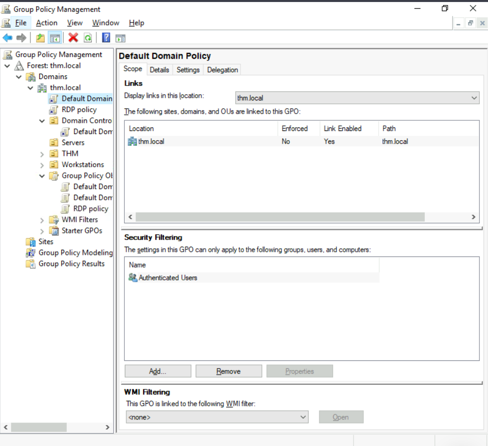
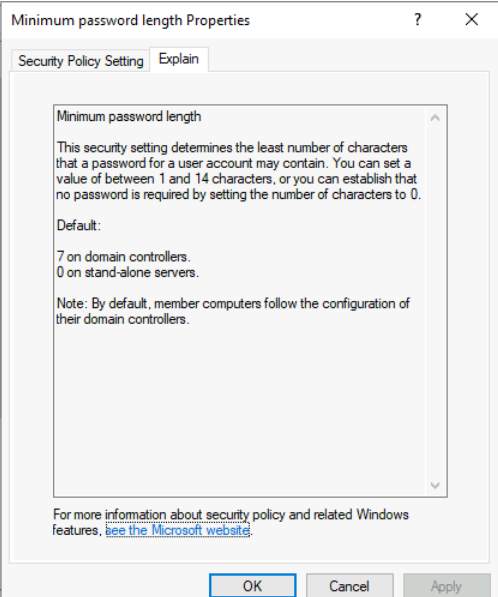
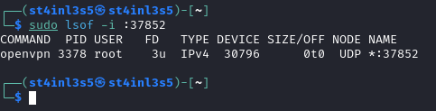

# Post Compromise (Erişim Sonrası)

Bu bölümde ilk erişimden sonra yapılması gerekenler ve neler yapabileceğimiz yer almaktadır.

## Güvenlik Çözümleri ve Teknolojileri

Kırmızı takımın katılımı sırasında güvenliği ihlal edilmiş bir makineye ilk erişiminizin olduğu ortama aşina olmanız çok önemlidir. Bu nedenle keşif ve enumerating yapılması önemli bir kısımdır ve öncelikli amaç bir sonraki aşamada kullanılmak üzere mümkün olduğunca fazla bilgi toplamaktır.

Başlangıç ​​noktasının oluşturulmasıyla birlikte sömürü sonrası(post-exploitation) süreci başlıyor!

Bu bölümde yaygın olarak kullanılan kavramlar, teknolojiler ve farkında olmamız gereken güvenlik ürünleri tanıtılmaktadır.

Bu bölümde, makineye zaten erişim sağladığımız ve aşağıdakileri sıralayarak çevre hakkındaki bilgimizi daha da genişletmeye hazır olduğumuz varsayılmaktadır:

+ Ağ altyapısı
+ Active Directory Ortamı
+ Host tabanlı(host-based) güvenlik çözümleri
+ Ağ tabanlı(network-based) güvenlik çözümleri
+ Uygulamalar ve hizmetler

### Ağ Altyapısı

Bilinmeyen bir ağa ulaştığımızda ilk hedefimiz nerede olduğumuzu ve neye ulaşabileceğimizi belirlemektir. Kırmızı ekip çalışması sırasında hangi hedef sistemle karşı karşıya olduğumuzu, makinenin hangi hizmeti sağladığını, ne tür bir ağda olduğumuzu anlamamız gerekir. Bu nedenle, ele geçirilen makinenin ilk erişim sağlandıktan sonra enumerate edilmesi bu sorulara yanıt vermenin anahtarıdır. Bu bölüm, katılım sırasında karşılaşabileceğimiz yaygın ağ türleri tartışılacaktır.

Ağ segmantasyonu, birden fazla alt ağa bölünmüş ekstra bir ağ güvenliği katmanıdır. Ağın güvenliğini ve yönetimini geliştirmek için kullanılır. Örneğin müşteri verileri, mali kayıtlar vb. kurumsal en değerli varlıklara yetkisiz erişimi önlemek için kullanılır.

(Virtual Local Area Networks) Sanal Yerel Alan Ağları (VLAN'lar), yerel ağdaki yayın sorunları gibi ağ sorunlarını kontrol etmek ve güvenliği artırmak için ağ segmantasyonunda kullanılan bir ağ tekniğidir. VLAN içindeki host'lar yalnızca aynı VLAN ağındaki diğer hostlarla iletişim kurabilir.

#### Internal (Dahili) Ağlar

Dahili Ağlar, dahili cihazın önemine veya verilerinin erişilebilirliğinin önemine göre bölümlere ayrılan alt ağlardır. Dahili ağ(lar)ın temel amacı, bir kuruluş içindeki bilgileri, daha hızlı ve daha kolay iletişimi, işbirliği araçlarını, operasyonel sistemleri ve ağ hizmetlerini paylaşmaktır. Kurumsal bir ağda, ağ yöneticileri, ağ trafiğini kontrol etmek, ağ performansını optimize etmek ve güvenlik durumunu iyileştirmek dahil olmak üzere çeşitli nedenlerle ağ bölümlendirmeyi kullanmayı amaçlamaktadır.

Yukarıdaki diyagram, ağ iki ağa bölündüğü için basit ağ bölümleme konseptinin bir örneğidir. Bunlardan ilki çalışanların workstation'ları ve kişisel cihazları içindir. İkincisi, DNS, dahili web, e-posta hizmetleri vb. gibi dahili hizmetler sağlayan özel ve dahili ağ cihazları içindir.

#### Demilitarized Zone (DMZ) (Arındırılmış/İzole Alan)

DMZ Ağı, bir şirketin dahili yerel alan ağını güvenilmeyen trafiğe karşı koruyan ve ona ekstra bir güvenlik katmanı ekleyen bir uç ağdır. DMZ'nin ortak tasarımı, genel internet ile dahili ağlar arasında yer alan bir alt ağdır.

Şirket içinde bir ağ tasarlamak, onun gereksinimlerine ve ihtiyacına bağlıdır. Örneğin, bir şirketin web sitesi, DNS, FTP, Proxy, VPN vb. kamu hizmetleri sağladığını varsayalım. Bu durumda, genel ağ trafiğini, güvenilmeyen trafiği izole etmek ve erişim kontrolünü etkinleştirmek için bir DMZ ağı tasarlayabilirler.

Yukarıdaki diyagramda, DMZ ağına giden, güvenilmeyen (doğrudan internetten gelen) ağ trafiğini kırmızı renkle gösteriyoruz. İç ağ arasındaki yeşil ağ trafiği, bir veya birden fazla ağ güvenlik cihazından/cihazlarından geçebilen kontrollü trafiktir.

Sistemin ve iç ağın enumerate edilmesi, saldırganın sistem ve iç ağ hakkında bilgi edinmesine olanak sağlayan keşfetme aşamasıdır. Elde edilen bilgilere dayanarak, bunu sistem veya AD ortamında daha fazla yetki kazanmak için yanal hareketi veya yetki yükseltmek için kullanırız.

#### Ağ Enumeration

TCP ve UDP portları ve kurulan bağlantılar, yönlendirme tabloları, ARP tabloları vb. gibi ağ oluşturma hususlarıyla ilgili olarak kontrol edilmesi gereken çeşitli şeyler vardır.

Hedef makinenin TCP ve UDP açık portlarını kontrol etmeye başlayalım. Bu, aşağıda gösterildiği gibi netstat komutu kullanılarak yapılabilir.

Çıktı, kurulu bağlantıların yanı sıra açık portları da ortaya çıkarır. Daha sonra ağdaki hedef makinelerle iletişim kuran bilgisayarların IP adresini ve fiziksel adresini içeren ARP tablosunu listeleyelim. Bu, diğer makineleri açık portlarını ve güvenlik açıklarına karşı taramak için ağ içindeki iletişimleri görmenize yardımcı olabilir.

#### Dahili Ağ Servisleri

Dahili ağ cihazları için özel ve dahili ağ iletişim erişimi sağlar. Ağ hizmetlerine örnek olarak dahili DNS, web sunucuları, özel uygulamalar vb. gösterilebilir. Dahili ağ hizmetlerine ağ dışından erişilemeyeceğini unutmamak önemlidir. Ancak, bu ağ hizmetlerine erişen ağlardan birine ilk erişimimiz olduğunda, bu ağlara ulaşılabilir ve iletişim için uygun olacaktır.

### Active Directory Genel Bilgi

Veri nesnelerini iç ağ ortamına depolayan ve sağlayan Windows tabanlı bir dizin hizmetidir. Kimlik doğrulama ve yetkilendirmenin merkezi yönetimine olanak tanır. AD, kullanıcılar, bilgisayarlar, yazıcılar vb. dahil olmak üzere ağ ve çevre hakkında temel bilgileri içerir. Örneğin, AD, iş unvanı, telefon numarası, adres, şifreler, gruplar, izinler vb. gibi kullanıcıların ayrıntılarına sahip olabilir.

Diyagram, Active Directory'nin nasıl tasarlanabileceğinin olası bir örneğidir. AD Controller(Denetleyicisi), sunucular için bir alt ağa yerleştirilir (yukarıda sunucu ağı olarak gösterilmiştir) ve ardından AD istemcileri, domain'e katılabilecekleri ve güvenlik duvarı aracılığıyla AD hizmetlerini kullanabilecekleri ayrı bir ağ üzerindedir.

Aşağıda aşina olmamız gereken Active Directory bileşenlerinin bir listesi bulunmaktadır:

+ Domain Denetleyicileri
+ Organizasyon Birimleri
+ AD nesneleri
+ AD Domainleri
+ Forest
+ AD Servis Hesapları: Yerleşik yerel kullanıcılar, domain kullanıcıları, Yönetilen servis hesapları
+ Domain Yöneticileri

Domain Denetleyicisi, Active Directory hizmetleri sağlayan ve domainin tamamını denetleyen bir Windows sunucusudur. Kullanıcı verilerinin şifrelenmesinin yanı sıra kullanıcılar, gruplar, politikalar ve bilgisayarlar da dahil olmak üzere bir ağa erişimi kontrol eden bir merkezi kullanıcı yönetimi biçimidir. Ayrıca kaynak erişimine ve paylaşımına da olanak tanır. Bunların hepsi, saldırganların bir domaindeki domain denetleyicisini hedeflemesinin nedenleridir, çünkü bu denetleyici çok fazla yüksek değerli bilgi içerir.

Organizational Units (Organizasyon Birimleri) (OU'lar), AD alanı içindeki hiyerarşik yapıya sahip kapsayıcılardır.

Active Directory Nesneleri tek bir kullanıcı veya grup olabileceği gibi bilgisayar veya yazıcı gibi bir donanım bileşeni de olabilir. Her domain, aşağıdakiler de dahil olmak üzere bir AD ortamı oluşturan nesne kimlik bilgilerini içeren bir veritabanına sahiptir:

+ Kullanıcılar - Domaindeki makinelerde kimlik doğrulaması yapılmasına izin verilen bir güvenlik sorumlusu
+ Bilgisayarlar - Özel bir kullanıcı hesabı türü
+ GPO'lar - Diğer AD nesnelerine uygulanan politika koleksiyonları

AD domainleri, bir AD ağı içindeki Microsoft bileşenlerinin bir koleksiyonudur.

AD Forest, birbirine güvenen domainlerden oluşan bir koleksiyondur.

İlk Erişim sağlandıktan sonra kurumsal bir ağda bir AD ortamı bulmak önemlidir, çünkü Active Directory ortamı, katılan kullanıcılara ortam hakkında birçok bilgi sağlar. Kırmızı takım oyuncusu olarak, AD ortamını enumerate ederek ve daha sonra yanal hareket aşamasında kullanılabilecek çeşitli ayrıntılara erişim sağlayarak bundan yararlanıyoruz.

Windows makinesinin AD ortamının bir parçası olup olmadığını kontrol etmek için bir yol olarak komut istemi systeminfo komutunu kullanabiliriz. Systeminfo çıktısı, işletim sistemi adı ve sürümü, host adı ve diğer donanım bilgilerinin yanı sıra AD alanı da dahil olmak üzere makine hakkında bilgi sağlar.

Yukarıdaki çıktıdan, bilgisayar adının, AD ortamının bir parçası olduğunu doğrulayan domain adı olarak thmredteam.com olan bir AD olduğunu görebiliriz.

Domain bölümünde WORKGROUP çıktısı alırsak, bunun, bu makinenin yerel bir çalışma grubunun parçası olduğu anlamına geldiğini unutmayın.

AD ortamında enumeration, farklı araç ve teknikler gerektiriyor. Makinenin AD ortamının bir parçası olduğunu doğruladıktan sonra daha sonra kullanılabilecek değişken bilgileri aramaya başlayabiliriz. Bu aşamada kullanıcılar ve gruplar için enumeration yapmak için PowerShell kullanıyoruz.

Aşağıdaki PowerShell komutu ile tüm AD kullanıcı hesaplarını alabiliriz:

    Get-ADUser -Filter *

Ayırt Edici Ad (Distinguished Name) (DN), dizin içindeki benzersiz kayıtları tanımlamak için kullanılan virgülle ayrılmış(comma-seperated) anahtar ve değer çiftlerinden oluşan bir koleksiyondur. DN, Domain Bileşeni (Domain Component) (DC), OU, Yaygın Ad (Common Name) (CN) ve diğerlerinden oluşur. Aşağıdaki "CN=User1,CN=Users,DC=thmredteam,DC=com", aşağıdaki gibi görselleştirilebilen bir DN örneğidir:

SearchBase seçeneğini kullanarak, AD'de belirli bir CN belirtebiliriz. Örneğin, Kullanıcılar bölümünün herhangi bir kullanıcısını/kullanıcılarını listelemeyi belirtebiliriz.

    Get-ADUser -Filter * -SearchBase "CN=Users,DC=THMREDTEAM,DC=COM"

### Active Directory Temelleri

Kendinizi yalnızca beş bilgisayar ve beş çalışandan oluşan küçük bir işletme ağını yönettiğinizi hayal edin. Bu kadar küçük bir ağda, muhtemelen her bilgisayarı ayrı ayrı sorunsuz bir şekilde yapılandırabileceksiniz. Her bilgisayara manuel olarak giriş yapacak, onları kullanacak kişiler için kullanıcılar oluşturacak ve her çalışanın hesabı için özel yapılandırmalar yapacaksınız. Bir kullanıcının bilgisayarı çalışmayı durdurursa, muhtemelen onun yerine gidip bilgisayarı yerinde tamir edeceksiniz.

Bu çok rahat bir yaşam tarzı gibi görünse de işletmenizin aniden büyüdüğünü ve artık dört farklı ofise yayılmış 157 bilgisayarı ve 320 farklı kullanıcısı olduğunu varsayalım. Yine de her bilgisayarı ayrı bir varlık olarak yönetebilir, ağdaki her kullanıcı için politikaları manuel olarak yapılandırabilir ve herkese yerinde destek sağlayabilir misiniz? Cevap büyük olasılıkla hayır.

Bu sınırlamaların üstesinden gelmek için bir Windows domain kullanabiliriz. Basitçe söylemek gerekirse, Windows domain, belirli bir işletmenin yönetimi altındaki bir grup kullanıcı ve bilgisayardır. Bir domainin arkasındaki ana fikir, Windows bilgisayar ağının ortak bileşenlerinin yönetimini Active Directory (AD) adı verilen tek bir depoda merkezileştirmektir. Active Directory hizmetlerini çalıştıran sunucu, Domain (Controller)(Denetleyicisi) (DC) olarak bilinir.

Yapılandırılmış bir Windows domaine sahip olmanın ana avantajları şunlardır:

+ Merkezi kimlik yönetimi: Ağdaki tüm kullanıcılar, minimum çabayla Active Directory'den yapılandırılabilir.
+ Güvenlik ilkelerini yönetme: Güvenlik ilkelerini doğrudan Active Directory'den yapılandırabilir ve bunları gerektiğinde ağdaki kullanıcılara ve bilgisayarlara uygulayabilirsiniz.

Gerçek Dünyadan Bir Örnek

Bu biraz kafa karıştırıcı geliyorsa muhtemelen okulunuzda, üniversitenizde veya iş yerinizde bir noktada bir Windows domainle etkileşime geçmişsinizdir.

Okul/üniversite ağlarında, genellikle kampüsteki bilgisayarlardan herhangi birinde kullanabileceğiniz bir kullanıcı adı ve şifre sağlanır. Kimlik bilgileriniz tüm makineler için geçerlidir çünkü bunları bir makineye her girdiğinizde, kimlik doğrulama işlemi kimlik bilgilerinizin kontrol edileceği Active Directory'ye iletilecektir. Active Directory sayesinde kimlik bilgilerinizin her makinede bulunmasına gerek yoktur ve ağ genelinde kullanılabilir.

Active Directory aynı zamanda okulunuzun/üniversitenizin, okul/üniversite makinelerinizdeki kontrol paneline erişiminizi kısıtlamasına olanak tanıyan bileşendir. Politikalar genellikle ağ genelinde dağıtılacak ve böylece bu bilgisayarlar üzerinde yönetici ayrıcalıklarına sahip olmayacaksınız.
__________________

Herhangi bir Windows Domain çekirdeği, Active Directory Domain servisidir (AD DS). Bu servis, ağınızda bulunan tüm "nesnelerin" bilgilerini tutan bir katalog görevi görür. AD tarafından desteklenen birçok nesnenin arasında kullanıcılarımız, gruplarımız, makinelerimiz, yazıcılarımız, paylaşımlarımız ve daha birçokları var. Bunlardan bazılarına bakalım:

#### Kullanıcılar

Kullanıcılar Active Directory'deki en yaygın nesne türlerinden biridir. Kullanıcılar, güvenlik sorumluları olarak bilinen nesnelerden biridir; bu, domain tarafından kimliklerinin doğrulanabileceği ve dosyalar veya yazıcılar gibi kaynaklar üzerinde ayrıcalıkların atanabileceği anlamına gelir. Bir güvenlik sorumlusunun ağdaki kaynaklar üzerinde işlem yapabilen bir nesne olduğunu söyleyebilirsiniz.

Kullanıcılar iki tür varlığı temsil etmek için kullanılabilir:

+ Kişiler: Kullanıcılar genellikle kuruluşunuzdaki çalışanlar gibi ağa erişmesi gereken kişileri temsil eder.
+ Hizmetler: IIS veya MSSQL gibi hizmetler tarafından kullanılacak kullanıcıları da tanımlayabilirsiniz. Her bir hizmetin çalıştırılması için bir kullanıcı gerekir, ancak hizmet kullanıcıları normal kullanıcılardan farklıdır çünkü yalnızca kendi özel hizmetlerini çalıştırmak için gereken ayrıcalıklara sahiptirler.

#### Makineler

Makineler, Active Directory içindeki başka bir nesne türüdür; Active Directory domainine katılan her bilgisayar için bir makine nesnesi oluşturulacaktır. Makineler aynı zamanda "güvenlik sorumluları" olarak kabul edilir ve herhangi bir normal kullanıcı gibi bir hesaba atanır. Bu hesabın domain adı içinde bir miktar sınırlı hakları vardır.

Makine hesaplarının kendisi, atanan bilgisayardaki yerel yöneticilerdir; bunlara genellikle bilgisayarın kendisi dışında kimsenin erişmemesi gerekir, ancak diğer hesaplarda olduğu gibi, parolanız varsa, oturum açmak için bunu kullanabilirsiniz.

Not: Makine Hesabı şifreleri otomatik olarak dönüşümlü olarak gerçekleştirilir ve genellikle 120 rastgele karakterden oluşur.

Makine hesaplarını tanımlamak nispeten kolaydır. Belirli bir adlandırma şemasını takip ederler. Makine hesap adı, bilgisayarın adı ve ardından bir dolar işareti gelir. Örneğin, DC01 adlı bir makinenin DC01$ adında bir makine hesabı olacaktır.

#### Güvenlik Grupları

Windows'a aşina iseniz, muhtemelen dosyalara veya diğer kaynaklara erişim haklarını tek kullanıcılar yerine tüm gruplara atamak için kullanıcı grupları tanımlayabileceğinizi biliyorsunuzdur. Bu, kullanıcıları mevcut bir gruba ekleyebileceğiniz ve bu kullanıcıların grubun tüm ayrıcalıklarını otomatik olarak devralacağı için daha iyi yönetilebilirlik sağlar. Güvenlik grupları aynı zamanda güvenlik sorumluları olarak kabul edilir ve bu nedenle ağdaki kaynaklar üzerinde ayrıcalıklara sahip olabilirler.

Gruplarda hem kullanıcılar hem de makineler üye olabilir. Gerektiğinde gruplara başka gruplar da dahil edilebilir.

Bir domainde, kullanıcılara belirli ayrıcalıklar vermek için kullanılabilecek çeşitli gruplar varsayılan olarak oluşturulur. Örnek olarak, bir domaindeki en önemli gruplardan bazıları şunlardır:
+ Domain Yöneticileri : Bu grubun kullanıcıları, domainin tamamı üzerinde yönetici ayrıcalıklarına sahiptir. Varsayılan olarak etki alanındaki DC'ler de dahil olmak üzere herhangi bir bilgisayarı yönetebilirler.
+ Sunucu Operatörleri : Bu gruptaki kullanıcılar Domain Controller'ı yönetebilirler. Herhangi bir idari grup üyeliğini değiştiremezler.
+ Yedekleme Operatörleri : Bu gruptaki kullanıcıların, izinleri göz ardı edilerek herhangi bir dosyaya erişmelerine izin verilir. Bilgisayarlardaki verilerin yedeklemesini gerçekleştirmek için kullanılırlar.
+ Hesap Operatörleri : Bu gruptaki kullanıcılar, domainde başka hesaplar oluşturabilir veya değiştirebilir.
+ Domain Kullanıcıları : Domaindeki tüm mevcut kullanıcı hesaplarını içerir.
+ Domain Bilgisayarları : Domaindeki tüm mevcut bilgisayarları içerir.
+ Domain Denetleyicileri(Controller) : Domaindeki tüm mevcut DC'leri içerir.

#### Active Directory Kullanıcıları ve Bilgisayarları

Active Directory'deki kullanıcıları, grupları veya makineleri yapılandırmak için Domain Denetleyicisine giriş yapmamız ve başlat menüsünden "Active Directory Kullanıcıları ve Bilgisayarları"nı çalıştırmamız gerekir:

Bu, domainde bulunan kullanıcıların, bilgisayarların ve grupların hiyerarşisini görebileceğiniz bir pencere açacaktır. Bu nesneler, kullanıcıları ve makineleri sınıflandırmanıza olanak tanıyan kapsayıcı nesneler olan Organizational Units (OU'lar) halinde düzenlenir. Organizational Units esas olarak benzer politika gereksinimlerine sahip kullanıcı gruplarını tanımlamak için kullanılır. Örneğin, kuruluşunuzun Satış departmanındaki kişilerin, BT'deki kişilerden farklı politikalara sahip olması muhtemeldir. Bir kullanıcının aynı anda yalnızca tek bir organizational unit'in parçası olabileceğini unutmayın.

Makinemizi kontrol ettiğimizde BT, Yönetim, Pazarlama ve Satış departmanları için dört alt kuruluş birimine sahip THM adında bir kuruluş biriminin zaten bulunduğunu görebiliriz. Tüm departmanlar için geçerli olan temel politikaların verimli bir şekilde dağıtılmasına olanak tanıdığından, organizational unit'in iş yapısını taklit ettiğini görmek çok normaldir. Çoğu zaman beklenen model bu olsa da organizational unitleri isteğe bağlı olarak tanımlayabileceğinizi unutmayın.

Herhangi bir organizational unit'i açarsanız içerdikleri kullanıcıları görebilir ve bunları gerektiği gibi oluşturma, silme veya değiştirme gibi basit görevleri gerçekleştirebilirsiniz. Gerekirse şifreleri de sıfırlayabilirsiniz (helpdesk için oldukça faydalıdır.):

Muhtemelen THM OU dışında başka varsayılan kapsayıcıların da olduğunu fark etmişsinizdir. Bu kapsayıcılar Windows tarafından otomatik olarak oluşturulur ve aşağıdakileri içerir:

+ Builtin (Yerleşik): Herhangi bir Windows hostunun kullanabileceği varsayılan grupları içerir.
+ Bilgisayarlar: Ağa katılan herhangi bir makine varsayılan olarak buraya konulacaktır. Gerekirse bunları taşıyabilirsiniz.
+ Etki Alanı Denetleyicileri: Ağınızdaki DC'leri içeren varsayılan OU.
+ Kullanıcılar: Domain çapında bir bağlama uygulanan varsayılan kullanıcılar ve gruplar.
+ Yönetilen Hizmet Hesapları: Windows domaininizdeki hizmetler tarafından kullanılan hesapları tutar.

__Güvenlik Grupları ve Organizational Unit Karşılaştırması__

Her ikisi de kullanıcıları ve bilgisayarları sınıflandırmak için kullanılsa da amaçları tamamen farklıdır:

+ Organizational Unit, kuruluştaki belirli rollerine bağlı olarak kullanıcı kümeleriyle ilgili belirli yapılandırmaları içeren kullanıcılara ve bilgisayarlara ilkeler uygulamak için kullanışlıdır. Tek bir kullanıcıya iki farklı politika kümesi uygulamaya çalışmanın mantıklı olmayacağından, bir kullanıcının aynı anda yalnızca tek bir organizational unit üyesi olabileceğini unutmayın.
+ Güvenlik Grupları ise kaynaklar üzerinde izin vermek için kullanılır. Örneğin, bazı kullanıcıların paylaşılan bir klasöre veya ağ yazıcısına erişmesine izin vermek istiyorsanız grupları kullanacaksınız. Bir kullanıcı, birden fazla kaynağa erişim izni vermek için gerekli olan birçok grubun parçası olabilir.

#### Active Directory'de Kullanıcıları Düzenlemek

Yeni domain yöneticisi olarak ilk göreviniz, işletmede yakın zamanda bazı değişiklikler meydana geldiğinden mevcut AD OU'ları ve kullanıcıları kontrol etmektir. Size aşağıdaki organizasyon şeması verilmiştir ve AD'de buna uygun değişiklikler yapmanız beklenmektedir:

Dikkat etmeniz gereken ilk şey, mevcut AD yapılandırmanızda grafikte görünmeyen ek bir departman Organizational Unit olmasıdır. Bütçe kesintileri nedeniyle kapatıldığı ve domainden kaldırılması gerektiği söylendi. Organizational Unit'e sağ tıklayıp silmeye çalışırsanız aşağıdaki hatayı alırsınız:

Varsayılan olarak Organizational Unitler yanlışlıkla silinmeye karşı korunur. OU'yu silmek için Görünüm menüsünde Gelişmiş Özellikler'i etkinleştirmemiz gerekir:

Bu size bazı ek kapsayıcılar gösterecek ve yanlışlıkla silme korumasını devre dışı bırakmanıza olanak tanıyacaktır. Bunu yapmak için OU'a sağ tıklayın ve Özellikler'e gidin. Korumayı devre dışı bırakmak için Nesne sekmesinde bir onay kutusu bulacaksınız:

Kutunun işaretini kaldırdığınızdan emin olun ve OU'yu silmeyi tekrar deneyin. OU'yu silmek istediğinizi onaylamanız istenecektir ve bunun sonucunda, OU altındaki tüm kullanıcılar, gruplar veya OU de silinecektir.

AD'de yapabileceğiniz güzel şeylerden biri, belirli kullanıcılara bazı OU'lar üzerinde biraz kontrol vermektir. Bu işlem, yetki verme(delegation) olarak bilinir ve bir Domain Yöneticisinin devreye girmesine gerek kalmadan, OU'da gelişmiş görevleri gerçekleştirmeleri için kullanıcılara belirli ayrıcalıklar vermenizi sağlar.

Bunun en yaygın kullanım durumlarından biri, IT desteğine diğer düşük ayrıcalıklı kullanıcıların parolalarını sıfırlama ayrıcalıklarının verilmesidir. Organizasyon şemamıza göre Phillip, IT desteğinden sorumludur; bu nedenle, Satış, Pazarlama ve Yönetim OU'ları üzerindeki parolaların sıfırlanması kontrolünü muhtemelen ona devretmek isteriz.

Bu örnekte, Satış OU'sunun kontrolünü Phillip'e devredeceğiz. Bir OU üzerinde denetim yetkisi vermek için, OU'ya sağ tıklayıp Denetimi Delege Et'i seçebilirsiniz:

Bu, kontrolü devretmek istediğiniz kullanıcıların ilk olarak sorulacağı yeni bir pencere açmalıdır:

Not: Kullanıcı adının yanlış yazılmasını önlemek için "phillip" yazıp Adları Kontrol Et butonuna tıklayın. Windows kullanıcıyı sizin için otomatik olarak tamamlayacaktır.

Tamam'a tıklayın ve bir sonraki adımda aşağıdaki seçeneği seçin:

Birkaç kez ileri'ye tıklayın; artık Phillip, satış departmanındaki herhangi bir kullanıcının şifrelerini sıfırlayabilecektir.

Şimdi Phillip'in hesabını kullanarak Sophie'nin şifresini sıfırlamayı deneyelim.

Phillip'in yeni güçlerini denemek ve test etmek için Active Directory Kullanıcıları ve Bilgisayarları'na gitme cazip gelse de, onun bu yetkileri açma ayrıcalıkları yoktur, bu nedenle parola sıfırlama işlemi yapmak için başka yöntemler kullanmanız gerekecektir. Bu durumda bunu yapmak için Powershell'i kullanacağız:

Sophie'nin bildiğimiz bir parolayı kullanmaya devam etmesini istemediğimizden, aşağıdaki komutla bir sonraki oturum açmada parolanın sıfırlanmasını da zorlayabiliriz:

#### Active Directory'de Bilgisayarları Düzenlemek

Varsayılan olarak, bir domain'e katılan tüm makineler (DC'ler hariç) "Bilgisayarlar" adı verilen kapsayıcıya konulacaktır. DC'mizi kontrol edersek bazı cihazların zaten orada olduğunu göreceğiz:

Ağımızdaki kullanıcılara karşılık gelen bazı sunucuları, bazı dizüstü bilgisayarları ve bazı PC'leri görebiliriz. Sunucularınızın ve normal kullanıcıların günlük olarak kullandığı makinelerinizin farklı politikalara sahip olmasını istemeniz çok muhtemel olduğundan, tüm cihazlarımızın orada olması pek iyi bir fikir değildir.

Makinelerinizi nasıl organize edeceğiniz konusunda altın bir kural olmasa da, cihazları kullanımlarına göre ayırmak mükemmel bir başlangıç ​​noktasıdır. Genel olarak cihazların en az aşağıdaki üç kategoriye ayrıldığını görmeyi beklersiniz:

1. İş İstasyonları (Workstation)

İş istasyonları, Active Directory domain'deki en yaygın cihazlardan biridir. Domaindeki her kullanıcı büyük olasılıkla bir iş istasyonunda oturum açacaktır. Bu, işlerini veya normal tarama etkinliklerini gerçekleştirmek için kullanacakları cihazdır. Bu cihazlarda asla ayrıcalıklı bir kullanıcının oturum açmaması gerekir.

2. Sunucular (Servers)

Sunucular, Active Directory domaini içindeki en yaygın ikinci cihazdır. Sunucular genellikle kullanıcılara veya diğer sunuculara hizmet sağlamak için kullanılır.

3. Domain Controller'ları

Domain Controller'ları, bir Active Directory domain içindeki en yaygın üçüncü aygıttır. Domain Controller'ları, Active Directory domainini yönetmenize olanak tanır. Bu cihazlar, ortamdaki tüm kullanıcı hesapları için hashlenmiş şifreler içerdikleri için genellikle ağdaki en hassas cihazlar olarak kabul edilir.

AD'mizi düzenlediğimize göre, İş İstasyonları ve Sunucular için iki ayrı OU oluşturalım (Domain Controller'ları zaten Windows tarafından oluşturulan bir OU'dadır). Bunları doğrudan thm.local domain kapsayıcısının altında oluşturacağız. Sonunda aşağıdaki OU yapısına sahip olacağız:

#### Grup İlkeleri (Group Policies)

Şimdiye kadar kullanıcıları ve bilgisayarları OU'lar ile düzenledik, ancak bunun arkasındaki ana fikir her OU için ayrı ayrı farklı politikalar uygulayabilmektir. Bu şekilde, departmanlarına bağlı olarak kullanıcılara farklı konfigürasyonlar ve güvenlik temelleri sunabiliyoruz.

Windows bu tür ilkeleri Grup İlkesi Nesneleri (Group Policy Objects) (GPO) aracılığıyla yönetir. GPO'lar yalnızca OU'lara uygulanabilecek bir ayarlar koleksiyonudur. GPO'lar, kullanıcıları veya bilgisayarları hedef alan ilkeler içerebilir ve belirli makineler ve kimlikler için bir temel belirlemenize olanak tanır.

GPO'ları yapılandırmak için başlat menüsünde bulunan Grup İlkesi Yönetimi aracını kullanabilirsiniz:

Açtığınızda göreceğiniz ilk şey, daha önce tanımlandığı gibi tam OU hiyerarşinizdir. Grup İlkelerini yapılandırmak için önce Grup İlkesi Nesneleri altında bir GPO oluşturursunuz ve ardından bunu ilkelerin uygulanmasını istediğiniz OU'ya bağlarsınız. Örnek olarak, makinenizde halihazırda mevcut bazı GPO'ların bulunduğunu görebilirsiniz:

Yukarıdaki görselde 3 adet GPO’nun oluşturulduğunu görüyoruz. Bunlardan, Varsayılan Domain İlkesi (Default Domain Policy) ve RDP İlkesi (RDP Policy) bir bütün olarak thm.local domainine bağlanır ve Varsayılan Domain Controller İlkesi (Default Domain Controller Policy) yalnızca Domain Controller OU'suna bağlanır. Akılda tutulması gereken önemli bir nokta, herhangi bir GPO'nun bağlı OU'ya ve onun altındaki tüm alt OU birimlerine uygulanacağıdır. Örneğin, Satış OU'su Varsayılan Domain İlkesinden etkilenmeye devam edecektir.

Bir GPO'nun içinde ne olduğunu görmek için Varsayılan Domain İlkesini inceleyelim. Bir GPO seçerken göreceğiniz ilk sekme, GPO'nun AD'ye bağlandığı yer olan kapsamını(Scope) gösterir. Mevcut ilkenin yalnızca thm.local domainine bağlı olduğunu görebiliriz:

Gördüğünüz gibi, GPO'lara Güvenlik Filtrelemesi uygulayarak bunların yalnızca bir OU altındaki belirli kullanıcılara/bilgisayarlara uygulanmasını sağlayabilirsiniz. Varsayılan olarak tüm kullanıcıları/PC'leri içeren Kimliği Doğrulanmış Kullanıcılar grubuna uygulanacaktır.

Ayarlar sekmesi GPO'nun gerçek içeriğini içerir ve hangi spesifik yapılandırmaların uygulandığını bize bildirir. Daha önce belirtildiği gibi, her GPO'nun yalnızca bilgisayarlara uygulanan yapılandırmaları ve yalnızca kullanıcılara uygulanan yapılandırmaları vardır. Bu durumda, Varsayılan Domain İlkesi yalnızca Bilgisayar Yapılandırmalarını içerir:

Bu GPO tüm domain için geçerli olduğundan, üzerinde yapılacak herhangi bir değişiklik tüm bilgisayarları etkileyecektir. Kullanıcıların şifrelerinde en az 10 karakter olmasını zorunlu kılmak için minimum şifre uzunluğu politikasını değiştirelim. Bunu yapmak için GPO'ya sağ tıklayın ve Düzenle'yi seçin:

Bu, mevcut tüm yapılandırmalarda gezinebileceğimiz ve düzenleyebileceğimiz yeni bir pencere açacaktır. Minimum parola uzunluğunu değiştirmek için Bilgisayar Yapılandırmaları -> İlkeler -> Windows Ayarları -> Güvenlik Ayarları -> Hesap İlkeleri -> Parola İlkesi'ne gidin ve gerekli ilke değerini değiştirin:

Gördüğünüz gibi bir GPO'da pek çok politika oluşturulabilir. Her birini tek bir bölümde açıklamak imkansız olsa da, bazı politikaların basit olması nedeniyle biraz araştırma yapmaktan çekinmeyin. Politikalardan herhangi biri hakkında daha fazla bilgiye ihtiyaç duyulursa, bunlara çift tıklayıp her birinin üzerindeki Açıklama sekmesini okuyabilirsiniz:

GPO'lar, DC'de depolanan SYSVOL adı verilen bir ağ paylaşımı aracılığıyla ağa dağıtılır. Bir domaindeki tüm kullanıcıların, GPO'larını düzenli aralıklarla senkronize etmek için genellikle ağ üzerinden bu paylaşıma erişimi olmalıdır. SYSVOL paylaşımı varsayılan olarak ağımızdaki DC'lerin her birinde bulunan C:\Windows\SYSVOL\sysvol\ dizinini işaret eder.

Herhangi bir GPO'da değişiklik yapıldığında bilgisayarların bu değişikliği karşılaması 2 saate kadar sürebilir. Belirli bir bilgisayarı GPO'larını hemen eşitlemeye zorlamak istiyorsanız istediğiniz bilgisayarda her zaman aşağıdaki komutu çalıştırabilirsiniz:

    PS C:\> gpupdate /force

Yeni işimizin bir parçası olarak, aşağıdakileri yapmamıza olanak sağlayacak bazı GPO'ları uygulamakla görevlendirildik:

+ IT dışı kullanıcıların Kontrol Paneline erişmesini engelleyin.
+ İnsanların oturumlarını açıkta bırakmasını önlemek için, iş istasyonlarının ve sunucuların, kullanıcı 5 dakika boyunca herhangi bir işlem yapılmadığında ekranlarını otomatik olarak kilitlemesini sağlayın.

Bunların her birine odaklanalım ve her bir GPO'da hangi politikaları etkinleştirmemiz gerektiğini ve bunların nereye bağlanması gerektiğini tanımlayalım.

__Kontrol Paneli'ne Erişim Engeli__

Tüm makinelerdeki Kontrol Paneline erişimi yalnızca IT departmanının parçası olan kullanıcılarla sınırlamak istiyoruz. Diğer departmanların kullanıcıları sistem tercihlerini değiştirememelidir.

Restrict Control Panel Access adında yeni bir GPO oluşturalım ve onu düzenleme için açalım. Bu GPO'nun belirli kullanıcılara uygulanmasını istediğimizden, Kullanıcı Yapılandırması altında aşağıdaki politikayı arayacağız:

Kontrol Paneline ve Bilgisayar ayarlarına Erişimi Yasakla ilkesini etkinleştirdiğimize dikkat edin.

GPO yapılandırıldıktan sonra, onu bilgisayarlarının Kontrol Paneline erişimi olmaması gereken kullanıcılara karşılık gelen tüm OU'lara bağlamamız gerekecektir. Bu durumda, GPO'yu her birine sürükleyerek Pazarlama, Yönetim ve Satış OU'larını bağlayacağız:

__Ekranları Otomatik Kitleme İlkesi__

İş istasyonları ve sunucular için ekran kilitlemeyle ilgili ilk GPO'yu daha önce oluşturduğumuz İş İstasyonları, Sunucular ve Domain Controller OU'ları üzerinden doğrudan uygulayabildik.

Bu çözüm işe yarıyor olsa da, GPO'nun tüm bilgisayarlarımızı etkilemesini istediğimizden, bir alternatif de GPO'yu kök etki alanına uygulamaktan ibarettir. İş İstasyonları, Sunucular ve Domain Controller'lar OU'larının tümü kök domainin alt OU'ları olduğundan, onun ilkelerini devralırlar.

Not: GPO'muzun kök domaine uygulanması durumunda Satış veya Pazarlama gibi diğer OU'lar tarafından da devralınacağını fark etmiş olabilirsiniz. Bu OU'lar yalnızca kullanıcıları içerdiğinden, GPO'muzdaki herhangi bir Bilgisayar Yapılandırması onlar tarafından göz ardı edilecektir.

Yeni bir GPO oluşturalım, buna Otomatik Kilit Ekranı adını verelim ve düzenleyelim. İstediklerimize ulaşma politikası şu rotada yer alıyor:

Herhangi bir kullanıcının oturumunu açık bırakması durumunda bilgisayarların otomatik olarak kilitlenmesi için hareketsizlik sınırını 5 dakikaya ayarlayacağız. GPO düzenleyicisini kapattıktan sonra, GPO'yu ona sürükleyerek GPO'yu kök domain'e bağlayacağız:

GPO'lar doğru OU'lara uygulandıktan sonra doğrulama için Pazarlama, Satış veya Yönetim'de herhangi bir kullanıcı olarak oturum açabiliriz. Bu görev için Mark'ın kimlik bilgilerini kullanarak RDP aracılığıyla bağlanalım.

Kontrol Panelini açmayı denersek, bu işlemin yönetici tarafından reddedildiğini belirten bir mesaj almalıyız. Ayrıca isterseniz ekranın otomatik olarak kilitlenip kilitlenmediğini kontrol etmek için 5 dakika bekleyebilirsiniz.

#### Kimlik Doğrulama Metodları

Windows domainlerini kullanırken, tüm kimlik bilgileri Domain Controller'larda saklanır. Bir kullanıcı domain kimlik bilgilerini kullanarak bir hizmette kimlik doğrulaması yapmaya çalıştığında, hizmetin Domain Controller'larına bunların doğru olup olmadığını doğrulamasını istemesi gerekir. Windows domainlerde ağ kimlik doğrulaması için iki protokol kullanılabilir:

+ Kerberos: Windows'un herhangi bir güncel sürümü tarafından kullanılır. Bu, herhangi bir yeni domaindeki varsayılan protokoldür.
+ NetNTLM: Uyumluluk amacıyla tutulan eski kimlik doğrulama protokolü.

NetNTLM'nin eski olduğu düşünülse de çoğu ağda her iki protokol de etkindir. Bu protokollerin her birinin nasıl çalıştığına daha derinlemesine bakalım.

__Kerberos Kimlik Doğrulaması__

Kerberos kimlik doğrulaması, Windows'un tüm yeni sürümleri için varsayılan kimlik doğrulama protokolüdür. Kerberos kullanarak bir hizmete giriş yapan kullanıcılara ticket(bilet) atanacaktır. Ticketları daha önceki bir kimlik doğrulamanın kanıtı olarak düşünün. Ticketları olan kullanıcılar, daha önce ağda kimlik doğrulaması yaptıklarını ve bu nedenle onu kullanmalarına izin verildiğini göstermek için bunları bir hizmete sunabilirler.

Kimlik doğrulama için Kerberos kullanıldığında aşağıdaki süreç gerçekleşir:

1. Kullanıcı, kullanıcı adını ve şifresinden türetilen bir anahtar kullanılarak şifrelenmiş bir zaman damgasını(timestamp), genellikle ağda Kerberos ticketları oluşturmaktan sorumlu Domain Controller'a yüklenen bir hizmet olan Anahtar Dağıtım Merkezi'ne (Key Distribution Center) (KDC) gönderir.
KDC, kullanıcının belirli hizmetlere erişim için ek ticket talep etmesine olanak tanıyan bir Ticket İzin Verme Ticket'ı (Ticket Granting Ticket) (TGT) oluşturacak ve geri gönderecektir. Daha fazla ticket almak için ticket'a ihtiyaç duyulması biraz tuhaf gelebilir ancak kullanıcıların bir hizmete her bağlanmak istediklerinde kimlik bilgilerini girmeden hizmet ticketları talep etmelerine olanak tanıyor. TGT ile birlikte kullanıcıya aşağıdaki istekleri oluşturabilmesi için ihtiyaç duyacağı bir Oturum Anahtarı (Session Key) verilir.
TGT'nin krbtgt hesabının şifre hash'i kullanılarak şifrelendiğine ve bu nedenle kullanıcının içeriğine erişemediğine dikkat edin. Şifrelenmiş TGT'nin, içeriğinin bir parçası olarak Oturum Anahtarının bir kopyasını içerdiğini ve gerektiğinde TGT'nin şifresini çözerek bir kopyayı kurtarabileceği için KDC'nin Oturum Anahtarını saklamasına gerek olmadığını bilmek önemlidir.

2. Bir kullanıcı ağdaki paylaşım, web sitesi veya veri tabanı gibi bir hizmete bağlanmak istediğinde, TGT'sini kullanarak KDC'den Ticket İzin Verme Hizmeti (Ticket Granting Service) (TGS) isteyecektir. TGS, yalnızca oluşturuldukları belirli hizmete bağlantıya izin veren biletlerdir. Bir TGS istemek için kullanıcı, TGT ve erişmeyi planladığımız hizmet ve sunucu adını belirten Hizmet Asıl Adı (Service Principal Name) (SPN) ile birlikte kullanıcı adını ve Oturum Anahtarı kullanılarak şifrelenmiş bir timestamp gönderecektir.
Sonuç olarak KDC bize, erişmek istediğimiz hizmette kimlik doğrulaması yapmamız gereken Hizmet Oturum Anahtarı (Service Session Key) ile birlikte bir TGS gönderecektir. TGS, Hizmet Sahibi Hash'inden türetilen bir anahtar kullanılarak şifrelenir. Hizmet Sahibi, hizmetin altında çalıştığı kullanıcı veya makine hesabıdır. TGS, Hizmet Sahibinin TGS'nin şifresini çözerek erişebilmesi için şifrelenmiş içeriğinde Hizmet Oturum Anahtarının bir kopyasını içerir.

3. Daha sonra TGS, kimlik doğrulaması yapmak ve bağlantı kurmak için istenen hizmete gönderilebilir. Hizmet, TGS'nin şifresini çözmek ve Hizmet Oturum Anahtarını doğrulamak için yapılandırılmış hesabının parola hash'ini kullanacaktır.

__NetNTLM Kimlik Doğrulaması__

NetNTLM, bir meydan okuma-yanıt(challenge-response) mekanizması kullanarak çalışır. Tüm süreç aşağıdaki gibidir:

1. İstemci, erişmek istediği sunucuya bir kimlik doğrulama isteği gönderir.
2. Sunucu rastgele bir sayı üretir ve bunu istemciye bir challenge olarak gönderir.
3. İstemci, challenge'a bir yanıt oluşturmak için NTLM şifre hash'ini challenge (ve bilinen diğer verilerle) birleştirir ve bunu doğrulama için sunucuya geri gönderir.
4. Sunucu, doğrulama için challenge ve yanıtı Domain Controller'a iletir.
5. Domain Controller, yanıtı yeniden hesaplamak için bu challenge'ı kullanır ve bunu istemci tarafından gönderilen orijinal yanıtla karşılaştırır. Her ikisi de eşleşirse istemcinin kimliği doğrulanır; aksi takdirde erişim reddedilir. Kimlik doğrulama sonucu sunucuya geri gönderilir.
6. Sunucu, kimlik doğrulama sonucunu istemciye iletir.

Kullanıcının şifresinin (veya hash'inin) güvenlik amacıyla hiçbir zaman ağ üzerinden iletilmediğini unutmayın.

Not: Açıklanan işlem, bir domain hesabı kullanılırken geçerlidir. Yerel bir hesap kullanılıyorsa sunucu, parola hash'ini yerel olarak SAM'inde sakladığından, domain controller'la etkileşime gerek kalmadan, sorgulamaya verilen yanıtı kendisi doğrulayabilir.

#### Ağaçlar, Ormanlar ve Güven İlişkileri (Trees, Forests and Trusts)

Şu ana kadar tek bir domainin nasıl yönetileceğini, Domain Controller'ının rolünü ve bilgisayarları, sunucuları ve kullanıcıları nasıl birleştireceğini tartıştık.

Şirketler büyüdükçe ağları da büyüyor. Bir şirket için tek bir domaine sahip olmak başlangıç ​​için yeterince iyidir, ancak zamanla bazı ek ihtiyaçlar sizi birden fazla domaine sahip olmaya itebilir.

__Ağaçlar (Trees)__

Örneğin şirketinizin aniden yeni bir ülkeye genişlediğini düşünün. Yeni ülkede, GPO'larınızı uyum sağlayacak şekilde güncellemenizi gerektiren farklı yasa ve düzenlemeler bulunmaktadır. Ayrıca artık her iki ülkede de IT çalışanlarınız var ve her bir IT ekibinin, diğer ekibe müdahale etmeden, her ülkeye karşılık gelen kaynakları yönetmesi gerekiyor. Karmaşık bir OU yapısı oluşturup bunu başarmak için yetkilendirmeleri kullanabilseniz de, devasa bir AD yapısına sahip olmanın yönetimi zor olabilir ve insan hatalarına açık olabilir.

Şanslıyız ki Active Directory, ağınızı bağımsız olarak yönetilebilecek birimlere ayırabilmeniz için birden fazla domainin entegrasyonunu destekler. Aynı AD domainini paylaşan iki domaininiz varsa (örneğimizde thm.local), bu domainler bir Ağaçta birleştirilebilir.

Eğer thm.local domainimiz Birleşik Krallık ve ABD şubeleri için iki alt domaine bölünmüşse, thm.local kök domainine sahip uk.thm.local ve us.thm.local adında iki alt domaine sahip bir ağaç oluşturabilirsiniz:

Bu bölümlenmiş yapı, domainde kimin neye erişebileceği konusunda bize daha iyi kontrol sağlar. Birleşik Krallık'taki IT personeli, yalnızca Birleşik Krallık kaynaklarını yöneten kendi DC'lerine sahip olacak. Örneğin, Birleşik Krallık'taki bir kullanıcı ABD'deki kullanıcıları yönetemez. Bu şekilde, her şubenin Domain Yöneticileri kendi DC'leri üzerinde tam kontrole sahip olacak ancak diğer şubelerin DC'leri üzerinde tam kontrole sahip olmayacaktır. Politikalar, ağaçtaki her domain için bağımsız olarak da yapılandırılabilir.

Ağaçlardan, ormanlardan bahsederken yeni bir güvenlik grubunun devreye sokulması gerekiyor. Enterprise Admins (Kurumsal Yöneticiler) grubuna, kuruluşun tüm domainleri üzerinde yönetici ayrıcalıkları verilecektir. Her domain, kendi tek domainleri üzerinde yönetici ayrıcalıklarına sahip Domain Yöneticilerine ve kuruluştaki her şeyi kontrol edebilen Kurumsal Yöneticilere sahip olacaktır.

__Ormanlar (Forests)__

Yönettiğiniz domainler farklı ad alanlarında(namespace) da yapılandırılabilir. Şirketinizin büyümeye devam ettiğini ve sonunda MHT Inc adında başka bir şirket satın aldığını varsayalım. Her iki şirket birleştiğinde, muhtemelen her şirket için her biri kendi IT departmanı tarafından yönetilen farklı domain ağaçlarına sahip olacaksınız. Farklı namespacelere sahip birkaç ağacın aynı ağda birleştirilmesi olarak da bilinir.

__Güven İlişkileri (Trusts)__

Ağaçlarda ve ormanda düzenlenmiş birden fazla domaine sahip olmak, yönetim ve kaynaklar açısından güzel bölümlere ayrılmış bir ağa sahip olmanızı sağlar. Ancak belirli bir noktada THM UK'deki bir kullanıcının MHT ASIA sunucularından birindeki paylaşılan bir dosyaya erişmesi gerekebilir. Bunun gerçekleşebilmesi için ağaçlarda ve ormanlarda düzenlenen alanlar güven ilişkileriyle birleştirilir.

Basit bir ifadeyle, domainler arasında bir güven ilişkisine sahip olmak, THM UK domaininden bir kullanıcıya, MHT EU domaininden kaynaklara erişmesi için yetki vermenize olanak tanır.

Kurulabilecek en basit güven ilişkisi tek yönlü güven ilişkisidir (one-way trust relationship). Tek yönlü güvende, AAA domaini BBB domainine güveniyorsa bu, BBB'deki bir kullanıcının AAA'daki kaynaklara erişme yetkisine sahip olabileceği anlamına gelir:

Tek yönlü güven ilişkisinin yönü erişim yönünün tersidir.

Her iki domainin kullanıcıları karşılıklı olarak yetkilendirmesine olanak sağlamak için iki yönlü güven ilişkileri de yapılabilir. Varsayılan olarak, birkaç domaini bir ağaç veya orman altında birleştirmek, iki yönlü bir güven ilişkisi oluşturacaktır.

Domainler arasında bir güven ilişkisine sahip olmanın, diğer domainlerdeki tüm kaynaklara otomatik olarak erişim izni vermediğini unutmamak önemlidir. Bir güven ilişkisi kurulduğunda, farklı domainlerdeki kullanıcıları yetkilendirme şansınız olur, ancak gerçekte neyin yetkili olup olmadığı size bağlıdır.

### Ana Bilgisayar Tabanlı(Host-based) Güvenlik Çözümleri

Mümkün olduğunca tespit edilmemek ve yakalanma olasılığını azaltmak için bir uç nokta (endpoint) üzerinde antivirüs ve güvenlik tespit yöntemlerini enumerate etmenin önemli olduğunu unutmayın.

Host-based güvenlik çözümleri, aşağıdakiler de dahil olmak üzere, hosttaki anormal ve kötü amaçlı etkinlikleri izlemek ve tespit etmek için kullanılan bir dizi yazılım uygulamalarıdır:

+ Antivirüs yazılımı
+ Microsoft Windows Defender'ı
+ Host Tabanlı Güvenlik Duvarı
+ Güvenlik Olay Günlüğü ve İzleme (Security Event Logging and Monitoring)
+ Host Tabanlı Saldırı Tespit Sistemi (Host-based Intrusion Detection System) (HIDS)/ Host Tabanlı Saldırı Önleme Sistemi (Host-based Intrusion Prevention System) (HIPS)
+ Uç Nokta Tespiti ve Yanıtı (Endpoint Detection and Response) (EDR)

Kırmızı takımın devreye girmesi sırasında karşılaşabileceğimiz host tabanlı güvenlik çözümleri üzerinden daha detaya inelim.

#### Antivirüs Yazılımı (AV)

Kötü amaçlı yazılımdan koruma olarak da bilinen virüsten koruma yazılımı, esas olarak kötü amaçlı yazılımların ana bilgisayar(host) içinde yürütülmesini izlemek, tespit etmek ve önlemek için kullanılır. Çoğu antivirüs yazılımı uygulaması, Arka Plan taraması, Tam sistem taramaları, Virüs tanımları gibi iyi bilinen özellikleri kullanır. Arka plan taramasında antivirüs yazılımı gerçek zamanlı olarak çalışır ve arka planda açık ve kullanılmış tüm dosyaları tarar. Antivirüsü ilk yüklediğinizde tam sistem taraması önemlidir. En ilginç kısım ise antivirüs yazılımlarının önceden virüslere yanıt verdiği virüs tanımlarıdır. Bu nedenle antivirüs yazılımlarının zaman zaman güncellenmesi gerekir.

Antivirüsün kullandığı çeşitli algılama teknikleri vardır;

+ İmza tabanlı algılama (Signature-based)
+ Sezgisel tabanlı algılama (Heuristic-based)
+ Davranış tabanlı algılama (Behaviour-based)

__İmza tabanlı algılama__, antivirüs yazılımlarında kötü amaçlı dosyaları tanımlamak için kullanılan yaygın ve geleneksel tekniklerden biridir. Çoğu zaman, araştırmacılar veya kullanıcılar virüslü dosyalarını AV satıcıları tarafından daha ayrıntılı analiz için bir antivirüs motoru platformuna gönderirler ve kötü amaçlı olduğu onaylanırsa imza veritabanlarına kaydedilir. Antivirüs yazılımı, taranan dosyayı istemci tarafındaki olası saldırılara ve kötü amaçlı yazılımlara karşı bilinen imzalardan oluşan bir veritabanıyla karşılaştırır. Eğer bir eşleşme olursa bu bir tehdit olarak algılanır.

__Sezgisel tabanlı algılama__, kötü amaçlı dosyanın bizde olup olmadığına karar vermek için makine öğrenimini(machine learning) kullanır. Uygulamanın kodundaki şüpheli özellikleri bulmak veya yaygın olmayan Windows veya sistem API'leri kullanıp kullanmadığını kontrol etmek için gerçek zamanlı olarak tarama yapar ve statik olarak analiz eder. Kararların alınmasında imzaya dayalı saldırıya dayanmaz veya bazen güvenir. Bu, antivirüs yazılımının uygulanmasına bağlıdır.

Son olarak, __Davranış tabanlı algılama__, kayıt defteri anahtarlarında değer oluşturma/güncelleme, işlemleri öldürme(process killing)/oluşturma vb. gibi anormal davranışları ve olağandışı etkinlikleri bulmak için uygulamaların yürütülmesinin izlenmesine ve incelenmesine dayanır.

Kırmızı takım oyuncusu olarak antivirüsün var olup olmadığının farkında olmak çok önemlidir. Yapmaya çalıştığımız şeyi yapmamızı engelleyebilir. AV yazılımını wmic gibi Windows yerleşik araçlarını kullanarak sıralayabiliriz.

    wmic /namespace:\\root\securitycenter2 path antivirusproduct

Ya da powershell ile:

Get-CimInstance -Namespace root/SecurityCenter2 -ClassName AntivirusProduct

    displayName              : Bitdefender Antivirus
    instanceGuid             : {BAF124F4-FA00-8560-3FDE-6C380446AEFB}
    pathToSignedProductExe   : C:\Program Files\Bitdefender\Bitdefender Security\wscfix.exe
    pathToSignedReportingExe : C:\Program Files\Bitdefender\Bitdefender Security\bdservicehost.exe
    productState             : 266240
    timestamp                : Wed, 15 Dec 2021 12:40:10 GMT
    PSComputerName           :

    displayName              : Windows Defender
    instanceGuid             : {D58FFC3A-813B-4fae-9E44-DA132C9FAA36}
    pathToSignedProductExe   : windowsdefender://
    pathToSignedReportingExe : %ProgramFiles%\Windows Defender\MsMpeng.exe
    productState             : 393472
    timestamp                : Fri, 15 Oct 2021 22:32:01 GMT
    PSComputerName           :

Sonuç olarak, bilgisayarda yüklü bir üçüncü taraf antivirüs (Bitdefender Antivirus) ve Windows Defender bulunmaktadır. Windows sunucularının, çalışmayabilecek SecurityCenter2 namespace'ine sahip olmayabileceğini unutmayın. Bu komutlar Windows iş istasyonlarında çalışır.

#### Windows Defender

Microsoft Windows Defender, uç noktalarda çalışan, önceden yüklenmiş bir antivirüs güvenlik aracıdır. Tespitte makine öğrenimi, büyük veri analizi, derinlemesine tehdit direnci araştırması ve kötü amaçlı yazılımlara ve virüslere karşı korumada Microsoft bulut altyapısı dahil olmak üzere çeşitli algoritmalar kullanır. MS Defender üç koruma modunda çalışır: Aktif, Pasif, Devre Dışı modlar.

Aktif mod, MS Defender'ın makinede koruma ve iyileştirme sağlayan birincil antivirüs yazılımı olarak çalıştığı durumlarda kullanılır. Pasif mod, 3. taraf bir antivirüs yazılımı yüklendiğinde çalıştırılır. Bu nedenle, dosyaları tarayıp tehditleri tespit eden ancak iyileştirme sağlamayan ikincil bir antivirüs yazılımı olarak çalışır. Son olarak, Devre Dışı modu, MS Defender'ın devre dışı bırakıldığı veya sistemden kaldırıldığı zamandır.

 Windows Defender'ın hizmet durumunu kontrol etmek için aşağıdaki PowerShell komutunu kullanabiliriz:

    Get-Service WinDefend

Daha sonra mevcut Windows Defender durumunu almak için Get-MpComputerStatus cmdlet'ini kullanmaya başlayabiliriz. Anti-Spyware, Antivirus, LoavProtection, Gerçek zamanlı koruma (Real-time protection) vb. dahil olmak üzere güvenlik çözümü öğelerinin mevcut durumunu sağlar. Neye ihtiyacımız olduğunu belirlemek için Select-Object'i aşağıdaki gibi kullanabiliriz:

    Get-MpComputerStatus | Select-Object RealTimeProtectionEnabled

Sonuç olarak MpComputerStatus, Windows Defender'ın etkin olup olmadığını söyler.

#### Host Tabanlı Güvenlik Duvarı(Firewall)

Saldırganın veya kırmızı takım üyelerinin saldırı girişimlerini önleyebilen ve engelleyebilen bir ana makineye yüklenen ve çalıştırılan bir güvenlik aracıdır. Bu nedenle, ilk erişime sahip olduğumuz makinedeki güvenlik duvarı ve kuralları hakkındaki ayrıntıları enumerate etmek ve toplamak önemlidir.

Ana bilgisayar tabanlı güvenlik duvarının temel amacı, cihazın arayüzünden geçen gelen ve giden trafiği kontrol etmektir. Ana bilgisayarı aynı ağdaki güvenilmeyen cihazlardan korur. Modern ana bilgisayar tabanlı bir güvenlik duvarı, bağlantıyı kurarken paket analizi de dahil olmak üzere birden fazla düzeyde trafik analizi kullanır.

Güvenlik duvarı, ağ katmanında kontrol erişimi görevi görür. Ağ paketlerine izin verme ve reddetme yeteneğine sahiptir. Örneğin, bir güvenlik duvarı, aynı ağdaki diğer makinelerden ping komutu aracılığıyla gönderilen ICMP paketlerini engelleyecek şekilde yapılandırılabilir. Yeni nesil güvenlik duvarları aynı zamanda uygulama katmanları gibi diğer OSI katmanlarını da denetleyebilir. Bu nedenle SQL enjeksiyonunu ve diğer uygulama katmanı saldırılarını tespit edip engelleyebilir. Bir ana bilgisayarda güvenlik duvarlarını şu şekilde görüntüleyebiliriz: 

    Get-NetFirewallProfile | Select-Object Name, Enabled

Oturum açtığımız mevcut kullanıcı üzerinde yönetici ayrıcalıklarımız varsa, Set-NetFirewallProfile cmdlet'ini kullanarak bir veya birden fazla güvenlik duvarı profilini açık/devre dışı bırakmaya çalışabiliriz.

    Set-NetFirewallProfile -Profile Domain, Private, Public -Enabled False

Ayrıca güvenlik duvarı tarafından izin verilme veya reddedilme gibi mevcut Güvenlik Duvarı kurallarını da öğrenebilir ve kontrol edebiliriz.

    Get-NetFirewallRule | Select-Object DisplayName, Enabled, Description

Kırmızı takımın yaklaşımı sırasında güvenlik duvarının neyi engellediğine dair hiçbir fikrimiz olmayabilir. Ancak Test-NetConnection ve TcpClient gibi bazı PowerShell cmdlet’lerinden faydalanabiliyoruz. Bir güvenlik duvarının mevcut olduğunu bildiğimizi ve gelen bağlantıyı ekstra araçlar olmadan test etmemiz gerektiğini varsayalım, bu durumda aşağıdakileri yapabiliriz:

Sonuç olarak, 80 numaralı portun açık olduğunu ve gelen bağlantılara güvenlik duvarında izin verildiğini doğrulayabiliriz. Ayrıca, Test-NetConnection için -ComputerName bağımsız değişkeninde belirterek aynı ağdaki veya domain adlarındaki uzak hedefleri de test edebileceğimizi unutmayın.

#### Güvenlik Olay Günlüğü ve İzleme

Varsayılan olarak, İşletim sistemleri günlük dosyalarını(log) kullanarak sistemdeki çeşitli etkinlik olaylarını günlüğe kaydeder. Olay günlüğü özelliği, ister ana bilgisayar ister ağ tarafında olsun, önemli olayları izlemek ve analiz etmek için IT sistemi ve ağ yöneticilerinin kullanımına açıktır. İşbirliği yapan ağlarda güvenlik ekipleri, güvenlik olaylarını izlemek ve araştırmak için olay kaydı tekniğini kullanır.

Windows işletim sisteminin uygulama, sistem, güvenlik, hizmetler vb. dahil olmak üzere olay bilgilerini günlüğe kaydettiği çeşitli kategoriler vardır. Ayrıca güvenlik ve ağ cihazları, sistem yöneticilerinin olayın ne olduğu konusunda fikir sahibi olmasını sağlamak için olay bilgilerini günlük dosyalarında saklar.

Get-EventLog cmdlet'ini kullanarak yerel makinedeki mevcut olay günlüklerinin bir listesini alabiliriz.

Bazen mevcut olay günlüklerinin listesi size makinede hangi uygulamaların ve hizmetlerin yüklü olduğu konusunda fikir verebilir. Örneğin, yerel makinenin Active Directory, DNS sunucusu vb. sahip olduğunu görebiliriz.

Kurumsal ağlarda, ağ içindeki etkinlikleri analiz etmek ve izlemek için farklı sensörlerden günlükleri toplamak ve elde etmek için istemcilere(clientlere) log aracısı yazılımı (log agent software) yüklenir.

__System Monitor (Sysmon)__

Windows Sistem Monitörü sysmon bir hizmet ve aygıt sürücüsüdür. Microsoft Sysinternals paketlerinden biridir. Sysmon aracı varsayılan olarak yüklenmez, ancak yüklendikten sonra olayları toplamaya ve günlüğe kaydetmeye başlar. Bu günlük göstergeleri, sistem yöneticilerinin ve mavi ekip üyelerinin kötü amaçlı etkinlikleri izlemesine ve araştırmasına ve genel sorun gidermeye önemli ölçüde yardımcı olabilir.

Sysmon aracının harika özelliklerinden biri, birçok önemli olayı günlüğe kaydedebilmesi ve ayrıca izlemek için kendi kuralınızı/kurallarınızı ve yapılandırmanızı oluşturabilmenizdir:

+ İşlem oluşturma ve sonlandırma
+ Ağ bağlantıları
+ Dosyadaki değişiklik
+ Uzaktan tehditler
+ İşlem ve bellek erişimi
+ Ve diğerleri

Kırmızı takım oyuncusu olarak öncelikli hedeflerden biri tespit edilemez kalmaktır, bu nedenle bu araçların farkında olmak ve olaylara neden olan ve uyarı veren olaylara neden olmaktan kaçınmak çok önemlidir. Aşağıdakiler, sysmon'un kurban makinede mevcut olup olmadığını tespit etmek için kullanılabilecek püf noktalarından bazılarıdır.

Mevcut işlemler veya hizmetler içerisinde "Sysmon" olarak adlandırılan bir işlem veya hizmeti şu şekilde arayabiliriz,

    Get-Process | Where-Object -Property ProcessName -eq Sysmon

veya aşağıdaki gibi hizmetleri arayabiliriz,

    Get-CimInstance win32_service -Filter "Description = 'System Monitor service'" # or

Aynı zamanda Windows kayıt defterini kontrol ederek de yapılabilir.

    reg query HKLM\SOFTWARE\Microsoft\Windows\CurrentVersion\WINEVT\Channels\Microsoft-Windows-Sysmon/Operational

Tüm bu komutlar sysmon aracının kurulu olup olmadığını doğrular. Bunu tespit ettikten sonra, sistem yöneticilerinin neyi izlediğini anlamak için okuma iznimiz varsa sysmon yapılandırma dosyasını bulmayı deneyebiliriz.

    findstr /si '<ProcessCreate onmatch="exclude">' C:\tools\*

#### Host Tabanlı Saldırı Tespit/Önleme Sistemleri (HIDS/HIPS)

HIDS, Ana Bilgisayar Tabanlı Saldırı Tespit Sistemi anlamına gelir. Bir ana bilgisayardaki anormal ve kötü amaçlı etkinlikleri izleme ve tespit etme yeteneğine sahip bir yazılımdır. HIDS'in temel amacı şüpheli etkinlikleri tespit etmektir, bunları önlemek değildir. Ana bilgisayar tabanlı veya ağ saldırı tespit sisteminin çalıştığı iki yöntem vardır:

+ İmza tabanlı IDS - checksum'lara ve mesaj kimlik doğrulamasına bakar.
+ Anomali tabanlı IDS, anormal bant genişliği kullanımı, protokoller ve portlar dahil beklenmeyen etkinlikleri tarar.

Host Tabanlı Saldırı Önleme Sistemleri (HIPS), kuruldukları cihazın işletim sistemi faaliyetlerini güvence altına alır. Bilinen saldırılara ve anormal davranışlara karşı tespit ve önleme çözümüdür. HIPS, ana bilgisayarın günlük dosyalarını denetleyebilir, işlemleri izleyebilir ve sistem kaynaklarını koruyabilir. HIPS, antivirüs, davranış analizi, ağ, uygulama güvenlik duvarı vb. gibi birçok ürün özelliğini birleştirir.

#### Uç Nokta Tespiti ve Yanıtı (EDR)

Aynı zamanda Uç Nokta Tespiti ve Tehdit Yanıtı (Endpoint Detection and Threat Response) (EDTR) olarak da bilinir. EDR, kötü amaçlı yazılımlara ve diğer tehditlere karşı koruma sağlayan bir siber güvenlik çözümüdür. EDR'ler kötü amaçlı dosyaları arayabilir, uç noktayı, sistemi ve ağ olaylarını izleyebilir ve bunları daha fazla analiz, tespit ve araştırma için bir veritabanına kaydedebilir. EDR'ler yeni nesil antivirüslerdir ve ana bilgisayardaki kötü amaçlı etkinlikleri gerçek zamanlı olarak tespit eder.

EDR, aşağıdaki gibi tehditleri bulmak için sistem verilerini ve davranışını analiz eder;

+ Virüsler, truva atları, reklam yazılımları, keylogger'lar dahil olmak üzere kötü amaçlı yazılımlar
+ Exploit zincirleri
+ Fidye yazılımı

Aşağıda uç noktalar için bazı yaygın EDR yazılımları verilmiştir

+ Cylance
+ Crowdstrike
+ Symantec
+ SentinelOne
+ ve diğerleri

Saldırganın payloadını başarıyla iletmesine ve reverse shell'i alırken EDR'yi atlamasına rağmen, EDR hala çalışıyor ve sistemi izliyor. Bir uyarı tetiklenirse başka bir şey yapmamızı engelleyebilir.

Makine içindeki güvenlik ürünlerini enumerate etmek için Invoke-EDRCecker (https://github.com/PwnDexter/Invoke-EDRChecker) ve SharpEDRCecker (https://github.com/PwnDexter/SharpEDRChecker) gibi scriptler kullanabiliriz. Yaygın Dosya meta verilerini, işlemleri, mevcut işlemlere yüklenmiş DLL'leri, Hizmetleri ve sürücüleri, dizinleri kontrol ederek kullanılan Antivirüs, EDR, günlük izleme ürünlerini kontrol ederler.

### Ağ Tabanlı (Network-Based) Güvenlik Çözümleri

Ağ güvenliği çözümleri, ağ içindeki kötü niyetli etkinlikleri izlemek, tespit etmek ve önlemek için kullanılan yazılım veya donanım araçlarıdır. Ağa bağlı istemcileri ve cihazları korumaya odaklanır. Ağ güvenliği çözümü aşağıdakileri içerir ancak bunlarla sınırlı değildir:

+ Ağ Güvenlik Duvarı
+ Security Information and Event Management (SIEM)
+ IDS/IPS

#### Ağ Güvenlik Duvarı (Firewall)

Güvenlik duvarı, bir ağa gelen güvenilmeyen trafik için ilk kontrol noktasıdır. Güvenlik duvarı, güvenilmeyen trafiği kurallara ve politikalara göre ağa geçirmeden önce filtreler. Ayrıca Güvenlik Duvarları, ağları harici trafik kaynaklarından, dahili trafik kaynaklarından ve hatta belirli uygulamalardan ayırmak için kullanılabilir. Günümüzde güvenlik duvarı ürünleri, yerleşik ağ yönlendiricileri veya çeşitli güvenlik özellikleri sağlayan diğer güvenlik ürünleridir. Aşağıda kuruluşların kullanabileceği bazı güvenlik duvarı türleri yer almaktadır.

+ Paket filtrelemeli(Packet-filtering) güvenlik duvarları
+ Proxy güvenlik duvarları
+ NAT güvenlik duvarları
+ Web uygulaması güvenlik duvarları (WAF)

#### SIEM (Güvelik Bilgisi ve Olay Yönetimi)

SIEM, olayları izlemek ve analiz etmek, verileri gerçek zamanlı olarak takip etmek ve günlüğe kaydetmek için Güvenlik Bilgi Yönetimi (SIM) ve Güvenlik Olay Yönetimini (SEM) birleştirir. SIEM, sistem yöneticilerinin ve mavi ekip üyelerinin, bir kuruluşa zarar vermeden önce potansiyel güvenlik tehditlerini ve güvenlik açıklarını izlemelerine ve takip etmelerine yardımcı olur.

SIEM çözümleri, güvenlik tehditlerini veya saldırılarını tanımlamak ve tespit etmek için sensörlerden günlük dosyalarını topladığı ve toplanan veriler üzerinde işlevler gerçekleştirdiği günlük veri toplama merkezi olarak çalışır. Bir SIEM'in sunabileceği işlevlerden bazıları şunlardır:

+ Günlük yönetimi: Tüm kurumsal ağ için verileri gerçek zamanlı olarak yakalar ve toplar.
+ Olay analitiği: Anormal kalıpları veya davranışları tespit etmek için, grafikler ve istatistikler içeren kontrol panelinde bulunan gelişmiş analitiği uygular.
+ Olay izleme ve güvenlik uyarıları: Bağlı kullanıcılar, cihazlar, uygulamalar vb. dahil olmak üzere tüm ağı izler ve saldırılar tespit edilir edilmez, saldırıları hafifletmek için uygun önlemleri almaları için yöneticileri hemen uyarır.
+ Uyumluluk yönetimi ve raporlama: İstediğiniz zaman gerçek zamanlı raporlar üretir.

SIEM, dahili tehditler, güvenlik açıkları, phishing saldırıları, Web saldırıları, DDoS saldırıları, veri sızması vb. dahil olmak üzere entegre tehdit istihbaratı ve yapay zeka teknolojilerini kullanarak gelişmiş ve bilinmeyen tehditleri tespit etme kapasitesine sahiptir.

Birçok işletmede yaygın olarak görülen SIEM ürünlerinden bazıları şunlardır:

+ Splunk
+ LogRhythm Yeni Nesil SIEM Platformu
+ SolarWinds Güvenlik Olay Yöneticisi
+ Datadog Güvenlik İzleme
+ ve diğerleri

#### NIDS/NIPS (Ağ Tabanlı IDS ve IPS)

Ağ tabanlı IDS/IPS, ana bilgisayar tabanlı IDS/IPS ile benzer bir konsepte sahiptir. Temel fark, ağ tabanlı ürünlerin ana bilgisayar yerine ağın güvenliğine odaklanmasıdır. Ağ tabanlı çözüm, veri toplamak için ağ cihazlarına ve ana bilgisayarlara dağıtılan sensörlere ve aracılara dayanacaktır. IDS ve IPS, bir kuruluşun iç sistemlerini güvence altına almak için kullandığı siber güvenlik çözümlerini tespit etme ve izleme çözümleridir. Her ikisi de, önceki bir veritabanına önceden yüklenmiş olan anormal davranışları ve bilinen tehditleri arayan ağ paketlerini okur. Her iki çözüm arasındaki önemli fark, IDS'nin harekete geçmek üzere verileri analiz etmek için insan etkileşimi veya 3. taraf yazılımı gerektirmesidir. IPS, politikaları ve kuralları temel alarak paketleri kabul eden veya reddeden bir kontrol sistemidir.

Aşağıdakiler yaygın kurumsal IDS/IPS ürünleridir

+ Palo Alto Networks
+ Cisco's Next-Generation
+ McAfee Ağ Güvenliği Platformu (NSP)
+ Trend Micro TippingPoint
+ Suricata

### Uygulamalar ve Hizmetler

Bu bölüm, sistem hakkında daha fazla bilgi edinmek için gereken bilgimizi genişletecektir. Sistem içindeki hesap bulma ve güvenlik ürünlerini önceki bölümlerde ele almıştık. Aşağıdakiler de dahil olmak üzere sistem hakkında daha fazla bilgi edinmeye devam edeceğiz:

+ Yüklü uygulamalar
+ Hizmetler ve işlemler
+ Paylaşılan dosyalar ve yazıcılar
+ Dahili hizmetler: DNS ve yerel web uygulamaları

Bilgilerden faydalanabilmek için sistemin neler sağladığını anlamak gerekir.

#### Yüklü Uygulamalar

Öncelikle uygulamanın adını ve versiyonunu kontrol ederek kurulu uygulamalar için sistemi enumerate etmeye başlıyoruz. Kırmızı takım oyuncusu olarak bu bilgi bize fayda sağlayacaktır. Sistem yetkimizi exploit etmek ve yükseltmek için yüklenmiş güvenlik açığı bulunan yazılımlar bulabiliriz. Ayrıca, diğer sistem veya hizmetlere ait olan sade metin (plaintext) kimlik bilgileri gibi bazı bilgilerin sistemde bırakıldığını da görebiliriz.

 Yüklü tüm uygulamaları ve sürümlerini listelemek için wmic Windows komutunu kullanacağız.

    wmic product get name,version

Bir başka ilginç şey de belirli metin dizelerini, gizli dizinleri, yedekleme dosyalarını aramaktır. PowerShell cmdlet'i olan Get-ChildItem'i aşağıdaki gibi kullanabiliriz:

    Get-ChildItem -Hidden -Path C:\Users\kkidd\Desktop\

#### Servisler ve İşlemler

Windows hizmetleri, sistem yöneticisinin kendi Windows oturumlarımızda uzun süre çalışan yürütülebilir uygulamalar oluşturmasına olanak tanır. Bazen Windows hizmetlerinde yanlış yapılandırma izinleri bulunur ve bu da geçerli kullanıcı erişim izin düzeyini yükseltir(privilege escalation). Bu nedenle, çalışan hizmetlere bakmalı ve hizmet ve işlem keşiflerini gerçekleştirmeliyiz.

İşlem keşfi, sistemin ne sağladığını anlamaya yönelik bir enumeration adımıdır. Kırmızı takım, bir sistem üzerinde hizmet ve işlemlerin çalıştırılmasına ilişkin bilgi ve ayrıntıları almalıdır. Hedeflerimizi mümkün olduğunca anlamamız gerekiyor. Bu bilgi, ağdaki diğer sistemlerde çalışan ortak yazılımları anlamamıza yardımcı olabilir. Örneğin, ele geçirilen sistemin dahili amaçlar için kullanılan özel bir istemci uygulaması olabilir. Şirket içinde özel olarak geliştirilen yazılım, tırmanma vektörlerinin en yaygın temel nedenidir. Bu nedenle mevcut işlemler hakkında ayrıntılı bilgi almak için daha fazla araştırma yapmakta fayda var.

#### Paylaşılan Dosyalar ve Yazıcılar

Dosyaları ve ağ kaynaklarını paylaşmak, kişisel ve kurumsal ortamlarda yaygın olarak kullanılır. Sistem yöneticileri erişim izinlerini yanlış yapılandırabilir ve diğer hesaplar ve sistemler hakkında yararlı bilgilere sahip olabilirler.

#### Dahili hizmetler: DNS ve yerel web uygulamaları

Dahili ağ hizmetleri, diğer sistemler ve tüm ortam hakkındaki bilgimizi genişletecek başka bir bilgi kaynağıdır.

İlgilendiğimiz, yaygın olarak kullanılan dahili hizmetlerden bazıları şunlardır:

+ DNS Hizmetleri
+ E-posta Hizmetleri
+ Ağ Dosya Paylaşımı (Network File Sharing)
+ Web uygulaması
+ Veritabanı hizmeti

#### Örnek Bir Senaryo

İlk erişim elde ettiğimiz makinede 'net start' komutu çalıştırarak çalışan servisleri görüntüledik.

Burada THM Service adında ilginç bir servis bulunuyor. Bu servisin hangi programı çalıştırdığını bulmak için wmic kullandık. Programı bulduktan sonra çalıştırılan bu programın işlem ID'sini bulduk ve bu işlem numarasını TCP bağlantılarında gördük. Bu garip servis sayesinde hedef makinenin 13337. portunda çalışan bir servis olduğunu keşfettik.

#### Örnek Senaryo 2

İlk erişim elde ettiğimiz makinede thmredteam.com adında bir AD olduğunu görmüştük. (Önceki bölümlerde) Bu domainin DNS kayıtlarını DNS Zone Transfer ile enumerate edebiliriz.

Bunu nslookup.exe'yi kullanarak yapacağız. Programı çalıştırdığımızda DNS adresi olarak erişim elde ettiğimiz makinenin IP adresini yazıyoruz. Daha sonra ls -d thmredteam.com diyerek domainin DNS kayıtlarını başarıyla enumerate etmiş oluyoruz :

## Enumeration

Bu bölüm post-exploitation enumerate'e odaklanmaktadır. Başka bir deyişle, bir sisteme başarıyla bir şekilde erişim sağladığımızı varsayıyoruz. Üstelik yetki yükseltme de yapmış olabiliriz; yani hedef sistemde yönetici veya root ayrıcalıklarına sahip olabiliriz. Bu bölümde tartışılan bazı teknikler ve araçlar yetkisiz bir hesapla (yani root veya yönetici hesabıyla değil) bile yine de yararlı çıktılar sağlayacaktır.

Ayrıca, MS Windows ve Linux yetki yükseltmesi için sırasıyla WinPEAS ve LinPEAS olmak üzere iki kullanışlı script vardır.

Amacımız, hedef ağa daha fazla erişim sağlamamıza yardımcı olacak daha fazla bilgi toplamaktır. Örneğin, başka bir sisteme erişim elde etmek için oturum açma kimlik bilgilerini (credentials) bulabiliriz. Hedef hakkında daha fazla bilgi toplamak için standart sistemlerde yaygın olarak bulunan araçlara odaklanıyoruz. Sistemin bir parçası olan bu tür araçlar zararsız görünür ve en az "gürültüye" neden olur.

Hedefte, Linux sisteminde bash veya MS Windows sisteminde cmd.exe gibi bir komut satırı arayüzüne erişiminizin olduğunu varsayıyoruz. Bir Linux sisteminde bir tür shell ile başlayarak diğerine geçmek genellikle kolaydır. Benzer şekilde cmd.exe'den başlayarak varsa PowerShell'e geçebilirsiniz. Bunu, cmd.exe'de powershell.exe çalıştırarak yapabiliriz.

### Amaç

Hedef sistemde bir 'shell' edindiğinizde genellikle sistem hakkında çok temel bilgilere sahip olursunuz. Eğer bu bir sunucuysa, hangi hizmetten yararlandığınızı zaten biliyorsunuz; ancak kullanıcı adları veya ağ paylaşımları gibi diğer ayrıntıları bilmiyorsunuz. Sonuç olarak shell, etrafınızda olup bitenler hakkında eksik ve belirsiz bilgiye sahip olduğunuz bir "karanlık oda" gibi görünecektir. Bu anlamda enumeration, daha eksiksiz ve doğru bir resim oluşturmanıza yardımcı olur.

Sömürü sonrası enumeration'un ardındaki amaç, sistem ve ağı hakkında olabildiğince fazla bilgi toplamaktır. İstismar edilen sistem bir şirketin masaüstü/dizüstü bilgisayarı veya sunucusu olabilir. Ağdaki diğer sistemlere dönmemizi veya mevcut sistemi yağmalamamızı sağlayacak bilgileri toplamayı hedefliyoruz. Toplamak istediğimiz bilgilerden bazıları şunlardır:

+ Kullanıcılar ve gruplar
+ Ana makine adları (Hostnames)
+ Yönlendirme tabloları
+ Ağ paylaşımları
+ Ağ Servisleri
+ Uygulamalar ve bannerlar
+ Güvenlik duvarı yapılandırmaları
+ Servis ayarları ve denetim yapılandırmaları
+ SNMP ve DNS ayrıntıları
+ Kimlik bilgilerinin aranması (web tarayıcılarına veya istemci uygulamalarına kaydedilmiş)

Karşılaşabileceğimiz her şeyi listelemenin bir yolu yok. Örneğin başka sistemlere erişmemizi sağlayacak SSH anahtarlarını bulabiliriz. SSH anahtar tabanlı kimlik doğrulamada, bir SSH anahtar çifti (genel ve özel anahtarlar) oluştururuz; genel anahtar bir sunucuya yüklenir. Sonuç olarak sunucu, ilgili özel anahtarın bilgisini kanıtlayabilen herhangi bir sisteme güvenecektir.

Ayrıca kullanıcının belgeleri veya masaüstü dizinleri arasında kayıtlı hassas verilere rastlayabiliriz. Birisinin uygun bir şifre yöneticisi yerine şifreler.txt veya şifreler.xlsx dosyasını tutabileceğini düşünün. Kaynak kodu, özellikle kaynak kodun herkese açık hale getirilmesi amaçlanmamışsa, ortalıkta gizlenen anahtarlar ve şifreler de içerebilir.

### Linux Enumeration

Bu bölüm, bash gibi bir shelle eriştikten sonra bir Linux makinesini enumerate etmeye odaklanır. Bazı komutlar birden fazla alana ilişkin bilgi sağlasa da, edinmeyi beklediğimiz bilgilere göre komutları dört kategoride toplamaya çalıştık.

+ Sistem
+ Kullanıcılar
+ Networking
+ Çalışan Servisler

#### Sistem

Bir Linux sisteminde, /etc/ dosyasında -release ile biten dosyaları veya bağlantıları arayarak Linux dağıtımı ve sürümü hakkında daha fazla bilgi edinebiliriz. ls /etc/*-release komutunu çalıştırmak bu tür dosyaları bulmamıza yardımcı olur. Kali Linux'te deneyelim:

hostname diyerek sistemin adını öğrenebiliriz:

Bir sistemdeki çeşitli dosyalar birçok yararlı bilgi sağlayabilir. Özellikle aşağıdaki /etc/passwd, /etc/group ve /etc/shadow'u göz önünde bulundurun. Herhangi bir kullanıcı passwd ve group dosyalarını okuyabilir. Ancak shadow parola dosyası, hash edilmiş parolaları içerdiğinden root yetkisi gerektirir. Hash'leri kırmayı başarırsanız kullanıcının orijinal şifresini bulabilirsiniz.

Benzer şekilde, çeşitli dizinler kullanıcılar hakkındaki bilgileri açığa çıkarabilir ve hassas dosyalar içerebilir; bunlardan biri /var/mail/ adresinde bulunan posta dizinleridir.

Yüklü uygulamaları bulmak için /usr/bin/ ve /sbin/ içindeki dosyaları listelemeyi düşünebilirsiniz:

    ls -l /usr/bin/
    ls -l /sbin/

RPM tabanlı bir Linux sisteminde, rpm -qa komutunu kullanarak kurulu tüm paketlerin bir listesini alabilirsiniz. -qa tüm paketleri sorgulamak istediğimizi (query all) belirtir.

Debian tabanlı bir Linux sisteminde, kurulu paketlerin listesini dpkg -l komutunu kullanarak alabilirsiniz.

#### Kullanıcılar

/etc/passwd gibi dosyalar kullanıcı adlarını ortaya çıkarır; ancak çeşitli komutlar, sistemdeki diğer kullanıcılar ve onların yerleri hakkında daha fazla bilgi ve öngörü sağlayabilir.

who'yu kullanarak kimin giriş yaptığını gösterebilirsiniz.

İşleri bir sonraki seviyeye taşımak için kimin oturum açtığını ve ne yaptığını gösteren w'yi kullanabilirsiniz.

Gerçek ve şuanki kullanıcı ve grup kimliklerini yazdırmak için id komutunu verebilirsiniz.

Son zamanlarda sistemi kimin kullandığını bilmek ister misiniz? last, en son oturum açan kullanıcıların listesini görüntüler; üstelik kimin çıkış yaptığını, ne kadar bağlantıda kaldığını da görebiliyoruz.

Son olarak, sudo -l'nin mevcut sistemde root olarak çalıştırılabilecek komutları listelediğini belirtmekte fayda var.

#### Networking

IP adresleri, ip address show (ip a s olarak kısaltılabilir) kullanılarak veya daha eski olan ifconfig -a komutuyla (paket artık güncellenmemektedir.) gösterilebilir.

DNS sunucuları /etc/resolv.conf dosyasında bulunabilir.

netstat, ağ bağlantıları, yönlendirme tabloları ve arayüz istatistikleri hakkında bilgi edinmek için kullanışlı bir komuttur. Birçok seçeneğinden bazıları:

-a dinlenen ve dinlenmeyen soketleri gösterir
-l yalnızca dinlenen soketleri gösterir
-n IP adresini ve port numarasını çözümlemek yerine sayısal çıktıyı gösterir
-t TCP
-u UDP
-x UNIX
-p Soketin ait olduğu programın PID'sini ve adını gösterir

İhtiyaçlarınıza uygun herhangi bir kombinasyonu kullanabilirsiniz. Örneğin netstat -plt, TCP soketlerinde Dinlenen Programları döndürür. Aşağıdaki terminal çıktısında görebileceğimiz gibi hem IPv4 hem de IPv6 adreslerinde sshd SSH portunu dinlerken master SMTP portunu dinliyor. Tüm PID'yi (işlem kimliği) ve program adlarını almak için netstat'ı root olarak çalıştırmanız veya sudo netstat kullanmanız gerektiğini unutmayın.

           
    user@TryHackMe$ sudo netstat -plt
    Active Internet connections (only servers)
    Proto Recv-Q Send-Q Local Address           Foreign Address         State       PID/Program name    
    tcp        0      0 0.0.0.0:ssh             0.0.0.0:*               LISTEN      978/sshd            
    tcp        0      0 localhost:smtp          0.0.0.0:*               LISTEN      1141/master         
    tcp6       0      0 [::]:ssh                [::]:*                  LISTEN      978/sshd            
    tcp6       0      0 localhost:smtp          [::]:*                  LISTEN      1141/master

netstat -atupn, tüm TCP ve UDP dinlenen ve kurulan bağlantıları ve program adlarını adresler ve port numaralarıyla birlikte sayısal formatta gösterecektir.

Hedef makineye erişmeden önce nmap kullanmanın benzer bir sonuç sağlayacağı düşünülebilir. Ancak bu tamamen doğru değil. Nmap'in, izinsiz giriş tespit ve önleme sistemlerini tetikleyebilecek açık portları kontrol etmek için nispeten fazla sayıda paket oluşturması gerekir. Ayrıca, rota üzerindeki güvenlik duvarları belirli paketleri düşürebilir ve taramayı engelleyebilir, bu da Nmap sonuçlarının eksik olmasına neden olabilir.

lsof, Açık Dosyaları Listele (List Open Files) anlamına gelir. Eğer sadece internet ve ağ bağlantılarını görüntülemek istiyorsak lsof -i kullanabiliriz. Aşağıdaki terminal çıkışı IPv4 ve IPv6 dinleme hizmetlerini ve devam eden bağlantıları gösterir. Eşleşen programların tam listesini almak için lsof'u root olarak çalıştırmanız veya sudo lsof kullanmanız gerektiğini unutmayın.

Liste oldukça uzun olabildiği için, SMTP portu 25 gibi ilgilendiğiniz portu belirterek çıktıyı daha da filtreleyebilirsiniz. lsof -i :37852 komutunu çalıştırarak, aşağıda gösterildiği gibi çıkışı port 37852 ile ilgili olanlarla sınırlandırırız:

#### Çalışan Servisler

Çalışan işlemlerin anlık görüntüsünü almak birçok bilgi sağlayabilir. ps, çalışan işlemleri ve onlar hakkında birçok bilgiyi keşfetmenizi sağlar.

ps -e komutunu kullanarak sistemdeki her işlemi listeleyebilirsiniz; burada -e tüm işlemleri seçer. İşlem hakkında daha fazla bilgi edinmek için tam format için -f ve uzun format için -l ekleyebilirsiniz.

Karşılaştırılabilir çıktılar elde edebilir ve BSD sözdizimini kullanarak tüm işlemleri görebilirsiniz: ps ax veya ps aux. BSD sözdizimini kullanırken "yalnızca kendiniz" ve "tty'ye sahip olmalısınız" kısıtlamalarını kaldırdıkları için a ve x'in gerekli olduğunu unutmayın; yani tüm işlemlerin görüntülenmesi mümkün hale geliyor. u, işlemi gerçekleştiren kullanıcıyla ilgili ayrıntılar içindir.

Daha fazla “görsel” çıktı için, ps axjf komutunu bir işlem ağacı yazdırmak üzere kullanabilirsiniz. f, "orman" anlamına gelir ve aşağıdaki terminal çıktısında gösterildiği gibi bir ASCII sanat işlemi hiyerarşisi oluşturur.

Özetlemek gerekirse, çalışan tüm işlemlerin bir listesini almak için ps -ef veya ps aux komutunu kullanmayı unutmayın. Çıkış satırlarını belirli kelimelerle görüntülemek için çıkışı grep aracılığıyla piping etmeyi düşünün. Aşağıdaki terminal çıktısı, içinde openvpn bulunan satırları göstermektedir.

### Windows Enumeration

Bu bölümde, bir Microsoft Windows ana bilgisayarında cmd'ye erişiminiz olduğunu varsayıyoruz. Bu erişimi, bir güvenlik açığından yararlanarak ve bir shell veya reverse shell alarak elde etmiş olabilirsiniz. Ayrıca, istismar ettiğiniz bir sisteme arka kapı kurmuş veya SSH sunucusu kurmuş olabilirsiniz. Her durumda, aşağıdaki komutların çalışması için cmd gerekir.

#### Sistem

Build numarası ve yüklü yamalar gibi sistem hakkında bize ayrıntılı bilgi verebilecek komutlardan biri systeminfo olacaktır. Aşağıdaki örnekte hangi düzeltmelerin yüklendiğini görebiliriz.

    C:\>systeminfo

    Host Name:                 WIN-SERVER-CLI
    OS Name:                   Microsoft Windows Server 2022 Standard
    OS Version:                10.0.20348 N/A Build 20348
    OS Manufacturer:           Microsoft Corporation
    [...]
    Hotfix(s):                 3 Hotfix(s) Installed.
                            [01]: KB5013630
                            [02]: KB5013944
                            [03]: KB5012673
    Network Card(s):           1 NIC(s) Installed.
                            [01]: Intel(R) 82574L Gigabit Network Connection
    [...]

Yüklü güncellemeleri wmic qfe get Caption,Description  kullanarak kontrol edebilirsiniz. Bu bilgi size sistemlerin ne kadar hızlı yamalandığı ve güncellendiği hakkında bir fikir verecektir.

    C:\>wmic qfe get Caption,Description

    Caption                                     Description      
    http://support.microsoft.com/?kbid=5013630  Update
    https://support.microsoft.com/help/5013944  Security Update
                                                Update

Net start'ı kullanarak kurulu ve başlatılan Windows hizmetlerini kontrol edebilirsiniz.

    C:\>net start
    These Windows services are started:

    Base Filtering Engine
    Certificate Propagation
    Client License Service (ClipSVC)
    COM+ Event System
    Connected User Experiences and Telemetry
    CoreMessaging
    Cryptographic Services
    DCOM Server Process Launcher
    DHCP Client
    DNS Client
    [...]
    Windows Time
    Windows Update
    WinHTTP Web Proxy Auto-Discovery Service
    Workstation

    The command completed successfully.

Yalnızca yüklü uygulamalarla ilgileniyorsanız, wmic get name,version,vender çalıştırabilirsiniz.

    C:\>wmic product get name,version,vendor

    Name                                                            Vendor                                   Version
    Microsoft Visual C++ 2019 X64 Minimum Runtime - 14.28.29910     Microsoft Corporation                    14.28.29910
    [...]
    Microsoft Visual C++ 2019 X64 Additional Runtime - 14.28.29910  Microsoft Corporation                    14.28.29910

#### Kullanıcılar

Kim olduğunuzu bilmek için whoami'yi çalıştırabilirsiniz; dahası, neler yapabileceğinizi, yani yetkilerinizi bilmek için whoami /priv'i kullanabilirsiniz. Aşağıdaki terminal çıkışında bir örnek gösterilmektedir.

    C:\>whoami
    win-server-cli\strategos

    > whoami /priv

    PRIVILEGES INFORMATION
    ----------------------

    Privilege Name                            Description                                                        State
    ========================================= ================================================================== =======
    SeIncreaseQuotaPrivilege                  Adjust memory quotas for a process                                 Enabled
    SeSecurityPrivilege                       Manage auditing and security log                                   Enabled
    SeTakeOwnershipPrivilege                  Take ownership of files or other objects                           Enabled
    [...]

Üstelik hangi gruplara ait olduğunuzu öğrenmek için whoami /groups komutunu kullanabilirsiniz. Aşağıdaki terminal çıktısı, bu kullanıcının NT AUTHORITY\Local account and member of Administrators Group grubunun üyesi olduğunu gösterir.

    C:\>whoami /groups

    GROUP INFORMATION
    -----------------

    Group Name                                                    Type             SID          Attributes
    ============================================================= ================ ============ ===============================================================
    Everyone                                                      Well-known group S-1-1-0      Mandatory group, Enabled by default, Enabled group
    NT AUTHORITY\Local account and member of Administrators group Well-known group S-1-5-114    Mandatory group, Enabled by default, Enabled group
    BUILTIN\Administrators                                        Alias            S-1-5-32-544 Mandatory group, Enabled by default, Enabled group, Group owner
    [...]

Net user komutunu çalıştırarak kullanıcıları görüntüleyebilirsiniz.

    C:\>net user

    User accounts for \\WIN-SERVER-CLI

    -------------------------------------------------------------------------------
    Administrator            DefaultAccount           Guest
    michael                  peter                    strategos
    WDAGUtilityAccount
    The command completed successfully.

Aşağıdaki terminalde gösterildiği gibi, sistem bir Windows Domain Controller ise net group veya değilse net localgroup  kullanarak mevcut grupları keşfedebilirsiniz.

    C:\>net localgroup

    Aliases for \\WIN-SERVER-CLI

    -------------------------------------------------------------------------------
    *Access Control Assistance Operators
    *Administrators
    *Backup Operators
    *Certificate Service DCOM Access
    *Cryptographic Operators
    *Device Owners
    [...]

net localgroup administrator komutunu kullanarak administrator grubuna ait olan kullanıcıları listeleyebilirsiniz.

    C:\>net localgroup administrators
    Alias name     administrators
    Comment        Administrators have complete and unrestricted access to the computer/domain

    Members

    -------------------------------------------------------------------------------
    Administrator
    michael
    peter
    strategos
    The command completed successfully.

Bir makinedeki yerel ayarları görmek için net accounts kullanın; ayrıca makine bir domaine aitse net accounts /domain kullanabilirsiniz. Bu komut, minimum parola uzunluğu, maksimum parola geçerlilik süresi ve kilitleme süresi gibi parola politikası hakkında bilgi edinmeye yardımcı olur.

#### Networking

Sistem ağ yapılandırmanız hakkında bilgi edinmek için ipconfig komutunu kullanabilirsiniz. Ağ ile ilgili tüm ayarları bilmek istiyorsanız ipconfig /all komutunu kullanabilirsiniz. Aşağıdaki terminal çıkışı ipconfig kullanıldığındaki çıkışı gösterir. Mesela DNS sunucularını öğrenmek isteseydik ipconfig /all komutunu kullanabilirdik.

    C:\>ipconfig

    Windows IP Configuration

    Ethernet adapter Ethernet0:

    Connection-specific DNS Suffix  . : localdomain
    Link-local IPv6 Address . . . . . : fe80::3dc5:78ef:1274:a740%5
    IPv4 Address. . . . . . . . . . . : 10.20.30.130
    Subnet Mask . . . . . . . . . . . : 255.255.255.0
    Default Gateway . . . . . . . . . : 10.20.30.2

MS Windows'ta sistemin hangi portları dinlediği, hangi bağlantıların aktif olduğu ve bunları kimin kullandığı gibi çeşitli bilgileri almak için netstat'ı kullanabiliriz. Bu örnekte, tüm dinleme portlarını ve aktif bağlantıları görüntülemek için -a seçeneklerini kullanıyoruz. -b, bağlantıya dahil olan binary dosyayı(.exe) bulmamızı sağlarken -n, IP adreslerini ve port numaralarını çözümlemeyi önlemek için kullanılır. Son olarak -o işlem kimliğini (PID) görüntüler.

Aşağıda gösterilen kısmi çıktıda, netstat -abno'nun sunucunun 22, 135, 445 ve 3389 numaralı TCP portlarını dinlediğini gösterdiğini görebiliriz. sshd.exe, RpcSs ve TermService işlemleri 22, 135 ve 3389 numaralı portlardadır. Ayrıca SSH sunucusuna ESTABLISHED durumuyla gösterilen iki bağlantının kurulduğunu görebiliriz.

    C:\>netstat -abno

    Active Connections

    Proto  Local Address          Foreign Address        State           PID
    TCP    0.0.0.0:22             0.0.0.0:0              LISTENING       2016
    [sshd.exe]
    TCP    0.0.0.0:135            0.0.0.0:0              LISTENING       924
    RpcSs
    [svchost.exe]
    TCP    0.0.0.0:445            0.0.0.0:0              LISTENING       4
    Can not obtain ownership information
    TCP    0.0.0.0:3389           0.0.0.0:0              LISTENING       416
    TermService
    [svchost.exe]
    [...]
    TCP    10.20.30.130:22        10.20.30.1:39956       ESTABLISHED     2016
    [sshd.exe]
    TCP    10.20.30.130:22        10.20.30.1:39964       ESTABLISHED     2016
    [sshd.exe]
    [...]

Hedef sistemin port taramasını yaparak da aynı sonucu elde edebileceğinizi düşünebilirsiniz; ancak bu iki nedenden dolayı yanlıştır. Bir güvenlik duvarı, taranan ana bilgisayarın belirli ağ portlarına erişmesini engelliyor olabilir. Dahası, bir sistemin port taraması, sıfır gürültü yapan netstat'ın aksine önemli miktarda trafik üretir.

Son olarak, arp -a kullanmanın aynı LAN üzerinde yakın zamanda sisteminizle iletişim kuran diğer sistemleri keşfetmenize yardımcı olduğunu belirtmekte fayda var. ARP, Adres Çözümleme Protokolü (Address Resolution Protocol) anlamına gelir; arp -a geçerli ARP girişlerini, yani aynı LAN üzerinde sisteminizle iletişim kuran sistemlerin fiziksel adreslerini gösterir. Örnek bir çıktı aşağıda gösterilmektedir. Bu, bu IP adreslerinin bir şekilde sistemimizle iletişim kurduğunu gösterir; iletişim, bir bağlanma girişimi veya hatta basit bir ping olabilir. 10.10.255.255'in alt ağ yayın adresi(subnet broadcast) olduğundan bir sistemi temsil etmediğini unutmayın.

    C:\>arp -a

    Interface: 10.10.204.175 --- 0x4 
    Internet Address      Physical Address      Type
    10.10.0.1             02-c8-85-b5-5a-aa     dynamic
    10.10.16.117          02-f2-42-76-fc-ef     dynamic
    10.10.122.196         02-48-58-7b-92-e5     dynamic
    10.10.146.13          02-36-c1-4d-05-f9     dynamic
    10.10.161.4           02-a8-58-98-1a-d3     dynamic
    10.10.217.222         02-68-10-dd-be-8d     dynamic
    10.10.255.255         ff-ff-ff-ff-ff-ff     static

### DNS, SMB ve SNMP

Enumeration'u ele alırken DNS, SMB ve SNMP'ye değinmeden olmaz.

#### DNS

A, AAAA, CName ve TXT kayıtlarını ve diğerlerini arayabileceğimiz Domain Name System (DNS) sorgularına hepimiz aşinayız. Bir DNS sunucusunun yanıtlamaktan sorumlu olduğu tüm kayıtların bir "kopyasını" alabilirsek, varlığından haberdar olmadığımız ana bilgisayarları keşfedebiliriz.

DNS alan aktarımını (zone transfer) denemenin kolay bir yolu dig komutunu kullanmaktır. DNS sunucusu yapılandırmasına bağlı olarak DNS alan aktarımı kısıtlanmış olabilir. Kısıtlı değilse, dig -t AXFR DOMAIN_NAME @DNS_SERVER kullanılarak ulaşılabilir olmalıdır. -t AXFR, alan aktarımı talebinde bulunduğumuzu belirtirken @, belirtilen DOMAIN_NAME ile ilgili kayıtlara ilişkin sorgulamak istediğimiz DNS_SERVER'ın önüne gelir.

#### SMB

Server Message Block (SMB), dosyalara ve yazıcılara paylaşımlı erişim sağlayan bir iletişim protokolüdür. net share kullanarak paylaşılan klasörleri kontrol edebiliriz. İşte çıktının bir örneği. C:\Internal Files'ın Internal adı altında paylaşıldığını görüyoruz.

           
    user@TryHackMe$ net share

    Share name   Resource                        Remark

    -------------------------------------------------------------------------------
    C$           C:\                             Default share
    IPC$                                         Remote IPC
    ADMIN$       C:\Windows                      Remote Admin
    Internal     C:\Internal Files               Internal Documents
    Users        C:\Users
    The command completed successfully.

#### SNMP

Simple Network Management Protocol (SNMP), ağdaki farklı cihazlar hakkında bilgi toplanmasına yardımcı olmak için tasarlanmıştır. Arızalı diski olan bir sunucudan mürekkebi biten bir yazıcıya kadar çeşitli ağ olayları hakkında bilgi sahibi olmanızı sağlar. Sonuç olarak SNMP, saldırgan için bir bilgi hazinesi tutabilir. SNMP ile ilgili sunucuları sorgulamak için basit bir araç snmpcheck'tir (https://gitlab.com/kalilinux/packages/snmpcheck.git). Sözdizimi oldukça basittir: /opt/snmpcheck/snmpcheck.rb 10.10.72.150 -c COMMUNITY_STRING.

### Windows İçin Tool'lar

Bu bölümde, herhangi bir modern MS Windows sisteminde kolayca bulunabilen yerleşik komut satırı araçlarına odaklandık. Grafik Kullanıcı Arayüzü (GUI) araçlarını ele almadık; üstelik ek indirme ve kurulum adımları gerektiren programları da ele almadık.

Bu bölüm, yerleşik komut satırı araçları olmayan üç seçenekten bahseder:

+ Sysinternals Suite
+ Process Hacker
+ GhostPack Seatbelt

#### Sysinternals Suite

Sysinternals Suite, Windows sistemiyle ilgili çeşitli yönler hakkında bilgi sağlayan bir grup komut satırı ve GUI yardımcı programı ve aracıdır. Size fikir vermesi açısından aşağıdaki tabloda birkaç örnek sıraladık.

+ Process Explorer: İşlemleri açık dosyalar ve kayıt defteri anahtarlarıyla birlikte gösterir
+ Process Monitor: Dosya sistemini, işlemleri ve Kayıt Defterini izler
+ PsList: İşlemler hakkında bilgi sağlar
+ PsLoggedOn: Oturum açmış kullanıcıları gösterir

#### Process Hacker

Çalışan işlemler hakkında bilgi toplamanıza olanak tanıyan bir diğer etkili ve güvenilir MS Windows GUI aracı Process Hacker'dır. Process Hacker, çalışan işlemler ve ilgili aktif ağ bağlantıları hakkında size ayrıntılı bilgi verir; dahası, CPU ve bellekten disk ve ağa kadar sistem kaynağı kullanımına ilişkin derinlemesine bilgi sağlar.

#### GhostPack Seatbelt

GhostPack koleksiyonunun bir parçası olan Seatbelt, C# ile yazılmış bir araçtır. Resmi olarak binary biçimde yayınlanmamıştır; bu nedenle MS Visual Studio'yu kullanarak bunu kendiniz derlemeniz beklenir.